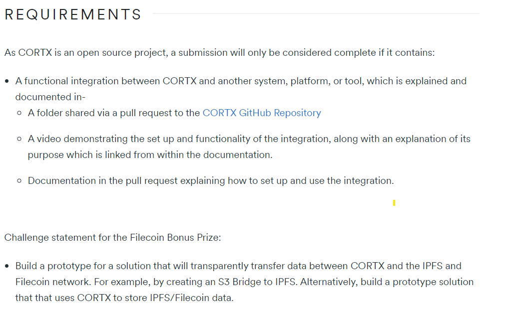

# Cortx Filecoin Integration Challenge 2022

My submission for this hackathon.

## Connect to instance

First step is to get the endpoint and port from the cortx server. Then we can connect using the S3 sdk in Python or NodeJs.

### Login on instance

1. Open the VM console, and login with the below credentials.
   Username: cortx
   Password: opensource!
2. Become the root user by running this:
   `sudo su -`
   Note Wait for 5 - 10 mins till the cluster services are started.

3. Run the following command to check the health of CORTX using hctl by running this command:
   `hctl status`
   To perform the S3 IO operations, refer the instructions in S3 IO operations.

## IPFS

peer-star-app for p2p DAG transfer.

[Fleek](ipfs://bafybeiarrje6j344nfquzi6fxc4eqs3lmjdohgqq4tekukze4shs3rswhe/space-sdk/) for an web3 sdk and deploying websites like netlify but decentralized.

## The challenge

### Instructions

### What are we building

Exactly what is described in the Filecoin Challenge. An app which lets you deploy data from IPFS to cortx and vice-versa. If not too complicated, use the Motr API.
Bulding the Api in Python Flask and the frontend in NextJs. This way I get to know flask, set up a more versatile API and work with the new version of NextJs.

Now the same in bulletpoints so we can check them off and get have that rewarding feeling.

App roadmap:

1. Flask backend:
    1. Connect to cortx.
    1. Get and push data.
    1. Same for IPFS.
    1. Provide list of hosted buckets/files.
    1. [Optional] Integrate Filecoin wallet.
    1. [Optional] Include pinning services.
2. NextJs frontend:
    1. Auth page. Either with wallet or google auth.
    2. Cortx login credentials are bound to user credentials.
    3. View data in bucket.
    4. Resolve CID.
    5. Choose file to upload/pin to IPFS.
    6. Enter CID to store in Cortx.
    7. [Optional] Create an IPFS DAG with the datahistory.
    8. [Optional] Make a smooth animation with [framerJs](https://www.framer.com/docs/introduction/)

Learning goals:

-   Master Flask.
-   Learn 3 new things about APIs.
-   Use the new folder structure of NextJs.
-   [Optional] Create your first framerJs animation.
