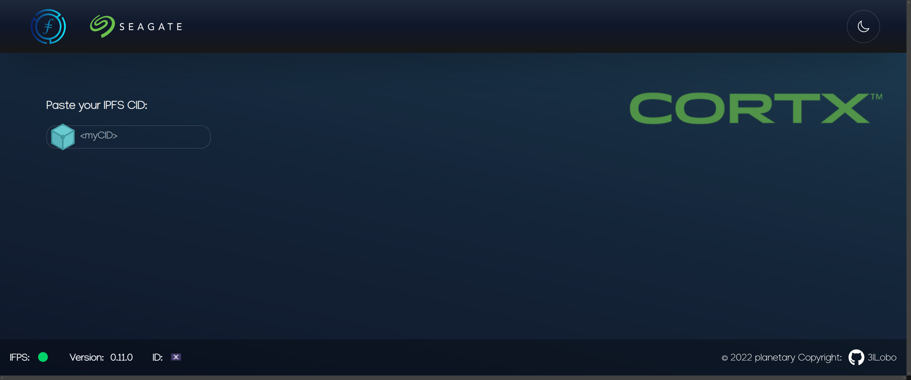
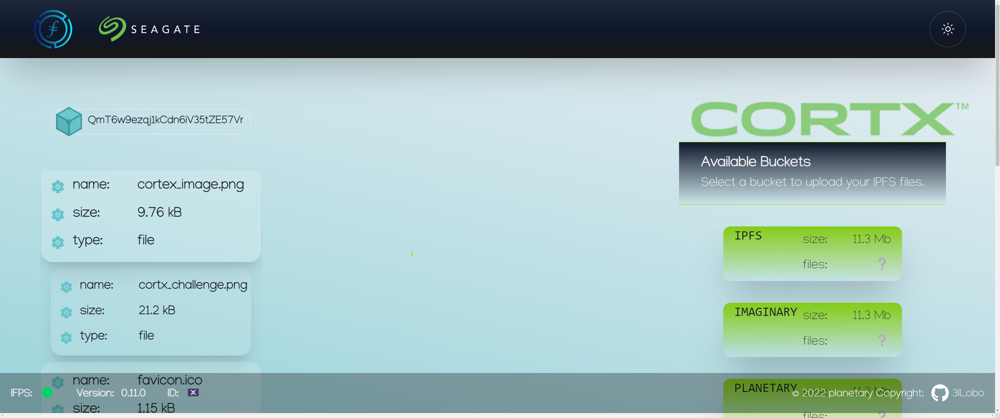

### Cortx IPFS Bridge

This web(3) app provides a bridge between IPFS with it's incentive-layer blockchain FileCoin and the massive-data storage system CORTX.

The user can download his files from IPFS using the CID and chose an existing bucket inside his Cotx cluster to upload it. The mayor contribution is to facilitate the file transfer as most IPFS and Cortx tools demand coding skills. This web/mobile app is available for everyone.  




Main Features:
- Inspect CID content if available ✅
- fetch data from IPFS through it's CID ✅
- deploy to CORTX file-system using S3 interface ✅
- Mobile friendly ✅
- List deployed files from CORTX file-system 📦
- authenticate using FileCoin 📦
- assign user-specific bucket 📦
- invert bridge 📦

[Live Demo](https://cortxportal.netlify.app/)

Also static hosted on IPFS by Fleek:
[InterPlanetary Demo](https://cortxbridge.on.fleek.co/)

## Get Started 🚀

Spin up an IPFS deamon:

```bash
ipfs daemon
```

Make sure your CORTX cluster is running and available. In case of [cloudshare](https://use.cloudshare.com/Authenticated/Landing.aspx?s=1), log in to your account.

## Resources

[AWS for React](https://docs.aws.amazon.com/sdk-for-javascript/v3/developer-guide/getting-started-react-native.html)

### Color palette

Used the [IPFS color pallette](https://github.com/ipfs-shipyard/ipfs-css/blob/main/theme.json#L2).

[Tailwind animations](https://www.devwares.com/blog/create-animation-with-tailwind-css/)

## IPFS

Two options available to fetch files over IPFS.

### Browser

Starts an IPFS node inside the browser. This takes considerably longer than the second option. Further, the node is node not closed properly when closing the tap and might not clean up configuration files. File size might be limited by browser configurations.

### HTTP client

Connects to a running local IPFS node on port 5001. This option is faster, more stable and doens't limit file size. User must run a local instance of IPFS.

To spin up an IPFS node on the browser, use the `create()` from ipfs-core.
To connect to a running node on localhost, use the ipfs-http-client library like [here](https://github.com/ipfs/js-ipfs/tree/master/packages/ipfs-http-client)

The browser extension can not be connected to as it runs in Braves native IPFS mode, which refuses API connections.
Switching this to `local` will make it connectable.

[IPFS hooks](https://github.com/ipfs-examples/js-ipfs-examples/blob/master/examples/browser-create-react-app/src/App.js)

## AWS S3

- bucket names must be lowercase.
- CORS can be upadted with Callback
- CORS policy should look like [this](https://docs.amazonaws.cn/en_us/AmazonS3/latest/userguide/ManageCorsUsing.html)

**Update:**

CORSpolicy only concerns the incoming requests. There is no obvious way to have the bucket sign the the response with the incoming origin.
That leaves us with the only option to go ServerSide, which also holds the benefit that it doesn't disclose the env variables to the browser.

Instead of messing with CORS policy, we now try `getServerSideProps()` and as plan B set up a proxy-server API.
