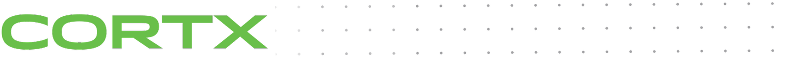
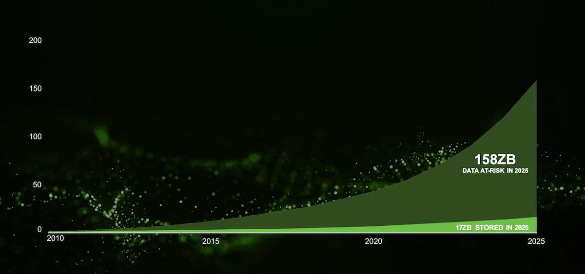

|license| |Codacy Badge| |codacy-analysis-cli|

CORTX. Hyperscale storage stack capabilities for all.
=====================================================

In consultation with IDC, Seagate has determined that by 2025, an immense amount of data, approximately 175 zettabytes will be created. Surprisingly, only 10% or 17 out of 175 zettabytes of data will be retained. IDC predicts that this 158 zettabytes of unretained data, has tremendous unrealized potential. Multiple research efforts conclude that machine learning and data analytics accuracy is directly correlated to the size of the input data set.

Retaining such a large volume of data necessitates hardware innovations for high areal density per cost and new software architecture, which are prohibitively expensive. Developing a new software architecture that ensures efficient utilization of co-evolving hardware innovations and mitigates the economic limitations of existing systems is the imminent need of the hour. 

The CORTX Project
-----------------
Seagate has developed CORTX after diligently understanding the software and hardware specifications required to retain large amounts of data. CORTX is a distributed object storage system designed for efficiency, mass-capacity, and high HDD-utilization. The CORTX project is focussed on achieving goals such as maximum utilization of storage with high code-quality that prevents vendor lock-ins. 

The CORTX project is licensed under the `Apache 2.0 License <LICENSE.md>`__.

Join the CORTX Community
""""""""""""""""""""""""

If you’re interested in contributing to Seagate’s CORTX community, please read the `Contributions Guide <doc/SuggestedContributions.md>`__. 

   - To know about our code style guidelines, refer to our `Code Style Guide <https://github.com/Seagate/cortx/blob/master/doc/CodeStyle.md>`__.

   -  You can contribute to `CORTX Documentation <https://github.com/Seagate/cortx/tree/master/doc>`__. Refer to the `list of existing documents <https://github.com/Seagate/cortx/tree/master/doc>`__ to help us improve our documentation.
- To find out more about the contributions that we are currently seeking, refer to our `Suggested Contributions List <doc/SuggestedContributions.md>`__.

We are committed to our social goal for respectful interactions and inclusivity. Refer to our `Code of Conduct <CODE_OF_CONDUCT.md>`__ documentation to know more about Community Rules.

To Start Using CORTX
"""""""""""""""""""""

- Refer to the `Quick Start Guide <QUICK_START.md>`__ to build and test the code.

- Use `Opengrok <http://ssc-vm-c-192.colo.seagate.com:8090/source/>`_ to browse through the source code. Opengrok is a source code search and cross-reference engine. 

Resources
----------

-  You can read about our `CI/CD and Automation <doc/CI_CD.md>`__.
-  Download the CORTX Technical Whitepaper
-  Check out the `GitHub issues section <https://github.com/Seagate/cortx/issues>`__, if you find a bug or have a feature request. Please check the list of existing issues before you create a new one. 

Thank You
"""""""""

We know that your time is limited and thank you for stopping by to check out the CORTX Community. Seagate is fully dedicated to its mission to produce open source technologies that help the world save more data and solve challenging data problems. Join our mission to help reinvent a data-driven world. 

.. |license| image:: https://img.shields.io/badge/License-Apache%202.0-blue.svg
   :target: https://github.com/Seagate/EOS-Sandbox/blob/master/LICENSE
.. |Codacy Badge| image:: https://api.codacy.com/project/badge/Grade/c099437792d44496b720a730ee4939ce
   :target: https://www.codacy.com?utm_source=github.com&utm_medium=referral&utm_content=Seagate/mero&utm_campaign=Badge_Grade
.. |codacy-analysis-cli| image:: https://github.com/Seagate/EOS-Sandbox/workflows/codacy-analysis-cli/badge.svg
