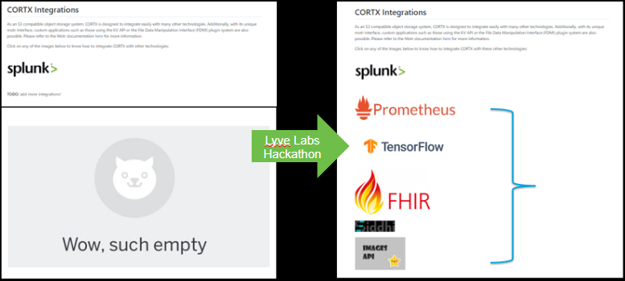

=======================
CORTX First Hackathon
=======================

This page provides complete information about the Seagate sponsored CORTX hackathon. Here you go!!!!!!!!

+++++++++++++
Key Aspects
+++++++++++++

The key aspects concerning the first hackathon are listed below.

- 70+ Registrants

- 75 in Slack channel

- 2 Webinars for the participants

- 10 Initially Active Teams

- 5 Proposals Submitted

- 5 Integrations Added to GitHub

++++++++++++++
Integrations
++++++++++++++

Different integrations that resulted out of the hackathon are as follows:

- FHIR Integration from Amit Yaniv and team - First

- Images API Integration from Nir Adler - Second

- Tensorflow Integration from Bari Arviv - Third

- Prometheus Integration from Rotem Beach - Third

- Siddhi Integration from Weka Team

FHIR Integration
=================

FHIR is best-practice API for exchanging electronic health records data from hospital records and inserted into CORTX via S3. Added support for the following four of the many FHIR models:

- Patient

- Observation

- Procedure

- Appointment

Remaining models can be easily subsequently added.

Images API Integration
=======================

The following can be performed:

- Storing an original image into CORTX

- Create an Image dashboard to CORTX

- Allow requesting resized images

- If resized image does not exist, the dashboard creates it and save it into CORTX.

  - Inspired by Cloudinary

Tensorflow Integration
=======================

1. Download a training set from CORTX.

2. Train

3. Upload the trained model into CORTX.

**Note**: So excited to have an opportunity to demonstrate her new education and to participate.

Prometheus Integration
=======================

The following can be performed:

- Use the CORTX management API to collect CORTX metrics

- Use Telegraf which is a plugin-driven server agent

- Use Grafana for analytics and interactive visualization

- Use Prometheus for monitoring

Siddhi Integration
====================

- Event-driven processing capabilities

- Complex data-based rules on S3 operations

  - “When log file arrives, compress it, save the compressed version, delete the original”

  - Akin to AWS Lambda but uses advanced rules engine

  - Designed for “automotive systems development”

  - Can also tier to hybrid cloud, “automatic virus scan, media files optimization, sensitive info deletion, etc”

- Tried to use pub-sub mechanism but “no such mechanism available at this time”

  - Polled S3 bucket lists

- Fed polled “events” into Siddhi

- Siddhi put jobs into Celery

CORTX: Before and After Integrations
=======================================

The diagram below depicts how CORTX was before integration and how it is after the integrations are complete.

