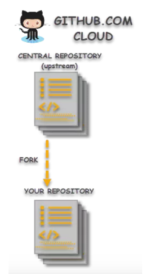
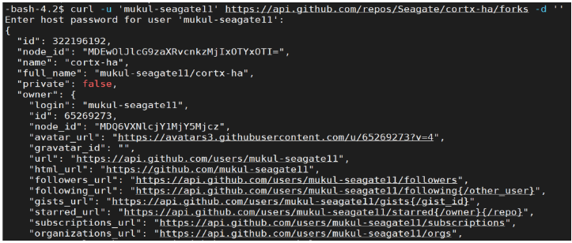
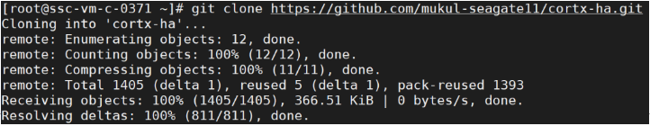
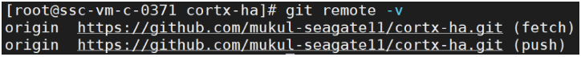
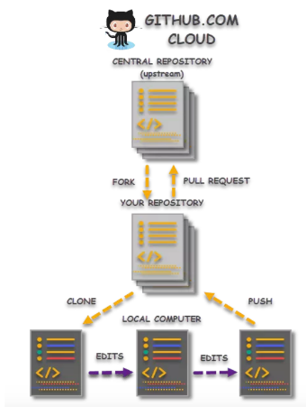

===========================================================
Guidelines and Instructions for GitHub Processes and Tools
===========================================================
*******
GitHub
*******
GitHub brings together the world's largest community of developers to discover, share, and build better software.

Account Creation
================
To create a GitHub account, perform the procedure below.

1. Navigate to the GitHub by clicking `https://github.com/ <https://github.com/>`_. The login page appears.

2. Enter relevant information in the following fields:

   * **Username** – Your Username

   * **Email** - Your email address

   * **Password** - Ensure that the password meets either of the following two conditions:

     - The word must include at least 15 characters
                    
     - The word must include at least 8 characters. One numeric value and a   letter in lower case is mandatory.

3. Under **Email preferences**, select the **Send me occasional product updates, announcements, and offers** check box. This is an optional step.

4. Under the **Verify your account** section, click **Verify**.

   1. Using the arrows, rotate the image to achieve accuracy.
   2. Click **Done** after you ensure that the image is accurately positioned.

5. Click **Create Account**. An email with a link to verify the created account would be sent to you.

   - Click the link to complete the verification process.

Personal Access Token (PAT)
===========================
Personal Access Tokens (PATs) are an alternative to using passwords for authentication to GitHub when using the GitHub API or the command line. To generate a PAT, perform the procedure below.

1. Sign in to GitHub.

2. In the upper-right corner of any page, click your profile photo, then click **Settings**. The **Profile** page is displayed.

3. In the left sidebar, click **Developer settings**. The **GitHub Apps** page is displayed.

4. In the left sidebar, click **Personal access tokens**. The **Personal access tokens** page is displayed.

5. Click **Generate new token**. The New personal access token page is displayed.

6. Provide a name for the token in the relevant field.

7. Select the scopes or permissions to which you want to grant this token. To use your token to access repositories from the command line, select **repo**.

8. Click **Generate token**. A token is generated accordingly.

9. Copy the token to the clipboard.

Authorizing PAT
---------------
To authorize a PAT, perform the procedure mentioned below.

1. Sign in to your GitHub account.

2. In the upper-right corner of any page, click your profile photo, then click **Settings**. The **Profile** page is displayed.

3. In the left sidebar, click **Developer settings**. The **GitHub Apps** page is displayed.

4. In the left sidebar, click **Personal access tokens**. The **Personal access tokens** page is displayed.

Git Workflow
============
In Git, the following two aspects are applicable:

- Gitflow

- Dev Branches

Setting up the Git Config
-------------------------
To perform the Git configuration, use the following:

- **$ git config --global user.name ‘Your Name’**

- **$ git config --global user.email ‘Your.Name@yourdomain.com’**

Fork the Repository: A Workflow
================================

**What is Forking on GitHub?**

A fork is a copy of a repository. Forking a repository allows you to freely experiment with changes without affecting the original project i.e., creating a “fork” is producing a personal copy of some external contributor repository which act as a sort of bridge between the original repository and your personal copy.

**How does Forking (Git Fork) work?**

A contributor can use forks to propose changes related to fixing a bug rather than raising an issue for the same so he that he can:

- Fork a repository

  ::
  
   curl -u $github_user_name
   
   https://api.github.com/repos/$upstream_repo/$upstream_repo_name/forks -d ''
   
**CLI View**
  

Forking a Repository
--------------------
To fork a repository, perform the procedure mentioned below.

1. Login to the GitHub account.

2. Navigate to the relevant repository.

3. In the top-right corner of the page, click **Fork**. A fork of the required repository is created successfully.

**Forking and Performing changes**

- Create a local clone of your fork by running the following command.

  ::
  
   git clone <URL of your fork>>
   

   
   
- Verify the new upstream repository you've specified for your fork by running the following command.

  ::
  
   git remote –v
 

- Pushing code changes to your fork.

- Send changes to Original Repository via Pull Request (PR).

  - You can contribute back to the original repository by sending a request to the original author to pull your fork into their repository by submitting a pull request.
  

**Note**: Forking is allowed for public repositories without permission but if the repository is private, the contributor can only be able to fork if he/she has required permission from the owner/admin of the repository. 
    
Advantages of Forking
----------------------

- Improving some other contributor's code 

- Reusing the code in a project 

- Reduce license cost consumed per user or contributor 

Cloning a Repository
--------------------
To clone a repository, perform the procedure below.

1. Login to your GitHub account, and navigate to the above created fork.

2. Above the list of files, click the following tab.

   .. image:: images/code-button.png

3. To clone the repository using HTTPS, under the Clone with HTTPS section, click the clipboard. To clone the repository using a SSH key, including a certificate issued by your organization's SSH certificate authority, click **Use SSH**, then click the clipboard.

4. Open Git Bash.

5. Change the current working directory to the location where you want the cloned directory.

6. Type **git clone**, and then paste the URL you copied earlier. It will look like this, with your GitHub username instead of **YOUR-USERNAME**.

   ::
  
    $ git clone https://github.com/YOUR-USERNAME/repository name

7. Press **Enter**. Your local clone will be created. A local copy of your fork of the repository is created.

Syncing the Fork with Repository
--------------------------------
To configure Git to sync with the fork, perform the following:

1. Open Git Bash.

2. Change directories to the location of the fork you cloned in the earlier procedure.

   - To navigate to your home directory, type **cd**.

   - To list the files and folders in your current directory, type **ls**.

   - To go into one of your listed directories, type **cd your_listed_directory**.

   - To go up one directory, type **cd** ..

3. Type **git remote –v**, and press **Enter**. The configured remote repository for your fork is visible.

4. Type **git remote add upstream**, and then paste the URL you had copied. Then, click **Enter**.

   - **$ git remote add upstream <<URL>>**

5. To verify the new upstream repository that you had specified for your fork, type **git remote -v** again. You should see the URL for your fork as **origin**, and the URL for the original repository as **upstream**.

Branching Information
---------------------
Please note the below mentioned points.

- As per the global naming convention, we've renamed Master to Main branch.

- The Main branch represents the official history, and it must be deployable at any point of time. For every new feature that is being developed, the developer creates a new branch.

- At times, a single branch would be used to deliver a large feature, or prepare for a release.

- Before creating a branch, make sure that all the upstream changes from the main branch is maintained.

- Make sure that you are in the right branch before pulling the commits.

- The checked-out branch must have a “*” as a prefix to the name. If the returned value is not main, then switch to main.

- A new Git branch can be created from the current branch.
    
Code Changes and GIT Commands
-----------------------------
- Make your code changes, and commit.

  - When main is the branch, and is ready to pull the updates:

    ::
    
     $ git pull origin main

  - You may have to run the following:

    ::
  
     $ git pull origin/feature_x
 
  - The Git pull command merges the git fetch and git merge commands.

- With each commit, there would be additions and deletions. The following command provides an updated list of files.

  ::
 
   $ git status

- Run the following command from root of the project to add files individually or in bulk.

  ::
  
   $ git add

- Run the following command to address additions and deletions.

  ::
  
   $ git add –all

- When the updates are presented differently, under the heading of Changes to be committed, run the following:

  ::
   
   $ git commit -m "<type>(<scope>): <subject>"
 
Pushing your Branch
-------------------

To push the new dev branch to the remote repo, perform the following:

1. Configure Git to always push using the current branch.

   ::
   
    $ git config --global push.default current

2. Push a local branch to a different remote branch.

   ::
   
    $ git push origin <local_branch>:<remote_branch>
   
Pull Request
------------
To create a pull request on GitHub, navigate to the main page of the respective repository, and perform the following:

1. Select the appropriate branch from the **Branch** drop-down menu.
2. Click **Compare & Pull Request**.
3. Type a title and description for your pull request.
4. Select the reviewers using the menu on the right-side of the window.
5. Click **Create Pull Request**. The pull request is raised successfully.

Rebasing
--------
Rebasing ensures that you have the latest version of main. The procedure is detailed below.

1. Consume the commits from your dev branch.
2. Temporarily unset them
3. Move to the newest head of the main branch
4. Commit them again

**Note**: If there are no issues, conflicts would not occur.

To rebase your local dev branch on the latest version of main: 

•	**$ git checkout main             /* ensure you are on the main branch**
•	**$ git pull                                   /* pull the latest from the remote**
•	**$ git push origin PM/cortx-re-testbranch  /* update your copy in the repo**
•	**$ git rebase main                 /* rebase on the main branch**    
•	**$ git push origin PM/cortx-re-testbranch --force   /* force update the remote** 

******
Codacy
******

Codacy is an automated code analysis or quality tool that enables a developer to deliver effective software in a faster and seamless manner.

.. raw:: html

    

   
<a>Working of Codacy</a>

You can use Codacy by performing the below mentioned procedure.

1. Login to your GitHub account, and navigate to the relevant repository.
2. Scroll down the page until you reach the **README** section.
3. Under the **README** section, click the **code quality** tab. The **Dashboard** of the Codacy portal is displayed. You can view the following information:

   - Graphical representation of the repository certification
   - Commits made in your repository
   - Issues reported in your repository
   - Files associated with your repository
   - Pull requests raised in your repository
   - Security status of different parameters
   
.. raw:: html
   
   

   
********************************
Developer Certificate of Origin and Contributor License Agreement
********************************
 
CORTX always requires DCO and may require CLA.  To learn more, please refer to `DCO and CLA <https://github.com/Seagate/cortx/blob/main/doc/dco_cla.md>`_.
