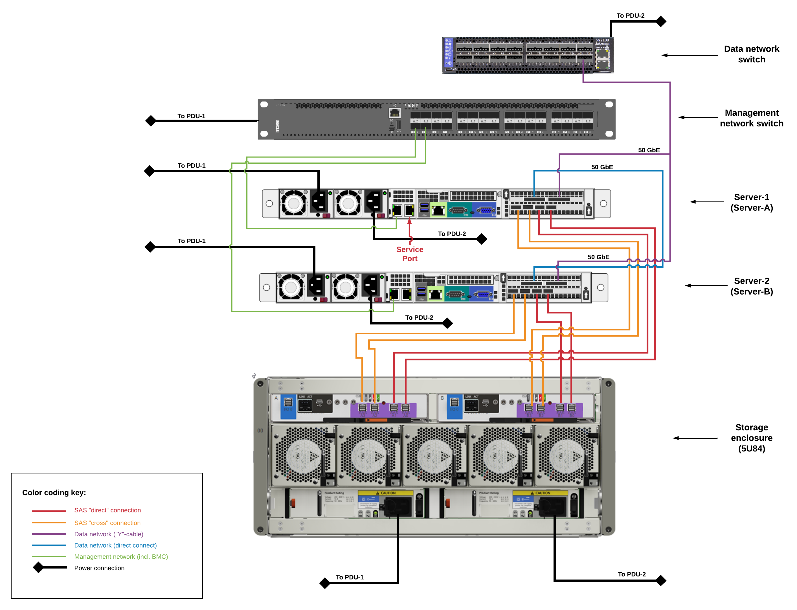

# Install CORTX on Supermicro Servers with Seagate RBOD Storage
### LyveLab Israel - Bari Arviv

1. Verify that the connectivity of the hardware is the same as described below: 
   <p align="center">
	 
   </p>

1. HW spec that was used for the installation:
    - 2x Supermicro 6019U-TRT 
    - CPU – 2x Intel Silver 4210R, 10 cores/20 threads
    - Memory – 192GB, 12x 16GB DDR4 2666 MHz 
    - HDD – 2x Seagate 1TB SATA HDD 
    - Power supply – 2x 750W, redundant 
    - Network (onboard) – 2x 1GbE/10GbE RJ-45 network interfaces (only one connected; serving BMC and Ethernet) 
    - Network (PCI) – 1x Mellanox Connect-X5 EN (MCX516A-GCAT), two 50 GbE ports; QSFP-28 
    - BMC – 1x BMC interface (RJ-45) 
    - SAS HBA – LSI 9305-16e, quad-port, PCIe Gen 3 x8 
    - 1x EXOS X 5U84 enclosure with 2x Gallium NX3 controllers (for 5U84) 
    - 84x 16TB NL-SAS 7k RPM HDDs 
    - 6x Ethernet cables 
    - 8x SAS cables (note: Beta units have only 4x) 
    - 1x break-out cable for Mellanox (QSFP-28) 
    - 1x Mellanox cable (for direct connectl QSFP-28)

1. Connect to 5U84’s web interface, go to `System->Actions->Firmware update`, and verify that bundle version is `GN280R008-04`. \
   Other versions could work by storage level but might be unsupported by CORTX hardware monitoring features.

1. Configure **both servers** identically to boot in UEFI mode. Controller configuration should be AHCI (non-RAID), \
   boot from first local drive.

1. Install [`cortx-os-1.0.0-23.iso`](https://cortxpublic.s3.us-west-2.amazonaws.com/cortx-os-1.0.0-23.iso) **on both servers**. Possible installation options are using a physical USB drive (with installation iso deployed) using PXE environment configured in UEFI mode, using kickstart file `ks.cfg` from the iso. It should be slightly modified to be run in isolated mode (non-production environment). Example configuration:
   ```
   [root@rack-b-node-1-gui ~]# cat ks.cfg
   install
   cdrom
   lang en_us.utf-8
   selinux --disabled
   keyboard us
   skipx

   network --bootproto dhcp --hostname=cortx-lnx
   rootpw --plaintext cortx2021
   firewall --disable
   authconfig --useshadow --passalgo=sha256 --kickstart
   timezone --utc america/denver
   services --disabled gpm,sendmail,cups,pcmcia,isdn,rawdevices,hpoj,bluetooth,openibd,avahi-daemon,avahi-dnsconfd,hidd,hplip,pcscd

   # minimum 1tb disk
   %include /tmp/part-include
   %pre
   vgremove vg_sysvol -f
   # supports sata or nvme disks
   drive=( $(ls -l /dev/disk/by-path/ | grep -e ata -e nvme | grep -v part | awk '{print $11}' | tr -dc '[:alnum:]\n\r') )
   for x in ${drive[@]}; do wipefs -f -a $x ; done
   cat << eof > /tmp/part-include

   # clean existing partitions and add bootloader
   zerombr
   ignoredisk --only-use=${drive[0]},${drive[1]}
   clearpart --initlabel --drives=${drive[0]},${drive[1]} --all
   bootloader --append="nofb quiet splash=quiet crashkernel=auto" --location=mbr --driveorder=/dev/${drive[0]}

   # create raids
   part raid.01 --fstype="mdmember" --ondisk=${drive[0]} --size=1024
   part raid.02 --fstype="mdmember" --ondisk=${drive[1]} --size=1024
   part raid.03 --fstype="mdmember" --ondisk=${drive[0]} --size=409600 --grow
   part raid.04 --fstype="mdmember" --ondisk=${drive[1]} --size=409600 --grow

   # create partitions
   raid pv.01 --device md1 --fstype="lvmpv" --level=raid1 raid.03 raid.04
   part /boot/efi --ondisk=${drive[0]} --fstype="efi" --size=256 --fsoptions="defaults,uid=0,gid=0,umask=0077,shortname=winnt"
   part /boot/efi2 --ondisk=${drive[1]} --fstype="efi" --size=256 --fsoptions="defaults,uid=0,gid=0,umask=0077,shortname=winnt"
   raid /boot --device md0 --fstype="ext4" --level=raid1 --label=boot raid.01 raid.02

   # create volumegroup and logical volumes
   volgroup vg_sysvol --pesize=4096 pv.01
   logvol /  --name=lv_root --fstype="ext4" --vgname=vg_sysvol --size=51200
   logvol /tmp --name=lv_tmp --fstype="ext4" --vgname=vg_sysvol --size=20480
   logvol /var --name=lv_var --fstype="ext4" --vgname=vg_sysvol --size=40960
   logvol /var/log --name=lv_log --fstype="ext4" --vgname=vg_sysvol --size=512000
   logvol /var/log/audit --name=lv_audit --fstype="ext4" --vgname=vg_sysvol --size=128
   logvol swap --name=lv_swap --fstype="swap" --vgname=vg_sysvol --size=2048
   eof
   %end

   text
   reboot --eject
   %packages
   yum
   dhclient
   ntp
   wget
   vim
   ipmitool
   screen
   @core
   mlnx-ofed-all
   python3
   tmux
   sg3_utils
   bind-utils
   net-tools
   biosdevname
   bc
   scsi-network-relay
   sshpass
   lshw
   %end

   %post --nochroot
   exec < /dev/tty3 > /dev/tty3
   /usr/bin/chvt 3
   (
   cp -va /etc/resolv.conf /mnt/sysimage/etc/resolv.conf
   /usr/bin/chvt 1
   ) 2>&1 | tee /mnt/sysimage/root/install.postnochroot.log
   %end
 
   %post --log=/mnt/sysimage/root/install.post.log
   logger "starting anaconda postinstall"
   exec < /dev/tty3 > /dev/tty3
   /usr/bin/chvt 3

   # get Mellanox devices. assumes the only add-on cards are Mellanox.
   interface=( $(ip link show | grep -e enp -e p2 | awk '{print $2}' | sed 's/\://g') )
   cat > /etc/sysconfig/network-scripts/ifcfg-${interface[0]} << eof
   device=${interface[0]}
   type=ethernet
   name=${interface[0]}
   onboot=yes
   bootproto=dhcp
   defroute=no
   nm_controlled=no
   mtu=9000
   peerdns=no
   eof

   cat > /etc/sysconfig/network-scripts/ifcfg-${interface[1]} << eof
   device=${interface[1]}
   type=ethernet
   name=${interface[1]}
   onboot=yes
   bootproto=dhcp
   defroute=no
   nm_controlled=no
   mtu=9000
   peerdns=no
   eof

   echo nameserver 8.8.8.8 > /etc/resolv.conf
   /usr/sbin/ntpdate -sub time.seagate.com
   /usr/sbin/hwclock --systohc
   rm -f /etc/yum.repos.d/centos-*
   plymouth-set-default-theme details
   dracut -f

   cp -a /boot/efi/. /boot/efi2/
   sed -i 's/winnt/winnt,nofail/g' /etc/fstab
   cat > /etc/scsi-network-relay.conf << eof
   mc-a-address = 10.0.0.2
   mc-b-address = 10.0.0.3
   fix-addresses = false
   node-id = 1
   address = 10.0.0.4/24
   eof

   chown root:root /etc/scsi-network-relay.conf
   chmod 644 /etc/scsi-network-relay.conf
   # make dir for isos and scripts
   mkdir -p /opt/isos

   sync
   %end
   reboot
   ```
   - Please note that provided script does not include the installation repository path (device, URL, etc.) and it should be defined following the installation method of     entered explicitly during installation.

6. Prepare `config.ini` file with desired data and store it in `/root/config.ini`. For instance:
   ```
   [cluster]
   cluster_ip=172.31.0.220
   mgmt_vip=172.21.0.100

   [storage_enclosure]
   type=5u84
   controller.primary_mc.ip=10.0.0.2
   controller.secondary_mc.ip=10.0.0.3
   controller.user=manage
   controller.secret=<’controller password’>
   controller.type=gallium

   [srvnode-1]
   hostname=server-a
   network.mgmt_nw.iface=eno1
   network.data_nw.public_ip_addr=172.31.0.214
   network.data_nw.iface=enp216s0f0, enp216s0f1
   bmc.user=root
   bmc.secret=<’BMC a password’>

   [srvnode-2]
   hostname=server-b
   network.mgmt_nw.iface=eno1
   network.data_nw.public_ip_addr=172.31.0.215
   network.data_nw.iface=enp216s0f0, enp216s0f1
   bmc.user=root
   bmc.secret=<’BMC b password’>
   ```

   - Put attention not to use too complex passwords for BMC. In case of usage of unsupported symbols (like exclamation mark) setup will fail with ipmitool connection error because of ipmitools library limitations.

   - Do not use the `172.168.0.0/24` subnet in any IP parameter because this subnet will be configured automatically on `enp216s0f1`. Second 100G interface `enp216s0f0` will get `network.data_nw.public_ip_addr`. Also, `mgmt_vip=172.21.0.100`   
     will be set **on server-a** only as a sub-interface of `eno1` and `mgmt_vip=172.21.0.100` won’t be configured.

   Here is the dump of IP configuration using `config.ini` above:
   ```
   [root@server-a]# ip a
   1: lo: <LOOPBACK,UP,LOWER_UP> mtu 65536 qdisc noqueue state UNKNOWN group default qlen 1000
       link/loopback 00:00:00:00:00:00 brd 00:00:00:00:00:00
       inet 127.0.0.1/8 scope host lo
          valid_lft forever preferred_lft forever
       inet6 ::1/128 scope host 
          valid_lft forever preferred_lft forever
   2: eno1: <BROADCAST,MULTICAST,UP,LOWER_UP> mtu 1500 qdisc mq state UP group default qlen 1000
       link/ether 3c:ec:ef:19:fa:5e brd ff:ff:ff:ff:ff:ff
       inet 172.21.0.214/16 brd 172.21.255.255 scope global noprefixroute eno1
          valid_lft forever preferred_lft forever
       inet 172.21.0.100/16 brd 172.21.255.255 scope global secondary eno1:v1 
          valid_lft forever preferred_lft forever
       inet6 fe80::5ccf:5555:2ce9:febf/64 scope link 
          valid_lft forever preferred_lft forever
   3: enp216s0f0: <BROADCAST,MULTICAST,UP,LOWER_UP> mtu 9000 qdisc mq state UP group default qlen 1000
       link/ether 0c:42:a1:c0:ec:88 brd ff:ff:ff:ff:ff:ff
       inet 172.31.0.214/16 brd 172.31.255.255 scope global enp216s0f0
          valid_lft forever preferred_lft forever
       inet 172.31.0.220/16 brd 172.31.255.255 scope global secondary enp216s0f0
          valid_lft forever preferred_lft forever
       inet6 fe80::e42:a1ff:fec0:ec88/64 scope link 
          valid_lft forever preferred_lft forever
   4: enp216s0f1: <BROADCAST,MULTICAST,UP,LOWER_UP> mtu 9000 qdisc mq state UP group default qlen 1000
       link/ether 0c:42:a1:c0:ec:89 brd ff:ff:ff:ff:ff:ff
       inet 192.168.0.1/24 brd 192.168.0.255 scope global enp216s0f1
          valid_lft forever preferred_lft forever
       inet 192.168.0.3/24 brd 192.168.0.255 scope global secondary enp216s0f1:c1
          valid_lft forever preferred_lft forever
       inet6 fe80::e42:a1ff:fec0:ec89/64 scope link 
          valid_lft forever preferred_lft forever
   5: eno2: <NO-CARRIER,BROADCAST,MULTICAST,UP> mtu 1500 qdisc mq state DOWN group default qlen 1000
       link/ether 3c:ec:ef:19:fa:5f brd ff:ff:ff:ff:ff:ff
   6: tap0: <BROADCAST,MULTICAST,UP,LOWER_UP> mtu 1500 qdisc pfifo_fast state UNKNOWN group default qlen 1000
       link/ether 4a:52:a1:f6:a5:33 brd ff:ff:ff:ff:ff:ff
       inet 10.0.0.4/24 scope global tap0
          valid_lft forever preferred_lft forever
       inet6 fe80::4852:a1ff:fef6:a533/64 scope link
          valid_lft forever preferred_lft forever
   ```

7.	Configure `eno1` as management interface (not to use `192.168.0.0/24` subnet).   
    Next, add DNS and gateway to provide an internet connection. For instance: 
    - `172.21.0.214/16`
    - `172.21.0.215/16` 
    
8.	Set hostnames **on both servers** and append them to `/etc/hosts` file. For instance: 
    - `172.21.0.214` **server-a**
    - `172.21.0.215` **server-b**

9.	Copy installation file to `/opt/packages` **on both servers** and install it [`scsi-network-relay-1.1.0-47.x86_64.rpm`](http://cortx-storage.colo.seagate.com/prvsnr/scsi-network-relay-1.1.0-47.x86_64.rpm)

10.	Create file `/etc/scsi-network-relay.conf` **on both nodes** with contents as under:

    **Server-a:**
      ```
      # Default settings for the first host and array
      mc-a-address = 10.0.0.2
      mc-b-address = 10.0.0.3
      fix-addresses = false
      node-id = 1
      address = 10.0.0.4/24
      ```

    **Server-b:**
      ```
      # Default settings for the first host and array
      mc-a-address = 10.0.0.2
      mc-b-address = 10.0.0.3
      fix-addresses = false
      node-id = 2
      address = 10.0.0.5/24
      ```

11.	**On both servers:**

    1. Start and Enable service:
       ```
       systemctl enable scsi-network-relay 
       systemctl start scsi-network-relay
       ```

    2. Check services up and running:
       ```
       systemctl status scsi-network-relay
       ```

    3. Check cluster private IPs are able to ping from node:
       ```
       ping 10.0.0.2
       ping 10.0.0.3
       ```

    4. If you are not able to ping, then restart the service:
       ```
       systemctl restart scsi-network-relay
       ```

12.	Enclosure storage configuration: 

    1. [Download the files](https://github.com/Seagate/cortx-prvsnr/tree/main/srv/components/controller/files/scripts) to `/tmp/scripts`:
    
       ```
       wget https://raw.githubusercontent.com/Seagate/cortx-prvsnr/9618eab4a1aca82b8c7921cfcfc6751614b3e1df/srv/components/controller/files/scripts/controller-cli.sh
       wget https://raw.githubusercontent.com/Seagate/cortx-prvsnr/9618eab4a1aca82b8c7921cfcfc6751614b3e1df/srv/components/controller/files/scripts/provision.sh
       wget https://raw.githubusercontent.com/Seagate/cortx-prvsnr/9618eab4a1aca82b8c7921cfcfc6751614b3e1df/srv/components/controller/files/scripts/xml.sh
       ```

    2. Install `sshpass` via `yum`: 
       ```
       yum install sshpass
       ```

    3. Change permissions of `/tmp/scripts`. Run: 
       ```
       sudo chmod +x *
       ```

    4. inspect log records for example using `service scsi-network-relay status` and verify that IP’s were discovered via SAS fabric.

    5. Using one of the discovered IP’s clear current volumes from the [storage enclosure](https://github.com/Seagate/cortx-prvsnr/wiki/Seagate-Gallium-Storage-Controller-Configuration) **(DATA WILL BE LOST!!)**:
       ```
       ./controller-cli.sh host -h '10.0.0.3' -u manage -p <’controller password’> prov -c

       Deleting pool A
       Pool A deleted successfully
       Deleting pool B
       Pool B deleted successfully
       Checking the provisioning again..
       Cleanup done successfully
       ***** SUCCESS! *****
       The detailed logs are kept at: /var/log/seagate/provisioner/controller-cli.log
       ```
    
    6. Print details about available disks on storage enclosure (should be no disks):
       ```
       ./controller-cli.sh host -h '10.0.0.3' -u manage -p <’controller password’> prov -s

       No provisioning details found on the controller
       ***** SUCCESS! *****
       The detailed logs are kept at: /var/log/seagate/provisioner/controller-cli.log
       ```

    7. Deploy CORTX standard configuration of 2 linear pools with 8 volumes per pool:

       ```
       ./controller-cli.sh host -h '10.0.0.3' -u manage -p <’controller password’> prov -a

       Creating linear pool 'dg01' with adapt level over 0.0-41 disks
       Pool dg01 Created Successfully
       Creating volume dg01-v0001 of size 63922.00GB in pool dg01 mapped to ports A0,A1,A2,A3,B0,B1,B2,B3
       Creating volume dg01-v0002 of size 63922.00GB in pool dg01 mapped to ports A0,A1,A2,A3,B0,B1,B2,B3
       Creating volume dg01-v0003 of size 63922.00GB in pool dg01 mapped to ports A0,A1,A2,A3,B0,B1,B2,B3
       Creating volume dg01-v0004 of size 63922.00GB in pool dg01 mapped to ports A0,A1,A2,A3,B0,B1,B2,B3
       Creating volume dg01-v0005 of size 63922.00GB in pool dg01 mapped to ports A0,A1,A2,A3,B0,B1,B2,B3
       Creating volume dg01-v0006 of size 63922.00GB in pool dg01 mapped to ports A0,A1,A2,A3,B0,B1,B2,B3
       Creating volume dg01-v0007 of size 63922.00GB in pool dg01 mapped to ports A0,A1,A2,A3,B0,B1,B2,B3
       Creating volume dg01-v0008 of size 63922.00GB in pool dg01 mapped to ports A0,A1,A2,A3,B0,B1,B2,B3
       Creating linear pool 'dg02' with adapt level over 0.42-83 disks
       Pool dg02 Created Successfully
       Creating volume dg02-v0001 of size 63922.00GB in pool dg02 mapped to ports A0,A1,A2,A3,B0,B1,B2,B3
       Creating volume dg02-v0002 of size 63922.00GB in pool dg02 mapped to ports A0,A1,A2,A3,B0,B1,B2,B3
       Creating volume dg02-v0003 of size 63922.00GB in pool dg02 mapped to ports A0,A1,A2,A3,B0,B1,B2,B3
       Creating volume dg02-v0004 of size 63922.00GB in pool dg02 mapped to ports A0,A1,A2,A3,B0,B1,B2,B3
       Creating volume dg02-v0005 of size 63922.00GB in pool dg02 mapped to ports A0,A1,A2,A3,B0,B1,B2,B3
       Creating volume dg02-v0006 of size 63922.00GB in pool dg02 mapped to ports A0,A1,A2,A3,B0,B1,B2,B3
       Creating volume dg02-v0007 of size 63922.00GB in pool dg02 mapped to ports A0,A1,A2,A3,B0,B1,B2,B3
       Creating volume dg02-v0008 of size 63922.00GB in pool dg02 mapped to ports A0,A1,A2,A3,B0,B1,B2,B3
       Controller provisioned successfully with following details:
       --------------------- Pools -----------------------
       name           health         
       dg01           OK             
       dg02           OK             
       ------------------- Disk-groups -------------------
       name           pool           status         health         
       dg01           dg01           FTOL           OK             
       dg02           dg02           FTOL           OK             
       ------------------- Volumes -----------------------
       volume-name         size                owner               storage-pool-name   health              
       dg01-v0001          63.9TB              A                   dg01                OK                  
       dg01-v0002          63.9TB              A                   dg01                OK                  
       dg01-v0003          63.9TB              A                   dg01                OK                  
       dg01-v0004          63.9TB              A                   dg01                OK                  
       dg01-v0005          63.9TB              A                   dg01                OK                  
       dg01-v0006          63.9TB              A                   dg01                OK                  
       dg01-v0007          63.9TB              A                   dg01                OK                  
       dg01-v0008          63.9TB              A                   dg01                OK                  
       dg02-v0001          63.9TB              B                   dg02                OK                  
       dg02-v0002          63.9TB              B                   dg02                OK                  
       dg02-v0003          63.9TB              B                   dg02                OK                  
       dg02-v0004          63.9TB              B                   dg02                OK                  
       dg02-v0005          63.9TB              B                   dg02                OK                  
       dg02-v0006          63.9TB              B                   dg02                OK                  
       dg02-v0007          63.9TB              B                   dg02                OK                  
       dg02-v0008          63.9TB              B                   dg02                OK                  
       ***** SUCCESS! *****
       The detailed logs are kept at: /var/log/seagate/provisioner/controller-cli.log
       ```

    8. Print details about available disks on the storage enclosure. The command output should be the same as the table printed at the end of the previous command run. 
       ```
       ./controller-cli.sh host -h '10.0.0.3' -u manage -p <’controller password’> prov -s
       ```

13.	Copy installation files to `/opt/isos` **on server-a**: \
    [`cortx-os-1.0.0-23.iso`](https://cortxpublic.s3.us-west-2.amazonaws.com/cortx-os-1.0.0-23.iso)  
    [`cortx-prep-1.0.0-540.sh`](https://cortxpublic.s3.us-west-2.amazonaws.com/cortx-prep-1.0.0-540.sh)  
    [`cortx-1.0.0-540-single.iso`](https://cortxpublic.s3.us-west-2.amazonaws.com/cortx-1.0.0-540-single.iso) 

14.	Execute:
    ```
    ./cortx-prep-1.0.0-540.sh
    ```

15.	Execute main installation (provisioner setup): 
    ```
    provisioner auto_deploy --console-formatter full --logfile --logfile-filename /var/log/seagate/provisioner/setup.log \
    --source iso --config-path /root/config.ini --ha --iso-cortx /opt/isos/cortx-1.0.0-540-single.iso --iso-os \
    /opt/isos/cortx-os-1.0.0-23.iso srvnode-1:server-a srvnode-2:server-b
    ```

    - In case of script failure, problematic action could be found in Exception data by `"result":false` value, check the comment and `STDERR values`, and try to fix the issue.

16.	The script should exit with:
    ```
    2021-07-02 00:34:53,894 - 140604625401664 - provisioner.commands.deploy_dual - INFO - [deploy_dual.py:265]: cmd:auto_deploy Deploy - Done
    2021-07-02 00:34:53,895 - 140604625401664 - provisioner.commands.auto_deploy - INFO - [auto_deploy.py:85]: cmd:auto_deploy Done
    ```

17.	Once `auto_deploy` command is executed successfully, verify `salt-master` setup **on both nodes** (setup verification checklist):
    ```
    salt '*' test.ping  
    salt "*" service.stop puppet
    salt "*" service.disable puppet
    salt '*' pillar.get release  
    salt '*' grains.get node_id  
    salt '*' grains.get cluster_id  
    salt '*' grains.get roles  
    ```

18.	Verify CORTX cluster status:
    ```
    pcs status
    ```

19.	Get build details:
    ```
    provisioner get_release_version
    ```

20.	Go to *https://<management IP>:28100/#/preboarding/login* and [configure the CORTX GUI](https://github.com/Seagate/cortx/blob/main/doc/Preboarding_and_Onboarding.rst).
    * Now that you have the complete system up and running, using the data IP from the `ip a` command, use these instructions [to test the system](https://github.com/Seagate/cortx/blob/main/doc/testing_io.rst) and observe activity in the GUI.
 
 
### Tested by:
* July, 2021: Bari Arviv (bari.arviv@seagate.com) on Bare Metal Server in Lyve Labs - Israel
