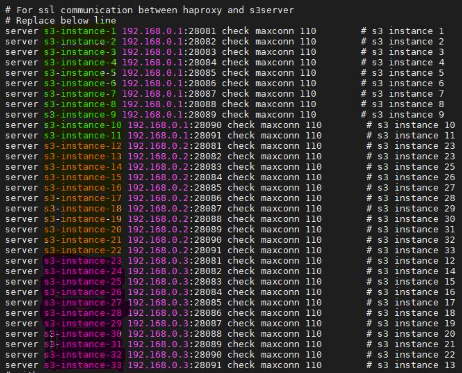
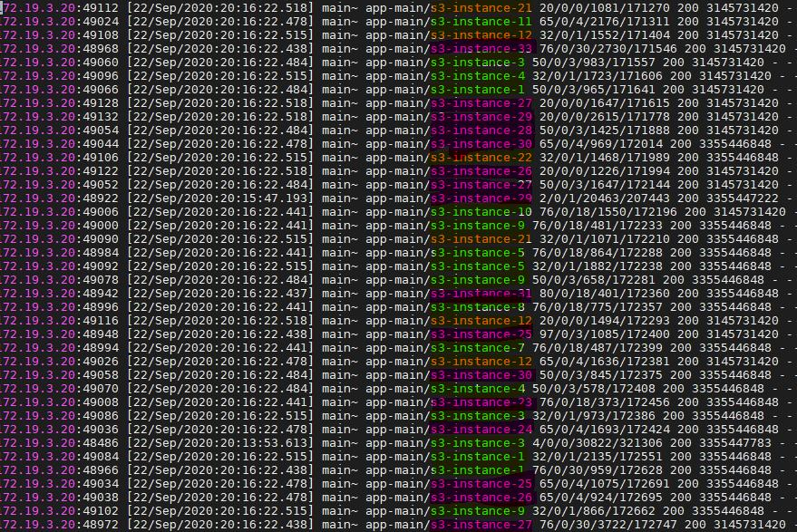

==========================
Preboarding and Onboarding
==========================

Preboarding
===========

The preboarding process must be the first process that must be completed after configuring CORTX. The preboarding procedure must be performed only once.

.. raw:: html

    

   
<a>Click here to expand the preboarding procedure.</a>

1. Open a browser and navigate to the *https://<management IP>:28100/#/preboarding/welcome*. The management IP must be fetched from the step 6 of `CORTX_on_Open_Virtual_Appliance <https://github.com/Seagate/cortx/blob/main/doc/CORTX_on_Open_Virtual_Appliance.rst>`_.

   - If you see a message about your connection not being private, it is safe to ignore this message.

2. Click **Start**. A page that requests you to accept the End User License Agreement (EULA) appears.

   .. image:: images/Start1.PNG

3. Click **Get Started**. A window showcasing the End User License Agreement (EULA) appears.

   .. image:: images/Get.PNG

3. Click **Accept** to accept the EULA.

   .. image:: images/EULA1.PNG

4. Create a user with admin privileges by entering the username, password, and email address in the relevant fields, and click **Apply and Continue**.

   - If you want to receive email notifications, select the **Subscribe to email notifications** checkbox.
   
   .. image:: images/Adminu.PNG

   **Note**: Do not create an user with one of the following usernames.

   - **root**

   - **csm**
  
.. raw:: html
   
   

   
Onboarding
===========

The onboarding procedure must be performed after completing the preboarding procedure by accessing *https://<management IP>:28100/#/preboarding/login*. The onboarding procedure can be performed multiple times.
     
.. raw:: html

    

   
<a>Click here to expand the onboarding procedure.</a>

#. If prompted, login again with the username and password that you had provided earlier.

   .. image:: images/login.PNG

2. Enter a memorable name for your application in the **System Name** field, and click **Continue**.

   .. image:: images/Systemname.PNG

3. Optional: If you have a SSL certificate, you can upload it. Otherwise, a default self-signed certificate provided by Seagate will be used. Click **Continue**.

   .. image:: images/SSL.PNG

4. Enter information about the **DNS servers** and **Search domains** in relevant fields, and click **Continue**. 
   Multiple entries must be separated by commas.
   
   - If you don't know your DNS servers, 8.8.8.8 will usually work.
      
   - If you don't know your search domains, please use cortx.test.
  
   .. image:: images/DNS.PNG
   
   
5. Enter the NTP server address in the text box and select the NTP time zone offset from the drop-down menu. Then, click **Continue**.
   Multiple entries must be separated by comma.

   - If you don't know your NTP server, ntp-b.nist.gov will usually work.
   
   .. image:: images/NTP.PNG

6. Configure the email notifications by selecting the **Email** checkbox, and providing the relevant information. After configuring, click **Continue**.

   .. image:: images/Email.PNG

7. Click **Continue** after reviewing the summary. A dialog box is displayed indicating the success of the onboarding the process.

8. Click **Go to dashboard**. CORTX is now ready for use. 

   .. image:: images/DB.PNG
   
   **Note**: CSM GUI can now be accessed by navigating to *https://<management IP>:28100/#/login*

.. raw:: html
   
   

   
CORTX
=====

After the onboarding is complete, you can perform the actions mentioned below.

#. Run the below mentioned command to check the cluster health.

   ::
  
    hctl status
    
   .. image:: images/HCTL.PNG
   
#. Trigger IOs from an IO tool.

#. In the GUI, you can see the performance graph as part of the **Dashboard**. Please note that the triggering of IO is reflected in the graph.

   .. image:: images/PG.PNG

IO on Cluster (**Scale-out (JBOD)** only)
-----------------------------------------

The s3instance assignment per node is as follows.

::

 s3intance-1  to s3intance-11 =====> srvnode-1
 
 s3intance-12 to s3intance-22 =====> srvnode-2
 
 s3intance-23 to s3intance-33 =====> srvnode-3
 

  
On node 1, run the below mentioned command when IOs are started, to check IOs running on cluster

::

 tail -f /var/log/haproxy.log
 

 

