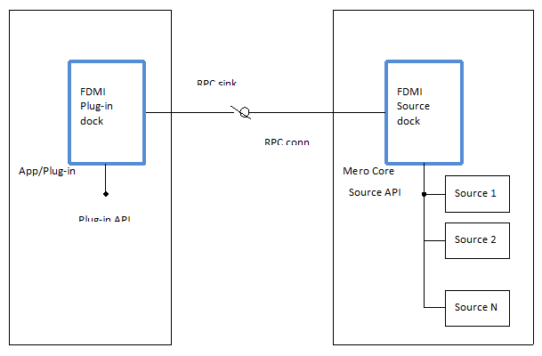
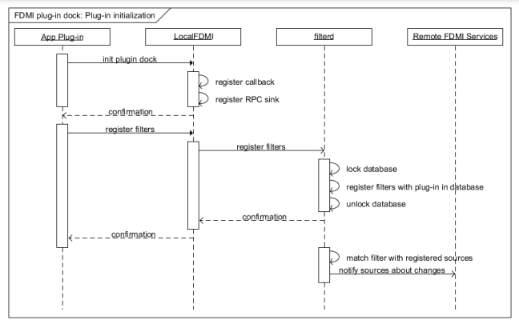
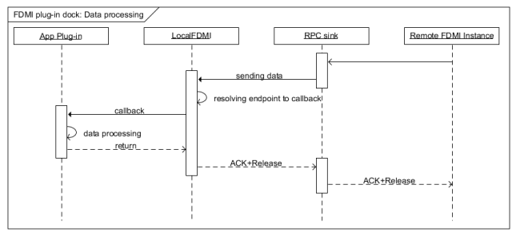
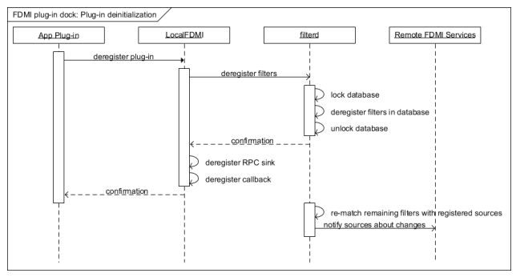
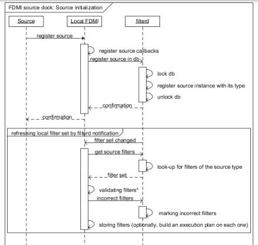
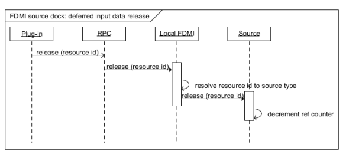
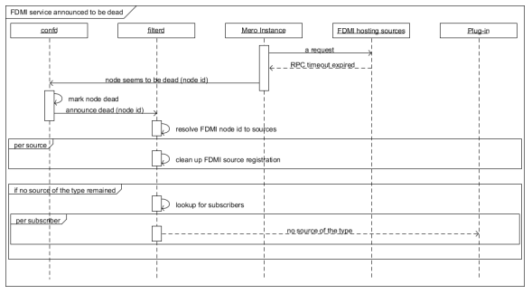

# High Level Design Specification  
## Seagate FDMI  

## Revision History
|Date  | Revision History | Revision # | Comments         | Initials|
|------| -----------------|------------| -----------------| --------|  
|08/29/2014 | Major       | 1.0        |                  | IV      |  
|         |  
|         |  

# Introduction
## 1.1 Document's Purpose
The document is intended to specify the design of Mero FDMI interface. FDMI is a part of Mero product. FDMI provides interface for Mero plugins and allows horizontally extending the features and capabilities of the system.   

## 1.2 Intended Audience
* Product Architect
* Developers
* QA Engineers   

## 1.3 Definitions, Acronyms, and Abbreviations
FDMI: File data manipulation interface

## 1.4 References
1. “Mero Object Store Architecture: Technical” MeroTechnicalWhitepaper.pdf
1. “mero a scalable storage platform” Mero technical (toi).pdf
1. fdmihighleveldecomposition.pdf	   

# Overview
Mero is a storage core capable of deployment for a wide range of large scale storage regimes, from cloud and enterprise systems to exascale HPC installations. FDMI is a part of Mero core, providing interface for plugins implementation. FDMI is build around the core and allows for horizontally extending the features and capabilities of the system in a scalable and reliable manner.

## 1.5 Product Purpose
TBD

## 1.6 Assumptions and Limitations
TBD   

# Architecture  

In this section only architectural information like the following is displayed but is not limited to:

1. Common design strategy including

  * General approach to the decomposition

2. Chosen architecture style and template if any

  * Key aspects and consideration that affect on the other design

## 1.7 FDMI position in overall Mero Core design

FDMI is an interface allowing Mero Core scale horizontally. The scaling includes two aspects:

* Core expansion in aspect of adding core data processing abilities, including data volumes as well as transformation into alternative representation. The expansion is provided by introducing FDMI plug-ins.

  * Initial design implies that FOL records are the only data plug-ins are able to process so far.

* Core expansion in aspect of adding new types of data the core is able to feed plug-ins. This sort of expansion is provided by introducing FDMI sources.

  * Initial design implies that FOL record is the only source data type Mero Core provides so far.

FDMI plug-in is an application linked with Mero Core to make use of corresponding FDMI interfaces and run separate from Mero instance/services. The purpose of introducing plug-in is getting notifications from Mero Core about particular changes in stored data and further post-processing of the data intended for producing some additional classes of data the Core currently is not able to provide.

Instead, FDMI source appears to be a part of Mero instance being linked with appropriate FDMI interfaces and allowing connection to additional data providers.

Considering the amount of data Mero Core operates with it obvious that plug-in typically requires a sufficiently reduced bulk of data to be routed to it for post-processing. The reduction is provided by introduction of mechanism of subscription to particular data types and conditions met at runtime. The subscription mechanism is based on set of filters the plug-in registers in Mero Filter Database during its initialization.

Source in its turn refreshes its own subset of filters against the database. The subset is selected from overall filter set based on the knowledge about data types the source is able to feed FDMI with as well as operation with the data the source supports.   

## 1.8 FDMI Roles
FDMI consists of APIs implementing particular roles in accordance with FDMI use cases. The roles are:

* Plug-in dock, responsible for:

  * Plug-in registration in FDMI instance

  * Filter registration in Mero Filter Database

  * Listening to notifications coming over RPC

  * Payload processing

  * Self-diagnostic (TBD)

* Source dock (FDMI service), responsible for:

  * Source registration

  * Retrieving/refreshing filter set for the source

  * Input data filtration

  * Deciding on and posting notifications to filter subscribers over Mero RPC

  * Deferred input data release

  * Self-diagnostic (TBD)

  

## 1.9 FDMI Plugin dock  
### 1.9.1 initialization   

    

Application starts with plug-in initialization by specifying Plug-in Dock role and providing a callback function pointer for
processing data notifications from other FDMI instances running Source Dock roles. At this time RPC sink registration is
done associating plug-in instance with RPC endpoint.  

Further initialization consists of registering a number of filters in  **filterd** database.

    **NB:**  
    Current design implies the filter instances are not validated anyhow at the moment of registration. However, filter correctness can be validated by target Source at the moment of filter set update on Source side. As the result, filter instance can be reported by Source as incorrect, and marked correspondingly in filtered database. Incorrect filters appear to be not propagated across the system anymore.  

    **NB:**
    TBD if we really need to determine the moment when all sources appear to be running filter sets consistent across the whole system. Currently we need to consider if Plug-in should be notified about this point.

### 1.9.2 Data Processing  
   

Remote FDMI instance running Source Dock role provides data payload via RPC channel. RPC sink calls back local FDMI
instance running Plug-in Dock role. The latter resolves the receiving RPC sink to plug-in callback, and calls the one passing
the data to plug-in instance.  

Successful data processing results in returning acknowledge along with confirmation allowing data release, if required.  

### 1.9.3 De-initialization  
    

Plug-in initiates de-initialization by calling local FDMI. The latter deregisters plug-in’s filter set with filtered service. After
confirmation it deregisters the associated RPC sink and plug-in’s callback function.  

All registered sources are notified about changes in filter set, if any occurred as the result of plug-in coming off

## 1.10  FDMI Source Dock  
### 1.10.1 Initialization  
    

* TBD where to validate, on Source side or inside FDMI  

Source registration starts with registering source callbacks in local FDMI instance. The instance reports the new source to filtered service, where source becomes associated with the FDMI service. Later filtered notifies FDMI about filter set update to let it initiate standard filter set update workflow. After getting filter set FDMI initiates validation of the filters with the source, and reports incorrect filters back, if any. Finally FDMI stores valid filters internally to be associated with the source instance.  
As an optimization, execution plan could be built for every added filter to be kept along with the one. As an option, execution
plan can be built on every data filtering action to trade off memory consumption for CPU ticks.  

### 1.10.2 Input Data Filtering  
  

*In case of RPC channel failure, input data reference counter has to be decremented. TBD if this to be done explicitly or in context of
transaction roll-back.  

** RPC mechanism is responsible for reliable data delivery, and is expected to do its best for re-sending data appeared to be stuck in the
channel.

When input data identified by resource id comes to Source, the latter calls local FDMI instance with the data. On data coming FDMI starts iterating through local filter set. On each filter record FDMI parses the filter definition and builds execution plan. According to the plan the filter definition is traversed node by node, and for every node a predicate result is calculated by appropriate source callback.   

    **NB:**
    It is expected that source will be provided with operand definitions only. Inside the callback the source is going to extract corresponding operand according to the description passed in. And predicate result is calculated based on the extracted and transformed data.  

When done with traversing, FDMI engine calculates final Boolean result for the filter tree, and makes a decision whether to put serialized input data onto RPC for the plug-in associated with the filter.  

    **NB:**
    A possible optimization could be: When filter matching was encountered, all the other filter entries associated with the plug-in are excluded from processing, because the data is already scheduled for delivery.  

    Plug-in may control this behavior and include an appropriate flag into filter definition whether to allow being
    notified with duplicates or not.

    The method “get next filter” is the place where the behavior is to be implemented.  

### 1.10.3 Deferred Input Data Release  
   

Input data may require to remain locked in the Source until the moment when plug-in does not need it anymore. The data processing inside plug-in is an asynchronous process in general, and plug-in is expected to notify corresponding source allowing it to release the data. The message comes from plug-in to FDMI instance hosting the corresponding source.  

    **NB:**
    TBD: We need to establish a way to resolve resource id to FDMI instance hosting particular source. Most probably
    resource id itself may contain the information, easily deduced or calculated.  

### 1.10.4 FDMI Service Found Dead  
  

When interaction between Mero services results in a timeout exceeding pre-configured value, the not responding service needs to be announced dead across the whole system. First of all **confd** service is notified about the service not responding. After being marked dead in **confd** database, the service has to be reported to **filterd** as well. The main purpose is to deregister FDMI sources hosted by the service, if any, to stop propagating **filterd** database changes to those.  

As well, the moment of the last instance of the source type coming out, the corresponding plug-ins might be notified.
