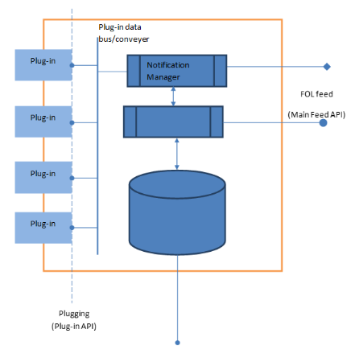
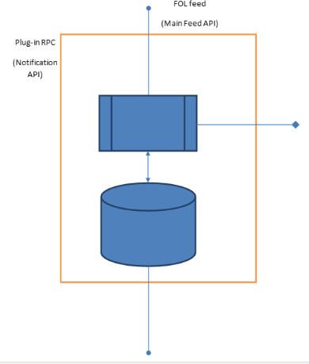

# Seagate - FDMI design notes

## Architectural View

  
Fig.1 Architecture Option 1- FDMI Plug-in  

  
Fig.1 Architecture Option 1- FDMI Plug-in  

The main intention is to provide a streamlined processing of FOL records generated locally on Mero instance, or arrived from other nodes via RPC, and fed to Main Feed API. The central processing mechanism has to be aware of current transaction carried out.

The processing is to be done on an incoming FOL record against the Filter set. The resultant list of Consumers will be supplied with the FOL record copy (or some data structure specific to notification mechanism; decision on data structure to be used for consumer notification is to be done) placed on the plug-in data bus, or its exact clone via RPC using Notification API.

Filter Store is to be filled in by means of Subscription API. Filter Index is updated internally on adding Filter.

Currently 2 options for Plug-in architecture are anticipated:  

1. Option 1: FDMI-Plug-in. Each plug-in is linked with FDMI making use of internal FDMI API only (some callback, for instance). See Fig.1

1. Option 2: FDMI Plug-in transforms to Mero Core Plug-in. Mero core in this case most likely provides limited features for RPC only. Mero RPC is used to collect notifications from all Mero instances.    

## Plug-in API

The API is to allow the plug-ins making use of FDMI to register with the latter service instance. It is supposed that plug-in initialization to result in adding a certain batch of Filters to Filter Store of FDMI instance(s) using Subscription API.

Besides, plug-in may additionally inform FDMI about its specifics, like FOL type it is to process, optimization/tweak requirements (e.g. no batching), etc.

Public Entries:

* Initialize plug-in

* <..>

**N.B.** Plug-in API design details depend on selected architecture option 1 or 2.   

## Main Feed API

The API is to provide FOL ingestion. Possible options are:

Synchronous processing, when Consumers found by Filter Processor are fed with the FOL copy, and only then the next FOL gets processed

Asynchronous processing, when incoming FOL is places on input queue, and Filter Processor appears to be driven internally or externally, but independent of the Main Feed. Two possible options with Transaction Bounds:

Transaction does not end until all Consumers are notified

Transaction ends independently

Success results in lazy FOL copying to Consumers

Failure results in dropping current FOL copy

For both options FOLs are fed to Filer Processor the same way: locally.

Public Entries:

* <..>

* <..>

## Subscription API

The API is to provide a way for adding Filter rules to FDMI instances, identifying FOL processing traits as well as associating Filter with Consumer

Public Entries:

* Register Filter

* Unregister Filter

* <..>   

## Notification API

The API is to provide a way for resultant FOL delivery. (It might appear to be just a trivial re-use of RPC, or something less trivial maybe)

Notification API details depend on selected option:

Option 1, Filter Processor creates Notification and passes it to Notification Manager. The Manager resolves Consumer delivery path: local callback or calling remote FDMI proxy using Mero RPC. Upon receiving a Notification FDMI proxy passes it to the Consumer via local callback.

Option 2, Filter Processor always sends a Notification to Consumer using Mero RPC.

Public Entries:

* <..>

* <..>

## Assumptions

### Filter

Filter identifies:

* Consumer to be notified

* Conditions FOL to meet

The index format: TBD

Filter once registered will be eventually spread across the whole number of Cluster nodes running FDMI services.

The number of Filters registered in Mero Cluster is expected to be of no explicit limit, though implicit limitation caused by physical cluster size is anticipated.

### Filter semantics

Filter syntax need to remain flexible to adopt any future improvements/enhancements, but fully covering initial requirements of multi-type support and human readability. Possible options are:

* Native-language-like syntax (SQL-like)

* Symbolic object notation, easily parsed (some standard adherent notation preferred), easily extensible, including object nesting, e.g. JSON (current DSR’s choice)  

NB: Filter being parsed on ingestion may be transformed to a combination of elementary rules in case the transformation does not change Filter semantics but potentially improves Processor performance (decomposition is being performed)

### Filter Index

To speed up FOL processing the Filer set should be indexed.  

NB: FOL record to be analyzed for parts providing records selectivity, the parts the indexes to be based on.
