.. vim: syntax=rst

|image0|

==========
**Agenda**
==========

● What is CORTX-S3

● Overview

● CORTX-S3 Server Architecture

● Technologies used

● Uploads

● Downloads

● CORTX-S3 URL to CORTX Motr OID

● Metadata

● Multipart Upload Design

● API support

● Contacts

   
============================
**What** is CORTX-S3 **and why?**
============================

|image2|
 

=============
**Overview**
=============

● CORTX-S3 Server can be installed on Motr node or a separate node

● Motr CORTX-S3 is developed in C++, Authentication/Authorisation server developed in Motr Java.

● Uses Clovis library (C - API) to talk to Motr IO/KVS services

● CORTX-S3 Objects stored as CORTX-Motr (motr) Objects - IOS

● KV store required for storing CORTX-S3 buckets and object metadata = CORTX-Motr (motr) KVS (cas/dix)

..

===========================
**CORTX-S3 Server Architecture**
===========================

|image4|

..
 
===========================
**CORTX-S3 Server Architecture**
===========================

|image5|

===================
**CORTX-S3 Overview**
===================

|image6|

1. CORTX-S3 client applications use CORTX-S3 REST APls to perform object operations.

2. s3iamcli or GUI for Account/Users/Credentials management.

3. haproxy - Load balancer / local node proxy, TLS/SSL termination.

4. CORTX-S3 Server exposes CORTX-S3 REST APIs for CORTX.

5. Clovis - C library interface to CORTX Object/KVS operations.

6. CORTX Motr Object store

7. Auth server - exposes Account/User/Credentials management REST APls and authentication, authorization REST APls.

8. Openldap server - DB for storing identities used with CORTX-S3.

===========================
**CORTX-S3 Tech stack overview**
===========================

|image7|

==================================
**CORTX-S3 Workflow (Upload Object)**
==================================

|image8|

**Identity access management (IAM)**
####################################

1. Create Account/User/Access keys using ldap credentials sent to haproxy.

2. haproxy forwards request to Auth server to create Account/User/Access keys.

3. Auth server authenticates request and creates Account/User/Access keys in openldap and response is sent back to s3iamcli via haproxy.

**Object upload via CORTX-S3 API**
############################

1. CORTX-S3 client reads file to be uploaded as object.

2. CORTX-S3 client uses PUT Object API to upload Object. For large object it divides file into parts and uploads using Multipart upload (POST Object,PUT Part and Complete upload) APIs.

3. haproxy receives these API requests and distributes to different CORTX-S3 instances.

4. CORTX-S3 instances request Auth server to verify the API signatures to authenticate and authorize the request.

5. CORTX-S3 instance creates an object in motr and writes data using clovis APIs. Clovis uses erasure coding/replication depending on configuration for data resiliency.

==================================
**CORTX-S3 Workflow (Download Object)**
==================================

|image9|

**Object download via CORTX-S3 API**
###############################

1. CORTX-S3 client makes a request to download object using CORTX-S3 REST API (either full download or range read with parallel range downloads)

2. haproxy receives these API requests and distributes to different CORTX-S3 instances.

3. CORTX-S3 instances request Auth server to verify the API signatures to authenticate and authorize the request.

4. CORTX-S3 instances reads object data from motr nodes and (assembles data units at clovis layer).

5. CORTX-S3 server sends the data back to CORTX-S3 clients via haproxy.

6. haproxy sends data back to CORTX-S3 clients.

=========================================
**CORTX-S3 Object to CORTX Motr object mapping**
=========================================

|image10|

● Murmur3 hashing was used in **past** to map CORTX-S3 URI to generated OID/fid

● Clovis Unique ID generator is used **today**.

● CORTX-S3 URI – OID mapping stored in CORTX-S3 Object metadata in KVS

================
**CORTX-S3 metadata**
================

**● CORTX-S3 Bucket metadata include**
#################################

* name, timestamps, ACL, Policy

* Object listing references within bucket (CORTX-S3 object url, motr oid)

* Multipart upload listing references 

* Tags

**● CORTX-S3 Object metadata**
#########################

* name, timestamps, ACL

* obj size, md5

* user defined metadata, tags etc

**● Metadata stored in Motr KVS**
##################################

**● Metadata is stored as JSON.**
##################################

==================================
**Streaming upload (PUT Object)**
==================================

|image12|

=====================
**Multipart Upload**
=====================

-  Two approaches:

   -  Short term (Write to Object offsets with assumptions)

   -  Assumptions:

      -  all parts are assumed to be identical size (except for final)

      -  all multipart uploads must start from partNumber = 1 sent first
         to server

      -  (universal) part size is determined from first uploaded part's
         Content-Length

      -  partNumber is used to determine part ordering, not Complete
         call

      -  offset for each part = partNumber \* Content-Length

   -  Long term (Assemble in motr -recommended)

      -  Follows CORTX-S3 protocol strictly and motr handles handles
         assembling in background without the user facing the delay in
         assemble.

===============================================
**Multipart Upload - Short term solution**
===============================================

|image14|

============================================
**Multipart Upload - Long term solution**
============================================

|image15|

=====================
**CORTX-S3 APls Supported**
=====================

Refer to the [S3 API document](https://github.com/Seagate/cortx-s3server/blob/main/docs/s3-supported-api.md) to know the supported Service, Bucket, and Object Operations supported by CORTX-S3 Server API.

=============================
**CORTX-S3 - Clovis KV interface**
=============================

* CORTX-S3 uses clevis key-value API interface to use specific KV store like Cassandra DB, Motr KVS, Redis etc.

* In future, when Motr KVS implementation is available we can switch to use Motr KVS by just a configuration change.

|image19|

===================
**CORTX-S3 Bucket data**
===================

* **CORTX-S3 Bucket data include**

* Name, timestamps, ACL

* Object references within bucket (CORTX-S3 object url, motr oid)
	
	

* **Bucket data stored in Cassandra (Will move to Motr KVS)**

* **Cassandra used for its nosql big data capabilities**

* **Cassandra designed for heavy write operations using append only logs**

* **Cassandra support built in replication and failure management**

* **Cassandra peer to peer architecture, with read/write anywhere**

* **Cassandra scales out linearly with no operational overhead for adding new nodes**

..

================
**Questions?**
================

*Reach out to:*

* *CORTX Community Slack channel* - `<https://cortxcommunity.slack.com>`_

|image18|

..

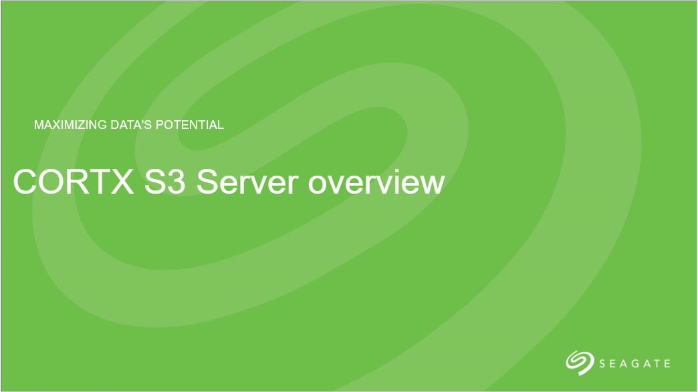
.. :width: 7.6002in
.. :height: 5.3680in
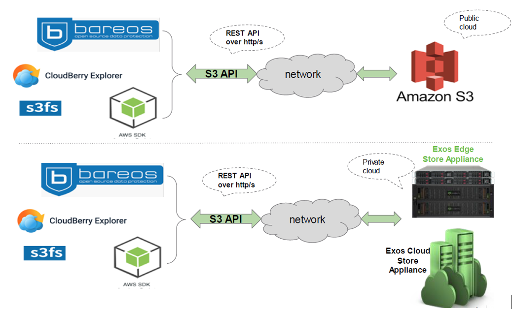
   
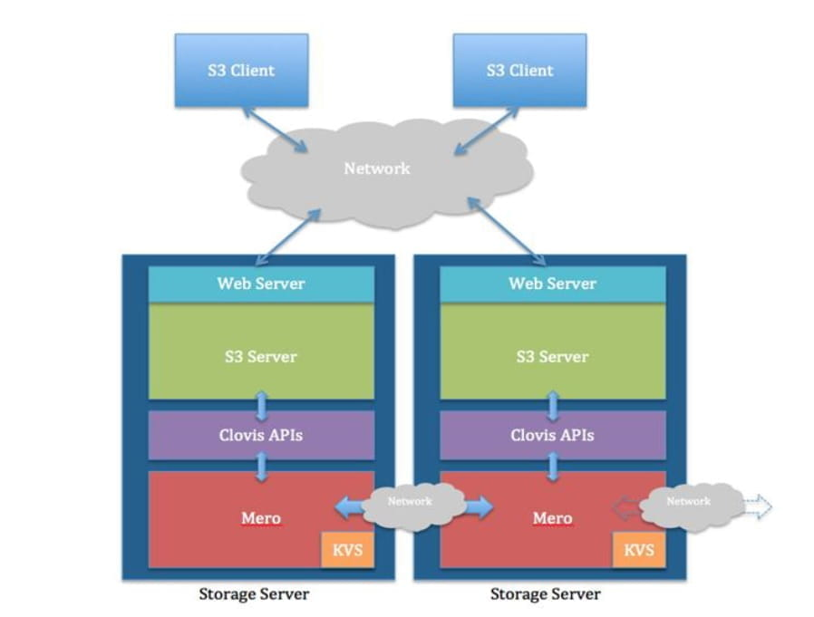
   
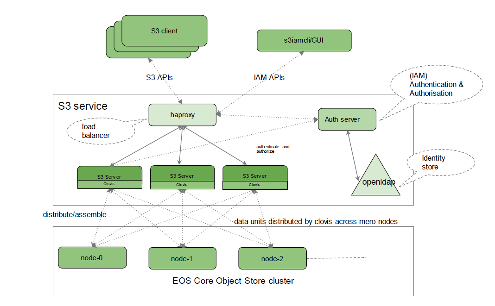

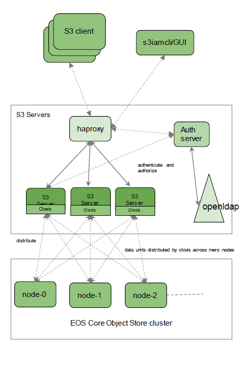

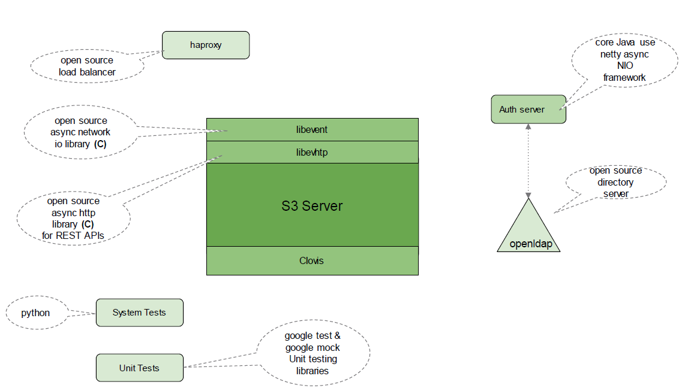

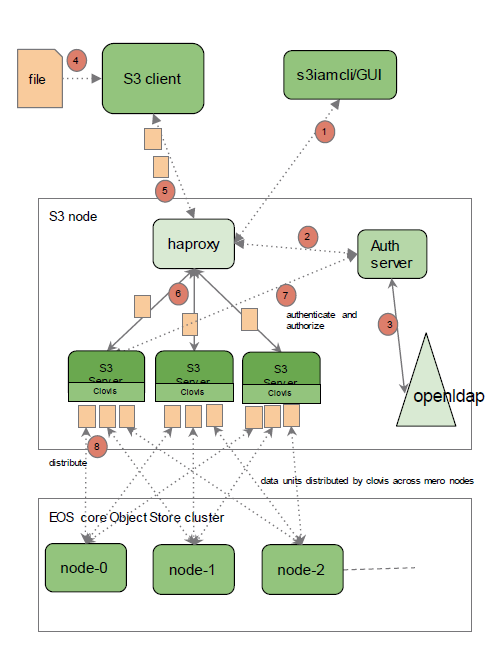

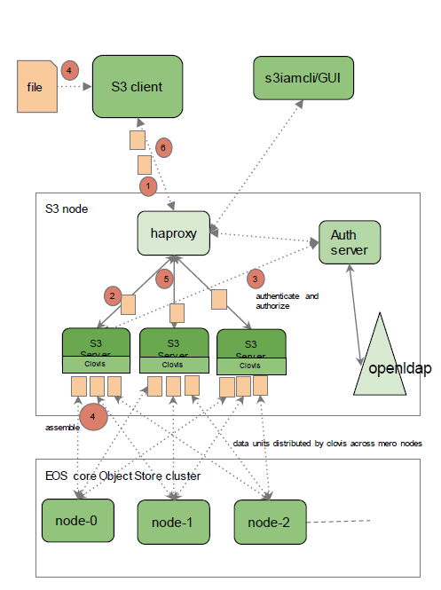

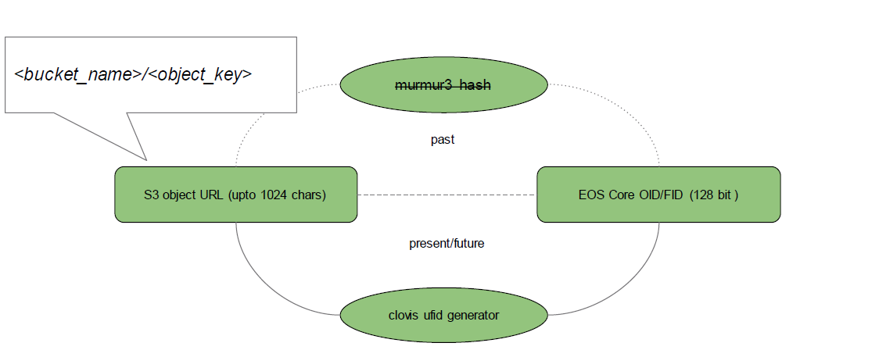

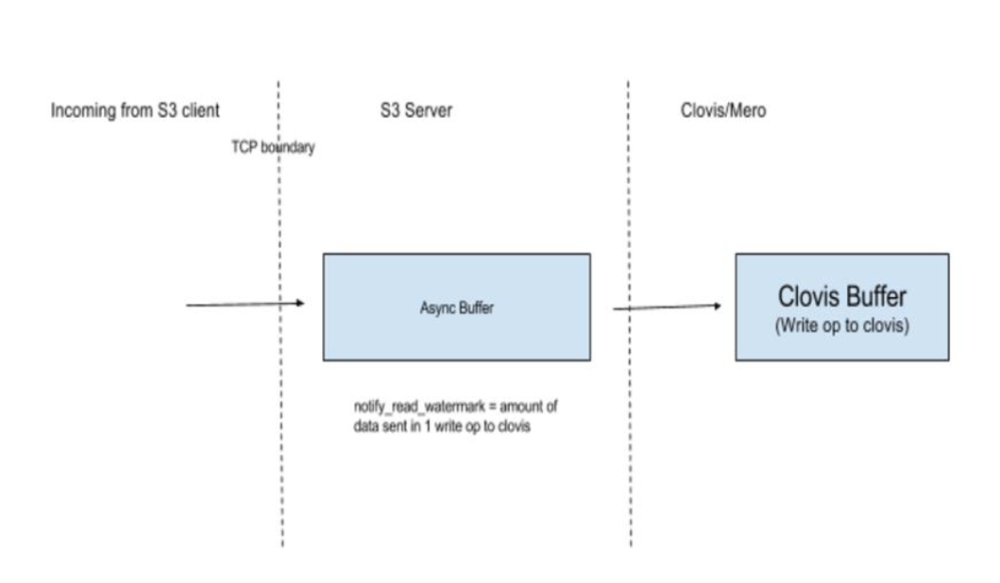

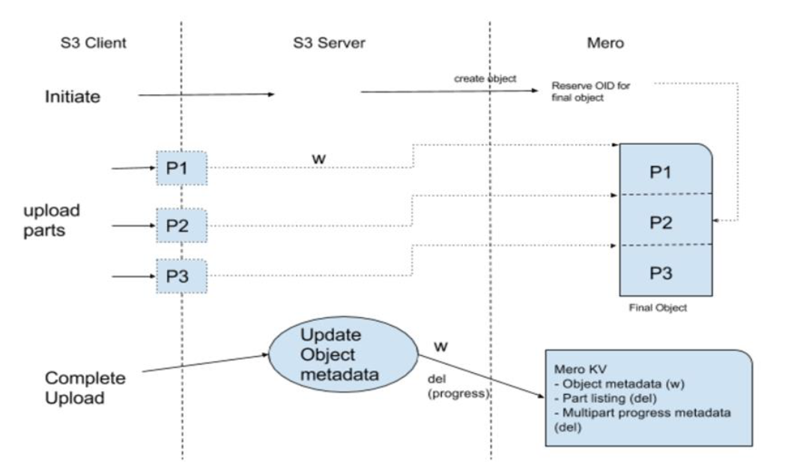

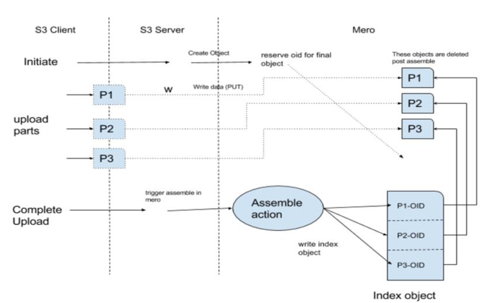

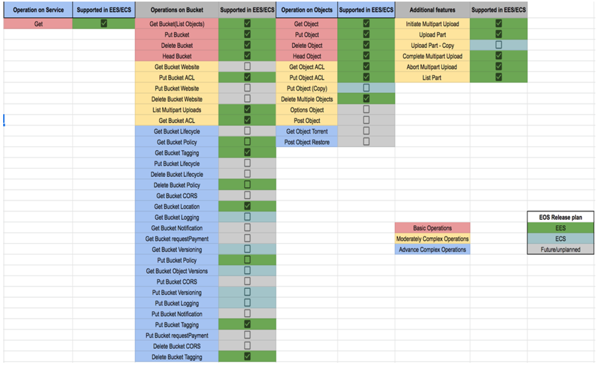

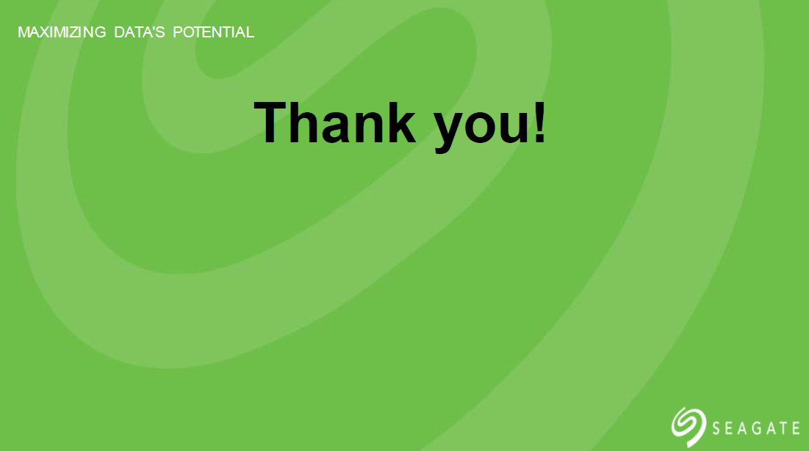
.. :width: 7.6002in
.. :height: 5.3680in
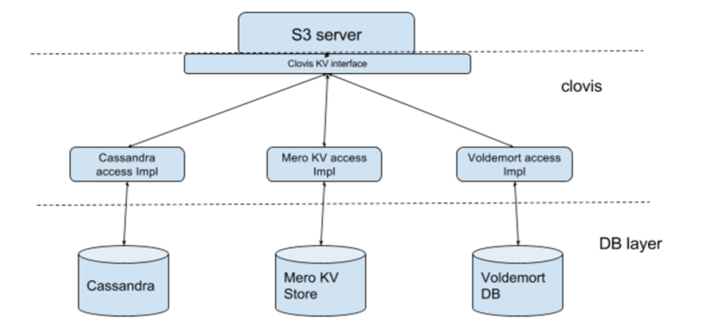

