.. vim: syntax=rst

|image0|

============
**Outline**
============

-  This presentation is a beginner's guide to the EOS core architecture

-  Tries to cover all important aspects of EOS core with a reasonable
   level of detail

-  Focus on software (hardware details elsewhere)

-  Overview

-  Typical use cases and data flow

-  How objects and indices are stored

-  IO path

-  DTM

-  FDMI

-  ADDB

=================
**What is EOS?**
=================

-  EOS core is a component of the new cloud software stack developed by Seagate

-  EOS provides basic functionality through its clovis interface:

   -  object store

   -  key-value store

-  The complete software stack also includes other components:

   -  S3 server

   -  pNFS server

   -  Provisioner

   -  RAS

   -  HA

   -  Administration and monitoring toolset

|image1|

-  Similar products:

   -  Ceph

   -  ActiveScale

   -  IBM/COS

   -  Scality

==========================
**How is EOS Different?**
==========================

-  Scalable

   -  horizontal scalability: grow system by adding more nodes. EOS designed for horizontal scalability: no meta-data hotspots,shared-nothing IO path. Extensions running on additional nodes.

   -  vertical scalability: more memory and cpu on the nodes.

-  Fault-tolerant:

   -  flexible erasure coding taking hardware and network topology into account

   -  fast network raid repairs

-  Observable: built-in monitoring collecting detailed information about system behaviour

-  Extensible

   -  extension interface

   -  flexible transactions

   -  open source

-  Portable: runs in user space on any version of Linux

=================
**Data flow S3**
=================

-  eos rpc: uses RDMA when available (requires kernel module)

-  s3 server linked with libmero

-  flexible deployment: services can run anywhere on the network, share storage

-  meta-data (dix) can be stored on disc, SSD or NVM

-  multiple io and dix services, no hotspots

|image2|

==================
**Data Flow NFS**
==================

-  very similar to S3

-  underlying eos object and index semantics is rich enough to support S3, NFS and others

-  interoperability between S3 and NFS: common meta-data format, *lingua franca* [work in progress]

|image3|

====================================
**Anatomy of an EOS core instance**
====================================

|image4|

-  Multiple services within the same process: io, dix, confd, rm, ha,
   sss, repair, addb, cas, fdmi, isc

-  State machine (fom) for each request: non-blocking state transitions,
   few threads, reduced locking, NUMA

-  Asynchronous network and storage interface

-  Same on "client" (libmero) and server (not quite yet).

==================
**Object Layout**
==================

-  Object is an array of blocks. Arbitrary scatter-gather IO with
   overwrite. Object has layout.

-  Default layout is parity de-clustered network raid: N+K+S striping.

-  Layout takes hardware topology into account: distribute units to
   support fault-tolerance.

|image5|

-  Object raid: component object (cob) for each device.

-  N data units, K parity units and S spare units (distributed spare).

-  Mapping from file offsets to cob offsets is deterministic.

-  Mapping from cob offsets to device blocks is done via meta-data index
   ("ad"), managed by io service.

-  Fast scalable repairs of device failure.

-  There are other layouts: composite.

==================
**Index Layout**
==================

-  An index is a container of key-value pairs:

   -  GET(key) -> val, PUT(key, val), DEL(key), NEXT(key) -> (key, val)

   -  used to store meta-data: (key: "/etc/passwd:length", value: 8192)

-  Uses network raid with parity de-clustering (same as objects), but
   only N = 1, in N + K + S

-  X-way replication (N = 1, K = X - 1), each key is replicated
   independently

-  takes hardware topology into account (for free!)

-  fast scalable repair (for free!)

|image6|

=======================
**Data Flow S3 Redux**
=======================

-  libmero calculates cob identities and offsets within cobs

-  ioservice maps cob offset to device offset though ad (allocation
   data) index

-  mapping is done independently for each object and each parity group
   (aka stripe)

-  parity blocks are calculated by libmero

|image7|

===============================
**Data Flow with meta - data**
===============================

-  2, 2': rpc from a client to services (async)

-  3, 7: various meta-data lookups on the service

-  {4,8}.n: meta-data storage requests (btree operations)

-  11: rdma

-  12: async direct-io to the data drives

-  fol: log of meta-data transactions

-  This diagram includes only s3 data operation, no s3 meta-data
   operations (buckets, permissions, *etc*.)

-  some requests are eliminated because of caching

|image8|

========
**DTM**
========

-  DTM: Distributed Transaction Manager

-  EOS operations affect multiple nodes. Nodes can fail independently. Error recovery is difficult.

-  Multiple EOS operations form logical groups:

   -  S3 object creation: update bucket, store object attributes, create object, write data

   -  NFS file creation: allocate inode number, write directory entry, initialise inode

   -  Error recovery in the middle of a group is difficult (errors during recovery)

-  a transaction is a group of eos core operations that are atomic in the face of failures

-  DTM guarantees that either all or none operations survive a failure

-  DTM: work in progress

-  one of the most complex EOS components

-  scalable efficient transactions are hard

-  fortunately not everything is needed at once

-  staged implementation: DTM0 first

|image9|

================================
**DTM Implementation Overview**
================================

-  track distributed transactions for each operation (send transaction identifier)

-  each service, before executing the operation, writes its description into FOL: file operations log

-  in case of a service or a client failure, surviving nodes look through their logs and determine incomplete transactions.

-  first try to re-do incomplete transactions by re-sending their descriptions to the restarted service

-  some transactions cannot be re-done, because too much state was lost in a failure

-  such transactions have to be undone (rolled back)

-  but if a transaction is rolled back, all transactions that depends on it also have to be undone:

   -  **mkdir a** (executed on servers S0 and S1)

   -  **mkdir a/b** (executed on servers S1 and S2)

   -  **touch a/b/f** (executed on servers S2 and S3)

   -  if **mkdir a** failed, **mkdir a/b** and **touch a/b/f** have to be rolled back too

-  transaction dependencies must be tracked. This is difficult to do scalably and efficiently!

-  fortunately, in DTM0 re-do is always possible

=========
**FDMI**
=========

-  FDMI: file data manipulation interface, EOS core extension interface

-  EOS core: objects, key-value indices, transactions. Fast path

-  Extensions: migration, backup, archive, replication, compression, encryption, indexing, tiering, defragmentation, scrubbing, format conversion, re-striping, *etc*.

-  We want to keep EOS core small and clean

-  Extensions must be:

   -  developed independently (without modifications to the core code), possibly by 3rd parties;

   -  deployed independently (on additional nodes,without compromising fast path)

   -  scalable

   -  reliable (transactionally coupled with the core)

|image10|

=================================
**FDMI Implementation Overview**
=================================

-  FDMI is a scalable publish-subscribe interface

-  each eos core instance produces cross-referenced records describing operations stored in FOL

-  FDMI plugin registers a filter, that selects some records

-  each instance sends matching records to the plugin (in batches) together with their transactional contexts

-  a plugin acts on records and sends acknowledgements back the source instances.

|image11|

============================================
**FDMI example plugin: integrity checking**
============================================

-  How to recovery from catastrophic failures?

-  Redundancy, fancy metadata: not an answer (has been tried)

   -  bugs (more important over time)

-  traditional fsck

   -  not distributed

   -  specific to particular meta-data format

   -  does not scale

      -  time

      -  space

-  need scalable integrity checking

   -  run it all the time, on dedicated separate nodes (horizontal scalability)

   -  maintain redundant "inverse" meta-data,

   -  update meta-data to match system evolution (through FDMI publish subscribe)

   -  detect inconsistencies, report, recover from redundancy

|image12|

Inverse meta-data

-  block allocation

-  pdclust structure

-  key distribution

-  b-tree structure

-  application specific invariants

   -  POSIX tree

   -  hdf5

==========
**ADDB**
==========

-  ADDB (analytics and diagnostics data-base): built-in fine grained telemetry sub-system

-  Why?

   -  systems grow larger and more complex

   -  how well the system is utilised?

   -  is it failure or expected behaviour?

   -  is it system or application behaviour?

   -  sources of data:

      -  system logs

      -  operating system

      -  application traces

   -  very large amount of collected data

   -  or insufficiently detailed, or both

   -  difficult to analyse and correlate

-  instrumentation on client and server

-  data about operation execution and system state

-  passed through network

-  cross-referenced

-  measurement and context

-  timestamped

-  labels: identify context

-  payload: up to 16 64-bit values,

-  interpreted by consumer

-  always on (post-mortem analysis, first incident fix)

-  simulation (change configuration, larger system, load mix)

\* 2020-02-20-14:36:13.687531192 alloc size: 40, addr: @0x7fd27c53eb20

\| node <f3b62b87d9e642b2:96a4e0520cc5477b>

\| locality 1

\| thread 7fd28f5fe700

\| fom @0x7fd1f804f710, 'IO fom' transitions: 13 phase: Zero-copy finish

\| stob-io-launch 2020-02-20-14:36:13.629431319,
<200000000000003:10000>, count: 8, bvec-nr: 8, ivec-nr: 1, offset: 0

\| stob-io-launch 2020-02-20-14:36:13.666152841, <100000000adf11e:3>,
count: 8, bvec-nr: 8, ivec-nr: 8, offset: 65536

===================================
**ADDB: Monitoring and Profiling**
===================================

|image13|

=============================
**ADDB: advanced use cases**
=============================

-  collect system execution traces

-  use them to calibrate a simulator

-  use the simulator to:

   -  model systems before hardware is available (very large, very fast)

   -  answer "what if?" questions

   -  combine workloads

|image14|

===============
**Questions?**
===============

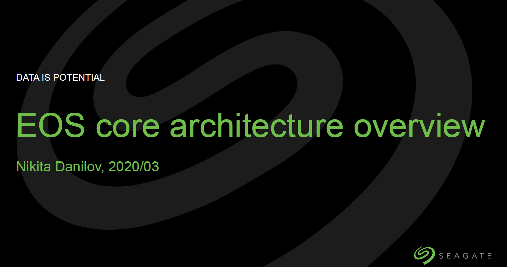

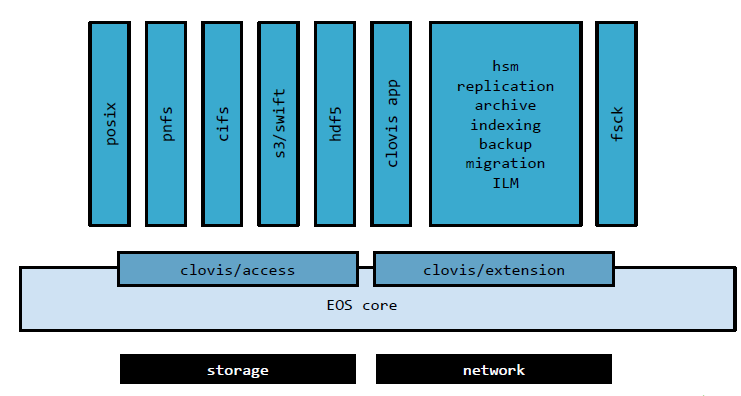

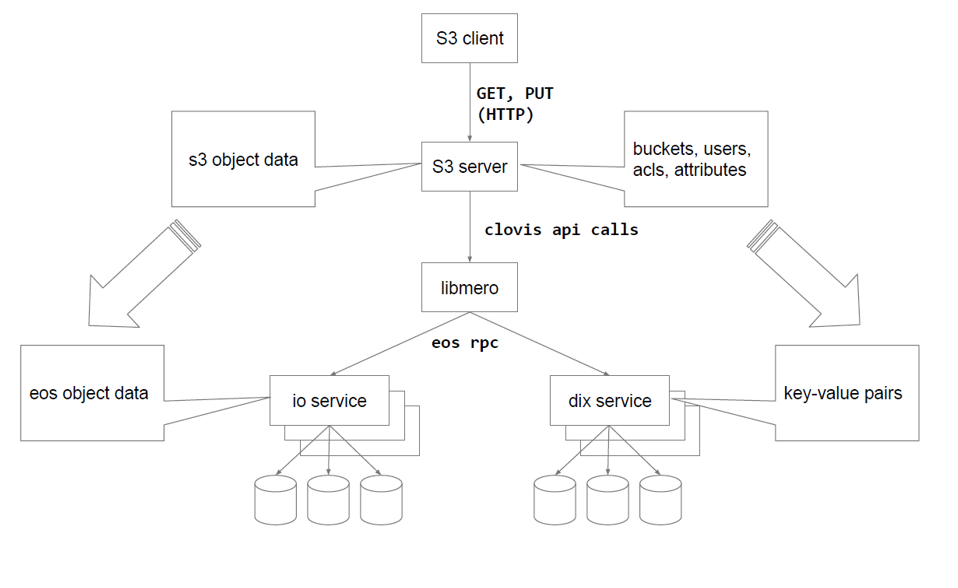

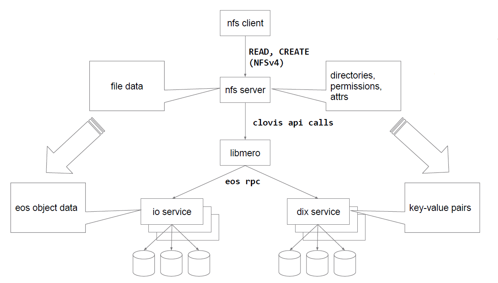

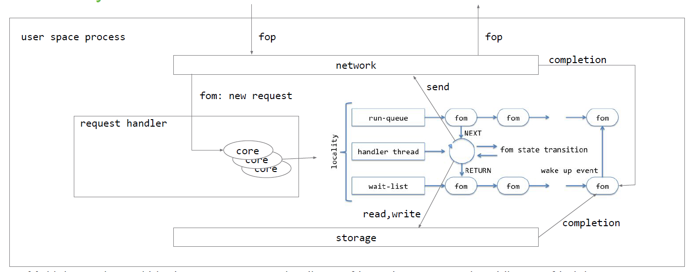

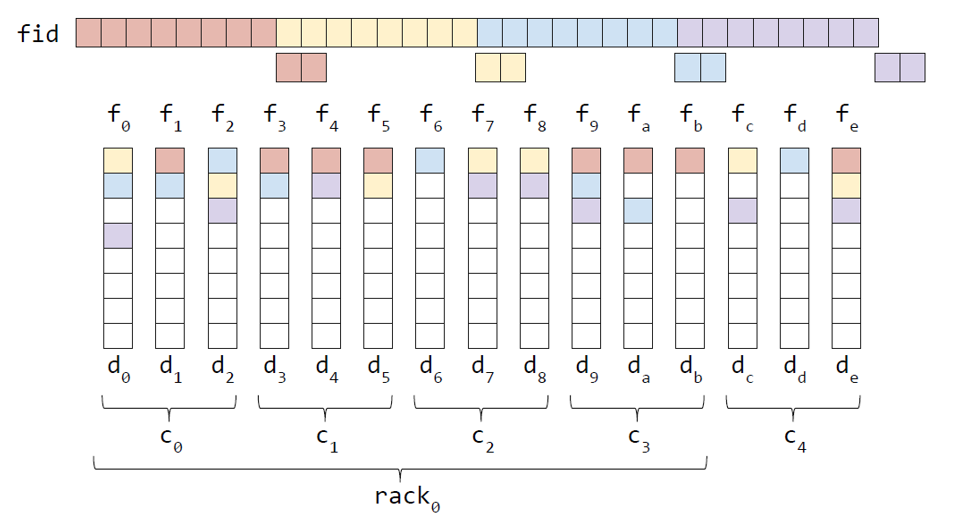

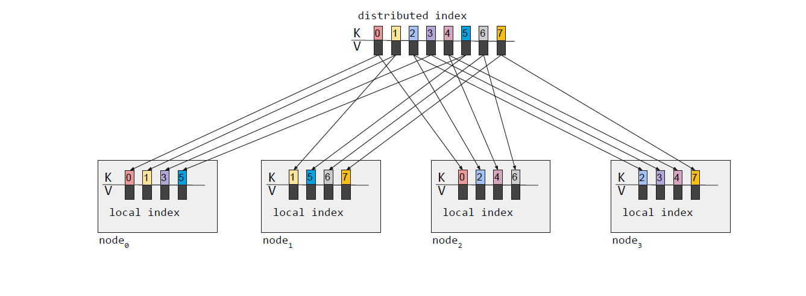

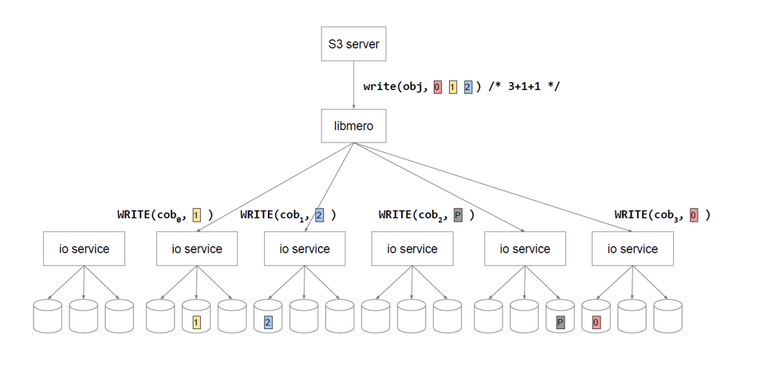

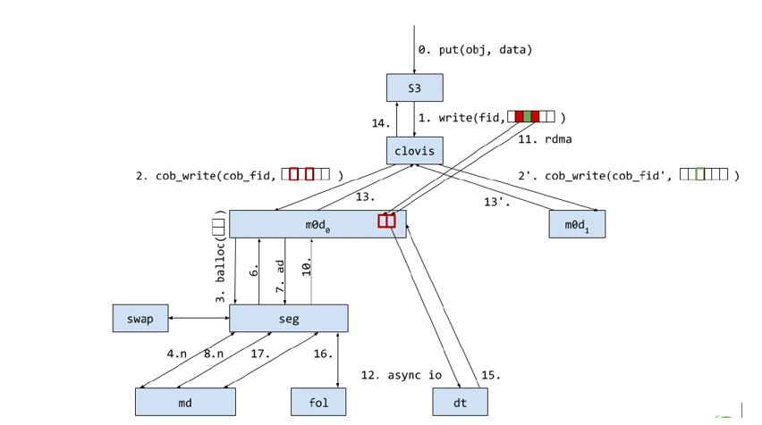

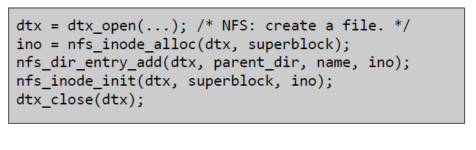

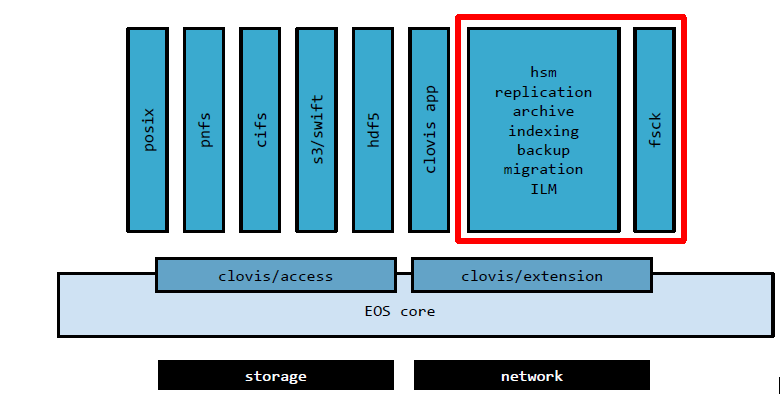

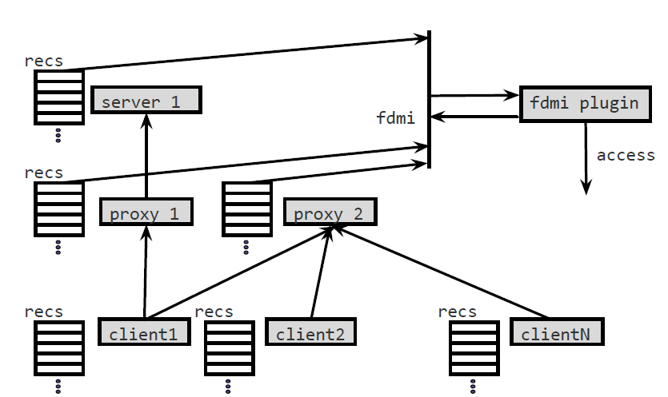

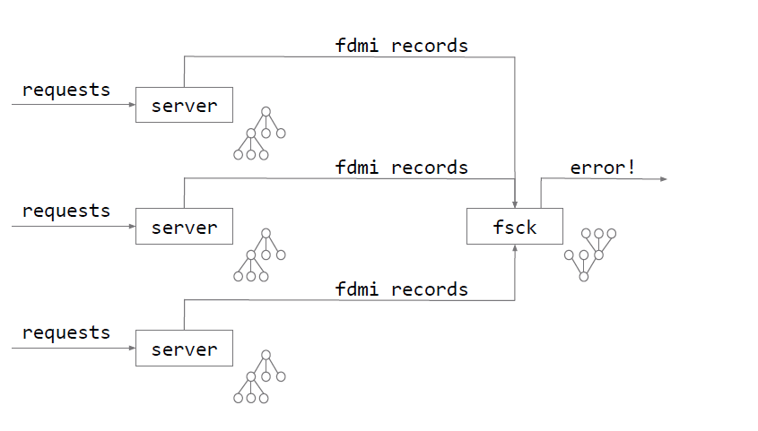

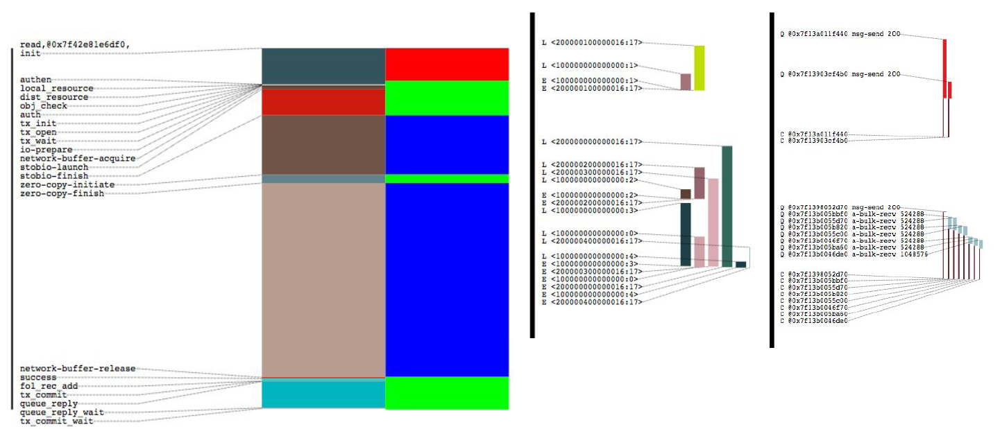

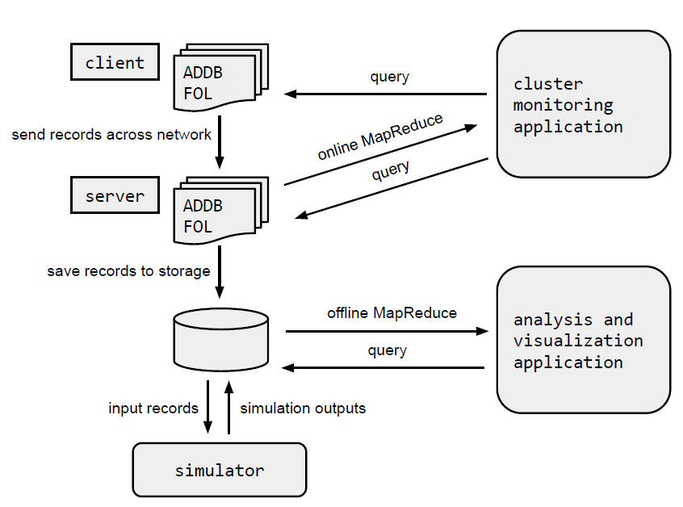
