.. vim: syntax=rst

|image0|

.. sai.narasimhamurthy@seagate.com

========================================
**EU R&D: Strategic focus for the team**
========================================

-  Develop new software technology suitable for future EOS based
   products

   -  Execute Collaborative R&D projects (Sage2, Maestro, EsiWACE2) in
      the EU

   -  Developing an early adopter ecosystem around them (software and
      user)

-  Continue to bring in external funding to Execute

   -  Primarily the EU

   -  Focus on follow on projects (Sage3, etc)

-  Promote Open sourcing of EOS

-  Developing new IP/Patents based on R&D

-  Influencing wider research & technology roadmaps in EU (w/ ETP4HPC)

   -  Also gather inputs on R&D areas of value for EOS & Seagate

..

=================
**HORIZON 2020**
=================

-  Biggest EU Research and Innovation Program

-  Europe Invests in R&D through Framework Programmes

-  Focus on collaborative Research between public and private sector

|image1|

-  H2020 Projects **Fully** Funded

-  Participants **get to keep IP**

..

=======================================
**One Storage System to Rule them All**
=======================================

|image3|

`www.sagestorage.eu <http://www.sagestorage.eu>`__

..

=====================
**SAGE Project Goal**
=====================

**Building a multi-tiered storage system suitable for Cloud, Big Data
and HPC use cases**

**~**\ €7.9M Project [Sept 2015 - Aug 2018] **(~€2.6M Seagate Share)**

SAGE Team includes:
###################

-  World’s largest Nuclear Fusion Tokamak (CCFE)

-  One of Europe’s biggest computing sites (CEA/Juelich)

-  UK Government Technology wing (STFC)

-  Leading edge AI lab in Europe (DFKI)

-  ARM (Allinea)

-  ATOS

|image4|

..

==================================
**SAGE Implemented System Stack**
==================================

|image5|

..

=======================
**Implemented System**
=======================

-  Co-designed with Use Cases

-  Developed @ Seagate, UK

-  Deployed @ Juelich Supercomputing

-  Porting of Stack Components

-  Porting of applications

-  Availability for External Users to Try!

|image6|

..

===================
**SAGE Use Cases**
===================

|image7|

..

===================
**SAGE2 – Vision**
===================

**Vision:**
############

Extending storage systems into Compute nodes & blurring the lines
between memory & storage

*Four primary Innovations Targeted:*

1. **Compute node local Memories**

2. **Byte Addressable extensions** into Persistent storage (Global
   Memory Abstraction)

3. **Co-design**: Mainly Data analytics pipelines w/ AI/Deep learning

4. **Co-design** with arm based environments

**AI/DL use cases expected to be memory intensive & will exploit node
local memory which will need to be extended**

..

====================
**SAGE2 Innovation**
====================

|image8|

..

====================
**SAGE2 Use Cases**
====================

|image9|

..

==========================
**SAGE2 Proposed System**
==========================

|image10|

..

================================
**System Operation with Sage2**
================================

|image11|

..

===========================================
**Sage2 Enhanced System & Software Focus**
===========================================

**Seagate EOS Focus (Sage2)**
##############################

-  QoS (Performance Throttling)

-  Function Shipping

-  Arm Porting

-  Distributed Transaction Management (Basic)

-  Higher Level Interface on Clovis

**Sage2 (Other anticipated outcomes)**
#######################################

-  TensorFlow on Clovis

-  dCache on Clovis

-  3DXPoint NVDIMM Interoperability

-  Deployed AI applications

-  Slurm Scheduler for EOS

|image12|

..

==================================
**MAESTRO [ Sept ‘18 - Aug’21 ]**
==================================

**Summary**
############

-  MAESTRO is a Forchungzentrum Juelich led R&D project for building a
   data aware middleware called “MAESTRO” for extreme scale apps

-  **Seagate Focus:** EOS support for Maestro and provision of I/O
   functionalities for Maestro

-  Seagate’s $0.7M grant awarded / Total project value is $5M

**Partners**
#############

-  Forschungszentrum Juelich(Germany), ECMWF(UK) - hosts the world’s
   largest weather prediction data archives, CSCS(Switzerland) - runs
   the largest supercomputer in the world outside of China, CEA,
   Appentra (Spain)
   
   

**Key Technology Focus**
#########################

MIO - Maestro I/O Interface that sits on top of EOS Clovis API

-  MIO is a higher level API on top of Clovis making it easy to use EOS

-  MIO work leads to work on a POSIX-lite API in Sage2

-  MIO also has features such as “hints” where users can provide hints
   in data placements

..

================================
**ESiWACE2 [Jan’19 - Dec’22]**
================================

**Summary**
############

-  ESiWACE2 is a **granted** DKRZ led R&D project (ESiWACE1 follow on)
   enabling leading **weather and climate communities** to leverage the
   available performance of pre-Exascale systems with regard to both
   compute and data capacity (Circa 2020) and prepare the weather and
   climate models to make use of Exascale systems when they arrive
   (Circa 2023)

-  **Seagate Focus:** Development of the Clovis API/EOS **suitable for the
   Weather/Climate Community** & provide a prototype storage solution

-  Seagate’s €240,000 grant/ Total project value is ~€8.04M

**Partners**
#############

-  DKRZ (Germany), CNRS-IPSL (France), ECMWF (UK), BSC (Spain), MPIM
   (Germany), SMHI (Sweden), CERFACS (France), ICHEC (Ireland), Met
   Office (UK), CMCC (Italy), Uni of Reading (UK), STFC (UK), Bull
   (France), ETH Zurich (Switzerland), University of Manchester (UK),
   NLeSC (Netherlands), MeteoSwiss (Switzerland), DDN (France), MO
   (France)

**Key Technology Focus**
#########################

ESDM - Earth Systems Data Middleware

-  Open Source Middleware being developed by weather and climate
   community

-  Enables them to work with different formats of data

-  EOS will be a backend for ESDM

..

===================================================
**IO-SEA [ Sept’20 - Aug’23 ] - PROPOSED PROJECT**
===================================================

**Summary**
############

-  IO-SEA is a **proposed** EU R&D project lead by CEA

-  Project focus on building a data management platform suitable for
   Exascale, with “Ephemeral” storage services, Hierarchical Storage
   Management & NVRAM

-  **Seagate Focus:** Provision of EOS and associated advanced tools to
   suit the IO-SEA data management platform

-  $1.2M Seagate Grant\* / $10M total project value

**Partners**
##############

-  FZJ, (Jülich Supercomputing, Germany), Partec (Germany), CEA
   (France), Atos (France), ICHEC (Ireland), ECMWF (European Weather
   Forecast), IT4Innovation (Czech Republic) with a use case from CEITEC
   (Czech Republic), Johannes Gutenberg University (University of Mainz,
   Germany)

**Key Technology Focus**
#########################

-  Ephemeral Services - Services that are allocated on-demand and
   stripped down once the workload/application run ends

-  EOS Advanced Views - POSIX, HDF5, MPI-IO, S3 access - but to the same
   objects ( leverages Lingua Franca)

-  Full in-storage processing - Leverage GPU resources close to storage
   for performing in-storage computations - apart from general purpose
   cores.

-  EOS+Full HSM - Using a advanced Hierarchical Storage Manager + EOS
   combination to move data across the full set of storage pools (NVRAM,
   SSD, Flash, Disk, Tape)

\* % Funding Dependent on Brexit Negotiations & if we want to use EU
entities [50% - 100%]

..

=====================
**Other Activities**
=====================

-  Continued Seagate participation ETP4HPC Steering Board advising
   EU/EuroHPC

   -  ETP4HPC Influences European technology strategy in the areas of
      HPC, AI & Big Data, processing tech ( European processor), etc

      -  Through the SRA (Strategic Research Agenda) Work

         -  Seagate leads storage and I/O workgroup

      -  ETP4HPC is an official advisor to the EC
	  
	  
	  
..

==================
**More material**
==================

`www.sagestorage.eu <http://www.sagestorage.eu>`__

`www.maestro-data.eu <http://www.maestro-data.eu>`__

`www.esiwace.eu <http://www.esiwace.eu>`__

..

================================================
**All Deliverables will be shared on EOS Dev**
================================================

..

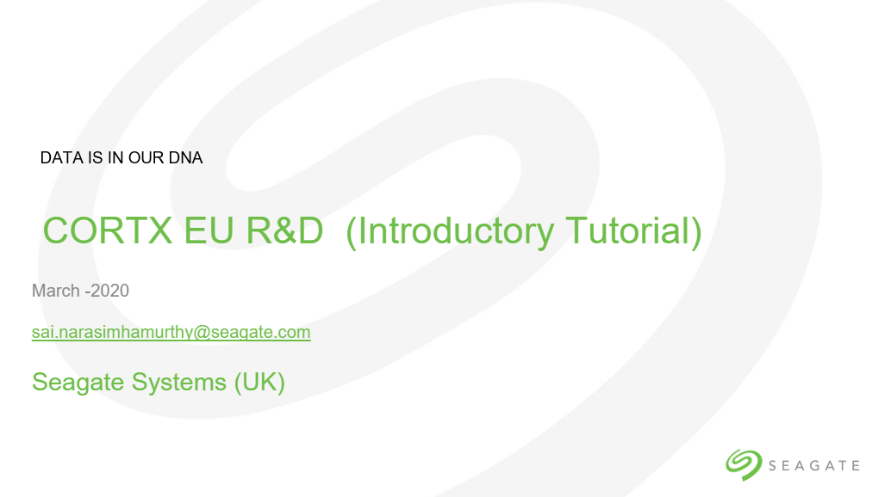
   
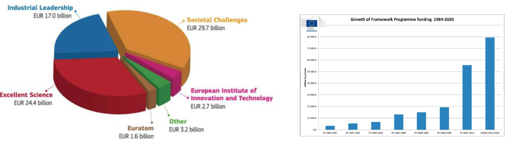
    
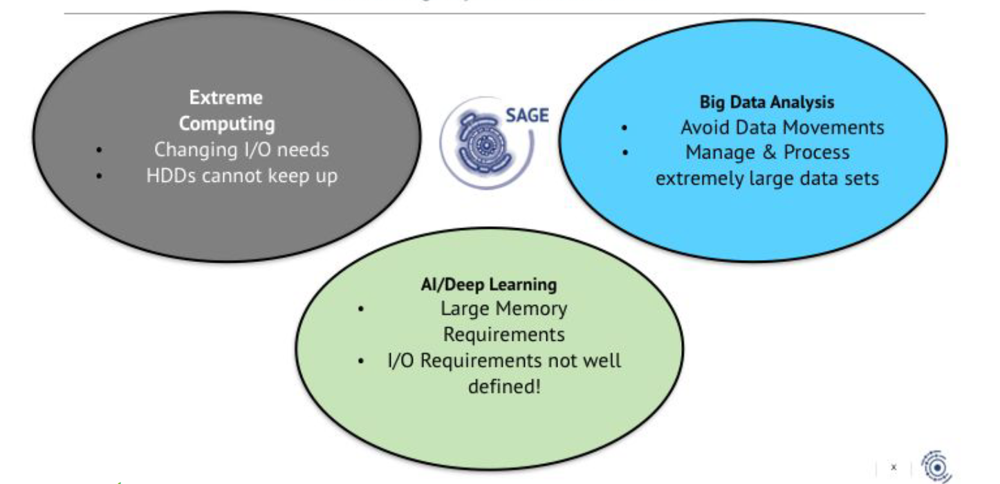
   
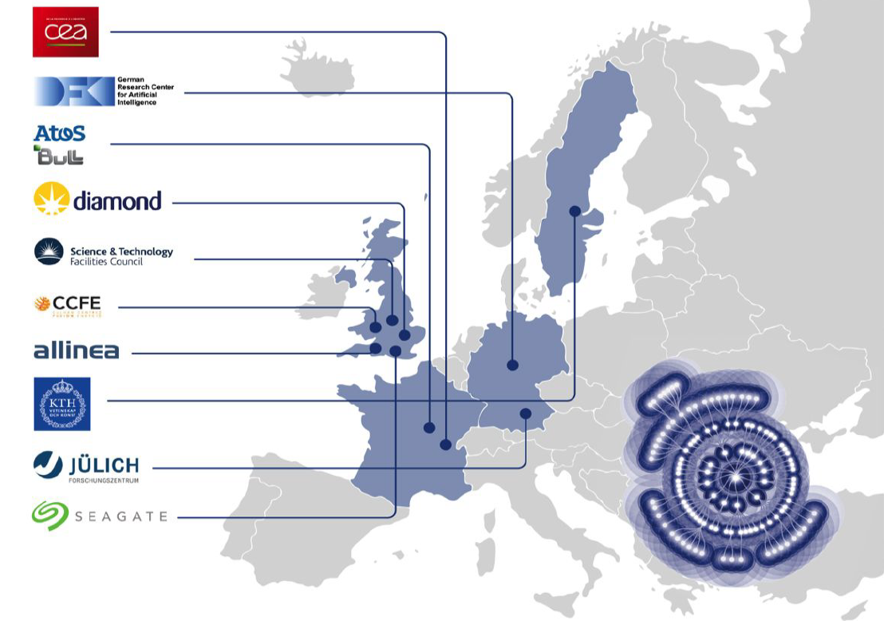
   
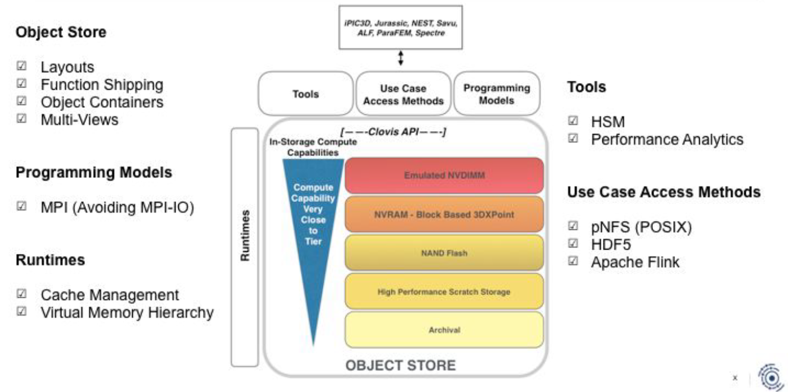
   
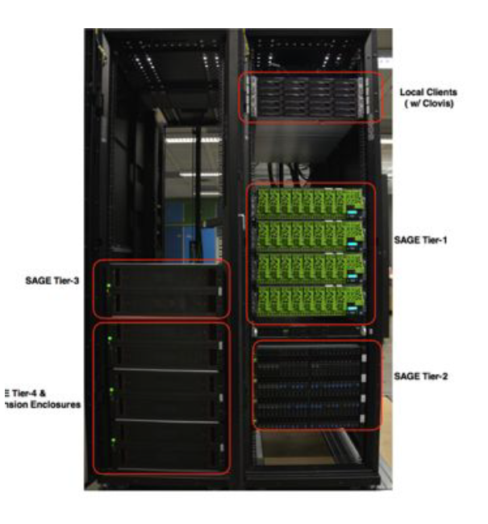
   
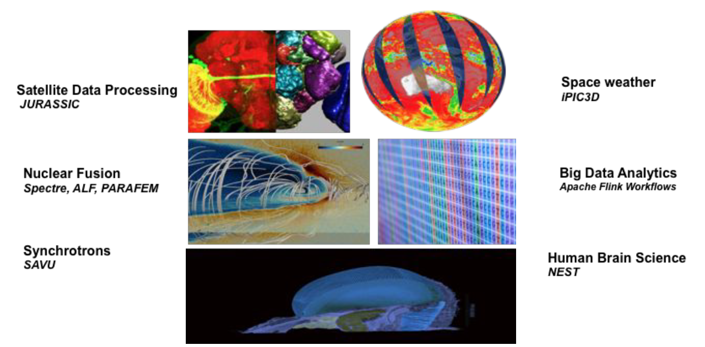
   
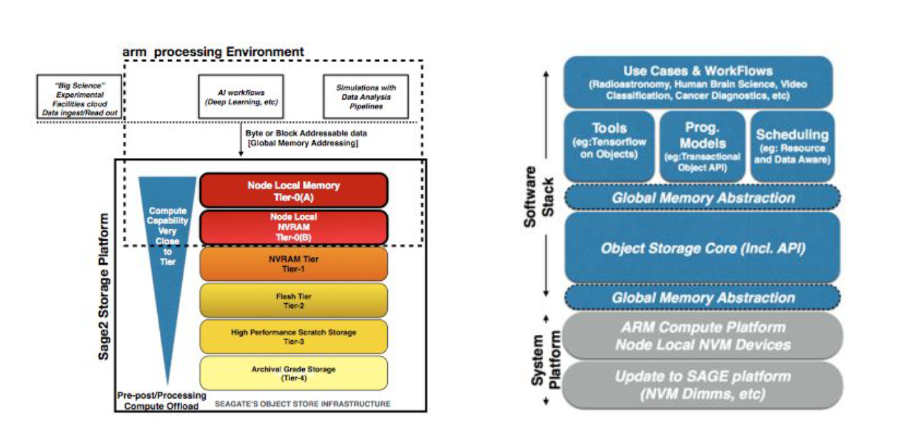
   
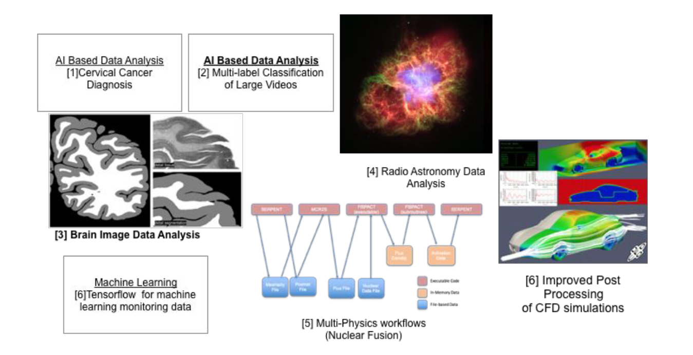
   
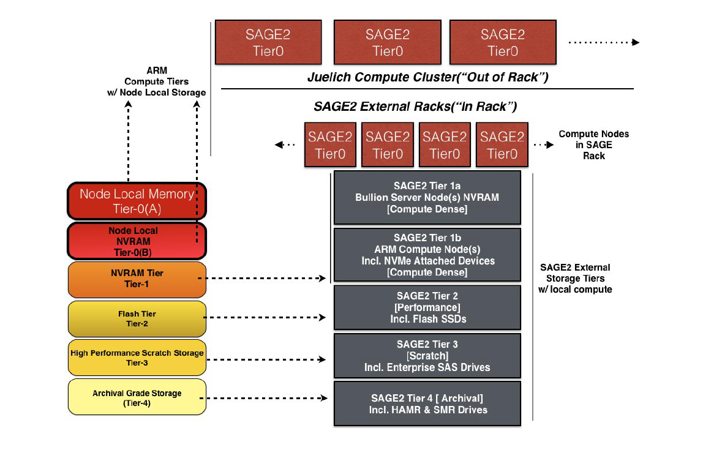
   
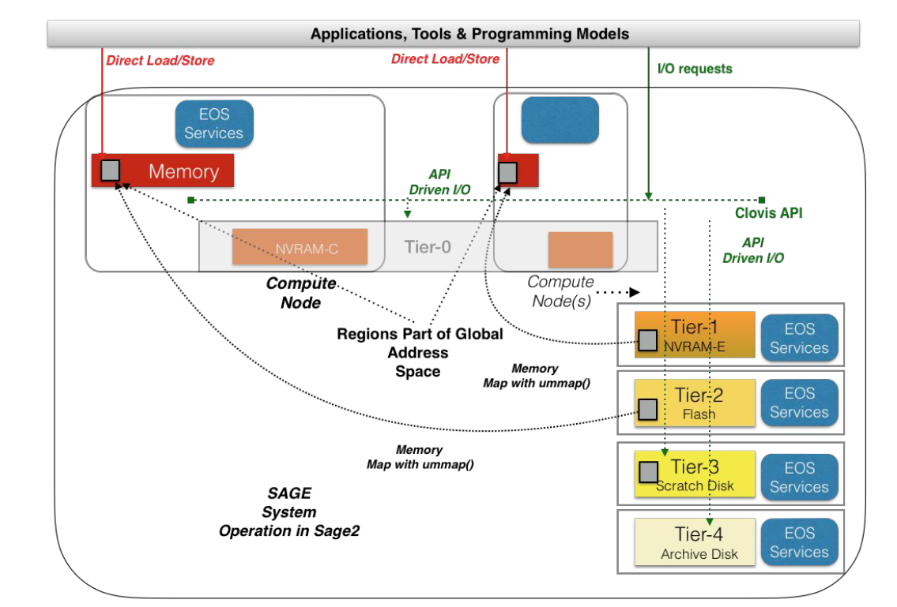
   
.. |image12| image:: images/13_SAGE2_Enhanced_System_&_Software_Focus.png
   

