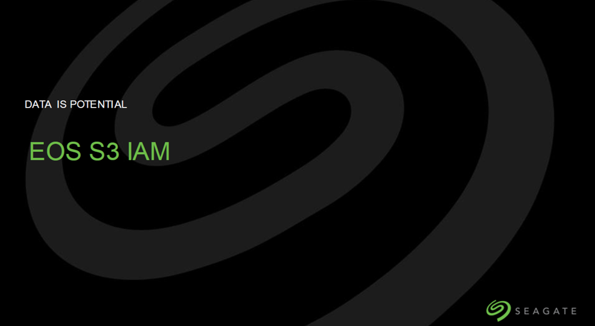
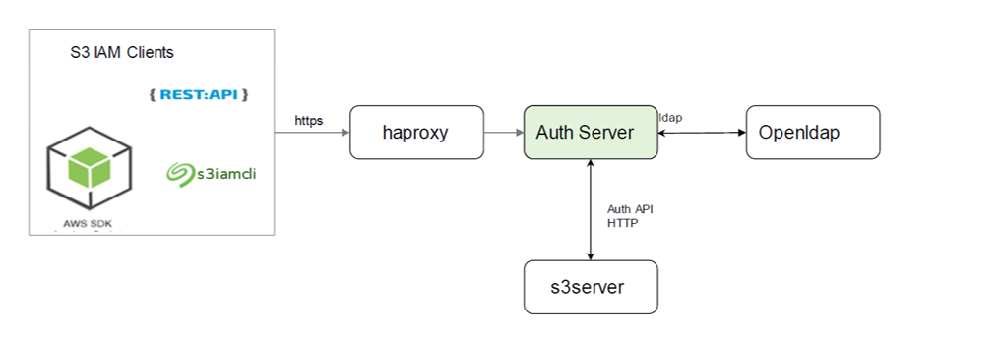
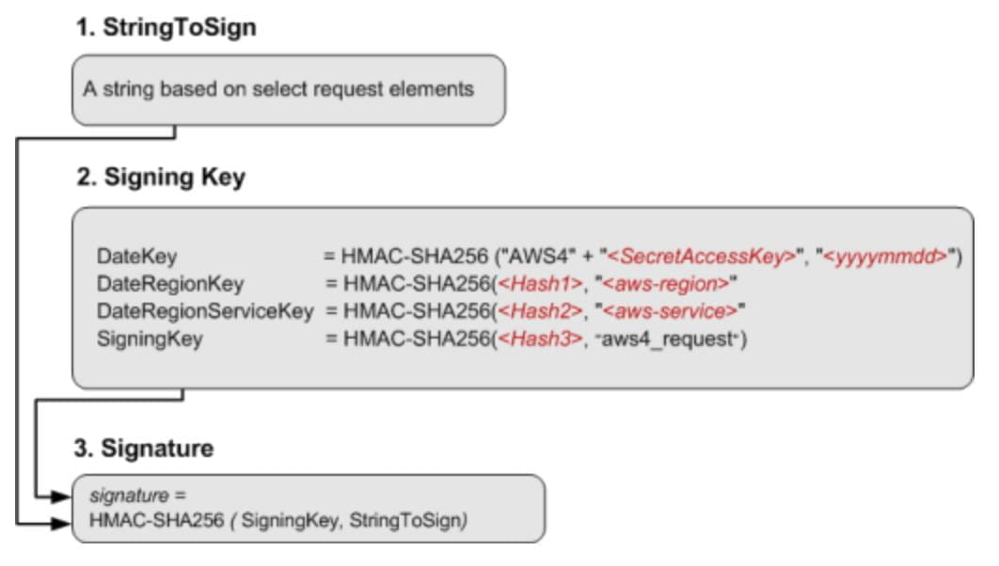
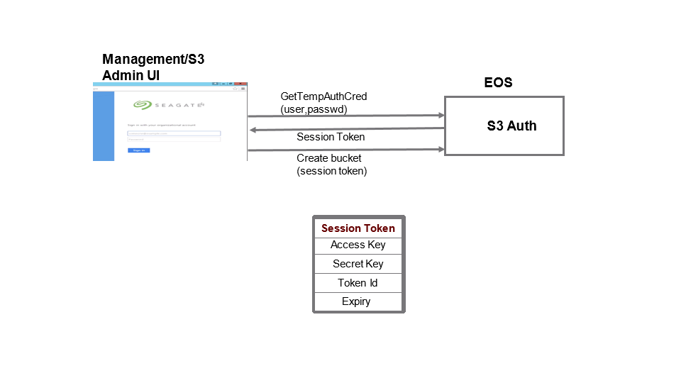
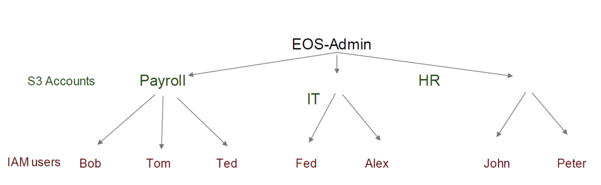
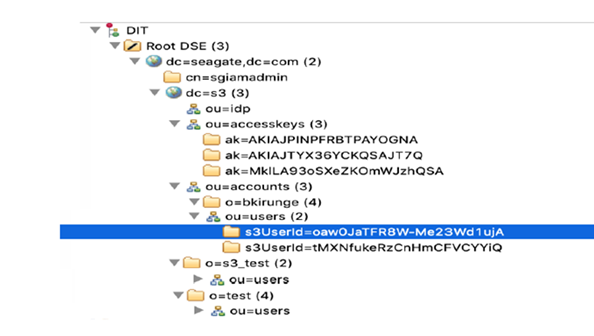
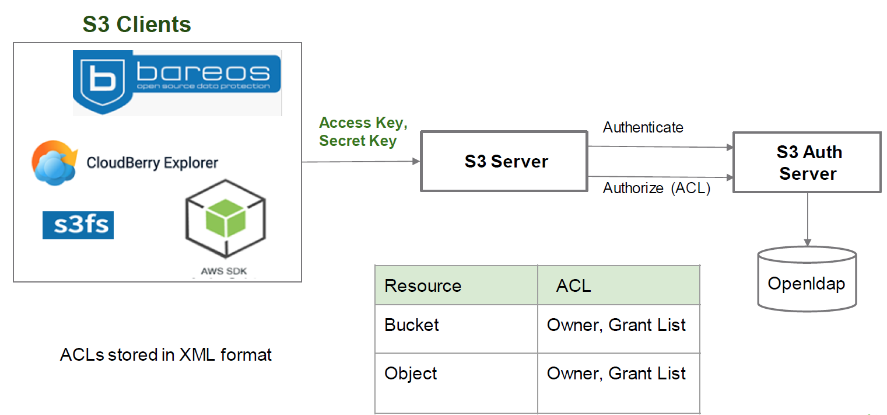
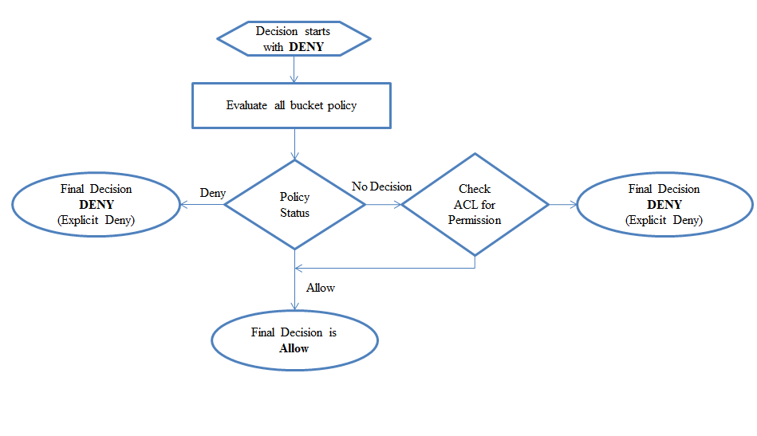

.. vim: syntax=rst

|image0|

=======
Agenda
=======

● S3 Auth Server

● Authentication

● Authorization

● Identity and Access Management

● Access Control List (ACL)

● Bucket Policy

● Access Evaluation method

● S3 IAM cli

● Demo S3 ACL with CloudBerry S3 Explorer

===============
S3 Auth Server
===============

● Enable access control to resources (Bucket, Objects)

● Developed in Java using Java netty io framework.

● One instance of Auth server runs on each EES node

● Uses OpenLdap as backend to store IAM data.

● OpenLdap is clustered, IAM data gets replicated across nodes.

● Provides REST API interface, AWS IAM API

● Every S3 request generates authentication and authorization request.

===============
S3 Auth Server
===============

|image1|

**S3 IAM endpoint:** *iam.seagate.com:9443*

**SSL ca cert:** */etc/ssl/stx-s3-clients/s3auth/s3authserver.crt*  

===============
S3 Auth Server
===============

**Authentication : “Verify Identity of a User”**

**Authorization : “Permission to perform operation”**

====================================
S3 Authentication and Authorization
====================================

|image2|

=======================   
Authentication methods
=======================

**Authentication steps**
#########################

• **Parse Http Header**

• **Validate Date Header**

• **Check access key in OpenLdap**

• **Calculate Signature**

• **Compare Signature**

• **Return response xml**

|image3|

**S3 Auth server supports both AWS V4 and AWS V2**

**Access Id** - This is a unique id generated for each user.

**Secret Key-** The secret key is used by s3-clients to 
sign all the requests to the s3-server.

**- No exchange of secret key**
   
   
===============================================
Authentication : Management/Web Login Use Case
===============================================

|image4|

..

=====================================
Identity and Access Management (IAM)
=====================================

|image5|

• S3 Account

• IAM User

• Static groups – AllUsers, AuthenticatedUser

=================================
S3 User Schema (DIT in OpenLdap)
=================================
   
|image6|

   
======================
Authorization methods
======================

**Authorization - Steps**

○ Parse input http header

○ Parse Bucket Policy Json

○ Evaluate input request

○ Openldap call to retrieve user details

○ Match permissions in Policy

○ Parse ACL xml

○ Match permissions

S3 Account - level Access Management

* S3 ACL

IAM User and Account - level Access Management

* S3 Bucket Policy

================   
S3 ACL Overview
================

|image7|

..

=============
Resource ACL
=============

+---------------------+----------------------+----------------------+
|    **Permission**   |    **When granted on |    **When granted on |
|                     |    a bucket**        |    an object**       |
+=====================+======================+======================+
|    **READ**         |    Allows grantee to |    Allows grantee to |
|                     |    list the objects  |    read the object   |
|                     |    in the bucket     |    data and its      |
|                     |                      |    metadata          |
+---------------------+----------------------+----------------------+
|    **WRITE**        |    Allows grantee to |    Not applicable    |
|                     |    create,           |                      |
|                     |    overwrite, and    |                      |
|                     |    delete any object |                      |
|                     |    in the bucket     |                      |
+---------------------+----------------------+----------------------+
|    **READ_ACP**     |    Allows grantee to |    Allows grantee to |
|                     |    read the bucket   |    read the object   |
|                     |    ACL               |                      |
|                     |                      |    ACL               |
+---------------------+----------------------+----------------------+
|    **WRITE_ACP**    |    Allows grantee to |    Allows grantee to |
|                     |    write the ACL for |    write the ACL for |
|                     |    the applicable    |    the applicable    |
|                     |    bucket            |    object            |
+---------------------+----------------------+----------------------+
|    **FULL_CONTROL** |    Allows grantee    |    Allows grantee    |
|                     |    the READ, WRITE,  |    the READ,         |
|                     |    READ_ACP, and     |    READ_ACP, and     |
|                     |    WRITE_ACP         |    WRITE_ACP         |
|                     |    permissions on    |    permissions on    |
|                     |    the bucket        |    the object        |
+---------------------+----------------------+----------------------+

ACL Code Example:

.. code-block:: xml

		<?xml version="1.0" encoding="UTF-8" standalone="no"?><AccessControlPolicy xmlns="http://s3.amazonaws.com/doc/2006-03-01/">
		
		 <Owner>
		 
		  <ID>b17f937d52db45ae9ddccc89da9da0f2e03f96492bf54720a51fad0fef9c55e6</ID>
		  
		  <DisplayName>usertest</DisplayName>
		  
		 </Owner>
		 
		 <AccessControlList>
		 
		  <Grant>
		  
		   <Grantee xmlns:xsi="http://www.w3.org/2001/XMLSchema-instance" xsi:type="CanonicalUser">
		   
			<ID>b17f937d52db45ae9ddccc89da9da0f2e03f96492bf54720a51fad0fef9c55e6</ID>
			
			<DisplayName>usertest</DisplayName>
			
		   </Grantee>
		   
		   <Permission>FULL_CONTROL</Permission>
		   
		  </Grant>
		  
		 </AccessControlList>
		 
		</AccessControlPolicy>
		

..

=================
S3 Bucket Policy
=================

  
● Bucket policy is a resource based access management policy.

● Using Bucket policy, we can grant access to other S3 accounts or
IAM users.

● Bucket policy is associated with individual bucket and stored as
part of bucket metadata.

● By default no bucket policy is created unlike Bucket ACL

.. code-block:: python

	{

		"Version": "2012-10-17", 
		"Id": "ExamplePolicy01", 
		"Statement": [

			{
				"Sid": "ExampleStatement01", 
				"Effect": "Allow", 
				"Principal": {

				"AWS": "arn:aws:iam::Account- ID:user/Dave"
			},

			"Action": [ 
			"s3:GetObject", 
			"s3:GetBucketLocation", 
			"s3:ListBucket"
				],
			"Resource": [ 
			"arn:aws:s3:::examplebucket/*",
			"arn:aws:s3:::examplebucket"
					]
				}
			]
		}
..

==================
Access Evaluation
==================

|image9|

..

=========== 
S3 IAM Cli
===========

**API’s /Operations available**

-  S3 Account

   - CreateAccountLoginProfile
   
   - GetAccountLoginProfile
   
   - UpdateAccountLoginProfile
   
   

-  S3 User
   
   - CreateUserLoginProfile
   
   - GetUserLoginProfile
   
   - UpdateUserLoginProfile
   
   

-  S3 Access Key/Secret Key
   
   - ChangePassword
   
   - GetTempAuthCredentials
   
   
..

===============  
**Questions?**
===============   

*Reach out to:*
################

•**EOS-S3** channel on MS Teams

•S3 team email @ eos.s3@seagate.com

   
==============
**Thank you**
==============

   

  
.. |image2| image:: images/3_S3_Authentication_and_Authorization.png
  

 

  

 

 

