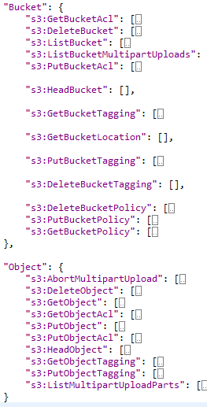

.. vim: syntax=rst

==================
**Bucket Policy**
==================

Bucket policy is a resource based access management policy i.e. using this, we can grant access to other cortx-s3 accounts or IAM users on specificbucket

Bucket policy is associated with individual bucket.

Accesses on buckets/objects can be controlled with any of the following options-

i.  Bucket Policy

ii. CORTX-S3 ACL (Access Control List)

ACL is an old way of providing grants on buckets/objects so recommendation is to use Bucket policies for access control.

+----------------------------------+----------------------------------+
| **Bucket Policy**                | **CORTX-S3 ACL**                 |
+----------------------------------+----------------------------------+
| At Bucket level                  | At Bucket or at Object level     |
+----------------------------------+----------------------------------+
| Max size allowed - 20KB          | No limit on size.                |
|                                  | Limit is present on grants.      |
|                                  | Maximum no. of grants - 100.     |
+----------------------------------+----------------------------------+
| This will define-                | This will define-                |
| Who all can perform what all     | Who all can perform what all     |
| operations on a bucket and       | operations on a bucket or        |
| objects inside it.               | object. Not combined.            |
+----------------------------------+----------------------------------+

We can apply Bucket policy and ACLs simultaneously.

When both are applied together, result will be least privilege of
union of all.

If Bucket policy allows access to some action/operation then
irrespective of acl, Result will be: Allow

If Bucket policy denies access to any action/operation then
irrespective of ACL, result will be: Deny

ACL will be checked only when -

Either policy itself is not present on bucket or policy is not
concluding anything (neither Allow nor Deny)

There are few exceptions to this rule-

i.   GET

ii.  PUT

iii. DELETE Bucket Policy

These three operations are by-default allowed to owner of the bucket and its subordinate IAM accounts only when provided access explicitly. Cross
accounts cannot perform these operations though granted access.

ACLs and Policies don't interfere with each other.

When PutBucketPolicy operation is executed, first authorization and then validatePolicy operation gets performed. If Authorization is successful
then only Policy Validation will take place. Policy Validation covers
all below checks-

1. Principal field validity - Here we check, if provided principal is
   valid/exists or not.

It accepts accountid, userid or user ARN

2. Action filed validity- Here we check if provided action comes under
   valid supported set of CORTX-S3 actions or no. Below is the list supported
   CORTX-S3 actions-

|image0|

3. Resource field validity- It checks if provided resource is same as
   requested resource or no. And also checks if arn format is right or
   no

4. Effect field validity - It checks if valid set of values provided for
   Effect field or no i.e. Allow or Deny

5. Duplicate fields- Bucket validation checks the duplicate field
   presence

6. Validation also checks out of order field

7. Case sensitivity check for all the fields

For each of these validations, specific error messages are handled.

Usage and Example available at below location -

`<https://docs.aws.amazon.com/cli/latest/reference/s3api/put-bucket-policy.html>`_

..

**Not in scope-**
#################

Below area are not in scope as of now-

1. NotPrincipal, NotResource and NotAction field in policy is not supported

2. Max policy size of 20KB not yet handled.

..

============================
**Bucket Policy Conditions**
============================

Following are the Condition scenarios that are being accepted:

1. Condition Operators :

   1. String

      1. StringEquals

      2. StringNotEquals

      3. StringEqualsIgnoreCase

      4. StringNotEqualsIgnoreCase

      5. StringLike

      6. StringNotLike

   2. Numeric

      1. NumericEquals

      2. NumericNotEquals

      3. NumericLessThan

      4. NumericLessThanEquals

      5. NumericGreaterThan

      6. NumericGreaterThanEquals

   3. Date and time

      1. DateEquals

      2. DateNotEquals

      3. DateLessThan

      4. DateLessThanEquals

      5. DateGreaterThan

      6. DateGreaterThanEquals

   4. Boolean

      1. Bool

   5. IfExists (checks if the key value exists as part of another
      check)

   6. Null check (checks if the key value exists as a standalone check)

2. Condition Keys

   1. AWS Wide Keys (Global Condition Context Keys)

      1. CurrentTime

      2. EpochTime

      3. Any key name followed by aws: will be accepted as valid. But it
         may not mean anything in authorizations unless it is a
         supported key which is present in the request body.

   2. Amazon S3 - specific keys

      1.  s3:x-amz-acl

      2.  s3:x-amz-grant-read

      3.  s3:x-amz-grant-write

      4.  s3:x-amz-grant-read-acp

      5.  s3:x-amz-grant-write-acp

      6.  s3:x-amz-grant-full-control

      7.  s3:max-keys

      8.  s3:prefix

      9.  s3:x-amz-content-sha256

      10. s3:x-amz-storage-class

**Note**:

1. Condition types (operators) are always validated. It should be one of
the predefined operators. Note, Boolean condition operator is considered
as a supported (valid) operator. However current Seagate infrastructure
does not so far support the necessary parameters (keys) that go along
with Boolean Condition, thus rendering it futile as of now.

2. For condition key - anything followed by "aws:" is valid. Other than
that only pre-defined keys are valid. Few of the condition keys may be
accepted (validated) but might not be considered while authorization if
those are not one of the supported features from their respective CORTX-S3
APIs. Please refer to the CORTX-S3 Rest API documentation for these details.

3. Each of these CORTX-S3 specifc keys can only be tagged to specific CORTX-S3
actions. For a detailed map of these Keys to Actions please visit:

`<https://docs.aws.amazon.com/AmazonS3/latest/dev/amazon-s3-policy-keys.html?shortFooter=true>`_

4. Conditions with multiple keys or values will be supported as per AWS
doc -

`<https://docs.aws.amazon.com/IAM/latest/UserGuide/reference_policies_multi-value-conditions.html>`_

5. Validation on the combination of Condition and Action will be
implemented according to AWS documentation -

`<https://docs.aws.amazon.com/IAM/latest/UserGuide/list_amazons3.html>`_

6. Boolean condition is supposed to work with following set of keys as
per Amazon:

-  aws:MultiFactorAuthPresent

-  aws:SecureTransport

-  aws:ViaAWSService

None of these keys are supported by Seagate currently in the request
context.

Hence as of now, there is no way this can be tested. So, Bucket policy
Boolean Condition operator will remain Non-QA and ineffective.

7. For DateCondition -

Date formats supported here are as per ISO 8601. Please find below the
details:

1. | Complete date:
   | YYYY-MM-DD (eg 1997-07-16)

2. | Complete date plus hours and minutes:
   | YYYY-MM-DDThh:mmTZD (eg 1997-07-16T19:20Z)

3. | Complete date plus hours, minutes and seconds:
   | YYYY-MM-DDThh:mm:ssTZD (eg 1997-07-16T19:20:30Z)

4. | Complete date plus hours, minutes, seconds and a decimal fraction
     of a
   | second
   | YYYY-MM-DDThh:mm:ss.sTZD (eg 1997-07-16T19:20:30.45Z)

where - TZD = time zone designator (Z or +hh:mm or -hh:mm)

Note for TZD we do not support 'hh:mm' designator. Only 'Z' (UTC format)
is supported in the current release.

**References -**

Condition operators' details:

`<https://docs.aws.amazon.com/IAM/latest/UserGuide/reference_policies_elements_condition_operators.html>`_

Bucket Policy examples:

`<https://docs.aws.amazon.com/AmazonS3/latest/dev/example-bucket-policies.html>`_

Overview:

`<https://docs.aws.amazon.com/AmazonS3/latest/dev/amazon-s3-policy-keys.html>`_

..

====================
**CORTX-S3 Failures**
====================

- S3TEST: Test for bucket_acl_grant_userid_read/readacp is failing with Assertion errors.
- The display name is optional for ACLs as per `AWS documentation <https://docs.aws.amazon.com/AmazonS3/latest/API/API_Grantee.html>`_

As we have tried to follow the documentation wherever possible this cannot be called an issue. For all such test cases, you can please update the results without
taking into account the failures due to 'display name'. If the test case fails only due to the unavailability of display name you can mark it `pass`.

.. :width: 2.73958in
.. :height: 4.98438in
