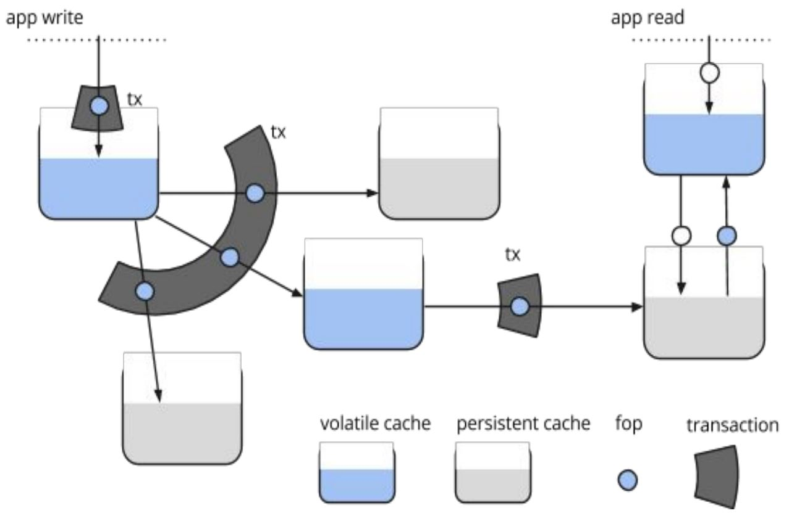
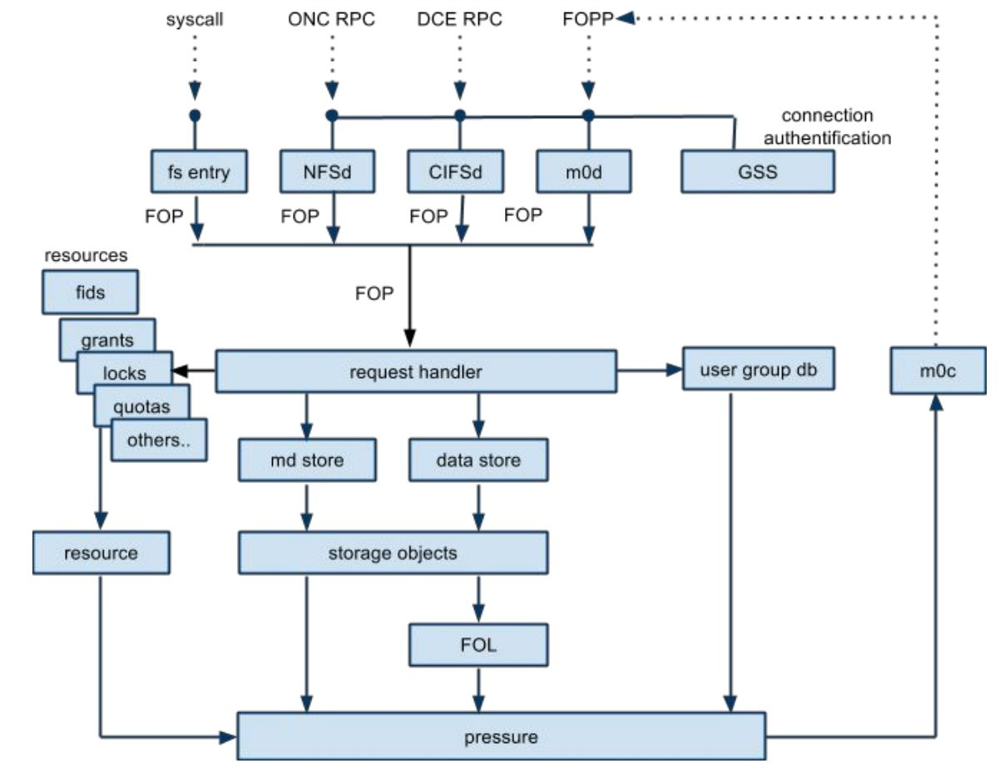
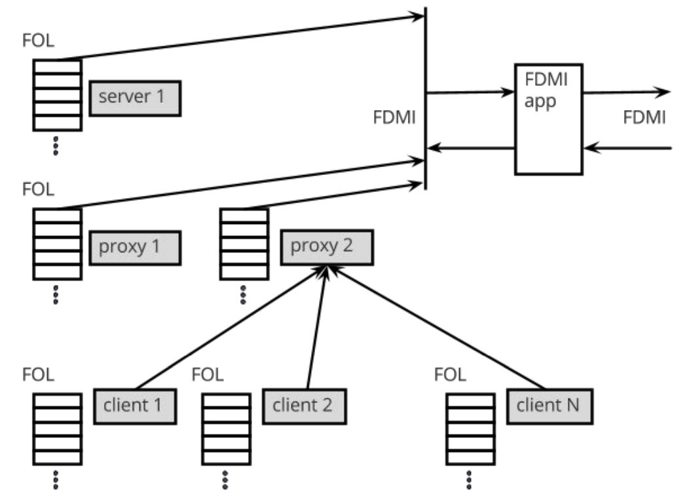
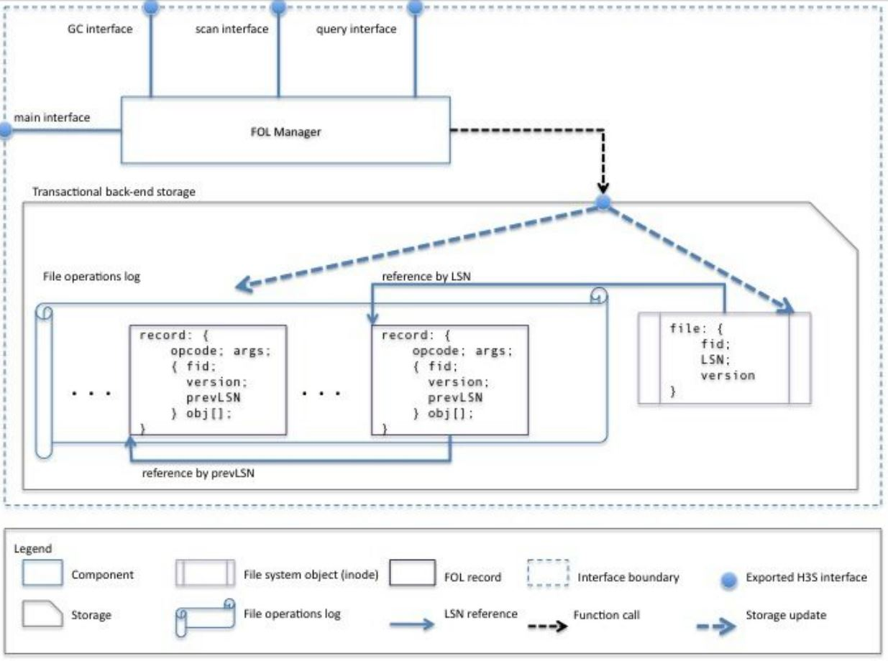
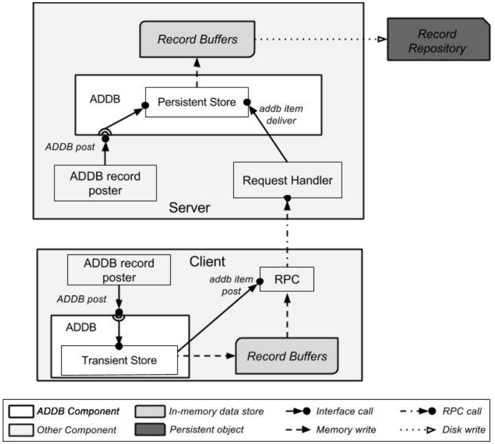
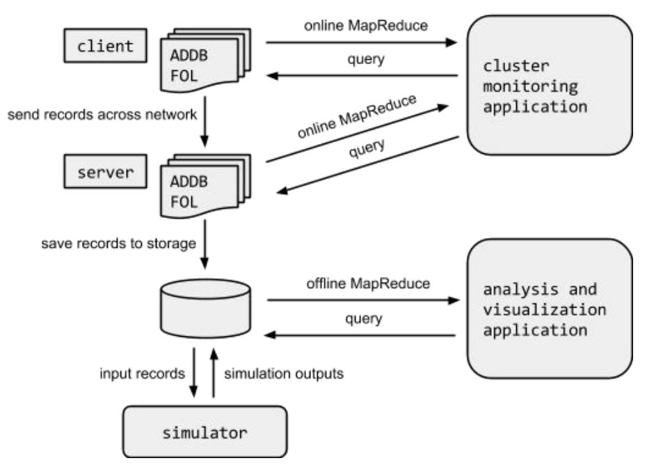
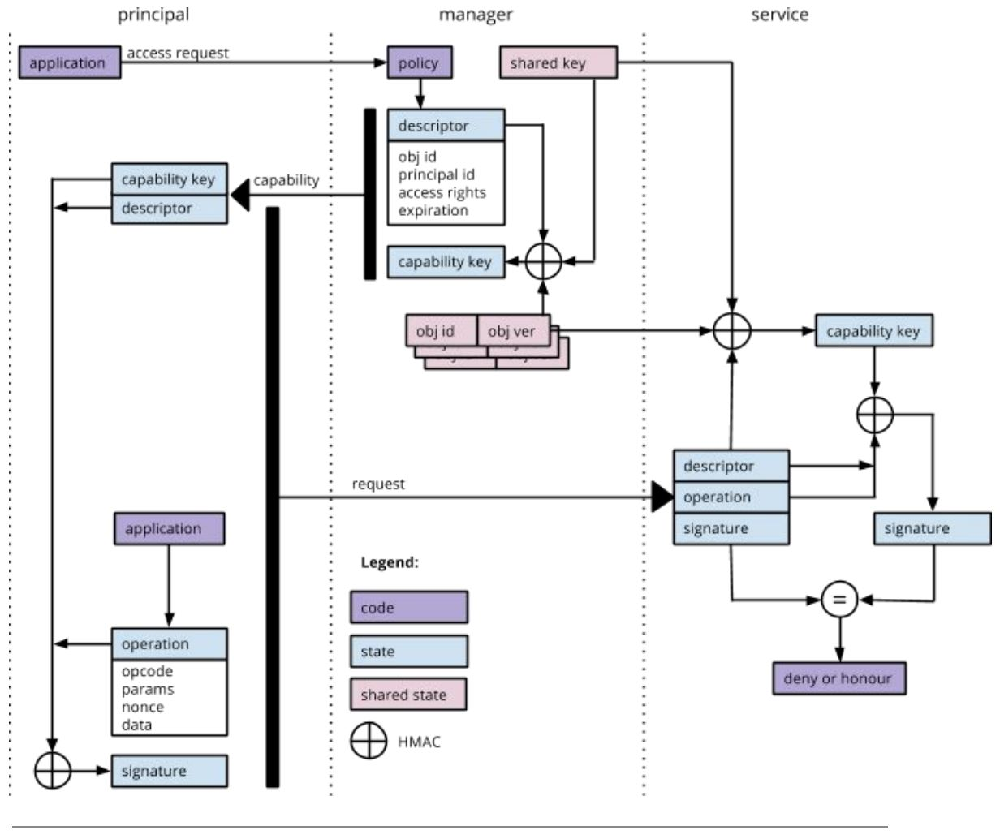
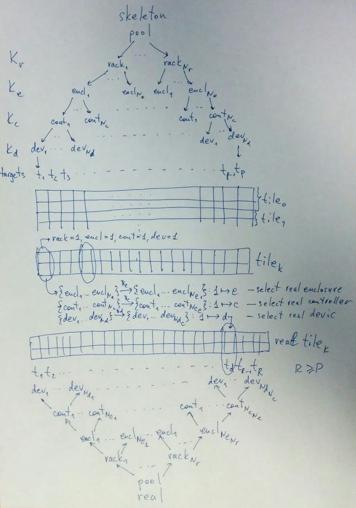

# Mero in Prose

_« Par ma foi ! il y a plus de quarante ans que je dis de la prose sans que j'en susse rien, et je vous suis le
plus obligé du monde de m'avoir appris cela. »_

This document attempts to be a master document for the whole of Mero, 
concentrating on giving a consistent overview of the architecture.

The document is structured as a collection of fragments. Each fragment, 
relatively small in size (1–2 pages), describes a particular subject 
(functional or structural part of Mero) at a particular level of detail and is 
named "subject, level". The fragments are referenced from the table below.

No linear reading order is assumed or possible, except that for a particular 
subject the reading should proceed left-to-right (because higher levels 
introduce terminology) and "overview" subject, that briefly describes the whole 
of Mero, should be read first. Each fragment ends with a list of suggestions 
for further reading: "More details" list pointing to the next level fragment 
for the same subject (corresponding to moving right in the table below), 
"References" list of external documents and "Related" list of "vertical" 
suggestions at the same detail level.


|     idea      | architecture | hld | dld | code |
|---------------|--------------|-----|-----|------|
| overview      | [X](#overview-idea)| [X](#overview-architecture)|    |      |
| client        | [X](#client-idea)            |     |     |      |
| server        | [X](#server-idea)            |     |     |      |
| md            |              |     |     |      |
| io            |              |     |     |      |
| cfg           |              |     |     |      |
| rm            | [X](#rm-idea)        |     |     |      |
| dtm           | [X](#dtm-idea)        |     |     |      |
| net           | [X](#net-idea)        | [X](#net-hld)   |     |      |
| fop           | [X](#fop-idea)        |     |     |      |
| fom           |              |     |     |      |
| rpc           | [X](#rpc-idea)            | [X](#rpc-hld)   |     |      |
| cm            |              |     |     |      |
| layout        |              |     |     |      |
| pdclust       | [X](#pdclust-idea)        |     |     |      |
| t1            | [X](#t1-idea)        |     |     |      |
| lustre        | [X](#lustre-idea)        |     |     |      |
| addb          | [X](#addb-idea)        |     |     |      |
| reqh          | [X](#reqh-idea)        |     |     |      |
| container     |              |     |     |      |
| file-set      |              |     |     |      |
| fdmi          | [X](#fdmi-idea)| [X](#fdmi-architecture)   |     |      |
| fol           | [X](#fol-idea)        |     |     |      |
| scalability   |              |     |     |      |
| failure       | [X](#failure-idea)| [X](#failure-architecture)   | |      |
| security      | [X](#security-idea)| [X](#security-architecture)   | |      |
| deployments   | [X](#deployments-idea)        |     |     |      |


# overview, idea

Mero is a distributed storage system, targeting 
[exascale](https://en.wikipedia.org/wiki/Exascale_computing) configurations. 
Mero architecture started in 2009. Its main roots are [Lustre](#lustre-idea) 
file system, NFSv4 and database technology. Mero is not, strictly speaking, a 
file system: an emerging consensus is that traditional file system properties 
(hierarchical directory namespace, strong POSIX consistency guarantees, &c.) 
are no longer desirable or achievable at exascale. Instead, Mero is a more 
general storage system, providing an optional file system interface. This 
allows wider range of deployments, including cloud.

Mero controls a cluster consisting of nodes connected by network. Some nodes 
have persistent storage attached to them. Mero makes distinction between 
various types of persistent store:

* rotational drives. They have low cost per bit, good durability, widely 
  available. Their drawbacks include high latency (due to rotational and seek 
  delays) and ever decreasing bandwidth-to-capacity ratio;
* flash drives. They are more expensive per bit, have limited capacity per 
  drive, no seek latency, good throughput;
* non-volatile memory of various types, including PCI-attached flash devices, 
  battery-backed memory and phase-change memory. Even more expensive and even faster.

Some nodes are running applications, which are entities external to Mero. 
Applications issue requests to query or manipulate cluster state. An 
application can be a traditional user space application, running standalone on 
a node, or a large [MPI](https://en.wikipedia.org/wiki/Message_Passing_Interface) 
job running on multiple nodes, or a cluster management utility monitoring the 
state of the system, or NFS (or CIFS) daemon exporting Mero to non-Mero clients.

Each Mero node caches a part of system state. This cache consists of meta-data 
(information about directories, files, their attributes) and data (file 
contents, usually in form of pages). The cache can be stored in volatile memory 
or on persistent store. To allow multiple nodes to cache state without 
violating system consistency a [resource manager](#rm-idea) is used. For 
example, multiple nodes can keep read-only copies of the same page in a file, 
but when one node writes in the page, all other copies of this page must be 
invalidated in caches. This latter requirement is part of consistency 
guarantees. Mero provides variable consistency levels (compare with 
[isolation levels](https://en.wikipedia.org/wiki/Isolation_(database_systems)) 
in databases and [close-to-open](http://www.quora.com/What-is-close-to-open-cache-consistency) 
cache consistency in NFS).

Applications request Mero to perform operations, including creating, reading, 
and writing files. An operation request goes to the Mero instance local to the 
application (running on the same node). The instance decides whether the 
operation is executed locally, by caching some state updates at the local 
node, or its execution should be forwarded to other nodes. A single operation 
might involve updating or querying state on multiple nodes. A mix of local and 
remote execution is possible for the same operation. While executing the 
operation, a remote node might decide to forward operation to yet another 
node and so on.

Ultimate effect of operation execution consists of updates and queries to 
cached state on multiple nodes. State updates gradually migrate toward more 
persistent store. That is, an update to an in-memory page cache might be 
propagated to a cache stored on a flash drive and later on to a cache stored 
on a rotational drive. This cache migration is controlled by a combination of 
administrative and opportunistic rules. Administratively, a network of proxy 
servers is configured, which defines the overall structure of cluster storage 
hierarchy. Opportunistically, nodes use resource manager to learn about caches 
in their vicinity and peer-to-peer communication to exploit neighbours' caches.

Remote execution requires [network](#net-idea) communication. Mero 
[rpc layer](#rpc-idea) handles certain network failures (message loss) and 
providing convenient interface to send items, which are internally packed in 
network messages. 

Distributed transaction manager ([dt](#dtm-idea)) allows operations to be 
grouped into distributed transactions, which are guaranteed to be atomic in 
the face of certain failures.



Main novel ideas of Mero, that distinguish it from other cluster  file-systems are:
* fdmi;
* file operations log (fol);
* fops;
* distributed transaction manager (dt);
* resource manager (rm);
* layouts, including parity de-clustering (pdclust);
* containers;
* addb.

Mero used to be called SCIF and H3S in the earlier documents. 

### References: 
* [Mero reading list](https://docs.google.com/document/d/1LUfd6MkNdnghmXhYwrKHIU_eTauMWdpHCXcVATG_Akg/edit)
* [Mero components](https://docs.google.com/spreadsheets/d/10plOv-1vbNp3ZTkRIjEu-L4TOrU5V71aBSQ6Nx9XkxE/edit#gid=0)
* [Mero technical (presentation)](https://docs.google.com/presentation/d/1VrqkzxklEXnthfsNl3GZhgGaeWl4yTW43LP87EmhzPc/edit#slide=id.g5422de3ce3ebe9f374)
* [Mero technical whitepaper](https://docs.google.com/document/d/1OnG7RL4HzmIhBzpbbbqyt3u2yC3uZUxzEKr-IJJXicg/edit#heading=h.lu5k8of3smm9)
* [Mero architecture whitepaper](https://docs.google.com/document/d/1xM7yYPjPH_AuxiN7-J54s2LANv87BvkqLtdL9bOU-7I/edit#heading=h.2cl1oobc8wgr)

### Related:
### More details: [overview, architecture](#overview-architecture)

## lustre, idea

Lustre is a cluster file-system, designed in late 90s early 00s by Peter Braam 
at CMU. Lustre was developed by ClusterFS, which was acquired by Sun 
Microsystems, which was acquired by Oracle, Lustre IP was then acquired by 
Xyratex, which is in process of being acquired by Seagate—file systems habent 
sua fata. Lustre is highly successful in the HPC space, running on 7 to 9 
supercomputers from Top10 list. 
Lustre is different from Mero in a number of ways:
* Lustre is a strictly client-server system. There are client nodes, that issue 
  file system operations to server nodes;
* Lustre clients have no persistent store. Only server nodes have persistent 
  store, typically in the form of rotational drives;
* there is a single meta-data server, which maintains all user-visible 
  file-system meta-data: directory entries, file identifier allocation maps and 
  so on. Plans to introduce some restricted form of clustered meta-data exist 
  for many years.

Commonalities between Lustre and Mero include:
* client caches for data and meta-data (Lustre supports only read-only meta-data cache);
* various network optimisations including intents and 0-copy transfers;
* highly asynchronous servers and associated recovery.

### References:

### Related:

### More details:

## reqh, idea

Request handler (reqh) processes [fops](#fop-idea). reqh is part of any 
[Mero instance](#overview-idea). It receives incoming fops and executes them to 
completion. As part of fop processing, 
[reqh interacts with other Mero sub-systems](#overview-architecture), issues 
store requests and sends network messages. Mero reqh design addresses the 
following issues:
* factoring out common code shared by multiple fop types. Various file-system 
  operations involve similar steps:
  * check cryptographic signatures on operation parameters to validate operation and authenticate users;
  * acquire local resources (locks, memory);
  * acquire global resources ([resource usage rights](#rm-idea));
  * load objects (files, directories) involved in the operation in memory;
  * consult user data-base to authorise the operation;
  * start local transaction;
  * send reply.

  reqh provides re-usable infrastructure to implement these steps with minimal 
  amount of additional code.
* scalable server implementation taking characteristics of modern hardware into 
  account. reqh uses non-blocking state machines to execute fops in a small 
  number of threads and binds computation resources such as threads, processor 
  cores, processor caches and memory together to improve their utilisation.
* long-term scheduling, taking fop properties into account. reqh attempts to 
  impose a global ordering on fop processing. Possible ordering policies include:
  * process fops in order that optimizes rotational store access. For example, 
    arrange IO requests (file reads and writes) in the order of data-blocks on 
    disk. This policy reduces seeks. Similarly process meta-data requests 
    (mkdir, rename, link, open) in order corresponding to the order of file 
    attributes in the store;
  * process fops in order that optimises network messaging. Attempt to group 
    together operations that are likely to send messages to the same node. This 
    policy tries to produce more opportunities to coalesce messages together, 
    reducing messaging overhead.

These and similar policies are effective because request handler keeps a large 
queue of fops expecting processing, thus providing opportunities of 
re-ordering. See NRS in the references below.

### References:
* [HLD of request handler](https://docs.google.com/a/xyratex.com/Doc?docid=0ATg1HFjUZcaZZGNkNXg4cXpfMjA2Zmc0N3I3Z2Y),
* [request handler overview](https://docs.google.com/a/xyratex.com/document/d/1JzuIYRpq483hF3_5aOHtwJjGSGr9glLPFS00QreaUR0/edit)
* [Locality](https://docs.google.com/a/xyratex.com/viewer?a=v&pid=explorer&chrome=true&srcid=0BwaCw6YRYSVSMmVlODY1ZjQtMzJkMS00ZGYwLWFiZWQtNWVhNWJmZWZlZWM2)
* [HLD of fop state machine](https://docs.google.com/a/xyratex.com/document/d/1LjL0Ky6mCxxAgRSX6DIe7UMdt1CrFsSWG_2twBy5kI8/edit)
* [Network request scheduler](http://wiki.lustre.org/index.php/Architecture_-_Network_Request_Scheduler)
* [HLD of Lustre NRS](https://docs.google.com/a/xyratex.com/Doc?docid=0AUggUDoE_TgXZGR6N3M1OXRfM2RiMzJ6Y2Zu)

### Related: [server](#server-idea), [client](#client-idea)

### More details:

# fop, idea
## overview, architecture
Each node in the cluster runs one or more Mero instances. Each instance has the 
same overall structure:



At the heart of Mero instance is [reqh](#reqh-idea) (request handler). Request 
handler processes requests in form of [fops](#fop-idea) 
(file-system operation packets). Fops arrive to request handler by variety of means:

* an instance (typically a [server](#server-idea)) understands Mero native 
  protocol, "fop protocol" (fopp) that allows fops to be sent over network 
  from one Mero instance to another;
* an instance (typically a [server](#server-idea)) understands standard 
  protocols: CIFS, NFS, iSCSI, FCoE. Requests in these protocols are 
  interpreted by protocol translators, which produce fops corresponding to 
  the requested operation;
* an instance (typically a [client](#client-idea)) plugs into local kernel VFS 
  and generates ops corresponding to system calls invoked by the user applications;
* an instance (typically a [t1](#t1-idea) front-end) registers itself as a 
  block device and generates fops corresponding to IO requests issued by the kernel.

Incoming fops are [authenticated](#security-idea) through GSS API, if necessary.

reqh can be thought as a scheduler for fops: it tracks fop state 
(read, waiting, completed, &c.), moves it between reqh queues and takes an 
action when an event affecting fop progress (IO completion, network 
communication failure, resource availability, &c.) occurs.

To process fops reqh interacts with 3 major modules:

* user data-base, which is used for [authorisation](#security-idea). In 
  addition, Mero integrates with external enterprise user database;
* stores: io-store, md-store and remote-store. Stores is where 
  [state cached locally](#overview-idea) on the node is kept. Client page 
  cache is part of io-store and client inode cache is part of md-store;
* [resource manager](#rm-idea), which cooperates with reqh to determine which 
  operations should be executed locally and which should be delegated to remote 
  Mero instances.

As a typical use case, consider file creation fop. Creation of a file requires 
updating multiple file-system meta-data structures:

* directory entry, describing the name of the file must be inserted in the 
  parent directory, updating parent directory attributes (size, blocks, time) along the way;
* inode must be allocated for the file, updating inode counter.

In general, these updates need to be performed on different remote servers 
(in a case, where one meta-data server manages the parent directory and another 
meta-data server manages new file inode). There are multiple possible execution strategies:

* master-server-only: a client sends a create file fop to a remote service 
  (say, the service that manages the parent directory). This service, performs 
  its part of the operation and, if necessary, sends create-inode fop to 
  another service that manages the inode;
* servers-only: in this scenario, a client concurrently sends two fops; 
  create-dir-entry and create-inode to remote services. This reduces the 
  overall operation latency compared to the previous scenario;
* has-lock: in this scenario, a client has a right to perform local 
  modification to, say, parent directory. This right is conveyed to the client 
  by resource manager. The client inserts new directory entry it its local 
  cache and sends create-inode fop to a remote service. Other variations are 
  possible: the client has a right to create a new inode, or both rights on the 
  parent directory and inode manipulations. In the latter case, when all the 
  client has all necessary rights the operation can be executed completely 
  locally without any network communication.

When a client sends a fop to the remote service as in one of the first two 
cases, the service, after executing the operation, sends back a reply. At that 
moment, the service might decide to piggy-back to the reply a right to 
manipulate the appropriate object (e.g., parent directory). On receiving the 
right, the client can execute following operations on the same object locally. 
The selection of operation execution strategy is done by resource manager. It 
uses information about granted rights and their usage patterns to select a 
strategy. As operations are executed, stores are populated with cached state. 
Cache pressure handler decides when parts of stores should be reintegrated into 
upward caches on remote nodes. This decision is based on the following 
guidelines:

* don't let updated information to stay in cache for too long: write out old state;
* don't let network pipe get underutilized: write out more when network 
  completes previous write-out;
* write-out when requested by resource manager;
* updates in the cache can be dependent (e.g., write to a file can only be 
  re-integrated after file creation has been re-integrated). Track dependencies 
  and respect them during reintegration. Dependencies are tracked by [fol](#fop-idea).

When pressure handler or request handler decide to send a fop out, they call 
into the [rpc layer](#rpc-idea). rpc layer converts fops into 
[network messages](#net-idea), batching them in the process. Network messages 
are sent to a remote service, which processes them. Sooner or later, the 
sender's reply callback is called. reqh uses this callback to continue fop 
processing.

### Reality check:
At the moment, client node looks differently from server node. A Linux client 
runs Mero file-system m0t1fs, implemented as a kernel module. This module 
doesn't have request handler and doesn't use fops. This will be changed.

### References:
* [Outline of the C2 core conceptual design](https://docs.google.com/a/xyratex.com/Doc?docid=0ATg1HFjUZcaZZGNkNXg4cXpfMTg5Y2c3Mm53YzI#),
* [Summary of the H3S architecture](https://docs.google.com/a/xyratex.com/viewer?a=v&pid=explorer&chrome=true&srcid=0Bzg1HFjUZcaZMTFkNzM2ZDEtOGIxOS00NGFhLWFiNGQtYzAzNmFhYjQwMWIy),
* [C2 Architecture Documentation](https://docs.google.com/a/xyratex.com/Doc?docid=0ATg1HFjUZcaZZGNkNXg4cXpfMjUzeHFnbjJmajY&authkey=CL_NxPEN&authkey=CL_NxPEN)
### Related:
### More details:

## fdmi, idea
Some Mero nodes are running service apps (or plugins), which are entities 
external to Mero. Plugins are more tightly coupled with Mero than applications. 
A plugin is connected to some Mero-provided event feeds, which provide a stream 
of notifications about events in the cluster. On receiving a notification about 
an event of interest, the plugin handles this event somehow, typically by 
updating cluster state through normal Mero interfaces (this means that a plugin 
is usually an application) or updating some state external to Mero (for example, 
as part of replication). Examples of plugins are:
* backup, migration, replication, [HSM](https://en.wikipedia.org/wiki/Hierarchical_storage_management) apps;
* tier-management (burst buffer prefetching and destaging), background 
  compression, de-duplication;
* online conversion of pre-existing cluster to a new format or a new meta-data schema;
* audit, logging apps;
* preventive file-system checking, re-silvering, scrubbing apps;
* full-text indexing, searching apps.

The interface used by plugins is called File-system Data Manipulation Interface 
(fdmi). Event feeds are populated from [fol](#fol-idea). fdmi makes Mero into an 
extensible storage system. fdmi used to be called Horizontal Scale Data 
Management Language (HSDML) in earlier documents.
### References:
### Related: [fol, idea](#fol-idea)
### More details: [fdmi, architecture](#fdmi-architecture)

## fdmi, architecture
The File Data Manipulation Interface (fdmi) is a publish-subscribe interface 
designed to receive records about operations executed in the Mero system or 
inject file operation requests. The fdmi is designed for use with external 
plugins.

The fdmi distributes to applications records from multiple fdmi sources:
* [fol](#fol-idea) (file operations log);
* [addb](#addb-idea) (analytics and diagnostics data-base);
* [rm](#rm-idea) (resource manager).

Each source produces records on all or some Mero instances.

The fdmi allows users to subscribe to a subset of records that are specified by 
a filter. Mero uses a MapReduce-style algorithm to continuously monitor new 
records produced by sources across all Mero instances, collect records that 
match the filter, batch the filtered records and forward them to subscribed 
users. In other words, fdmi allows users to "listen" to interesting events that 
occur in the Mero system.

The figure below shows the flow of fol records from the nodes where they are 
generated to fdmi subscribers.



As a simplified example, consider an fdmi-based application running on a 
dedicated server, connected to two Mero object stores (source and target) and 
subscribed to all operations in the source. When the fdmi user receives an 
operation from the source, it re-executes it in the target. This approach 
provides a simple and scalable replicator that does not require scanning of the 
source for updates and changes. If failures occur, the [dtm](#dtm-idea) 
guarantees that the source and that target remain consistent.

As a key element of Mero's scalability architecture, fdmi allows Mero's core to 
remain simple, clear and focused, while providing a framework to support future 
features and capabilities, in which they act as tightly integrated components. 
Core Mero will not have to change to add new features, such as later-developed 
functionality to support HSM; instead, an fdmi plugin will be written. The 
ability to utilize additional nodes to run fdmi plugins is important for 
horizontal scalability and compares favorably with the traditional 
architectures, where new features have to be added to existing servers.

### fdmi vs. POSIX
As a storage-level interface to data, fdmi overcomes the inherent limitations of 
POSIX, by enabling plugins to directly manipulate the storage infrastructure. 
This direct interaction allows storage applications to implement changelogs, 
mirrors, snapshots, indexers and other complex data management solutions. 

As scale increases, ILM features (backup, migration, HSM, replication, etc.) 
hit a POSIX "bottleneck". POSIX is designed for per-file lookups via 
string-based hierarchical namespace traversals; this is an extremely 
inefficient method to operate on an entire file system. POSIX forces inherently 
torage-centric utilities like HSM, replication, backup, and search to use the 
same stat/open/read/write/close interface to data as applications use, causing 
generally poor performance, scalability, recovery, and administration. In other 
words, the fdmi approach to publishing batched records to subscribed users is 
singularly effective because no form of scanning works at exascale.

Another problem that emerges at scale is storage application behavior in the 
face of failure, either in the storage system it operates upon or in the 
application itself. To avoid arbitrary inconsistencies, scalable solutions to 
ILM requirements must be tightly integrated with the storage system 
implementation, in particular by relying on logging changes and transactional 
mechanisms capable of resuming interrupted data management processes.

On a higher level, there is a striking contrast between the file system and 
database worlds. In the latter, the domain-specific SQL language underlies most 
applications, making them portable (either without or with a modest effort) 
between various RDBMS systems. For file systems, the only common language is 
POSIX and portable backup or HSM applications are unheard of (except for 
POSIX-based solutions, such as tar and rsync, which are not scalable and 
generally incorrect). The development of fdmi creates the possibility of an 
entirely new market for portable storage applications that are designed and 
developed independently from storage systems. To this end, fdmi is portable and 
can be implemented on non-Mero systems.

### References: [HLD of FDMI](#fdmi-idea)
### Related:
### More details:

## fol, idea
Data-bases and journal file-systems use 
[write-ahead logging](http://en.wikipedia.org/wiki/Write-ahead_logging) to 
implement transactions with all-or-nothing property. Mero too maintains a log 
of operations, called File Operations Log (fol). 

This log is maintained by every instance of Mero:

* when a caching client executes an operation, updating its local cached state 
  (e.g., when write to a file adds a page to the client page cache), a record 
  of this operation is added to the client's fol. This fol might be persistent 
  (stored on a persistent store attached to the client) or volatile (stored in 
  memory only);
* when a server executes an operation modifying system state (e.g., creates a 
  directory, unlinks or truncates a file, writes in a file) the server appends 
  a record to its fol. This fol is stored persistently on the server.

Fols of nodes collectively comprise a system-wide fol, which exists only 
notionally. This system-wide fol describe the history of recent system updates. 
Fol is used for multiple purposes:

* client's fol, containing records about updates to the cached state is later 
  used to re-integrate the changes to the servers;
* server fol is used for local recovery: after server failure and restart, its 
  fol is used to redo local transactions as during usual data-base recovery;
* system-wide fol is used for [distributed transaction recovery](#dtm-idea);
* system-wide fol is used to implement [fdmi](#fdmi-idea) event feeds



### Reality check
At the moment, clients don't use fol. They will.

At the moment, server fol is not used for local recovery. Instead we rely on 
the underlying mdstore (db4) to recover from failure.

### References:
* [fol overview](https://docs.google.com/a/xyratex.com/Doc?docid=0ATg1HFjUZcaZZGNkNXg4cXpfMTgwZmp3ZzI0Y3M)
* [fol QAS](https://docs.google.com/a/xyratex.com/document/d/1cvU5ggG8b9DrLVuoMHMKoMVjqUtneEZfULt-2E2zyvE/edit)
* [C&C Shared Data View Packet 0 File Operations Log](https://docs.google.com/a/xyratex.com/document/d/1yDZtq40b51hcMXmK71qg-5P8IdSVNy3IPLIzPlvDza0/edit)
* [Detailed QAS for M0 core](https://docs.google.com/a/xyratex.com/document/d/1QfmW8EJy9pY_JxdjcRHFxA_nMDS2BZbxzECpI5_MMmQ/edit#heading=h.2b37156a1fbb)

### Related:
### More details:

## dtm, idea
### References:
* [HLD of distributed transaction manager](https://docs.google.com/document/d/1D-99MmScYss3lgXbZvNLk2gMv66JeK4oZMZWtSF3Rsw)
* [Distributed transaction management](https://docs.google.com/document/d/1E7e1uaZ0C8UjpcqQ2e4Hv7AF-MgtpWFNhJn1WcwWzFU)
* [DTM overview](https://docs.google.com/document/d/1YclVBh1rRuH9cnyLuSaxFTenai2at89W8TOWiMOGlHY)
* [Recovery presentation](https://drive.google.com/open?id=0B6co5mpIf4sZWUpud21TcVp6MkU&authuser=1)
* [Report: distributed transactions stabilization (epochs)](https://docs.google.com/document/d/1arbmFJnTv7shH-HhqIvJnXXbZ1L5DWECXKHsq1M0YOk/edit)
* [Global epochs [an alternative proposal, long and dry].](http://marc.info/?l=lustre-devel&m=124788907220693&w=2)
* [An Introduction to the Black Art of File System Recovery[epochs-report.txt]](https://docs.google.com/document/d/1iQA4yNj4knRgzDbcmrEqRZiNO8Eo5Kox_kkdWPqHkpA)
* [US patent 8103643 B2 "System and method for performing distributedtransactions using global epochs"](https://www.google.com/patents/US8103643)

## rm, idea

## addb, idea
When Mero executes an operation on behalf of a user or system, it accumulates 
auxiliary information about the operation's execution, for example, time 
elapsed for network communication, time elapsed for storage I/O, lock 
contention, queue depth, cache hit or miss, etc. These performance 
measurements, called data-points, are collected in the records of the Analytics 
and Diagnostics Database (addb). An addb record contains information that can 
be used to analyze the execution of operations and detect exceptional 
conditions. Other addb records contain system data-points, such as free memory 
or provide notifications for exceptions like device failures or timeouts.

Diskless Mero instances (clients) forward addb records across the network. 
Instances with persistent storage store addb records, in a documented format, 
on the storage device. Similarly to the [fol](#fol-idea), addb records can be 
mined using a MapReduce-style mechanism, either online (as the records are 
produced) or offline (from storage). While this mechanism can collect millions 
of records per second, it is designed to be "lossy" to avoid negatively 
impacting data performance.

The figure below shows subcomponents of the addb subsystem.



Mero code is systematically instrumented to produce addb records. Each record 
contains context information, which identifies system activity to which the 
record pertains. Mapping the context of multiple related records enables, for 
example, records produced by multiple Mero services while executing the same 
read request, to be identified. Below is a real-life example of addb record:

```
*alloc size:40, addr:@0x7fd27c53eb20
| node <f3b62b87d9e642b2:96a4e0520cc5477b>
| locality 1
| thread 7fd28f5fe700
| fom @0x7fd1f804f710,'IOfom'transitions:13phase:Zero-copyfinish
| stob-io-launch 2015-04-20-14:36:13.629431319,<200000000000003:10000>,count:8,bvec-nr:8,ivec-nr:1, offset:0
| stob-io-launch 2015-04-20-14:36:13.666152841,<100000000adf11e:3>,count:8,bvec-nr:8,ivec-nr:8,offset:65536
```

This record describes allocation of 40 bytes of memory, which happened on a 
node with uuid f3b62b87d9e642b2:96a4e0520cc5477b, on the 1st locality (core) of 
this node, while the specified thread was executing “Zero-copy finish” state 
transition of the specified fom and, in particular, while IO to storage objects 
was initiated.

This structured data approach enables the collection of more efficient, clear 
and complete records of system behavior (addb is always on) as compared to bulk 
statistics or traditional unstructured system logs, which are either not 
sufficiently detailed or must be turned off to reduce overhead.

Records can be filtered by values of their fields, providing capabilities for 
flexible analysis. addb records are intended to be used for error reporting, 
debugging, health monitoring, performance measurements and visualizations of 
data flows and system hotspots. 

In a non-trivial storage stack, multiple layers should be able to report events 
of interest that can be correlated with events in different layers and on 
different nodes. Data mining consolidates these data (on a live basis and 
post-factum) for system analysis. Valuable first-find-fix diagnostics should be 
available along with theoretical system modelling to answer "what-if" questions 
and simulate application behavior in proposed configurations.

The figure below shows the possible uses of addb.



## Monitoring
The simplest addb use case is cluster monitoring. If an addb record, produced 
by a Mero node, matches a filter, specified by a cluster monitoring 
application, the record is forwarded to the application (subject to batching 
and aggregation on the intermediate nodes). The application, which can also be 
an [FDMI](#fdmi-idea) subscriber, uses incoming records to display statistics 
of interest: operation rate or throughput, memory usage, processor utilization, 
etc. all of which can be calculated cluster-wide, per server, per client or per 
job.

By manipulating addb and FDMI filters, a monitoring application can query Mero 
system about more detailed aspects of its behavior. For example, it is possible 
to request records to get answers to the questions like the following:
* Which processes of a particular MPI job do random IO?
* What clients read a given range of a given file?
* Does any device in a pool have abnormal service latency?

Internally, Mero uses the same addb mechanism to send information about
exceptional conditions to the [HA](https://docs.google.com/document/d/1OnG7RL4HzmIhBzpbbbqyt3u2yC3uZUxzEKr-IJJXicg/edit#heading=h.6ejjjyww6i7y) subsystem.

## Analysis
All addb records generated are eventually stored on persistent storage and kept 
there subject to an administrative purge policy.

An analysis and visualization application mines stored records to analyze 
system behavior post factum, much like the monitoring application is doing 
online. The application makes it possible to analyze past events, inspect 
details of a job execution post mortem and provides invaluable help to find, 
fix and track.

## Modelling
addb data is sufficiently detailed to allow the simulation of file system 
behavior.

A simulator uses a subset of stored addb records as the input for the 
simulation. addb records, among other things, provide accurate traces of all 
calls made by applications to Mero. The simulator "re-executes" these traced 
calls. Additionally, other subsets of addb can be used to drive the simulation, 
for example, to provide information about characteristics of storage devices, 
network connections or failures.

The most basic use of such incoming traces to is calibrate the simulator until 
the output produced, in the form of addb records, matches actual system 
behavior.

Once the simulator is properly calibrated, it can be used to test what-if 
scenarios on a system:
* What would be the completion time of a given job if more memory were 
  installed on a server?
* How would a job (with a known addb trace) be affected by concurrent execution 
  of a background backup job (with a known addb trace)?
* How would a particular HA algorithm scale to a system 10x larger than an 
  existing one?

With a simulator, simulations can be run without access to actual customer data 
or customer hardware, providing the ability to remotely debug or model the 
impact of changes to a system.

## net, idea

## net, hld
### References:
* [High level design of Colibri LNet Transport](https://docs.google.com/a/xyratex.com/document/d/1TZG__XViil3ATbWICojZydvKzFNbL7-JJdjBbXTLgP4/edit#heading=h.b4dea20125e3)
* [RPC Bulk Transfer Task Plan](https://docs.google.com/a/xyratex.com/document/d/1tm_IfkSsW6zfOxQlPMHeZ5gjF1Xd0FAUHeGOaNpUcHA/edit?hl=en#)
### Related:
### More details:

## rpc, idea
## rpc, hld
The rpc layer operates the following types of objects:
* machine,
* service,
* channel,
* connection,
* session,
* slot,
* item

An rpc machine is an instance of rpc layer. Multiple rpc machines can co-exist 
within the same process address space. Rpc machines are isolated from each 
other.

An item is an object representing a message the user wants to transmit to a 
remote service and also the process of transmission of the message.

A service is a receiver of rpc items. A service is uniquely identified by a 
UUID and runs on some node.

A channel exists within a machine and represents a network connection to a 
remote rpc instance. Specifically, a channel is a network connection between 
the rpc machine the channel belongs to and a remote rpc machine. Remote rpc 
machine is identified by its network end-point.

A connection exists within a machine and represents an rpc connection to a 
remote service. Connections use channels to communicate with the remote 
services. Multiple connections can share a channel.

A session is a security context within a connection.

A slot exists within a session through which items are delivered. Within a slot 
items are delivered one by one and the next item is delivered only after the 
reply is received for the previous item (except for one-way items, for which no 
reply is expected).

### References:
* [High level design of rpc layer core](https://docs.google.com/a/xyratex.com/document/d/1BGytJQz-_3dBG8puAOrEMNtCOxxTnzcFXKCJv8aIBP4/edit)
* [High level design of RPC Formation](https://docs.google.com/a/xyratex.com/document/d/1fLvyGCziZRD_SsHtEKg0UChHom9ywHpnHishO2G41d8/edit#heading=h.44cfd58fc30e)
* [Architecture review of Colibri rpc layer](https://docs.google.com/a/xyratex.com/document/d/1F1dP_uXNztb7m0mU6n6VPr3IlLFWbAoQTWy_mM3XGC0/edit)
### Related:
### More details:

## failure, idea
A distributed system has to handle a variety of failures: component failures 
(network, memory, store), software bugs (internal and external to the system), 
human errors. Different systems make different assumptions about possible 
failures and their semantics, these assumptions constitute a failure model, and 
provide different guarantees about system properties maintained in the face of 
failures (failure invariants, fault-tolerance characteristics).

Mero failure model (informal) is the following:
* a network message corruption is detectable by a suitable check-sum of message 
  payload;
* a storage block corruption is detectable by a suitable check-sum of block 
  data;
* a message sender can be authenticated by a cryptographic signature;
* a node failure can be
  * a restart, where all node instances of Mero stop executing and then 
    execution starts with a predefined "restart" action. The contents of 
    volatile store is lost in the restart,
  * a crash, where all node instances of Mero stop executing and never do any 
    further externally visible Mero actions. Node crash includes situations 
    where node physically restarted but there was a further failure to load 
    Mero software or attach persistent store or initialise the node properly;
  * a [Byzantine failure](http://en.wikipedia.org/wiki/Byzantine_fault_tolerance), 
    where a node exhibits arbitrary, including malign, behaviour, but still 
    assuming that message origin can be authenticated;
* a network failure can be
  * a message loss, re-ordering or duplication,
  * a message corruption, detectable by a check-sum,
  * a network partition, where connectivity between some nodes is lost.
    
    Note that partition can be asymmetric (A can communicate with B, but not 
    other way around) and not-transitive (A can communicate with B, B can 
    communicate with C, but A cannot communicate with C);
* a store failure can be
  * a detectable failure to read a block,
  * a detectable failure to write a block,
  * bit rot, where read data are different from last written (detectable via a check-sum),
  * undetected mis-directed write,
  * undetected lost write;
  * undetected primary store (memory) corruption, detectable via a check-sum.

    Note that there are no transient store failures, they are considered to be 
    masked by the underlying levels of software and hardware;
* transient errors (node restarts, network message corruptions and partitions) 
  are eventually avoided in the following sense: given a set of nodes N, a set 
  of network messages M and a set B of blocks on storage devices, suppose that
  * nodes from N send messages from M to each other resending, if necessary, on 
    message loss (detected by a timeout) or message corruption (detected by a 
    check-sum),
  * on receipt of a message, the target node stores message payload in one of B 
    blocks on node local storage device.

  Further suppose that nodes from N only restart, but never crash, and all 
  network partitions are transient (i.e., heal after some time). Then there 
  will be a time, when
  * all messages from M are delivered,
  * all blocks from B are updated and
  * all nodes from N are up and running.

  In other words, transient failures cannot live-lock the system from making 
  forward progress (transient failures can, of course, slow progress down): 
  messages are eventually delivered and storage blocks are eventually updated;
* software and human errors. To err is human.

Mero fault-tolerance characteristics are specified at the level of pools. A 
pool is a collection of cluster resources (nodes, network links, storage 
devices) which is administratively configured to maintain a specified level of 
availability under a certain safety condition, described below. An application 
that interacts with a pool may rely on certain guarantees, provided that safety 
condition is met.

A pool is safe iff
* a number of Byzantine failures in the pool is less than a configured limit,
* a number of failed devices in a pool is less than a configured limit;
* a number of failed nodes in a pool is less than a configured limit.

In a safe pool it is guaranteed that effects of an operation, for which a 
successful completion indication was returned, will be present as long as the 
pool is safe. That is, if Mero returned success to an application, it is 
guaranteed that any following query will observe the operation as executed, no 
matter what failures occur, provided that the pool remains safe.
### References:
### Related:
### More details: [failure, architecture](#failure-idea)

## failure, architecture

|           **failure**          |        **detector**       |                                            **reaction**                                           |
|:------------------------------:|:-------------------------:|:-------------------------------------------------------------------------------------------------:|
|          message loss          |          timeout          |                                        resend ([rpc](#rpc-idea))                                       |
|       message re-ordering      |      sequence number      |            receiver drops mis-ordered message. Sender resend on incurred timeout ([rpc](#rpc-idea))            |
|       message duplication      |      sequence number      |                                   receiver drops duplicate([rpc](#rpc-idea))                                   |
|       message corruption       |         check-sum         |                                    receiver drops message([rpc](#rpc-idea))                                    |
|   transient network partition  |          timeout          |                                            resend ([rpc](#rpc-idea))                                           |
|   permanent network partition  |          timeout          |                                           system failure                                          |
|         1 node restart         |  "restart" action invoked |        initiate recovery ask other nodes to resend latest messages to restarted node ([rpc](#rpc-idea))        |
|      multiple node restart     |  "restart" action invoked |                                         initiate recovery                                         |
|           node crash           |          timeout          | change pool state initiate storage recovery (see below). If pool is no longer safe—system failure |
|        Byzantine failure       |           quorum          |                use [distributed consensus](https://en.wikipedia.org/wiki/Consensus_(computer_science)). If pool is no longer safe—system failure                |
|        detected IO error       |       IO return code      |                            retry or abort distributed transaction ([dt](#dtm-idea))                            |
| bit rot or undetected IO error | ongoing consistency check |                                    storage recovery (see below)                                   |
|   human error or software bug  | ongoing consistency check |                                    storage recovery (see below)                                   |

Storage recovery consists of the following mechanisms:
* ongoing consistency check that verifies persistent structures to detect 
  inconsistencies. The check is performed on each node by background scan of 
  all persistent Mero structures to verify their consistency. There are three 
  main components to the check:
  *  check-sums must be correct. Mero calculates check-sums for all data and 
  meta-data. Specifically, check-sums are calculated on clients, giving 
  end-to-end integrity;
  *  redundant data must match. When RAID-style parity codes, including 
  mirroring, are used, data and parity must match;
  *  "inverse structures" maintained by file-system checker must match main 
  structures, see below;
* short-term recovery via distributed transaction abort. In case where 
  inconsistency is found in during an ongoing distributed transaction, the 
  transaction is aborted;
* medium-term recovery via redundancy. Otherwise (no active transaction), an 
  attempt is made to restore consistency by using redundancy. For example, if 
  parity block corruption is detected via check-sum, the parity is 
  re-calculated from data blocks (assuming they match their check-sums). As a 
  special case, medium-term recovery includes 
  [SNS repair](https://docs.google.com/a/xyratex.com/Doc?docid=0ATg1HFjUZcaZZGNkNXg4cXpfMTc5ZjYybjg4Y3Q) 
  that re-constructs data lost in a device or node failure;
* long-term recovery via preventive file-system checking. In case where all 
  redundant state is corrupted, file system checker is used. This is possible, 
  for example, when due to a software bug malformed meta-data are written to 
  store. Mero uses a novel file-system design: a preventive file-system checker.
  
  To understand it, recall that traditional [fsck](https://docs.google.com/a/xyratex.com/Doc?docid=0ATg1HFjUZcaZZGNkNXg4cXpfMTc5ZjYybjg4Y3Q) 
  works by building a set of extra data-structures, for example, tables 
  indicating to which file a block is allocated, or associating depth in the 
  directory tree to each directory and a list of names to each file. These 
  structures are, roughly speaking, "inverse" to normal file-system structures. 
  Mero preventive file-system checker is an [fdmi plugin](#fdmi-idea) that runs 
  on a dedicated node or a set of redundant nodes and continuously builds a set 
  of such inverse structures. For example, when an appending write is made to a 
  file, a server executing the write operation inserts a record in fol, 
  describing the operation. This record which, among other things, contains a 
  list of new blocks allocated to the file, is some time after the operation 
  completion asynchronously delivered to the file-system checker service, which 
  listens on all fol events. On receipt of this record, file-system checker 
  updates its internal table that maps blocks (or extents of blocks) to files. 
  This table is not needed for a normal file-system operation, but ongoing 
  consistency check uses it to detect allocation table corruptions, when 
  multiple files claim to own the same block.
* fencing. In case file-system checker is unable to restore file-system 
  consistency or its operation takes long, damaged part of file-system is 
  fenced: consistency guarantees are waived for the damaged fragment, and all 
  attempts to access it result in immediate error. Eventually, damaged fragment 
  is either restored from a backup or deleted.
### References:
### Related:
### More details:

## t1, idea
### References:
### Related:
### More details:

## server, idea
### References:
### Related:
### More details:

## client, idea
### References:
### Related:
### More details:

## security, idea
Security architecture of Mero is based on the architecture of secure network 
attached storage device (NASD) referenced below. Main elements of the 
architecture are the following:
* a secure service is part of the system that executes user operations 
  enforcing security restrictions. A typical example of a secure service would 
  be a Mero service like ioservice, mdservice, confd, dtm, rm, etc. Other 
  instances of secure services include clients (m0t1fs, REST, etc.), non-Mero 
  system components (Halon services, cluster management services, etc.). A 
  service is uniquely identified by a fid;
* a manager is a secure service which implements particular security policy. A 
  manager makes access decisions. Other secure services enforce these 
  decisions. Examples of managers are: POSIX front-end, executing as part of 
  mdservice, NFS front-end, cluster management application;
* an object is an entity for which a secure service enforces access 
  restrictions. Semantics and granularity of objects depend on particular 
  secure service. Examples: file and component object for ioservice, key or key 
  range for key-value service;
* a principal is anything that can be authenticated (user, process, etc.);
* a capability is an unforgeable token of authority generated by a manager and 
  verified by a secure service. A capability consists of an access descriptor 
  and a capability key.

  An access descriptor consists of identities of objects, access rights on 
  these objects, identities of principals to whom rights are granted and some 
  additional information, e.g., access expiration time. A manager generates an 
  access descriptor as a representation of authority to execute certain 
  operations in grants to a principal. An access descriptor is passed as 
  clear-text. Capability key is a keyed signature (e.g., HMAC) of the access 
  descriptor by secret key. Only manager and secure services can generate 
  capability keys.

The overall design is the following.
Each secure service has a secret key (in fact, a hierarchy of keys, described 
in more detailed specifications), used for symmetric cryptography. A manager 
knows secret keys of secure services for which it provides policy. Similarly, 
secure services know keys of their managers.

To request an operation execution, a principal sends a request to the manager. 
The manager composes access descriptor. The descriptor is signed with the 
secure service key to produce a capability key. Together with the access 
descriptor, capability key forms the capability, which is returned to the 
principal.

To send an operation request message to a secure service, the principal signs 
(and optionally encrypts) critical elements of the message with the capability 
key. Access descriptor is sent together with each request message, but the 
capability key is never sent.

In receiving an operation request message, a secure service first re-generates 
the capability key from the access descriptor and secret state it shares with 
the manager. It then verifies the parts of the message signed by the 
capability. Finally, the service verifies that the access rights granted by the 
operation match the requested operation.

This design achieves the following goals:
* separation of policy making (done by the manager) and policy enforcement 
  (done by the secure services);
* the same capability can be used multiple times with different operation 
  requests, enabling direct client-service communication and removing manager 
  from operation path;
* a manager can grant a capability applicable to multiple secure services 
  (signing it with the manager key) or a capability applicable to a single 
  service (signing it with the service key);
* access to individual objects, groups of objects, individual principals or 
  groups of principals can be efficiently revoked (see high level design for 
  more information on this);

### POSIX use case

* application opens a file
* m0t1fs sends OPEN rpc to a posixfe (POSIX front-end, co-located with
mdservice perhaps)
* ...

### Issues
* Where do we store secret or private keys? Normal service storage? Special 
  “tamper-proof” hardware?
* (Formal) threat model.
* Encryption: export restrictions.
* Principal authentication: can it be part of this model?

### References:
[Security for Network Attached Storage Devices](http://www.pdl.cmu.edu/PDL-FTP/NASD/CMU-CS-97-185.pdf)
[Security for a High Performance Commodity Storage Subsystem](http://www.pdl.cmu.edu/PDL-FTP/NASD/hbg_thesis.pdf)
[HMAC, Capability-based security](http://www.pdl.cmu.edu/PDL-FTP/NASD/hbg_thesis.pdf)
[Secure Capabilities for a Petabyte-Scale Object-Based Distributed File System](http://www.pdl.cmu.edu/PDL-FTP/NASD/hbg_thesis.pdf)

### Related:
### More details: [architectural diagram](#security-architecture)

## security, architecture



### References:
### Related:
### More details:

## deployments, idea
This section describes which Mero features (differentiators) apply to which possible deployments. See also [Mero Product Options](http://goo.gl/MB2lg).

|                 | LOMO | WOMO | AA | Ceph(PLFS) | BOMO | POSIX | Exascale | NFS |
|-----------------|------|------|----|------------|------|-------|----------|-----|
| network raid    | C    | C    | C  | N          | C    | N     | C        |     |
| fast repair     | C    | C    | C  | C          | C    | N     | C        |     |
| cmd             | D    | D    | D  | -          | -    | D     | C        |     |
| 0-copy          | C    | D    | D  | D          | D    | C     | C        |     |
| portability     | -    | -    | -  | -          | -    | -     | -        | N   |
| key-value store | -    | N    | -  | -          | -    | D     | N        |     |
| clovis          | D    | D    | -  | C          | D    | D     | D        |     |
| fdmi            | N    | N    | -  | -          | D    | N     | N        |     |
| addb            | N    | N    | -  | N          | N    | N     | N        |     |
| rm              | -    | -    | -  | -          | -    | N     |          |     |
| dtm             | C    | N    | -  | -          | C    | C     | C        |     |
| localities      | C    | D    | D  | D          | D    | C     |          |     |
| layouts         | -    | N    | N  | -          | -    | N     | N        |     |
| data integrity  | C    | N    | C  | N          | D    | N     | C        |     |
| nba             | D    | D    | -  | D          | D    | N     | N        |     |
| containers      | -    | -    | -  | -          | -    | -     | C        |     |
| ha              | C    | -    | C  | C          | C    | N     | C        |     |

Legend:
* C critical, absolutely required
* N needed
* D desirable
* \- not needed

\- < D < N < C

### References:
### Related:
### More details:

## pdclust, idea
Parity de-clustering (pdclust) is a method to implement network RAID (also 
known as server network striping, SNS).

pdclust consists of two components:
* pdclust layout. This is an algorithm and related code that determines how an 
  object (known in this context as a global object or file) is stored within a 
  cluster, and
* SNS repair. This is a mechanism that restores lost data in case of a failure.

Certain hardware and software elements in a Mero cluster are failure domains in 
the sense that our failure and availability model assumes these elements fail 
as a whole. Examples of failure domains are: harddrive, service, process, 
controller, enclosure, rack. Failure domains are arranged in a tree by the 
part-of relation. The root of this tree is a “cluster” failure domain.

A pool is a subtree of cluster failure domain tree, which contains root and 
such that its leaves are storage devices.

Examples of pools:
* the entire cluster is a pool (provided that all leaf failure domains are 
  storage devices);
* a single hard-drive together with all its ancestors in the failure domain 
  hierarchy (i.e., service, process, controller, enclosure, rack and the 
  cluster) is a pool;
* a rack with all its descendants (and with the cluster root object) is a pool;
* more generally, any failure domain with all its descendants and ancestors is 
  a pool;
* a union of 2 pools is a pool;
* an intersection of 2 pools is a pool, provided the intersection contains at 
  least one storage device.

A cluster is divided into pools for administrative reasons. pdclust operations 
are confined to a particular pool. Let’s restrict our attention to some pool.

Number of storage devices in the pool is traditionally denoted P. A pool has 3 
parameters N, K and S, described below. It is said that the pool uses N+K (or 
(N+K)/P) striping and that files, stored in this pool, are N+K striped. 
Another pool attribute is its fault-tolerance vector, which specifies how many 
failures can be tolerated at each level of the pool failure domain tree. That 
is, a pool can be configured to tolerate a certain number of rack failures, 
certain number of enclosure failures, etc. Only some combinations of N and K 
can be selected for a given fault-tolerance vector.

A file, stored in the pool, has a layout as a file attribute. Layout contains 
a reference to the pool and an attribute called unit size. Layout (and hence 
the pool) is assigned when the file is created and is immutable after the 
first write to the file.

For the purposes of IO, a file is thought of as an array of unit sized data 
blocks. Data blocks are sequentially aggregated in chunks of N blocks. These 
chunks are used to form parity groups. A parity group consists of N data units 
(which are the data blocks from the chunk), K parity units and S spare units, 
total of N+K+S units, where each unit is a block of unit size bytes. A parity 
group is always a parity group of some file, that is, when talking about a 
parity group, we always assume that it is associated with a particular file 
(and, hence, with layout and pool), has certain starting offset in the file, 
certain sequential number among parity groups of this file, etc.

Parity units contain redundancy information, also known as parity. pdclust uses [Reed-Solomon codes](http://en.wikipedia.org/wiki/Reed%E2%80%93Solomon_error_correction) to construct parity. Parity is 
calculated from data units on a file write. On a file read, parity can be used 
to guard against latent media failures. In case of hardware failure, parity is 
used to reconstruct unavailable data. The fundamental property of parity group 
is that any N of its data or parity units are sufficient to calculate the 
value of any remaining K parity or data units.

Spare units will be explained later.

Various values of N and K can be used:
* K = 0. This gives RAID0 (“striping”), without any fault tolerance;
* N = 1, K > 0. This gives (K+1)-way mirroring;
* N > 1, K = 1. RAID5, Reed-Solomon codes degenerate into XOR;
* N > 1, K = 2. RAID6;
* any other combination subject to constraint N+K+S <= P and pool fault-tolerance vector.

When a file is created in a pool, a so called component object (cob) is 
created for each storage device in the pool (potentially thousands of them, 
created lazily on the first write). A cob is a simple server-side storage 
abstraction: it’s a array of data blocks on a particular storage device. A cob 
notionally contains all data blocks indexed from 0 to 2 <sup>64</sup> - 1, 
actual device blocks are allocated on write. Cobs created for a file are 
called file targets. IO operations against a particular file are executed in 
terms of IO requests to the file targets.

Because targets are one to one with the storage devices in the pool and each 
target is structurally similar to a storage device (both are arrays of blocks)
, one can think that each file is given a private pool, where storage devices 
are replaced with cobs. This file private pool is organized as a 2-dimensional 
array (matrix) of unit sized blocks, with P columns, corresponding to the 
targets, and 2 64 rows corresponding to the blocks in targets.

At the core of pdclust layout is an algorithm that maps a parity group of a 
file to cells in the file private pool matrix. This algorithm takes parity 
group, file identifier, parity group sequential number within the file and 
pool failure domain tree as inputs. The resulting mapping satisfies the 
following properties:
* for any possible combination of failures, satisfying the pool 
  fault-tolerance vector limitations, a parity group will have at least N data 
  or parity units in non-failed domains. This, together with the fundamental 
  property of parity (see above), means that user data can be recovered as 
  long as failures are within fault-tolerance vector;
* given a set of files with sufficiently large total number of written parity 
  groups, the units from these groups are uniformly distributed across the 
  pool failure domains. This means that reconstruction of a failed domain 
  would utilise all pool resources, making SNS repair scalable.

Note that each parity group is mapped individually, which means that each next 
group from the same file would go to a different set of targets (and, hence, a 
different set of storage devices) than previous.



### References:
* [CMU PDL publications](http://www.pdl.cmu.edu/RAID/publications.shtml)
* [On-Line Data Reconstruction in Redundant Disk Arrays](http://www.pdl.cmu.edu/PDL-FTP/Declustering/Thesis.pdf). Mark Holland Carnegie Mellon Ph.D. Dissertation CMU-CS-94-164, 1994
* [HLD of SNS Repair](https://docs.google.com/a/seagate.com/document/d/1r8jqkrLweRvEbbmPXypoY8mKuEQJU9qS2xFbSbKHAGg)
* [HLD of parity de-clustering algorithm](https://docs.google.com/a/seagate.com/document/d/1r8jqkrLweRvEbbmPXypoY8mKuEQJU9qS2xFbSbKHAGg)
### Related:
### More details:
