.. vim: syntax=rst

|image0|

..

===========
**Agenda**
===========

-  **Training Schedule**

-  **Core Team Structure**

-  **Data Explosion**

-  **EES & ECS**

-  **UDX Release Roadmap**

-  **EOS Roadmap**

-  **Q & A**

..

===========================
**Schedule-Being updated**
===========================

|image12|

..

=================================================================
**UDX(tm) Programs - Overall Program Hierarchy**
=================================================================

|image2|

..

==========================================
**Exos Edge Store: Core Team Membership**
==========================================

|image3|

..

==========================
**Global Data Explosion**
==========================

The IDC Data Age 2025 report predicts massive volumes of data
creation and a convergence of every industry utilizing the value of
data.

|image4|

..

===========================
**Global Data Implosion**
===========================

The IDC Data Age 2025 report predicts massive volumes of data *at-risk*.

|image5|

..

=====================================================
**Exos Edge Store to Exos Cloud Store HW Overview**
=====================================================

|image6|

..

=============================================
**UDX(tm) Data Mobility and Orchestration**
=============================================

|image7|

..

==============================
**UDX(tm) Solutions Roadmap**
==============================

|image8|

..

============================
**EOS TM Roadmap Feb 2020**
============================

|image9|

..

=====================================================================================
**For IT4.0's Zettabyte data growth needs, Exos Object Store enables customers to**
=====================================================================================

|image10|

This is unlike options available today, because of the **lowest cost per byte economics** delivered by Seagate's unique end to end innovation
from the drives to the software

..

|image11|

..

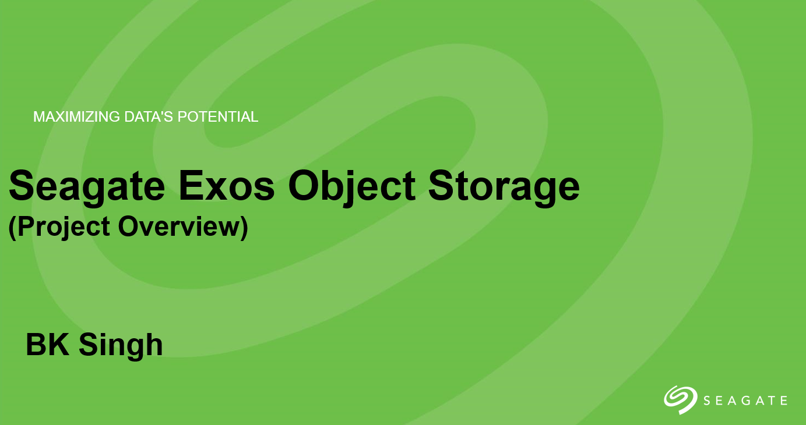

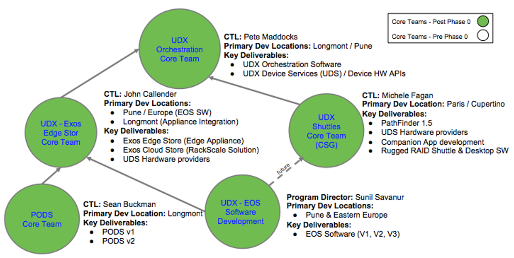

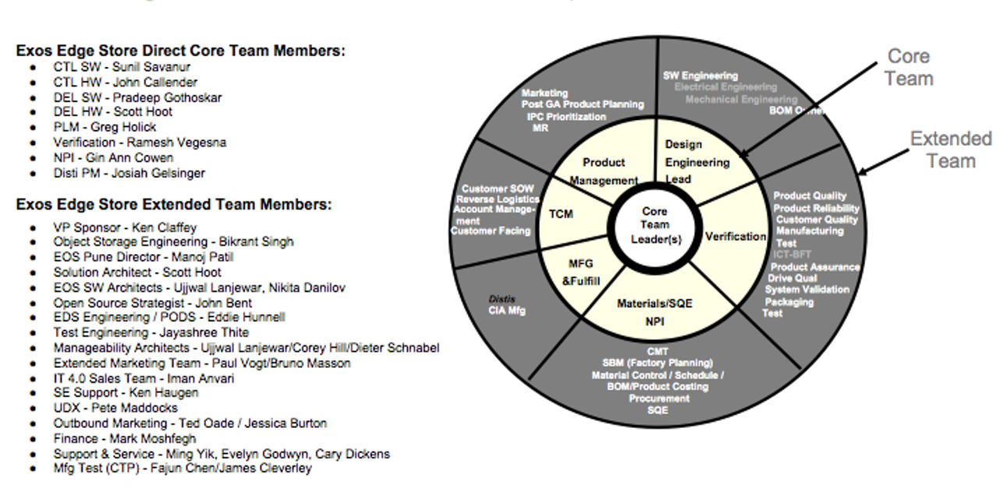
   
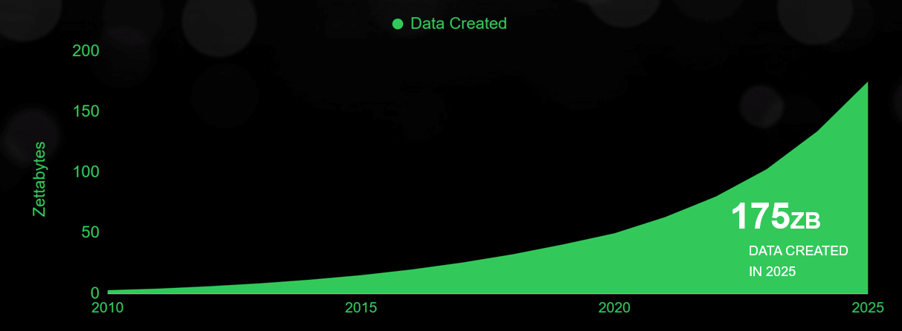
   
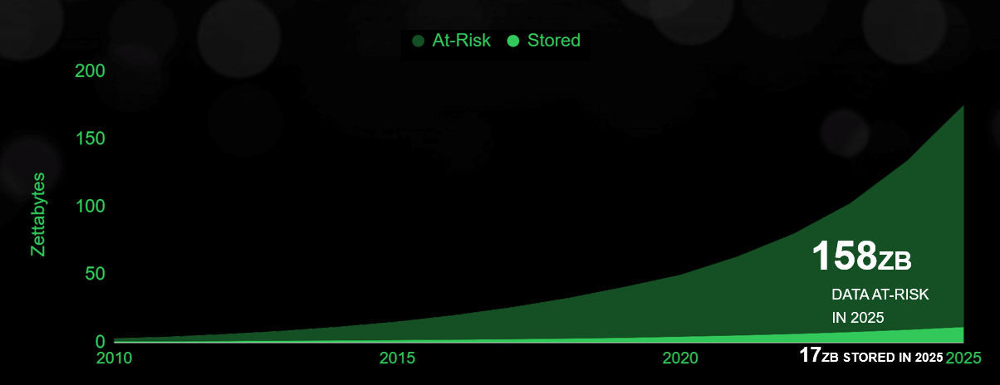
   
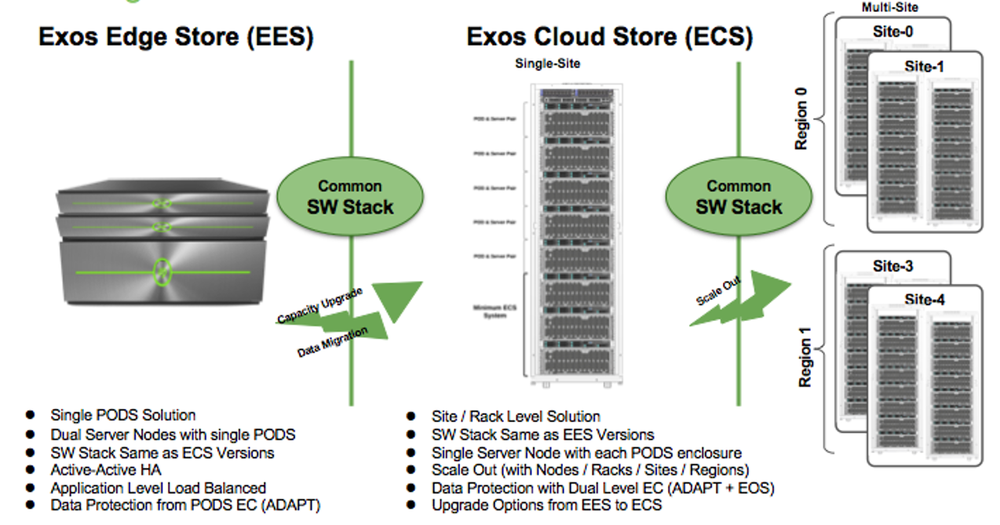
   
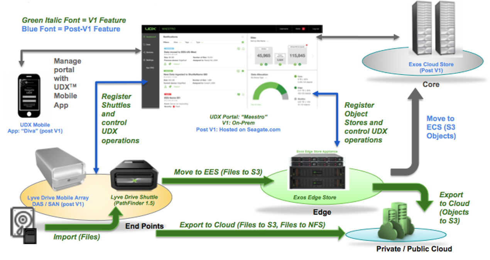
   
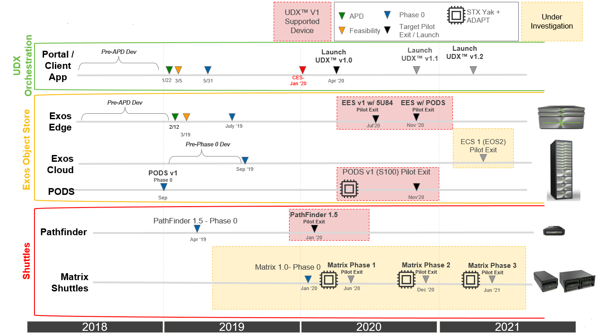
   
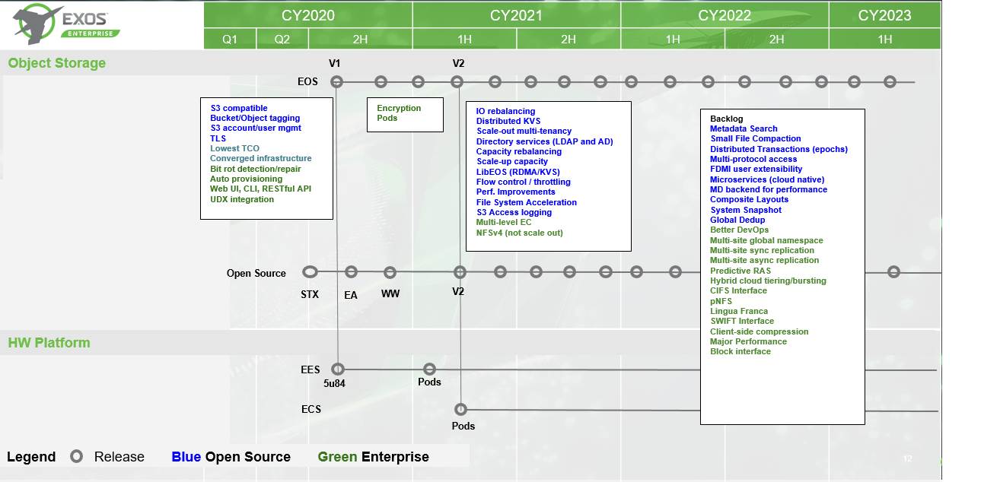
   
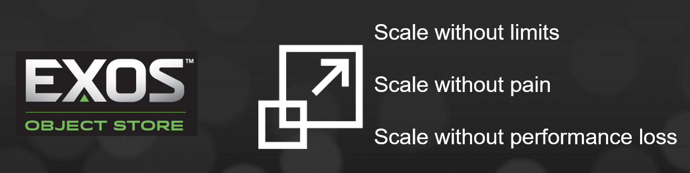
   
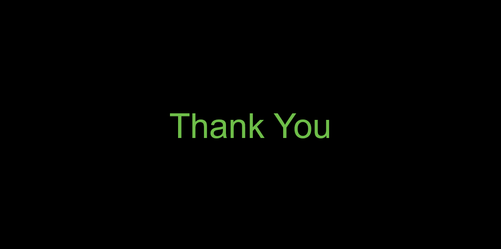
   
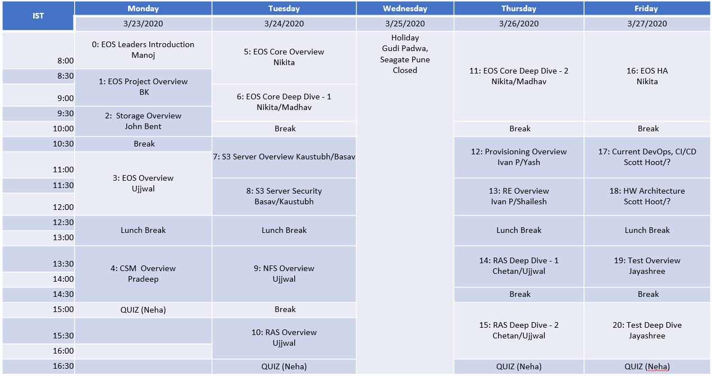