## VirtualBox Network Configuration
To set up CORTX from the source for a single node, you need to configure the network interface cards. For VirtualBox users, it's advisable to configure the network while installing the ISO image.

1. Select Network

    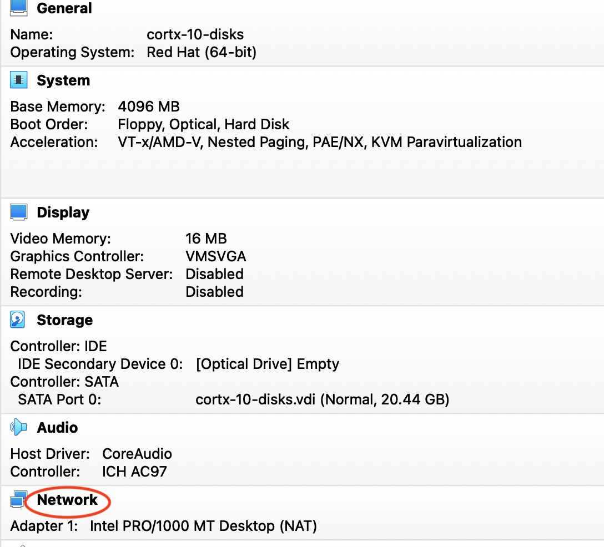
      
2. Enable Adapters 1, 2 and 3. Change Attached to from NAT to Bridged Adapter. On the promiscuous mode,select Allow All; this allows incoming traffic to pass the physical network adapter of the local machine and reach the virtual network adapter of the VM.

    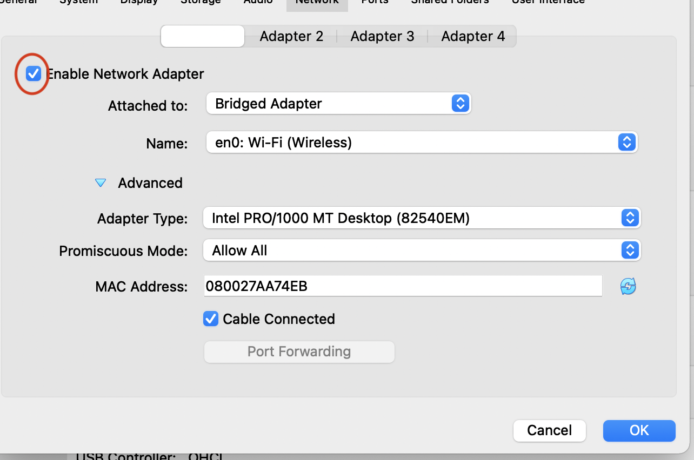
      

- The network configurations should be as follows:-

    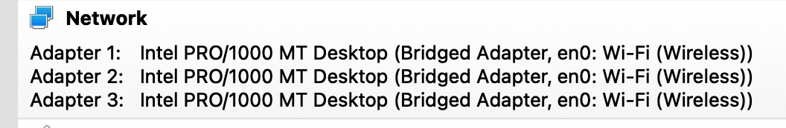
      

3. While installing the CentOS ISO image, connect the NIC cards:-

    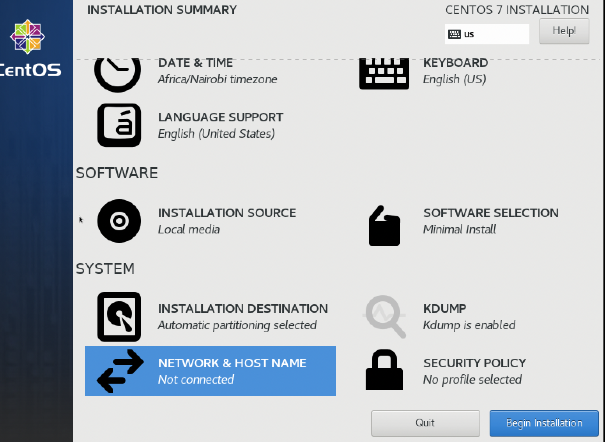
      

4. Click on configure:

    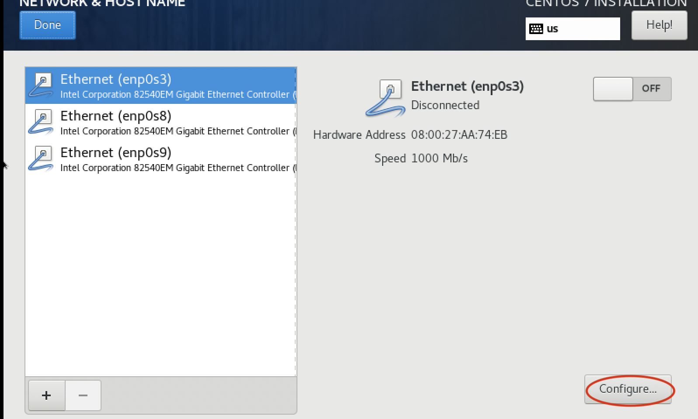
      

5. We want to automatically connect to the network when available.

    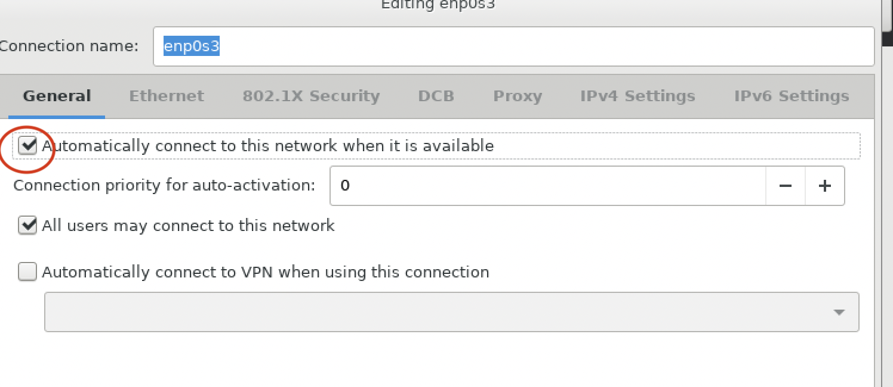
      
- This will connect the NIC cards to DHCP IP address, and the DNS configured on your local machine.

    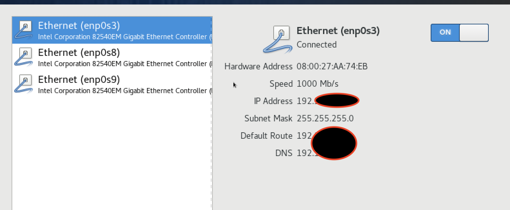
      
6. Start your VM, check the network settings using **ip a l**;-

    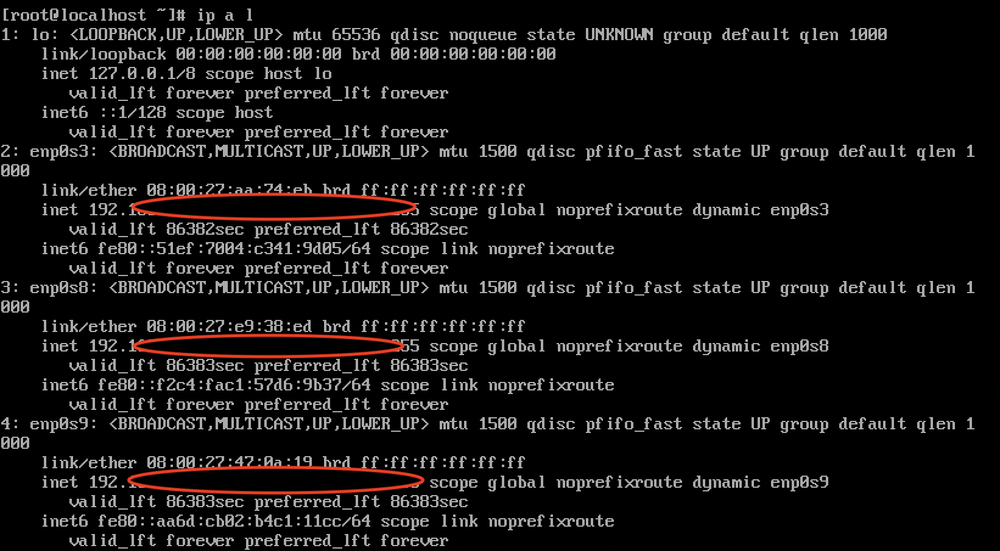
      
**Note** For this setup, you should consider your **enp0s3**, **enp0s8** and **enp0s9** as your **management IP**, **public data IP** and **private data IP**, respectively.
## Creating Disks
Setting up CORTX for single node requires:

- 1 OS disk
- 8 Data disks
- 1 Meta disk

The OS disk is created while installing the CentOS ISO image. To create and add the data disks follow the guidelines below:-

1. Click on Storage:-

    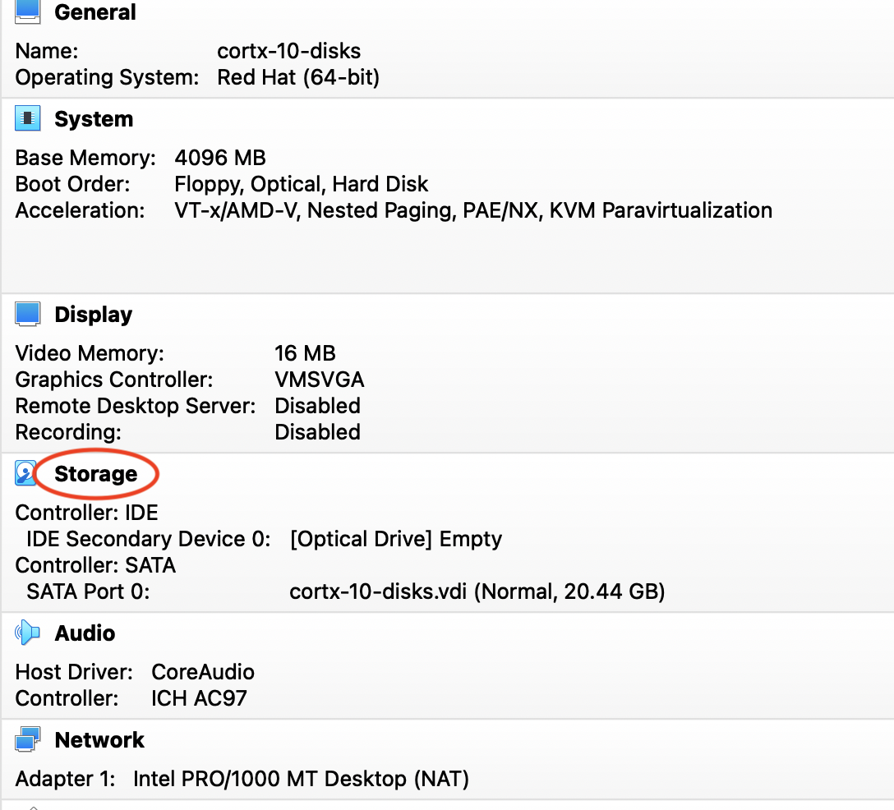
      
2. On the storage page, select controller: SATA, click on the + sign icon at the bottom and select hard disk.

    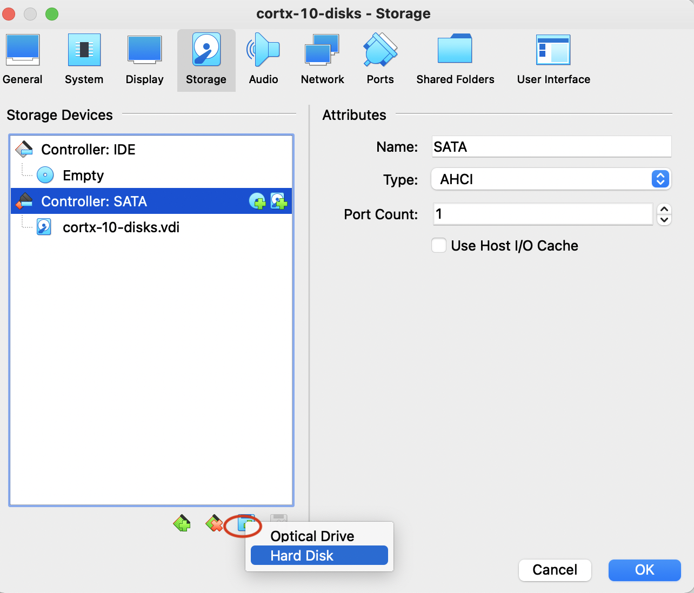
      
3. Click on create disk image, then follow the steps below

    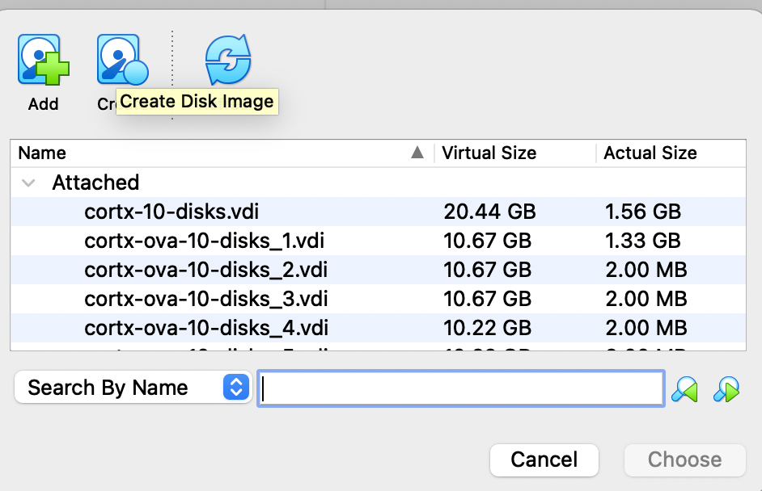

    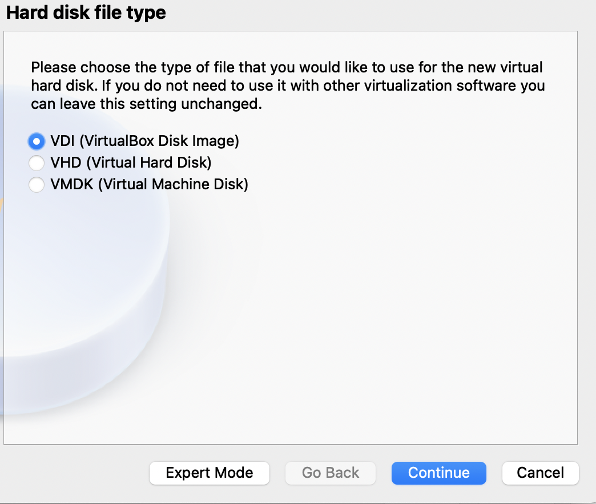

    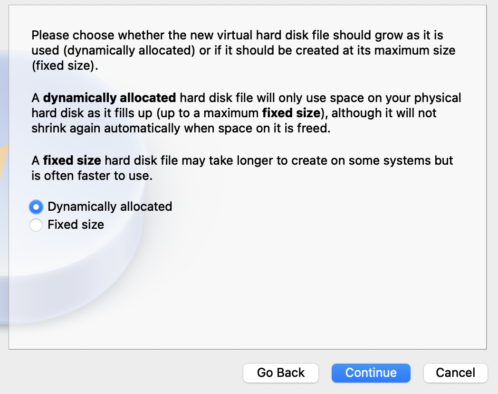
      
- Select the size of the disk:
    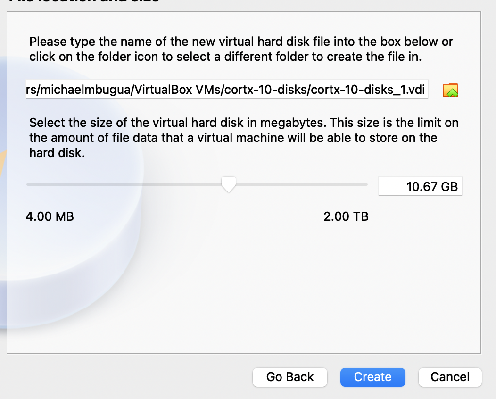
      
4. Add the disks created to the VM:-
    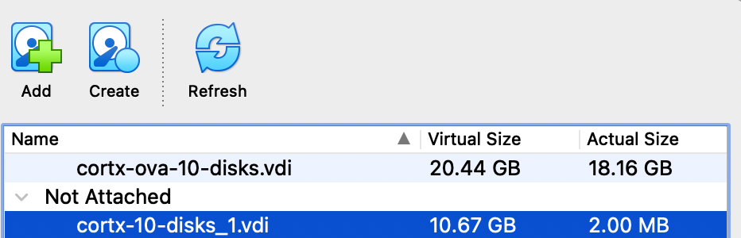
      
5. Create and add all the Data Disks using the steps above. Adding the Metadata Disk follows the same steps; only the size will change to 8GB. All the disks should be as follows:

    
