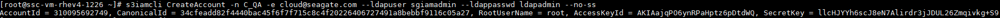

# Single Node K8s Cortx Deployment

The following steps are presented to deploy Cortx deployment on a single node K8s cluster. The single node acts as both control and worker node as it's untainted.

# Specifications

The following requirements must exists for deployment:
- 1 VM with CentOS 7.9.2009 OS.
- CPU: 8 cores
- RAM: 16 GB
- Minimum additional disks: 8 disks (6 Disks: Cortx Software, 1 Disk: 3rd Party Software, 1 Disk: Log)
> Example 8 drives (the actual device names might be different):
```
/dev/sdb => 25G
/dev/sdc => 25G
/dev/sdd => 25G
/dev/sde => 25G
/dev/sdf => 25G
/dev/sdg => 25G
/dev/sdh => 25G
/dev/sdi => 25G
```

# Installation

The following primary packages version are required:
- Kubernetes Version - 1.19.0-0
- Calico Plugin Version - Latest ( v3.20.1 )
- Docker version - Latest community edition ( 20.10.8 )

**Additional packages:**
- Helm - Latest version (3.7.1)
- yq
- python3-pip
- wget
- yum-utils
- git

All the steps are run using ```root``` user and firewall is stopped, selinux is in permissive mode, swap memory is turned off and additional packages are installed as follows:

**Firewall stop/disable:**
```
systemctl stop firewalld
systemctl disable firewalld
```
**SELinux permissive mode:**
```
sudo setenforce 0
sudo sed -i 's/^SELINUX=enforcing$/SELINUX=permissive/' /etc/selinux/config
```

**Turn off swap:**
```
swapoff -a
sed -i '/ swap / s/^\(.*\)$/#\1/g' /etc/fstab
```
**Install additional packages:**
```
yum install yum-utils python3-pip wget git -y && pip3 install yq
wget https://github.com/stedolan/jq/releases/download/jq-1.6/jq-linux64 -O /usr/bin/jq && chmod +x /usr/bin/jq
curl https://raw.githubusercontent.com/helm/helm/main/scripts/get-helm-3 | bash
```

##

**Docker installation:**
To install docker run the following  commands:
```
curl -fsSL https://get.docker.com -o get-docker.sh
chmod +x get-docker.sh
./get-docker.sh
```
Optional - Docker Hub rate limits:
Docker hub sets pull rate limits for anonymous requests to 100 container image pull requests per six hours which may cause issues with the installation. You may need to create an account on Docker Hub to increase rate limit to free user to 200 container image pull requests per six hours and pull required public images on all worker nodes. Use the following command to do so (replace username and password):
```
docker login --username=<Docker username> --password <Docker password>
```

##

**Kubernetes installation:**
To install Kubernetes run the following commands:
```
cat <<EOF | sudo tee /etc/modules-load.d/k8s.conf
br_netfilter
EOF

cat <<EOF | sudo tee /etc/sysctl.d/k8s.conf
net.bridge.bridge-nf-call-ip6tables = 1
net.bridge.bridge-nf-call-iptables = 1
EOF

sudo sysctl --system
```
Add Kubernetes repository:
```
cat <<EOF | sudo tee /etc/yum.repos.d/kubernetes.repo
[kubernetes]
name=Kubernetes
baseurl=https://packages.cloud.google.com/yum/repos/kubernetes-el7-\$basearch
enabled=1
gpgcheck=1
repo_gpgcheck=1
gpgkey=https://packages.cloud.google.com/yum/doc/yum-key.gpg https://packages.cloud.google.com/yum/doc/rpm-package-key.gpg
exclude=kubelet kubeadm kubectl
EOF
```
Install Kubernetes:
```
yum install -y kubectl-1.19.0-0 kubelet-1.19.0-0 kubeadm-1.19.0-0 --disableexcludes=kubernetes
sudo systemctl enable --now kubelet
```

## Setting up Kubernetes cluster:

To set-up Single Node K8s cluster with untainted control plane node follow the steps below:

**Start Docker:**
```
systemctl restart docker
systemctl enable docker
```

**Setup cluster:**
```
kubeadm init

# After cluster is setup:
mkdir -p $HOME/.kube
cp -i /etc/kubernetes/admin.conf $HOME/.kube/config
chown $(id -u):$(id -g) $HOME/.kube/config

#Check status:
kubectl get nodes

# Untaint control plane node to allow pods creation:
kubectl taint nodes $(hostname) node-role.kubernetes.io/master-
```

**Install Calico pod network addon:**
```
curl https://docs.projectcalico.org/manifests/calico.yaml -o calico-latest.yaml
sed -i '/# Auto-detect the BGP IP address./i \            - name: IP_AUTODETECTION_METHOD\n              value: "can-reach=www.google.com"' calico-latest.yaml

kubectl apply -f calico-latest.yaml

#Check status:
kubectl get nodes
kubectl get pods -A
```
**Setup storage-class:**
```
kubectl apply -f https://raw.githubusercontent.com/rancher/local-path-provisioner/master/deploy/local-path-storage.yaml
kubectl patch storageclass local-path -p '{"metadata": {"annotations":{"storageclass.kubernetes.io/is-default-class":"true"}}}'
```

# Setup Cortx Cluster:

To setup Cortx cluster on the above configured kubernetes cluster follow the steps below:

**Clone Seagate/cortx-k8s repository:**
```
git clone -b stable git@github.com:Seagate/cortx-k8s.git
```

**Update Cortx cluster configuration:**
CORTX deployment framework can be configured through a single file cortx-k8s/k8_cortx_cloud/solution.yaml Key configuration changes required: Kubernetes node name and disks layout. The node name in `solution.yaml` should match the Kubernetes node name.

Example solution.yaml configuration file:
```
solution:
  namespace: default
  secrets:
    name: cortx-secret
    content:
      openldap_admin_secret: seagate1
      kafka_admin_secret: Seagate@123
      consul_admin_secret: Seagate@123
      common_admin_secret: Seagate@123
      s3_auth_admin_secret: ldapadmin
      csm_auth_admin_secret: seagate2
      csm_mgmt_admin_secret: Cortxadmin@123
  images:
    openldap: ghcr.io/seagate/symas-openldap:2.4.58
    consul: hashicorp/consul:1.10.0
    kafka: 3.0.0-debian-10-r7
    zookeeper: 3.7.0-debian-10-r182
    gluster: docker.io/gluster/gluster-centos:latest
    rancher: rancher/local-path-provisioner:v0.0.20
    cortxcontrolprov: ghcr.io/seagate/cortx-all:2.0.0-latest-custom-ci
    cortxcontrol: ghcr.io/seagate/cortx-all:2.0.0-latest-custom-ci
    cortxdataprov: ghcr.io/seagate/cortx-all:2.0.0-latest-custom-ci
    cortxdata: ghcr.io/seagate/cortx-all:2.0.0-latest-custom-ci
  common:
    storage_provisioner_path: /mnt/fs-local-volume
    container_path:
      local: /etc/cortx
      shared: /share
      log: /etc/cortx/log
    s3:
      num_inst: 2
      start_port_num: 28051
      max_start_timeout: 240
    motr:
      num_client_inst: 0
      start_port_num: 29000
    storage_sets:
      name: storage-set-1
      durability:
        sns: 1+0+0
        dix: 1+0+0
    glusterfs:
      size: 5Gi
  storage:
    cvg1:
      name: cvg-01
      type: ios
      devices:
        metadata:
          device: /dev/sdc
          size: 5Gi
        data:
          d1:
            device: /dev/sdd
            size: 5Gi
          d2:
            device: /dev/sde
            size: 5Gi
    cvg2:
      name: cvg-02
      type: ios
      devices:
        metadata:
          device: /dev/sdf
          size: 5Gi
        data:
          d1:
            device: /dev/sdg
            size: 5Gi
          d2:
            device: /dev/sdh
            size: 5Gi
  nodes:
    node0:
        name: cortx-testbench
```

**Run prerequisites script:**
The prerequisites script configs required packages and changes in the system. Run prerequisite script on the node. "<disk>" is a required input to run this script. This disk should NOT be any of the devices listed in "solution.storage.cvg*" in the "solution.yaml" file. The prerequisites script can also take optional parameter of `<solution-file>`. Please make sure to use the same solution file for prerequisites, deploy and destroy scripts.
```
#Example:
./prereq-deploy-cortx-cloud.sh /dev/sdb

./prereq-deploy-cortx-cloud.sh /dev/sdb [<solution-file>]
```

**Deploy Cortx cluster:**
To deploy Cortx cluster framework run any one of the following command.  The deploy script can also take optional parameter of `<solution-file>`.
```
#Example:
./deploy-cortx-cloud.sh

./deploy-cortx-cloud.sh [<solution-file>]
```
**Verify Cortx cluster status:**
After deploy script completes it's implementation all the pods should be up and running. Verify with the following commands:
```
kubectl get pods -A

# In the following replace cortx-data-pod-XXXX with actual pod name running in the kubernetes cluster.
kubectl exec -it cortx-data-pod-XXXX -c cortx-motr-hax -- hctl
status
```


**Destroy Cortx cluster:**
To destroy Cortx cluster framework run any one of the following command. There is an additional force option if the which can be used in case of any error to remove Cortx cluster components.  The destroy script can also take optional parameter of `<solution-file>`.
```
#Example:
./destroy-cortx-cloud.sh

./deploy-cortx-cloud.sh [<solution-file>]

./destroy-cortx-cloud.sh [<solution-file>] [--force|-f]
```

# S3 setup:

Now the Cortx cluster is deployment is complete, all pods are in running state and data pods are running, we can setup and use the S3 storage by following the steps below (all the commands are run as `root`  user)-:

## Installation

Install the following packages which will be required in S3 IO operations:
First we need to build the cortx-s3-iamcli-devel package, which will be installed later. To build the cortx-s3-iamcli-devel package use the following steps on another node:

### Building cortx-s3-iamcli-devel-XXX rpm:

**Prerequisites** 
-   Create a  [CentOS 7.9.2009](http://repos-va.psychz.net/centos/7.9.2009/isos/x86_64/)  VM with following minimum configuration:
    
    -   RAM: 8GB
    -   Processor: 4
    -   NICs: 3
    -   Total Disk:
        -   1 OS disk of 50GB
        -   2 data disks of 32GB each
    
    **Note:**  4 partitions of +8GB from each data disks will be created as per script
    
-   All Network Interface Cards (NICs) must have internet access. Attach your network adapters accordingly as per your environment to establish internet connectivity. For this deployment, the NICs are considered as eth32, eth33, and eth34.
    
-   The VM must have a valid hostname and accessible using ping operation.
    
-   Do not update OS or kernel package with  `yum update`  as the kernel version must be set to  `3.10.0-1160.el7`  otherwise it will fail the build process.
    
-   Do not upgrade packages from  `CentOS 7.8`  to  `CentOS 7.9`

**Recommendations:**

-   If you are using multiple virtualization platforms including VMware Workstation, vSphere etc. then after rebooting ensure that all the NICs have internet connectivity.
-   It is recommended to use para-virtualized drivers in the guest VM for best performance.
-   While deploying the CORTX single node VM, if the deployment fails during any step:
    -   It is recommended that you must run the steps once and prevent to rerun the steps.
    -   Prevent running the steps multiple times.
    -   Create a fresh virtual machine.

**Setup build node (deploy-test.cortx.com):**
All commands are run from `root` user:

Install prerequisites:
```
yum install git yum-utils wget -y
hostnamectl set-hostname --static --transient --pretty deploy-test.cortx.com
sed -i 's/SELINUX=enforcing/SELINUX=disabled/' /etc/selinux/config

# Install Docker:
curl -fsSL https://get.docker.com -o get-docker.sh
sudo sh get-docker.sh

systemctl enable --now docker
```
**Compile and Build cortx-s3iamcli-devel from HEAD:**
-   Download cortx-build image:
    ```
    docker pull ghcr.io/seagate/cortx-build:centos-7.9.2009
    ```
        
Clone CORTX repository and build rpms:

1.  Run the following command to clone the CORTX repository:
    ```
    cd /root && git clone https://github.com/Seagate/cortx --recursive --depth=1
    ```
    
2.  Run the following command to checkout the codebase from  **kubernetes**  branch:
    ```
    docker run --rm -v /root/cortx:/cortx-workspace ghcr.io/seagate/cortx-build:centos-7.9.2009 make checkout BRANCH=kubernetes > /dev/null 2>&1
    cd ~/cortx/cortx-s3server; git checkout kubernetes    
    ```

3.  Run the following command to create a directory to store packages:
    ```
    mkdir -p /var/artifacts/ && mkdir -p /mnt/cortx/{components,dependencies,scripts}
    ```
    
4.  Run the following command to build the CORTX packages:
    ```
    docker run --rm -v /var/artifacts:/var/artifacts -v /root/cortx:/cortx-workspace ghcr.io/seagate/cortx-build:centos-7.9.2009 make clean cortx-s3server    
    ```
    
    **Note:**  This process takes some time to complete building the CORTX packages during  `/var/artifacts/0 /`  execution phase.
    
    
5.  The CORTX build is generated in the directory created at step 3. To view the generated build, run:
    ```
    ll /var/artifacts/0/cortx_iso/
    ```

##

### Install cortx-s3iamcli-devel-XXX rpm (on K8s node):
After the rpm is build follow the steps below to install it on the Kubernetes node where CORTX will be deployed:

**Copy the cortx-s3iamcli-devel build rpm:**
Copy the cortx-s3iamcli-devel-XXX rpm to Kubernetes node. You can copy by any method. Here we will copy by `scp` to Kubernetes node.
```
scp cortx-s3iamcli-devel-2.0.0-0-XXX.rpm root@CORTX-kubernetes-node:/path/to/copy/cortx-s3iamcli-devel-XXX.rpm
```

**Install the cortx-s3iamcli-devel-XXX rpm:**
```
yum install -y /path/to/cortx-s3iamcli-devel-2.0.0-0-XXX.rpm  --nogpgcheck

#Example:
yum install -y http://cortx-storage.colo.seagate.com/releases/cortx/github/main/centos-7.9.2009/last_successful/cortx-s3iamcli-devel-2.0.0-248_gite0c1f347.noarch.rpm --nogpgcheck
```

**Install awscli:**
```
pip3 install awscli 2
pip3 install awscli-plugin-endpoint

#Verify
aws s3 ls
```

## Configuration:

To configure S3 follow the steps below:
-   Make auth directory:
```
mkdir -p /var/log/seagate/auth
```

-   Create empty log file:
```
touch /var/log/seagate/auth/s3iamcli.log
```

-   Edit `/etc/hosts` file:
    -   Run ```kubectl get pods --o wide```
    -   Copy the IP of service data pod (cortx-data-pod). On the single node cluster only one cortx-data-pod will be present.
    -   In ```/etc/hosts``` file add a new entry as follows:
```<IP_Address> s3.seagate.com iam.seagate.com```

-   Create S3 account:
```
s3iamcli CreateAccount -n C_QA -e cloud@seagate.com --ldapuser sgiamadmin --ldappasswd ldapadmin --no-ss
```

-   The above command will output keys as following example:
    

**AWSCLI Configuration:**

-   To configure awscli to work with Cortx S3 storage run the following commands:
```
aws configure
```

-   The above command will prompt for Access key and Secret key, provide the keys received through the `s3iamcli CreateAccount` command:
    

-   Configure S3 endpoint for awscli as follows:
```
aws configure set plugins.endpoint awscli_plugin_endpoint 2 aws configure set s3.endpoint_url http://s3.seagate.com 3 aws configure set s3api.endpoint_url http://s3.seagate.com
```

-   Verify configurations as follows:
```
cat /root/.aws/config
```

-   The above command output should be as follows:
    

-   Now run following command it should not throw any errors:
```
aws s3 ls
```

## S3 Bucket Creation & Read Write Operation:

-   Create S3 bucket:
```
aws s3 mb s3://mybucket
```

-   Create a file of 10mb:
```
dd if=/dev/zero of=file10mb bs=1M count=10
```

-   Upload file to S3 bucket (This command will copy the file10mb to s3 bucket with name file10MB):
```
aws s3 cp file10mb s3://mybucket/file10MB
```

-   List files in S3 bucket:
```
aws s3 ls s3://mybucket/
```

-   Download the file from S3 bucket:
```
aws s3 cp s3://mybucket/file10MB file10mbDn
```

-   Check file diff (there should be no difference in both files):
```
diff file10mb file10mbDn
```

-   To delete S3 bucket:
```
aws s3 rb s3://mybucket --force
```

-   To delete file in S3 bucket:
```
aws s3 rm s3://mybucket/file10MB .
```

-   Upload local directory to S3 bucket:
```
aws s3 sync (directory) s3://mybucket/
```

And many more operations can be performed with awscli S3. Like awscli other tools like s3cmd, etc can also be configured to used with Cortx S3 storage.


