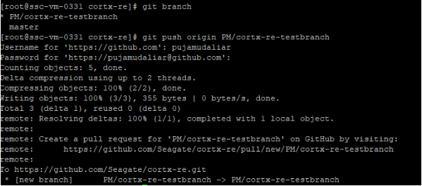
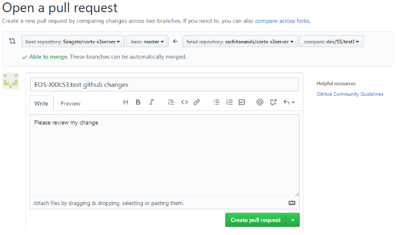
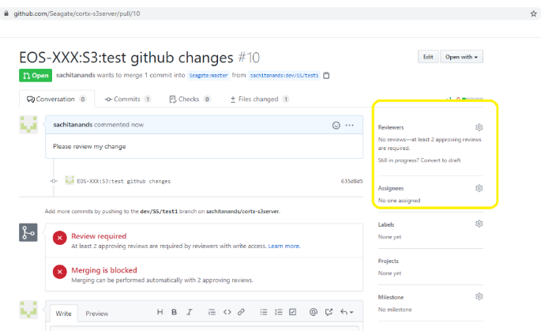
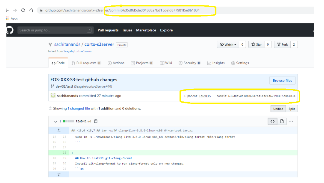
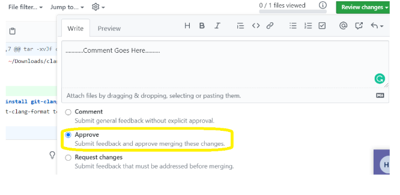

# FAQ – GITHUB Process 

# 1. Configure ssh keys 

A) Generate new ssh keys 
```sh
$ ssh-keygen -o -t rsa -b 4096 -C "<seagate-email-address>"  
```
B) Update github settings with this public ssh key
  - Get id_rsa.pub key (default location: /root/.ssh/id_rsa.pub) 

  - Go to github ssh key setting: https://github.com/settings/keys 

  - Add new ssh key and then select Enable SSO option and Authorize for this key

# 2. Git configuration process 

A) Configure git 
```sh
$ git config --global user.name ‘Your Name’ 

$ git config --global user.email ‘Your.Name@seagate.com’ 

$ git config --global color.ui auto 
```

B) Clone s3server  

a) using ssh: `$ git clone git@github.com:Seagate/cortx-s3server.git` 

C) Update the source code:  `$ git submodule-update --init  --recursive` 

D) Work on feature branch  

1)  create new branch: `$ git checkout –b dev/SS/test1` 

2)  update your code change and add it to git:  
                           
             $ vim README.md 

             $ git diff README.md 

             $ git add README.md 

3)  commit your code change: `$ git commit –m “<JIRA ID>:S3:<info about change>” `

4)  check git log: `$ git log –2 (to see last 2 commits)` 

5)  push your code change:  `$ git push origin dev/SS/test1` (output shows pull request url)

E)  Create pull request for feature branch 

A) Use pull URL showed in prev push command and raise pull requests. 



Or  

B) Use GitHub console,  

On GitHub, navigate to the main page of the repository.   
In the "Branch" menu, choose the branch that contains your commits. 



C) Add Reviewers, comments for your pull requests 



D) Trigger pre-merge jenkins job using commit id of your change 

1) get commit id of your change 



2) start pre-merge jobs using commit id: 
http://eos-jenkins.mero.colo.seagate.com/job/S3server/job/s3-github-test/ 

F) Rebase your changes: 

To rebase your local feature branch off of the latest version of main: 

`$ git checkout main`                  /* ensure you are on the main branch 

`$ git pull`                                          /* pull the latest from the remote 

`$ git submodule-update --init  --recursive`   /* pull the latest from the remote  

`$ git checkout dev/SS/test1`       /* checkout the feature branch 

`$ git pull`                                          /* pull the latest from the remote 

`$ git submodule-update --init  --recursive`   /* pull the latest from the remote 

`$ git rebase main`                      /* rebase on the main branch 

`$ git push`                                       /* force update the remote 

 

This process will ensure that you have the latest version of main then take the commits from your feature branch, temporarily unset them, move to the newest head of the main branch and then re-commit them. As long as there are no conflicts, there should be no issues. 
 

G)  How to review others changes: 
1) go to https://github.com/Seagate/cortx-s3server/pulls 
                   or 
   https://github.com/pulls/review-requested 
2) select pull requests to review e.g. 
 
 

G)  References: 

1) pre-merge job (Manual):  http://eos-jenkins.mero.colo.seagate.com/job/S3server/job/s3-github-test/ 

2) post merge job (Automatic):  
http://eos-jenkins.colo.seagate.com/job/Release_Engineering/job/github-work/job/S3server/6 
3) reference link: GitWorkflow created by Shailesh 
4) https://guides.github.com/activities/hello-world/ 


3) Using fork branch of main repository: 

    1) Create Personal Access Token on individual user 
a) Go to your GitHub Settings -> Developer settings -> Personal access tokens 
b) Click on Generate new token 
c)  add Note : “submodule_checkins_token” 
https://github.com/settings/tokens 

 

=====================Fork based Workflow ================== 

