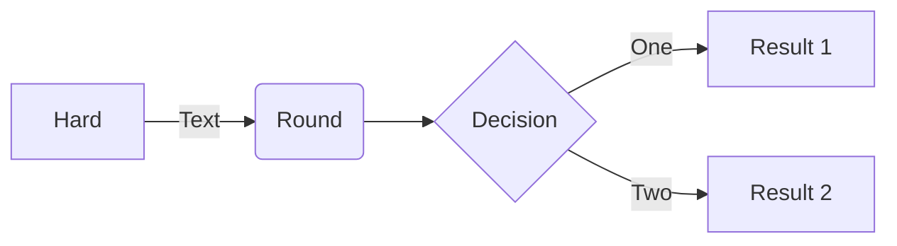

The diagrams at the bottom of this page are using a 3rd-party server to automatically render plantuml images which allow github markdown to use text-based diagrams which are stored in a separate file. Note that as of February 2022, an even better solution is possible which is that mermaid text-based diagrams can be embedded directly into the markdown. So, this new approach eliminates the need for a separate file and for a 3rd-party server. Here is a very simple example:


We can embed dynamically rendered PlantUML images into our github documentation.  Simply use the PlantUML proxy `http://www.plantuml.com/plantuml/proxy` to render your `*.iuml` or `*.plantuml` files and embed them like images:

```

``` 

Use the URL to the `RAW` version of your PlantUML files, prefix it with `src=`, and use the `cache=no` option so that GitHub always renders the currently committed 
version.

For example, here is a dynamically rendered view of the [example.plantuml](https://raw.githubusercontent.com/seagate/cortx/main/doc/images/plantuml/example.plantuml)
file in this directory:


Thanks very much to @jonashackt for showing how this works in his [github repo](https://github.com/jonashackt/plantuml-markdown)!

