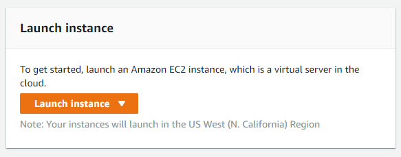
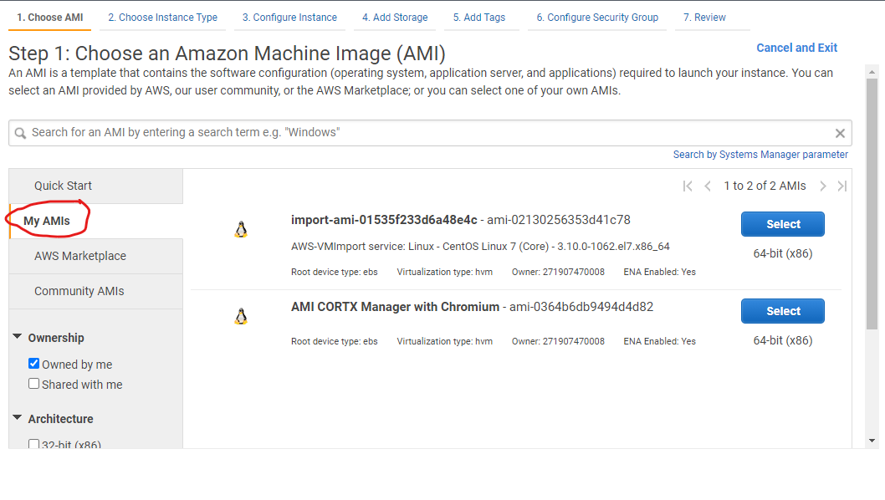
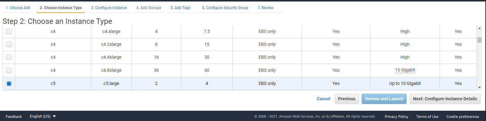
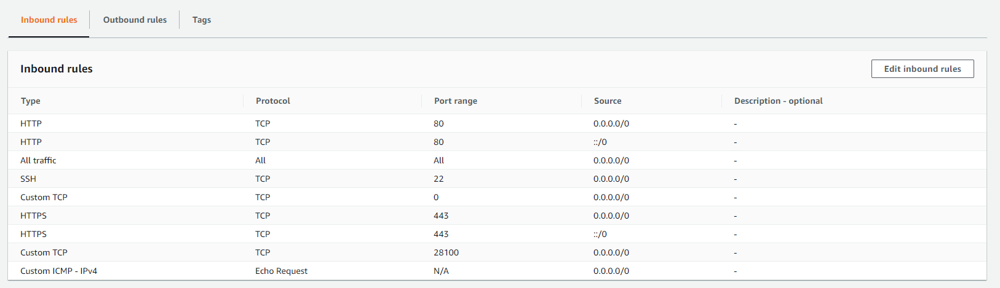
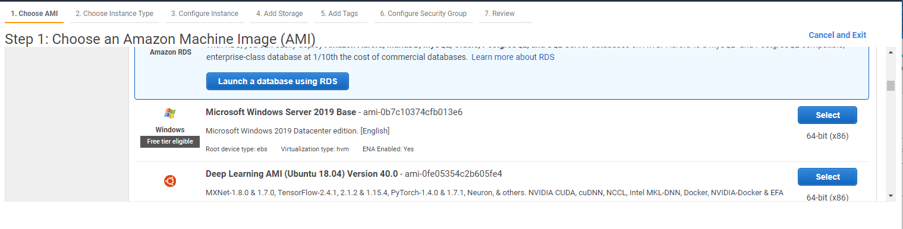
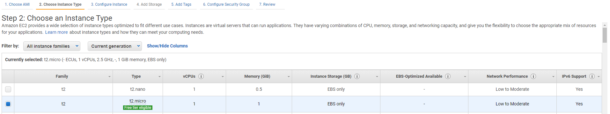
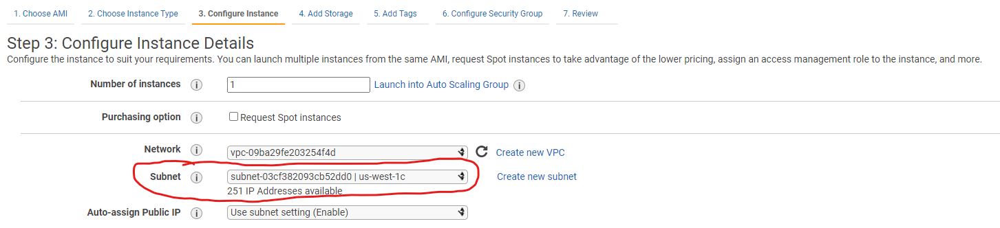

# Running CORTX on AWS


Summary:
----
TODO

Prerequisites:
-------

- You will need an AWS account with right to create an [EC2 instances.](https://aws.amazon.com/ec2/?ec2-whats-new.sort-by=item.additionalFields.postDateTime&ec2-whats-new.sort-order=desc) 
- You will need to [import to an AMI](https://docs.aws.amazon.com/vm-import/latest/userguide/vmimport-image-import.html) the [CORTX OVA.](https://github.com/Seagate/cortx/releases/download/VA/cortx-va-1.0.2.zip) 
- Ideally you would have [run and setup CORTX on a local VM](https://github.com/Seagate/cortx/blob/main/doc/CORTX_on_Open_Virtual_Appliance.rst) and gone through the steps locally before doing it on AWS. 


Step 1: Launch AWS EC2 instance with the CORTX AMI
--------

- To launch an instance in the EC2 dashboard look for the launch instance button.



- Select the AMI you created with the CORTX image. 

When choosing the AMI go to **My AMIs**.
 


- Launch an AWS instance that can support 4 network interfaces. The recommended instance would be a [c5 xlarge instance](https://aws.amazon.com/ec2/instance-types/c5/).



Step 2: Create security group and subnets
------
- Create a new security group by following [these instructions.](https://docs.aws.amazon.com/vpc/latest/userguide/VPC_SecurityGroups.html#CreatingSecurityGroups) Name this Security Group something recognizable like CORTX SG.

- Once created follow [these instructions](https://docs.aws.amazon.com/vpc/latest/userguide/VPC_SecurityGroups.html#AddRemoveRules) to add the below inbound rules to the security group



Step 3: Create 2 network interfaces on different subnets with the security group and attach them to the EC2 instance
----

- Go to Network Interfaces and create a network interface with the security group that you created above.
- Name that network interface ens256 and ens224
- Attach that interface to the EC2 instance

Step 4: Boot up the EC2 instance and edit net .rules file to create stable names for the network interfaces
---------------
 
 - Log in to the EC2 instance using these credentials:
 
 Username: `CORTX`
 
 Password: `opensource!`
 
 To [create stable names for network interfaces](http://www.linuxfromscratch.org/lfs/view/6.3/chapter07/network.html) on the EC2 instance we will need to edit the `70-persistent-net.rules` file located here `/etc/udev/rules.d`
 
 - You can edit the file using `vi` by running this command:
 
 `vi /etc/udev/rules.d/70-persistent-net.rules`

In the file you will add the value of each of the MAC addresses for the corresponding network interfaces to the right name.

Fill in the key for `ATTR{address}==` with the MAC address you want for each network interface.

*Example:*
```
  SUBSYSTEM=="net", ACTION=="add", DRIVERS=="?*", ATTR{address}=="02:6d:62:4e:41:e3", NAME="ens192"
  SUBSYSTEM=="net", ACTION=="add", DRIVERS=="?*", ATTR{address}=="02:7c:de:ea:8a:8d", NAME="ens224"
  SUBSYSTEM=="net", ACTION=="add", DRIVERS=="?*", ATTR{address}=="02:61:b7:69:e6:c9", NAME="ens256"
```
**Do NOT just copy this example, fill in the MAC adddress of YOUR network interfaces**

Step 5: Create symbolic links between drives
-------
The naming of both drives in the bootstrap script are quite specific to do this we will need to rename the 2 drives to `sdb` and `sdc`.

- Run these 2 commands:

```ln -s /dev/nvme2n1 /dev/sdb```

```ln -s /dev/nvme2n1 /dev/sdc```

Step 6: Reboot the instance, run the bootstrap script and configure the CORTX server
--------

You can reboot the instance by selecting the machine and rebooting it in the EC2 dashboard.

- After the instance has been rebooted, login and run this command:

`sh /opt/seagate/cortx/provisioner/cli/virtual_appliance/bootstrap.sh`

- After this has been completed run the `s3-sanity-test` script to make sure that we can add and remoce s3 objects.

`sh /opt/seagate/cortx/s3/scripts/s3-sanity-test.sh`

- If the sanity test passes you can configure the CORTX server by using [these instructions](https://github.com/Seagate/cortx/blob/main/doc/Preboarding_and_Onboarding.rst)

*Note: Your management IP address is the Elastic IP you created.*

Step 7: Create another EC2 instance to access to act as the S3 client
-------

Because we can only expose one of the network interfaces publicly we will need another another EC2 instance to access the data network. 

- Create another instance and instead of choosing the CORTX AMI select the Windows Server 2019 AMI instead



- For this instance you can use a T2 micro instance.



- Make sure the instance is on the same subnet as the network interface that is connected to ens256 which is the data interface. You will need to select this in the configuration.



Launch the instance and wait for it to complete booting before moving on to Step 7.


Step 7: Remote desktop into the Windows Server instance and connect to the CORTX server
-------

Once you have created the Windows Server you can remote desktop into the Windows Server instance to perform IO on the CORTX server.

- Follow [these instructions](https://docs.aws.amazon.com/AWSEC2/latest/WindowsGuide/connecting_to_windows_instance.html#connect-rdp) to remote desktop into your windows instance

- Follow  [these instructions](https://github.com/Seagate/cortx/blob/main/doc/testing_io.rst) to upload files to the CORTX server.
