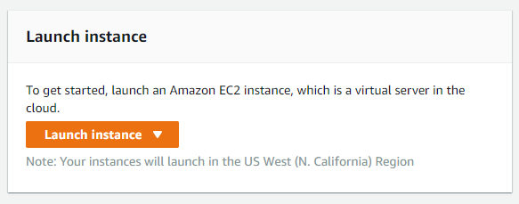
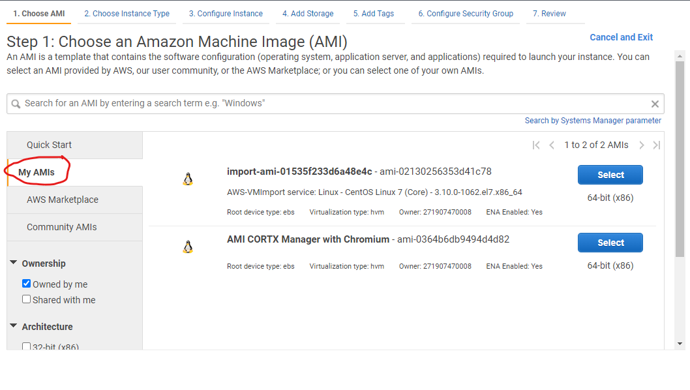
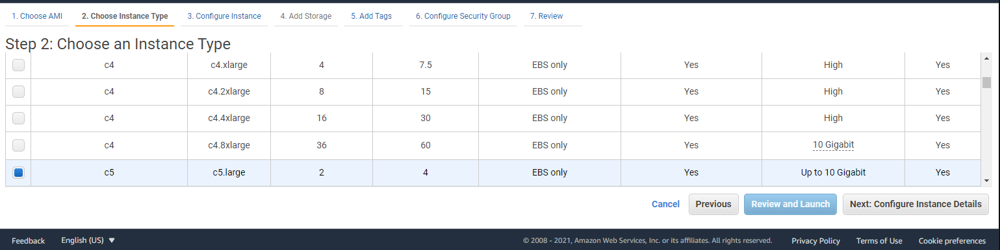
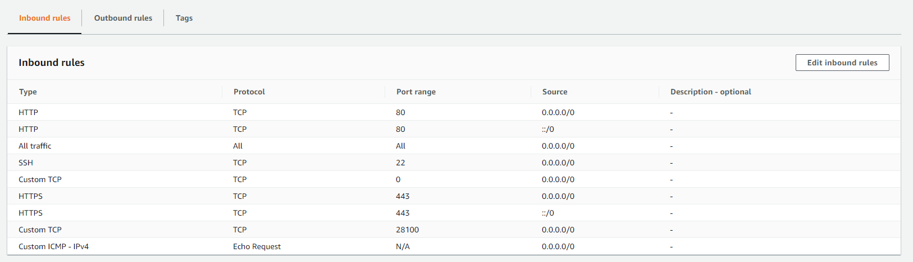
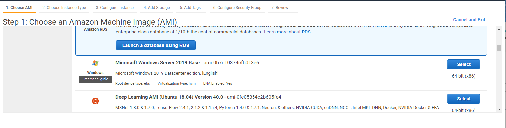
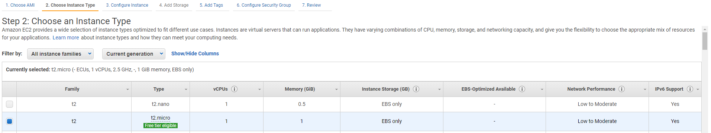
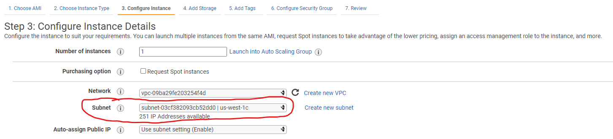

# Running CORTX on AWS


Summary:
----
This document walks you through how to set up CORTX on an Amazon EC2 instance and how to perform IO operations using another EC2 instance on the same subnet.  This allows easy testing of CORTX's "look and feel" and functionality. It is not suggested that people run CORTX for production systems in AWS; rather, that people test CORTX using AWS and then, if the testing goes well, subsequently create an on-prem production instance for CORTX.

Prerequisites:
-------

- You will need an AWS account with right to create an [EC2 instances.](https://aws.amazon.com/ec2/?ec2-whats-new.sort-by=item.additionalFields.postDateTime&ec2-whats-new.sort-order=desc) 
- You will need to [import to an AMI](https://docs.aws.amazon.com/vm-import/latest/userguide/vmimport-image-import.html) the [CORTX OVA](https://github.com/Seagate/cortx/releases/download/cortx-ova-1.0.4-632/cortx-ova-1.0.4.ova).
- Ideally you would have [run and setup CORTX on a local VM](https://github.com/Seagate/cortx/blob/main/doc/ova/1.0.4/CORTX_on_Open_Virtual_Appliance.rst) and gone through the steps locally before doing it on AWS.


Step 1: Launch AWS EC2 instance with the CORTX AMI
--------

- To launch an instance in the EC2 dashboard look for the launch instance button.



- Select the AMI you created with the CORTX image. 

When choosing the AMI go to **My AMIs**.
 


- Launch an AWS instance that can support 4 network interfaces. The recommended instance would be a [c5 xlarge instance](https://aws.amazon.com/ec2/instance-types/c5/).



Step 2: Create security group and subnets
------
- Create a new security group by following [these instructions.](https://docs.aws.amazon.com/vpc/latest/userguide/VPC_SecurityGroups.html#CreatingSecurityGroups) Name this Security Group something recognizable like CORTX SG.

- Once created follow [these instructions](https://docs.aws.amazon.com/vpc/latest/userguide/VPC_SecurityGroups.html#working-with-security-group-rules) to add the below inbound rules to the security group



Step 3: Create 2 network interfaces on different subnets with the security group and attach them to the EC2 instance
----

- [Create 2 network interfaces](https://docs.aws.amazon.com/AWSEC2/latest/UserGuide/using-eni.html#create_eni) with the security group that you created above.
- It will be helpful to name those network interfaces ens256 and ens224 so that they are easy to remember.
- [Attach those interfaces](https://docs.aws.amazon.com/AWSEC2/latest/UserGuide/using-eni.html#attach_eni) to the EC2 instance that you created in Step 2.

Step 4: Boot up the EC2 instance and edit net .rules file to create stable names for the network interfaces
---------------
 
 - Log in to the EC2 instance using these credentials:
 
 Username: `cortx`
 
 Password: `opensource!`
 
 To [create stable names for network interfaces](https://www.linuxfromscratch.org/lfs/view/9.0/chapter07/network.html) on the EC2 instance we will need to edit the `70-persistent-net.rules` file located here `/etc/udev/rules.d`
 
- If you are using **default configuration of `c5.large` instance type**, you can run the following script:
   ```sh
   mgmt_mac=$(ip addr show ens5 | grep -oP '(?<=ether\s)[0-9a-z]{2}(:[0-9a-z]{2}){5}')
   public_mac=$(ip addr show ens6 | grep -oP '(?<=ether\s)[0-9a-z]{2}(:[0-9a-z]{2}){5}')
   private_mac=$(ip addr show ens7 | grep -oP '(?<=ether\s)[0-9a-z]{2}(:[0-9a-z]{2}){5}')
   echo "SUBSYSTEM==\"net\", ACTION==\"add\", DRIVERS==\"?*\", ATTR{address}==\"$mgmt_mac\", NAME=\"ens32\"
   SUBSYSTEM==\"net\", ACTION==\"add\", DRIVERS==\"?*\", ATTR{address}==\"$public_mac\", NAME=\"ens33\"
   SUBSYSTEM==\"net\", ACTION==\"add\", DRIVERS==\"?*\", ATTR{address}==\"$private_mac\", NAME=\"ens34\"" > /etc/udev/rules.d/70-persistent-net.rules
   ```

 - Or you can edit the file **manually** using `vi` by running this command:
 
   `vi /etc/udev/rules.d/70-persistent-net.rules`

   In the file you will add the value of each of the MAC addresses for the corresponding network interfaces to the right name.


   *Example:*

   Fill in the key for `ATTR{address}==` with the MAC address you want for each network interface.
   ```
   SUBSYSTEM=="net", ACTION=="add", DRIVERS=="?*", ATTR{address}=="02:6d:62:4e:41:e3", NAME="ens32"
   SUBSYSTEM=="net", ACTION=="add", DRIVERS=="?*", ATTR{address}=="02:7c:de:ea:8a:8d", NAME="ens33"
   SUBSYSTEM=="net", ACTION=="add", DRIVERS=="?*", ATTR{address}=="02:61:b7:69:e6:c9", NAME="ens34"
   ```
   **DO NOT MERELY COPY, the content should look similar to the above**

   - Reboot your instance.

Step 5: Create symbolic links between drives
-------
The naming of both drives in the bootstrap script are quite specific to do this we will need to rename the 2 drives to `sdb` and `sdc`.

- Run these 2 commands:

```ln -s /dev/nvme1n1 /dev/sdb```

```ln -s /dev/nvme2n1 /dev/sdc```

Step 6: Run the bootstrap script and configure the CORTX server
--------

- Run this command:

`sh /opt/seagate/cortx/provisioner/cli/virtual_appliance/bootstrap.sh`

- After this has been completed run the `s3-sanity-test` script to make sure that we can add and remove s3 objects.

`sh /opt/seagate/cortx/s3/scripts/s3-sanity-test.sh -e 127.0.0.1`

- If the sanity test passes you can configure the CORTX server by using [these instructions](https://github.com/Seagate/cortx/blob/main/doc/Preboarding_and_Onboarding.rst)

*Note: Your management IP address is the Elastic IP you created.*

Step 7: Create another EC2 instance to access to act as the S3 client
-------

Because we can only expose one of the network interfaces publicly we will need another another EC2 instance to access the data network. 

- Create another instance and instead of choosing the CORTX AMI select the Windows Server 2019 AMI instead



- For this instance you can use a T2 micro instance.



- Make sure the instance is on the same subnet as the network interface that is connected to ens256 which is the data interface. You will need to select this in the configuration.



Launch the instance and wait for it to complete booting before moving on to Step 8.


Step 8: Remote desktop into the Windows Server instance and connect to the CORTX server
-------

Once you have created the Windows Server you can remote desktop into the Windows Server instance to perform IO on the CORTX server.

- Follow [these instructions](https://docs.aws.amazon.com/AWSEC2/latest/WindowsGuide/connecting_to_windows_instance.html#connect-rdp) to remote desktop into your windows instance

- Follow  [these instructions](https://github.com/Seagate/cortx/blob/main/doc/testing_io.rst) to upload files to the CORTX server.

### Tested By:

- Mar 3, 2022: Harrison Seow (harrison.seow@seagate.com) using OVA release 1.0.4.
- Apr 29, 2021: Patrick Hession (patrick.hession@seagate.com) using OVA release 1.0.3.
- Apr 12, 2021: Justin Woo (justin.woo@seagate.com) using OVA release 1.0.3.
