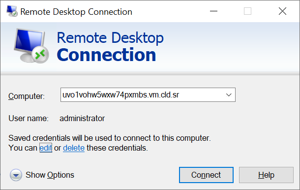
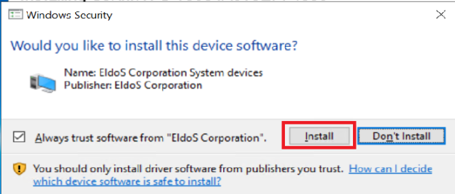
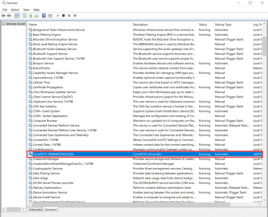

# CortxNTFS Installation and Usage Guide

This guide describes how you can test out CortxNTFS for yourself by either
logging into a test Windows environment remotely (whilee it lasts) and testing a
pre-installed CortxNTFS virtual drive, or installing your own copy. It also
provides some troubleshooting tips.

## Testing CortxNTFS in a Pre-Installed Windows Environment

To test CortxNTFS in an existing Windows environment remote desktop into the
following CloudShare Windows environment:

**uvo1vohw5wxw74pxmbs.vm.cld.sr**

With credentials:

**Username**: **Test**  
**Password**: **CortxNTFS\$9876**

[**NOTE**: *This Windows environment is provided on a temporary basis and will
eventually be removed.*]

Once you have successfully logged into the Windows environment, run **Windows
Explorer** and you should find a CortxNTFS **W:\\** virtual drive.

Feel free to test the drive out by reading/writing folders/files from/to it in
the normal ways. Keep in mind you are “sharing” the virtual drive with anyone
else who is testing CortxNTFS! That is the CortxNTFS **W:\\** virtual drive is
being simultaneously multi-mounted by everyone testing it!

# Install CortxNTFS in Your Own Windows Environment

Follow these steps to install CortxNTFS for Windows.

1.  Download one of the available unique CortxNTFS installers from the table
    below:

| [CortxNTFSSetUp.6E7ABFBC.exe](https://wco000032.blob.core.windows.net/worldcomputer/036DAD926F4749F3BA338636843143CA/CortxNTFSSetUp.6E7ABFBC.exe) |
|---------------------------------------------------------------------------------------------------------------------------------------------------|
| [CortxNTFSSetUp.7D0F3509.exe](https://wco000032.blob.core.windows.net/worldcomputer/10BAD48D2EFE451E907A3C2C456B44CB/CortxNTFSSetUp.7D0F3509.exe) |
| [CortxNTFSSetUp.C2EB613B.exe](https://wco000032.blob.core.windows.net/worldcomputer/11E461E1032C4A8DA0C63E1D41B44971/CortxNTFSSetUp.C2EB613B.exe) |
| [CortxNTFSSetUp.9D57E13F.exe](https://wco000032.blob.core.windows.net/worldcomputer/668595D0E22645E99FD6A985464E855F/CortxNTFSSetUp.9D57E13F.exe) |
| [CortxNTFSSetUp.9410EE28.exe](https://wco000032.blob.core.windows.net/worldcomputer/72F51A05A64D42BA828A93E796C5AB8E/CortxNTFSSetUp.9410EE28.exe) |
| [CortxNTFSSetUp.4588ECD8.exe](https://wco000032.blob.core.windows.net/worldcomputer/84C114C3C3E546079F22AF9FD584E860/CortxNTFSSetUp.4588ECD8.exe) |
| [CortxNTFSSetUp.BCD806E3.exe](https://wco000032.blob.core.windows.net/worldcomputer/89B372CD71B042CFA4301AEA5BDC8E0A/CortxNTFSSetUp.BCD806E3.exe) |
| [CortxNTFSSetUp.16DB2A19.exe](https://wco000032.blob.core.windows.net/worldcomputer/9BFD42D59B4D4FCC895B9173E16D4E30/CortxNTFSSetUp.16DB2A19.exe) |
| [CortxNTFSSetUp.957A6C14.exe](https://wco000032.blob.core.windows.net/worldcomputer/B6D030CB40E9475DB586C8F0A909D5E6/CortxNTFSSetUp.957A6C14.exe) |
| [CortxNTFSSetUp.5D932A80.exe](https://wco000032.blob.core.windows.net/worldcomputer/E0629C88411B4FC3BECFC5F4D4A3B854/CortxNTFSSetUp.5D932A80.exe) |

1.  Run the downloaded installer to install the software accepting all default.

    Note, depending on the version of Windows you are installing CortxNTFS on
    you may see the following dialog during the install process:

      
    If so click **Install** to continue:

2.  Wait 30-60 seconds for the Windows service that is installed to fully start,
    and then open Windows Explorer to find your **W:\\** virtual drive:

    

    Feel free to test the drive out by reading/writing folders/files from/to it
    in the normal ways. Keep in mind you are “sharing” the virtual drive with
    anyone else who is testing CortxNTFS! That is the CortxNTFS **W:\\** virtual
    drive is being simultaneously multi-mounted by everyone testing it!

# Configuring a CORTX S3 Instance to Work with CortxNTFS

For the purposes of a seamless demonstration experience, the above listed
installers have been hard coded to use a *temporary* CloudShare CORTX instance
graciously provided by Seagate during the Hackathon. It is likely that by the
time you are ready to test out CortxNTFS this CloudShare instance will have been
retired. In this case you will want to configure CortxNTFS to work with a CORTX
instance that you control/set up.

To do this place a text file named **CortxNTFS.Config** in the CortxNTFS
installation directory you chose during the installation process above (the
default is C:\\Program Files (x86)\\World Computer
Organization\\CortxNTFS-*\<YourUniqueSerialNumber\>*)

Note that this file will *not* yet exist so you will have to create it.

The file should contain a single CORTX S3 semi-colon delimited configure string
on the very first line of the file, in the form:  

<url with port and trailing slash\>;\<bucket
name\>;reserved-for-future-use;\<Access Key ID\>;\<Secret Access Key\>  

The default CORTX S3 configuration used if no **CortxNTFS.Config** file
exists, assumes the temporary Seagate provided CloudShare environment:  

http://uvo1z084vf5xbdy7ui3.vm.cld.sr:31949/;cortxntfs-4cluster-node1;reserved-for-future-use;sgiamadmin;ldapadmin

If the CloudShare environment is still up, feel free to inspect the blocks CortxNTFS writes to the above bucket (cortxntfs-4cluster-node1) as you perform file i/o on the shared W:\\ virtual drive. You can do this by connecting to the CORTX S3 environment in the usual way with a 3rd party tool like S3 Browser or Cyberduck. 

Keep in mind, however, that when inspecting blocks on the configured CORTX S3 instance, only 25% of the block i/o will actually be visible. This is because the demonstration virtual drive is configured for fast parallel block i/o using four S3 instances (clusters) and each gets approximately 25% of the block i/o traffic. 

Also note, that if/when you configure CortxNTFS to switch to using your own CORTX S3 instance you will only be able to properly access files that you write to the shared virtual drive *after* making the switch because the blocks of files written to the default configured CORTX S3 instance *before* the switch will no longer be accessible. 

# Troubleshooting

If after installation you do not see the **W:\\** associated with the Windows
Explorer, or you see error messages that say the **W:\\** drive is not
available, try to remedy the situation with one or more of the following:

1.  Wait an additional minute or two to give CortNTFS enough time to start after
    installation

2.  Collapse and Refresh the “This PC” node of the Windows Explorer tree

3.  Close all running instances of Windows Explorer and then restart an instance
    and repeat 2 above

4.  Restart the CortxNTFS service and then repeat step 1 above  
    

5.  Restart your PC and then repeat step 1 above

6.  Contact [RodDaSilva@WorldComputer.org](mailto:RodDaSilva@WorldComputer.org)
    for further support
