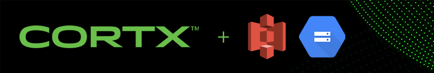

##################
CORTX Integrations
##################

As an S3 compatible object storage system, CORTX is designed to integrate easily with many other technologies.  Additionally, with its unique motr interface, custom applications
such as those using the KV API or the File Data Manipulation Interface (FDMI) plugin system are also possible. Please refer to the Motr documentation `here <https://github.com/Seagate/cortx-motr/blob/main/doc/reading-list.md#motr-clients>`_ for more information.

Click on any of the images below to know how to integrate CORTX with these other technologies:

+----------------+--------------------+---------------------+
| |Splunk|       | |Prometheus|       | |TensorFlow|        | 
+----------------+--------------------+---------------------+
| |FHIR|         | |Siddhi-Celery|    |      |ImagesApi|    |                     
+----------------+--------------------+---------------------+
| |AWS_EC2|      | |DAOS|             |       |IPFS|        |             
+----------------+--------------------+---------------------+
| |PyTorch2|     | |restic|           |      |yolo|         |             
+----------------+--------------------+---------------------+
| |cortx-js-sdk| | |label-studio|     |      |euclid|       |             
+----------------+--------------------+---------------------+
| |BizTalk|      | |Spark|            | |PyTorch|           |             
+----------------+--------------------+---------------------+

.. |yolo| image:: https://user-images.githubusercontent.com/2047294/117738419-34edd500-b1b9-11eb-90f8-8eac4168006b.png
   :width: 1 em
   :target: yolo/README.md 

.. |restic| image:: https://user-images.githubusercontent.com/2047294/117738249-d58fc500-b1b8-11eb-802b-78128e92a018.png
   :width: 1 em
   :target: restic.md

.. |label-studio| image:: https://user-images.githubusercontent.com/2047294/117737303-d1fb3e80-b1b6-11eb-81f1-36f182938e61.png
   :width: 1 em
   :target: label-studioAPI/README.md

.. |euclid| image:: https://user-images.githubusercontent.com/2047294/117737704-a593f200-b1b7-11eb-9915-cef2567b2583.png
   :width: 1 em
   :target: pytorch.md

.. |Splunk| image:: ../images/SplunkLogo.png
   :width: 1 em
   :target: splunk.md

.. |Prometheus| image:: prometheus/PrometheusLogo.png
   :width: 1 em
   :target: prometheus.md

.. |Siddhi-Celery| image:: ../images/siddhi_small.png
   :width: 1 em
   :target: siddhi-celery.md

.. |FHIR| image:: ../images/fhir-logo.png 
   :width: 1 em
   :target: fhir.md
   
.. |PyTorch2| image:: https://user-images.githubusercontent.com/2047294/117737939-1dfab300-b1b8-11eb-8ab3-56364e86c6d3.png
   :width: 1 em
   :target: pytorch2.md
   
.. |TensorFlow| image:: ../images/tensorflow.png
   :width: 1 em
   :target: tensorflow

.. |ImagesApi| image:: ../images/images-api.png
   :width: 1 em
   :target: images-api.md   

.. |AWS_EC2| image:: https://d0.awsstatic.com/logos/powered-by-aws.png
   :width: 1 em
   :target: AWS_EC2.md  
   
.. |DAOS| image:: https://camo.githubusercontent.com/38c204bac927eb42c29e727246742567baa5e1192fa5982183c227e570863604/68747470733a2f2f656d6f6a692e736c61636b2d656467652e636f6d2f5434525545324644482f64616f732f663532623565633262303439353866312e706e67
   :width: 1 em
   :target: https://github.com/Seagate/cortx-experiments/blob/main/daos-cortx/docs/datamovment_with_s3.md  
   
.. |IPFS| image:: ../images/IPFS.png
   :width: 1 em
   :target: ipfs.md
   
.. |PyTorch| image:: ../images/PyTorch.png
   :width: 1 em
   :target: pytroch-integration.md

.. |BizTalk| image:: ../images/BizTalkLogo.png
   :width: 1 em
   :target: biztalk.md

.. |Spark| image:: ../images/spark-logo.png
   :width: 1 em
   :target: spark.md

Looking to make your own integration?  Click `here <suggestions.md>`_ for instructions and a list of suggested techologies
