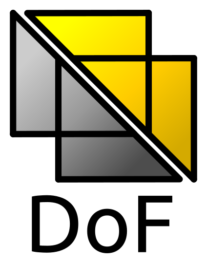

##################
CORTX Integrations
##################

As an S3 compatible object storage system, CORTX is designed to integrate easily with many other technologies.  Additionally, with its unique motr interface, custom applications
such as those using the KV API or the File Data Manipulation Interface (FDMI) plugin system are also possible. Please refer to the Motr documentation `here <https://github.com/Seagate/cortx-motr/blob/main/doc/reading-list.md#motr-clients>`_ for more information.

Click on any of the images below to know how to integrate CORTX with these other technologies:

+----------------+--------------------+---------------------+
| |Splunk|       | |Prometheus|       | |TensorFlow|        |
+----------------+--------------------+---------------------+
| |FHIR|         | |Siddhi-Celery|    | |ImagesApi|         |
+----------------+--------------------+---------------------+
| |AWS_EC2|      | |DAOS|             | |IPFS|              |
+----------------+--------------------+---------------------+
| |cortx-js-sdk| | |myDrive|          | |Slack-Bot|         |
+----------------+--------------------+---------------------+
| |parlAI|       | |restic|           | |yolo|              |             
+----------------+--------------------+---------------------+
| |DICOM|        | |label-studio|     | |euclid|            |             
+----------------+--------------------+---------------------+
| |BizTalk|      | |Spark|            | |cortx-pyTorch|     |             
+----------------+--------------------+---------------------+
| |fluentd|      | |strapi|           | |DOF|               |             
+----------------+--------------------+---------------------+
| |jupyter|      | |drp|              | |torchvision|       |             
+----------------+--------------------+---------------------+
| |edgehealth|   | |pulsar|           | |pytorch-mnist|     |             
+----------------+--------------------+---------------------+            
| |flapmax|      | |s3fs|             | |samba|             |                         
+----------------+--------------------+---------------------+          
| |h2o|          | |Django|           | |rclone|            | 
+----------------+--------------------+---------------------+        
| |chia|         | |laravel|          | |dvc|               | 
+----------------+--------------------+---------------------+
| |cortx-restic| | |thanos|           | |goofys|            | 
+----------------+--------------------+---------------------+
| |modzy-ai|     | |milvus|           | |s3filecoin|        | 
+----------------+--------------------+---------------------+
| |ftp|          | |docker|           | |cortx-drive|       | 
+----------------+--------------------+---------------------+
| |NTFS|         |  |freesheet|       |      |go-ds-motr|   | 
+----------------+--------------------+---------------------+
| |here|         |                    |                     | 
+----------------+--------------------+---------------------+

.. |laravel| image:: https://github.com/Seagate/cortx/blob/main/doc/integrations/laravel/1200px-Laravel.svg.png?raw=true
   :target: laravel

.. |flapmax| image:: https://github.com/flapmx/cortx/blob/09b27dcb19e55d0a598a5ca3085103d31bbed8da/doc/images/flapmaxlogo.png?raw=true
   :target: Flapmax_LETL

.. |edgehealth| image:: https://user-images.githubusercontent.com/2047294/117741785-72099580-b1c0-11eb-8b2f-de82cd7513fa.png
   :target: edgehealth

.. |pulsar| image:: https://user-images.githubusercontent.com/2047294/117741252-37ebc400-b1bf-11eb-8298-66ef3f8fd01f.png
   :target: pulsar

.. |pytorch-mnist| image:: https://user-images.githubusercontent.com/2047294/117741096-d3c90000-b1be-11eb-8cb9-00a46ba9c08b.png
   :target: pytorch-mnist

.. |drp| image:: https://user-images.githubusercontent.com/2047294/117740445-b21b4900-b1bd-11eb-9d12-5b7ce5ac1dc5.png
   :target: drp

.. |jupyter| image:: https://user-images.githubusercontent.com/2047294/117739959-a24f3500-b1bc-11eb-9cdf-bf50602589df.png
   :target: cortx_jupyter_integration

.. |fluentd| image:: https://user-images.githubusercontent.com/2047294/117739258-34563e00-b1bb-11eb-9330-f6ee034bb371.png
   :target: fluentd

.. |yolo| image:: https://user-images.githubusercontent.com/2047294/117738419-34edd500-b1b9-11eb-90f8-8eac4168006b.png
   :target: yolo

.. |restic| image:: https://user-images.githubusercontent.com/2047294/117738249-d58fc500-b1b8-11eb-802b-78128e92a018.png
   :target: restic

.. |label-studio| image:: https://user-images.githubusercontent.com/2047294/117737303-d1fb3e80-b1b6-11eb-81f1-36f182938e61.png
   :target: label-studioAPI

.. |euclid| image:: https://user-images.githubusercontent.com/2047294/117737704-a593f200-b1b7-11eb-9915-cef2567b2583.png
   :target: euclid

.. |Splunk| image:: ../images/SplunkLogo.png
   :target: splunk

.. |Prometheus| image:: prometheus/PrometheusLogo.png
   :target: prometheus

.. |Siddhi-Celery| image:: ../images/siddhi_small.png
   :target: siddhi-celery

.. |FHIR| image:: ../images/fhir-logo.png
   :target: fhir
   
.. |parlAI| image:: https://user-images.githubusercontent.com/2047294/117737939-1dfab300-b1b8-11eb-8ab3-56364e86c6d3.png
   :target: parlAI
   
.. |TensorFlow| image:: ../images/tensorflow.png
   :target: tensorflow

.. |ImagesApi| image:: ../images/images-api.png
   :target: images-api

.. |AWS_EC2| image:: https://d0.awsstatic.com/logos/powered-by-aws.png
   :target: AWS_EC2

.. |DAOS| image:: https://camo.githubusercontent.com/38c204bac927eb42c29e727246742567baa5e1192fa5982183c227e570863604/68747470733a2f2f656d6f6a692e736c61636b2d656467652e636f6d2f5434525545324644482f64616f732f663532623565633262303439353866312e706e67
   :target: https://github.com/Seagate/cortx-experiments/blob/main/daos-cortx/docs/datamovment_with_s3.md

.. |IPFS| image:: ../images/IPFS.png
   :target: ipfs
   
.. |cortx-pyTorch| image:: ../images/PyTorch.png
   :target: cortx-pytorch

.. |cortx-js-sdk| image:: ./cortx-js-sdk/images/logo.png
   :target: cortx-js-sdk

.. |torchvision| image:: https://user-images.githubusercontent.com/2047294/117740608-03c3d380-b1be-11eb-873f-f59af5781b40.png
   :target: torchvision

.. |Slack-Bot| image:: https://user-images.githubusercontent.com/2047294/118882535-8846de00-b8b1-11eb-863a-74b409affdff.png
   :target: cortx-s3-slack-bot

.. |BizTalk| image:: ../images/BizTalkLogo.png
   :target: biztalk

.. |DICOM| image:: ../images/dicom-logo.jpg
   :target: cortx_dicom

.. |Spark| image:: ../images/spark-logo.png
   :target: spark
   

.. |dvc| image:: ../images/dvc.png
   :target: dvc

.. |chia| image:: ../images/chia-logo.png
   :target: chia-blockchain

.. |rclone| image:: ./rclone/logo.png
   :target: rclone

   
.. |s3filecoin| image:: https://i.imgur.com/SfcbktD.jpg
   :target: s3filecoin
   

   

   
.. |milvus| image:: ../images/milvus.jpg
   :target: cortx-milvusio
   

   

   

  
.. |here| image:: ../images/cortx-here.png
   :target: here_cortx_traffic_data

Looking to make your own integration?  Click `here <suggestions.md>`_ for instructions and a list of suggested techologies
