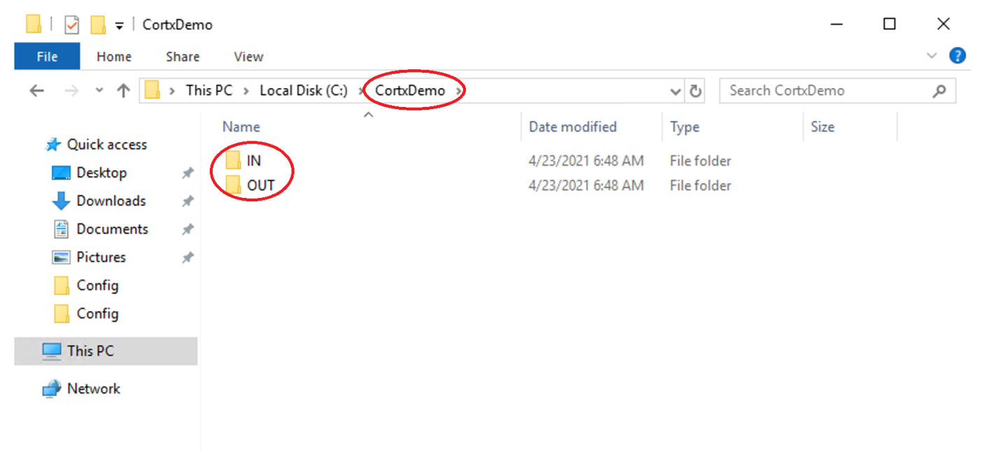
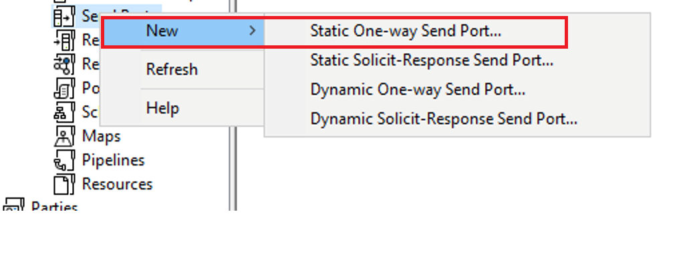
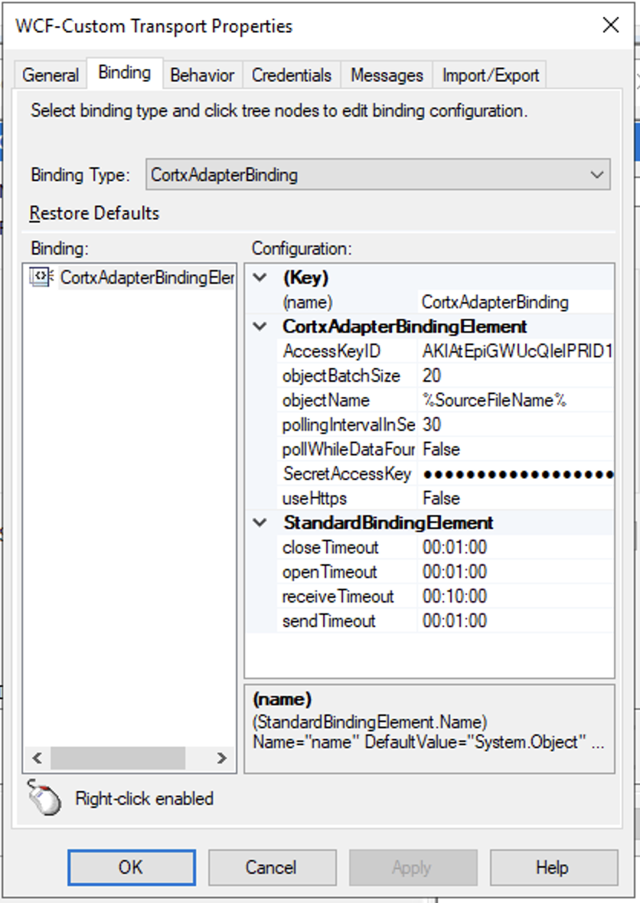
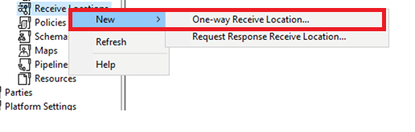
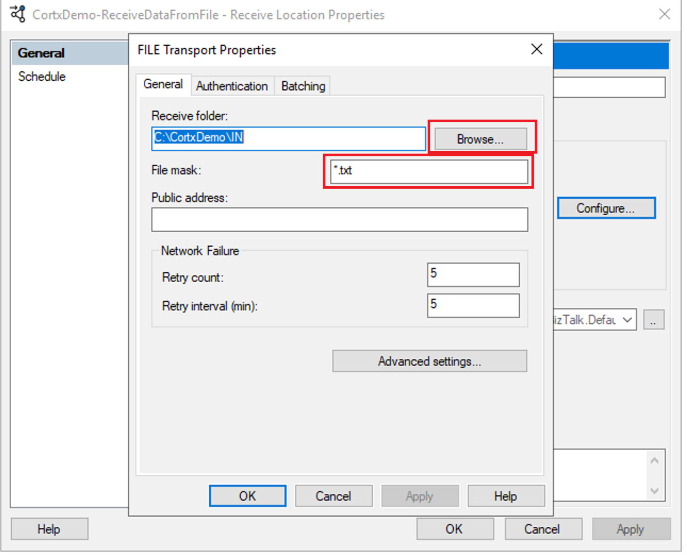
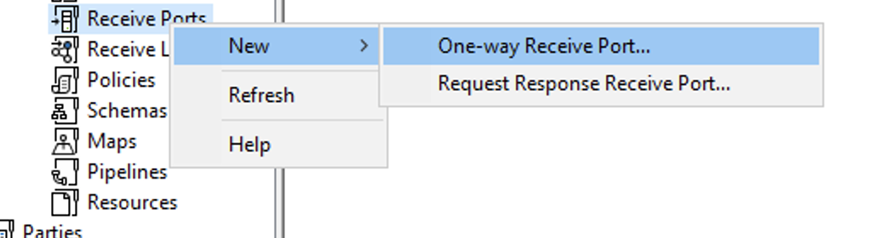

# CORTX BizTalk Adapter Getting Started Tutorial

In this tutorial you will see how to configure the settings required to use the
CORTX BizTalk Adapter, on both a BizTalk Server Send and Receive Port in order
to send data from BizTalk to CORTX and receive data from CORTX into BizTalk.

## Goals

-   Understand how to grant BizTalk necessary permissions over computer file
    system

-   Understand how to create BizTalk Send and Receive Ports, and how to link
    them together through subscription

-   Understand how to configure the CORTX BizTalk Adapter Bindings to work with
    your S3 Storage Account

-   Understand how to Send data to and Receive data from CORTX Storage
    automatically

## Notes

-   This Tutorial assumes you have a BizTalk environment already setup with the
    CORTX adapter installed into it. Refer to the [Microsoft SQL Server 2019
    Installation Guide](./Microsoft%20SQL%20Server%202019%20Installation%20Guide.md) 
    and [Microsoft BizTalk Server 2020 Installation Configuration Guide](./Microsoft%20BizTalk%20Server%202020%20Installation%20and%20Configuration%20Guide.md)
    that accompany this document for instructions for
    setting up your BizTalk environment, and to the [CORTX BizTalk Adapter
    Installation Guide](./CORTX%20BizTalk%20Adapter%20Installation%20Guide.md) for installing the CORTX adapter.

-   This tutorial assumes that suitable Amazon S3 compatible browser software
    (such as **S3 Browser** or **Cyberduck**) has already been installed and is
    configured to access your CORTX S3 account. You will need to know your
    **AcessKeyID** and the **SecretAccessKey** and **S3 URL endpoint** necessary
    to access your CORTX instance in order to configure the CORTX Adapter below.

## Part 1 - Send Data to CORTX Using the BizTalk CORTX Adapter  

1.  Create a new folder in your computer’s file system (e.g.; **CortxDemo**),
    then create two subfolders under it named **IN** and **OUT**.

    

2.  Right click on the folder you created in the above step from Windows
    Explorer and click **Properties \> Security\> Edit**

3.  Enter the name of your BizTalk host instance service account (in the demo
    environment for this tutorial it happens to be **BTServiceControl**) into
    the text box, then click **Add**. In the next pane, click the check box
    marked **Full** **Control**, then click **Ok**. This gives BizTalk full
    permission (i.e.; read/write/delete) to access files in the new file folders
    created above:

4.  Create a .txt file in notepad, enter some data. Then save it to the computer
    desktop.

5.  Go to S3 Browser (or equivalent) and click **New Bucket** in the top
    left-hand corner. Name your bucket **cortxdemo** (must be all lower-case)
    and click **Create New Bucket**. Your bucket should then appear in the
    tree-view.

6.  Search for and run the **BizTalk Administration Console** application and
    open the default BizTalk Application named **BizTalk Application 1** and
    right click on **Send Ports**. Then, select **New \>Static One-Way Send**
    **Port..**

7.  Give the Send Port a name such as **CortxDemo-SendDataToCortx**, then click
    the **Transport Type** dropdown menu and select **WCF-Custom** from the list
    of options.

8.  Enter the CORTX endpoint information in the **Address (URI)** in the form
    *cortx://\<host\>:\<port\>/\<bucketname\>*. In this example it is
    **cortx://uvo1u026p25wjnv7485.vm.cld.sr:80/cortxdemo** for a CORTX instance
    running over HTTP on port 80 on the server **uvo1u026p25wjnv7485.vm.cld.sr**
    with bucket **cortxdemo**. Enter **CortxAdapter** into the **SOAP Action
    Header** text box. [NOTE: the port is not optional and must be specified.]

9.  On the **Bindings** tab choose the **CortxAdapterBinding** as the **Binding
    Type**. Enter your **AccessKeyID** and **SecretAccessKey** for your CORTX
    instance then enter **%SourceFileName%** in the **objectName** box. If your
    CORTX endpoint is using the HTTP scheme (instead of HTTPS) as in this
    example, ensure **useHttps** is set to **False**.

10.  Click the **Messages** tab at the top of the window. Click the **Template**
    radio button, then enter **\<bts-msg-body
    xmlns="http://www.microsoft.com/schemas/bts2007" encoding="base64"/\>** in
    the **XML**: text box. Click **Ok** finish the configuration of your Send
    Port.

11.  Still in the **BizTalk Administration Console**, under **BizTalk Application
    1** Application right click on the **Receive Ports** tab and select
    **New\>One Way Receive Port…**

12.  Give the **Receive Port** a name such as **CortxDemo-ReceiveDataFromFile**,
    and then click **Ok** to create it.

13.  Under **BizTalk Application 1** Application right click on the **Receive
    Locations** tab and select **New\>One Way Receive Location…**

14.  Select the **Receive Port** you created in the previous steps when prompted.
    Give the **Receive Location** the same name as the Receive Port, then select
    **FILE** from the **Transport Type** dropdown and click the **Configure**
    button.

15.  Click **Browse**, then find and select the **IN** folder you created in your
    computer’s file system at the beginning of the tutorial. Change the **File
    mask:** property to **\*.txt**. This tells the BizTalk ReceivePort/Location
    to listen for and consume any files placed in that folder with an extension
    **.txt**. Click **Ok** to create the **Receive Location**.

16.  Right click on **BizTalk Application 1** and click **Start**. This
    starts/enables all of the BizTalk ports you’ve just created. BizTalk is now
    listening on the **IN** folder for **\*.txt** files.

17.  Go back to the **Send Ports** tab under **BizTalk Application 1**, right
    click the Send Port you created previously and then click **Properties**.
    Click **Filters** on the left-hand side, and in the **Property** dropdown
    menu find and select **BTS.ReceivePortName**. In the **Value** text box,
    paste the (case sensitive) name of the **Receive Port** you previously
    created. This creates a tells BizTalk that any message coming into that
    specified Receive Port will be redirected to this Send Port. This concept is
    referred to as subscription in the context of BizTalk.

18.  The configuration for Part-1 of the solution is now complete and ready to
    test. From Windows Explorer, copy the **.txt** file you created on the
    desktop in an earlier step, and paste it into your **IN** folder. You should
    see the message vanish from the folder as BizTalk consumes it.

19.  Go to your Amazon S3 Browser and refresh your **cortexdemo** bucket. You
    should see that BizTalk has deposited the file it consumed the **IN**
    directory in your computer’s file system and wrote it into your S3 bucket.

## Part-2 Receiving Data From CORTX Into BizTalk Using the BizTalk CORTX Adapter

1.  In the **BizTalk Administration Console** (again under **BizTalk Application
    1**), right click on **Receive** **Ports**, then click **New\>One Way
    Receive Port**. Give the port a name such as
    **CortxDemo-ReceiveDataFromCortx**, then click **Ok** to create it.

2.  Still under **BizTalk Application 1**, right click on the **Receive
    Locations** tab, then click **New\>One Way Receive Location**. Name the
    **Receive Location** the same as your Receive Port you created it the
    previous step. Select **WCF-Custom** in the **Transport Type** dropdown then
    click the **Configure** button:  
    
    

3.  As before, enter the address of your CORTX instance in the form of
    **cortx://\<hostname\>:\<port\>/\<bucketname\>** as the **Address (URI)**.
    In this example it is **cortx://uvo1u026p25wjnv7485.vm.cld.sr:80/cortxdemo**
    for a CORTX instance running over HTTP on port 80 on the server
    **uvo1u026p25wjnv7485.vm.cld.sr** with bucket **cortxdemo**. [NOTE: the port
    is not optional and must be specified.]

4.  Click the **Bindings** tab at the top of the window. Fill in your CORTX
    instance’s **AccessKeyID** and **SecretAccessKey**, then clear the text box
    beside **objectName**. If your CORTX instance is running over the HTTP
    scheme (instead of HTTPS) as in this case, ensure **useHttps** is set to
    **False**.

5.  Click the **Messges** tab at the top of the window. Click the **Path** radio
    button, and paste **/\*[local-name()='base64Binary']** into the **Body path
    expression:** text box. Lastly, select **Base64** from the dropdown menu
    beside **Node encoding:**. Click **Ok** to finish creating the **Receive
    Location**.

6.  Once again under **BizTalk Application 1**, right click **on Send Ports**.
    Click **New \>Static One-Way Send Port..**

    

7.  Give the **Send Port** a name such as **CortxDemo-SendDataFromCortxToFile**,
    and select **FILE** in the **Transport Type** dropdown. Then click the
    **Configure** button beside the dropdown.

8.  Click the **Browse** button and locate the **OUT** folder you created at the
    start of the tutorial. Change the **%MessageID%.xml** **File name:** to have
    a **.txt** extension instead of the default **.xml**.

9.  Click **Ok** to save this configuration. On the left-hand side of the Send
    Port window, click **Filters**. Under the **Property** dropdown menu, find
    and select **BTS.ReceivePortName**. In the **Value** text box, paste the
    name of the **Receive Port** you created in step 1 above. The, click **Ok** to
    finish creating the **Send Port**.

10.  The solution is now configured and ready to test. Upload your .txt file to
    the **cortxdemo** bucket in S3 Browser. After a few seconds, refresh the
    bucket list and you should see the object vanish as BizTalk consumes it.
    (Note please allow up to the default of **30** seconds as specified by the
    **pollIntervaleInSeconds** property specified in the Receive Location
    binding properties in step 4 above before the object is consumed out of
    CORTX). Go to your computer’s file system, and open your **OUT** folder. You
    should see that BizTalk has deposited the file from S3 into your file
    folder.

11.  To test the system end-to-end, drop another **.txt** file into your **IN**
    folder and watch it disappear, be written to CORTX only to have BizTalk
    consume it and place it into the **OUT** folder.   
    
    Congratulations! You now know how to configure the CORTX BizTalk adapter for
    both sending data to CORTX from BizTalk, and for receiving data from CORTX
    into BizTalk.
