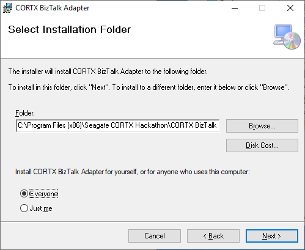
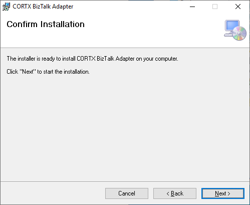
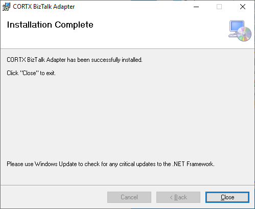

# CORTX BizTalk Adapter Installation Guide  
Follow these steps to install the CORTX BizTalk Adapter.   
[*NOTE: This guide assumes you have a BizTalk Environment to install the adapter into. If you need to setup a BizTalk environment please refer to the accompanying documents:  [Microsoft SQL Server 2019 Installation Guide](./Microsoft%20SQL%20Server%202019%20Installation%20Guide.md) and [Microsoft BizTalk Server 2020 Installation and Configuration Guide](./Microsoft%20BizTalk%20Server%202020%20Installation%20and%20Configuration%20Guide.md).*]  
[*NOTE: Before you begin, ensure you are logged into the Windows Server with local Administrator permissions.*]  
[*NOTE: Before you begin, ensure that the BizTalk Administration Console is not running.*]  

1.  Obtain the **CORTXBizTalkAdapter.msi** installation package from GitHub repo
    that you obtained this document from.

2.  Double click the **CORTXBizTalkAdapter.msi** to launch it and then click
    **Next**:  
    
    

3.  Choose an installation **Folder** and select **Everyone**, then click
    **Next**:  
    
    

4.  Confirm the installation by clicking **Next**:  
    
    

5.  When the installation is complete, click **Close**:  
    
      
    
    This completes the CORTX BizTalk Adapter installation.
