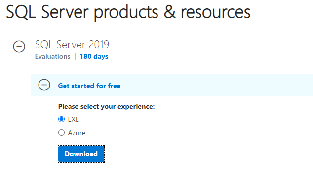
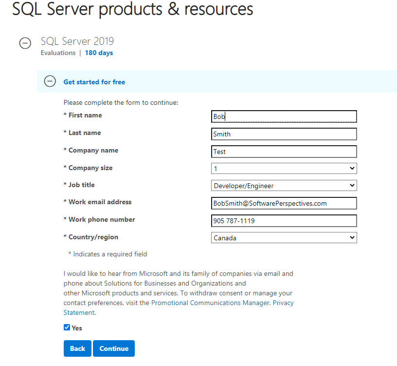
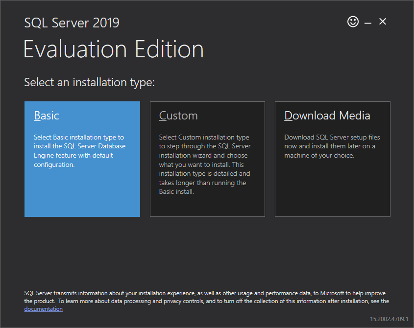
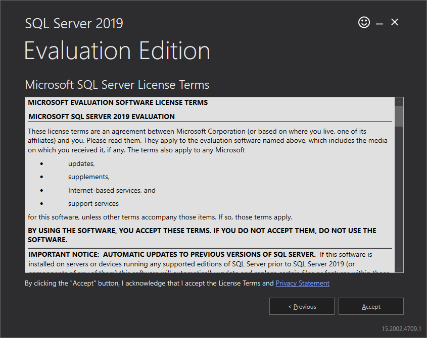
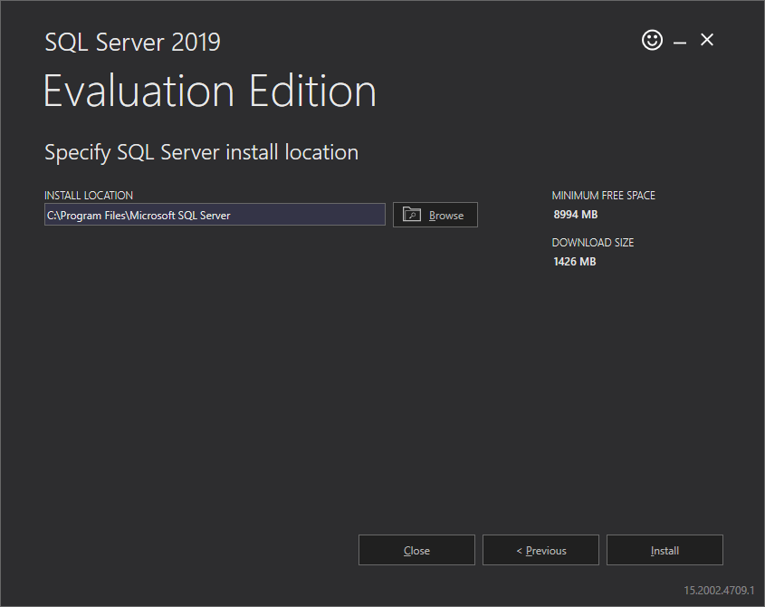
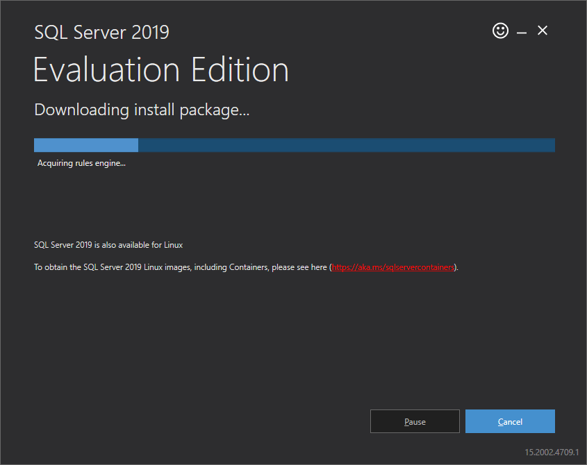
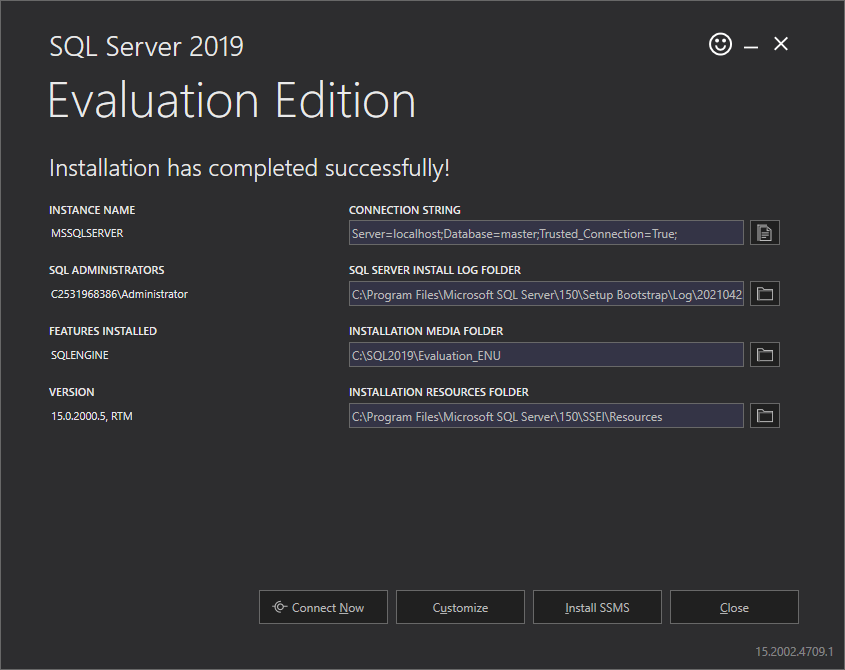

# Microsoft SQL Server 2019 Installation Guide

Follow these steps to install Microsoft SQL Server 2019 free 180 day trial:

1.  Download SQL Server 2019 180 day free trial
    [here](https://www.microsoft.com/en-us/evalcenter/evaluate-sql-server-2019?filetype=EXE).

2.  Choose **EXE** option and click **Download**.  
    

3.  Fill out the requested trial information and click **Continue**.  
    
    

4.  The **SQL2019-SSEI-Eval.exe** will automatically be downloaded by your
    browser. Run it, and choose the **Basic** installation type:  
    
    

5.  Click the **Accept** button to accept the licensing agreement…  
    
    

6.  Choose an installation directory and click **Install**…  
    
      
    
    

7.  When the installation is complete click the Install **Close** button and
    confirm you want to exit the installer:  
    
    
