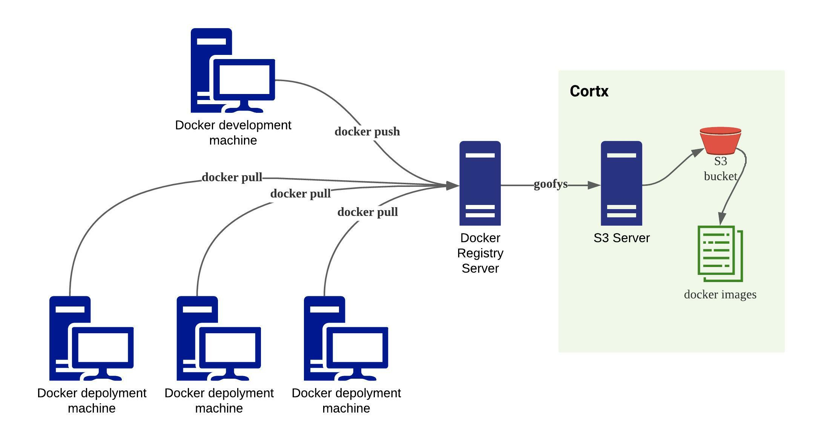

# CORTX Integration with Docker

What is Docker
----
Docker is an open platform for developing, shipping, and running applications. It is a containerization platform. Docker enables developers to separate applications from infrastructure so you can deliver software quickly. The Docker Registry is a stateless, highly scalable server side application that stores and lets you distribute Docker images.

Integrating CORTX with Docker
----
In this design, Cortx is integrated into Docker as its centralized storage for docker images. The integration architecture is shown below. In this integration, there is a Docker development machine, many Docker deployment machines, a Docker Registry server, and a Cortx/S3 server. Docker development machine push new Docker images to Docker Registry server to store them. Docker deployment machines pull Docker images from Docker Registry server to use them. Docker Registry server uses Cortx as backend storage for all the Docker images.     

Other S3 client tools can be added to the system to manage S3 storage, or use to test the system.  

###  Prerequisites
Have an avaliable Cortx setup, or setup follow the instructions below. And create a bucket testbucket.
https://github.com/Seagate/cortx/blob/main/QUICK_START.md 

###  Setup Steps 

Step 1: Install docker.

    sudo apt-get update
    sudo apt-get install \
        ca-certificates \
        curl \
        gnupg \
        dpkg \
        redhat-lsb-core -y
    mkdir -p /usr/share/keyrings/
    curl -fsSL https://download.docker.com/linux/ubuntu/gpg | sudo gpg --dearmor -o /usr/share/keyrings/docker-archive-keyring.gpg
    mkdir -p /etc/apt/sources.list.d/
    echo \
      "deb [arch=$(dpkg --print-architecture) signed-by=/usr/share/keyrings/docker-archive-keyring.gpg] https://download.docker.com/linux/ubuntu \
      $(lsb_release -cs) stable" | sudo tee /etc/apt/sources.list.d/docker.list > /dev/null
    sudo apt-get update
    sudo apt-get install docker-ce docker-ce-cli containerd.io -y
    sudo service docker start

Step 2: Install go, aws. Use your own S3 `your_access_key_id` and `your_access_key`

    sudo apt-get install golang awscli -y
    aws configure set aws_access_key_id your_access_key_id --profile default
    aws configure set aws_secret_access_key your_access_key --profile default
    aws configure set region us-east-1 --profile default

Step 3: Install goofys.

    mkdir -p $HOME/go/src/github.com/kahing/
    cd $HOME/go/src/github.com/kahing/
    git clone https://github.com/kahing/goofys.git
    export GOPATH=$HOME/go
    export GOOFYS_HOME=$HOME/go/src/github.com/kahing/goofys/
    cd $HOME/go/src/github.com/kahing/goofys
    git submodule init
    git submodule update
    PATH=$PATH:$HOME/go/bin; export PATH
    sudo go install $HOME/go/src/github.com/kahing/goofys

Step 4: Mount Cortx S3 bucket with goofys and start Docker Registry with the bucket as storage. Replace `http://192.168.1.91` with your own S3 endpoint url.

    sudo mkdir /mnt/registry
    goofys --endpoint http://192.168.1.91 testbucket /mnt/registry
    docker run -d \
    -p 5000:5000 \
    --restart=always \
    --name registry \
    -v /mnt/registry:/var/lib/registry \
    registry:2

###  Test the system 

Step 1: From Docker development machine, build a test docker image `hello` and push it to Docker Registry server. Replace `192.168.1.115` with your own Docker Registry server ip. If encounter "http: server gave HTTP response to HTTPS client" error, add your Docker Registry server ip to docker development machine's daemon configuration json file under "insecure-registries" first. 

Alternatively, if you test Docker development client on same machine as Docker Registry server, replace `192.168.1.115` with `localhost`.

    mkdir hello
    echo -e "# syntax=docker/dockerfile:1\nFROM scratch\nADD hello /\n" > Dockerfile
    docker build --tag hello .
    docker tag hello 192.168.1.115:5000/hello 
    docker push 192.168.1.115:5000/hello 

Step 2: Check Cortx S3 bucket is now updated with the new docker image. You can see `hello/` docker image is added to the bucket's `repositories` folder. Replace `http://192.168.1.91` with your own S3 endpoint url.

    aws s3 --endpoint "http://192.168.1.91" ls s3://testbucket/docker/registry/v2/repositories/

Step 3: From Docker deployment machine, pull docker image from Docker Registry server. Then you can start to use the downloaded docker image as usual.

    C:\tmp>docker pull 192.168.1.115:5000/hello                                                                             
    Using default tag: latest                                                                                               
    latest: Pulling from hello                                                                                                                              
    Status: Downloaded newer image for 192.168.1.115:5000/hello:latest                                                      
    192.168.1.115:5000/hello:latest 

All done. Now you have Cortx integrated with Docker as its centralized docker image storage.
