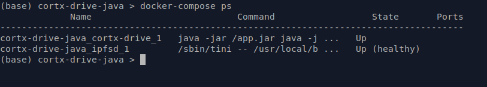
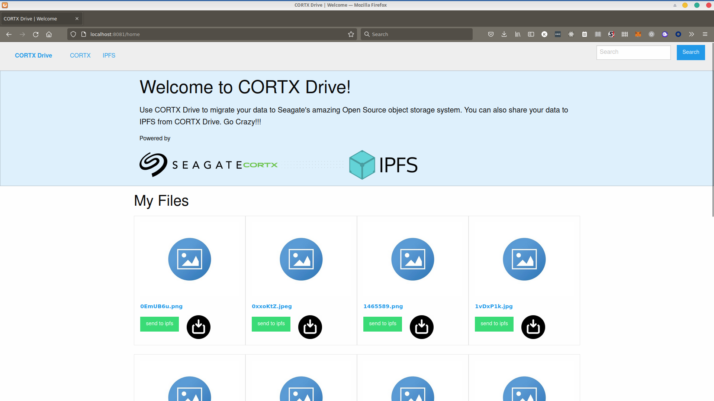

# CORTX Drive

CORTX Drive is a file management app built to use Seagate's open source object storage system: CORTX. it provides a web based user interface that can be easily navigated and allows the user store and browse their uploaded files in an easy-to-use friendly manner.

## Goals

- To provide an easy to use app that allows users store and manage their files on the cloud
- To provide a means for users to migrate their data into the decentralized web - IPFS


## Architecture

CORTX Drive is written in Java using the Spring Boot application framework. All interactions with CORTX and IPFS are implemented as Services and the web interface is served using Spring MVC Controllers.


## Getting started

The quickest way to setup CORTX Drive is by using **Docker Compose**. Before you start though you will have to open up the **docker-compose.yml** file and set some variables.

A summary of the variables and their description:

- AWS_ACCESS_KEY - API Access Key for connecting to CORTX instance
- AWS_SECRET_KEY - API Secret Key for connecting to CORTX instance
- AWS_ENDPOINT_URL - URL of CORTX endpoint for connecting to CORTX 
- DEFAULT_BUCKET_NAME - The bucket name of the default storage bucket. This bucket must already exist for the app to work
- IPFS_ADD_FILE_URL - API URL for the add file endpoint of your IPFS gateway. You can leave this at the default setting if you plan to use the preconfigured IPFS node instance that is already defined in the docker compose file
- IPFS_RETRIEVE_FILE_URL - API URL for the retrieve file endpoint of your IPFS gateway


### Using Docker

To start the app, Run:

```bash
docker-compose up -d
```

This should pull the required app image from Docker Hub and start the local IPFS node and the CORTX Drive app. Confirm that everything is working by running:

```bash
docker-compose ps
```

You should see some output like:



You can see the logs from the app by typing

```bash
docker-compose logs cortx-drive
```

Or view the logs from the IPFS node by typing

```bash
docker-compose logs ipfsd
```

The application should now be accessible from http://localhost:8081/home. The IPFS node dashboard should also be available at http://localhost:5001/webui

#### Notes

- The Docker setup uses a host-mode network. This is to allow you access local ports from the container in case you are using an SSH Tunnel to connect to you CORTX instance (on CloudShare)

- Because of the host mode network setting, you must make sure that ports **5001** and **8081** are not being used by any other application before you start docker-compose

### Building from source

To build the app from source, You will need

- Java 11 Development Kit
- Gradle Build Tool

The quickest way to get these tools is to use [sdkman!](https://sdkman.io/)

##### Steps

1. Clone the source repository from [Github](https://github.com/kurosouza/cortx-drive) 

2. Got to the source repo folder and build the project by running:

   ```bash
   ./gradlew build
   ```

3. Setup the necessary environment variable as defined above

   ```bash
   export AWS_ACCESS_KEY='...'
   export AWS_SECRET_KEYY='...'
   export DEFAULT_BUCKET_NAME='...'
   ```

4. Run the project by typing

   ```bash
   ./gradlew bootRun
   ```

5. This will build the project and run it as a Spring Boot application. The application will be available at http://localhost:8081/home


## Screenshots




## Video

Here is a video showing a demo of the application

https://youtu.be/3ZVRK8s75SY