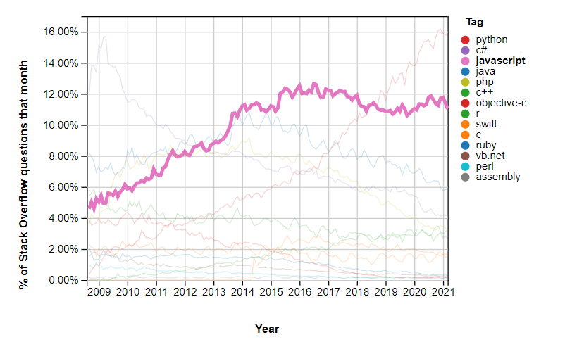

 
# CORTX Javascript/Typescript SDK
 
## Javascript is eating the world. dont stay behind.

 
 
## Motivation
 
Javascript is one of the most used languages in the world, According to [StackOverflow](https://insights.stackoverflow.com/trends?tags=java%2Cc%2Cc%2B%2B%2Cpython%2Cc%23%2Cvb.net%2Cjavascript%2Cassembly%2Cphp%2Cperl%2Cruby%2Cvb%2Cswift%2Cr%2Cobjective-c). 

This makes total sense, as we can run it in the frontend , backend , mobile , wearables , cars or even... fridgeders!
 
 

 
By making CORTX and "Object Storage Technologies"
(which are traditionally ruled by devops or backend engineers at best) available for frontend, mobile and fullstack engineers we open new doors for CORTX and the millions developers in the JS eco-system.
 
## Installation 
 
[](https://npmjs.org/package/cortx-sdk-js)
 
```sh
$ npm install --save cortx-js-sdk
```
 
# Connectors
 
### Amazon S3
 
`cortx-js-sdk` exposes a fully wrapped AWS.S3 class to communicate with CORTX
 
```typescript
const cortx = new CORTX(S3_ENDPOINT, S3_ACCESS_KEY_ID, S3_SECRET_ACCESS_KEY);
const s3 = cortx.createS3Connector();
```
 
in this example, the `s3` object is a proxy object to Cortx.
 
```typescript
const res = await s3
  .putObject({
    Bucket: 'testbucket/',
    Key: 'file.txt',
    Body: Buffer.from(file),
    ACL: 'public-read',
  })
  .promise();
```
 
## Examples
 
- any example shown on [Amazon s3 KB](https://docs.aws.amazon.com/sdk-for-javascript/v2/developer-guide/s3-node-examples.html) can be interchangeably used with the `cortx.createS3Connector()` object.
 
- Find more examples on the project github under the `./example/src/` folder
 
### MOTR
 
TBD , once Cortx release MOTR APIs.
 
### Google Cloud Storage
 
TBD , once Cortx integrates with GCS.
 
 
## Can I use it with my Typescript project?
 
`cortx-sdk-js` comes with its own type definitions. battery included ⚡.
 
if you're using "import/export" syntax in your project, you can simply `import CORTX from "cortx-js-sdk";` 
to get the full types definitions.
 
## Can I use it on my frontend?
 
Absolutly! the package is a thin lightweight wrapper which is "bundle-size" friendly ⚖

