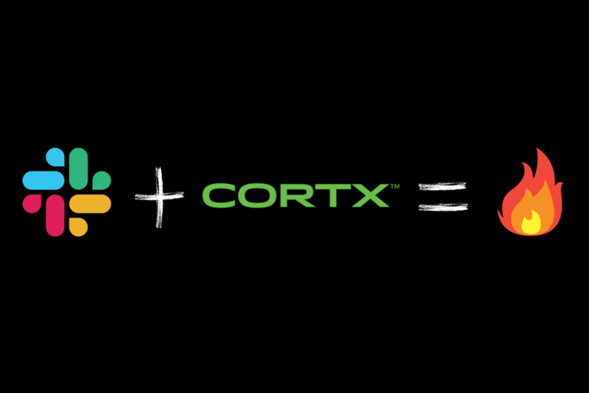

 
 
 

  
  <h1 align="center">CORTX S3 Slack Bot</h1>
  <h4 align="center">A slack bot that uses Elastic Search and AWS to interact with Cortx S3 server</h4>
  

Devpost link [https://devpost.com/software/cortx-s3-slack-bot](https://devpost.com/software/cortx-s3-slack-bot)
 
Video link [https://youtu.be/G_Pu86H5nSg](https://youtu.be/G_Pu86H5nSg)
 

## What does the CORTX S3 SLACK BOT do?

### File Syncing and Data Backup inside Slack

Cortx S3 Slack Bot enables users to access files in your S3 bucket directly from Slack using _Slash commands_. By using simple commands like `/cortx-s3-get filename` and `/cortx-s3-delete filename` we can find or delete files. Whenever a new file is shared on any public channel it is automatically added to the Cortx S3 test bucket, ensuring that all your slack files are safe in case a teammate accidently deletes a file that you need.

### File Searching

Most of the time we don't know the exact name of the file we are looking for. We also need to check if the file is actually present in the S3 bucket. Pooling the bucket over and over again to find a file or check for its existence is a computationally expensive and slow operation. To enable faster indexing of all the files on the S3 bucket, there is a layer of Elasticsearch between the Slack Bot and the S3 bucket. A user can find any file using the `/cortx-s3-search` command which opens a file search dialog. Elasticsearch's autocomplete functionality helps in navigating or guiding the user by prompting them with likely completions and alternatives to the filenames as they are typing it.

### Employee/Intern Onboarding

Whenever a new employee/intern joins the `#cortx-s3-test` channel he/she is greeted by our Cortx bot and is asked to upload his/her resume. After uploading their resume, they notify the slack bot with the `/cortx-s3-upload-resume resume.pdf` command. The bot processes the file extracts Personally Identifiable Information (PII) like name, email and phone number from the document updates of the csv file.
The administrators can get all the details of the employees within slack using `/cortx-s3-resume-data` slash command.

## In App Screenshots

## How we built it

This integration has 5 components

<ol>
    <li>Slack Bot</li>
    <li>Cortx S3 Server</li>
    <li>Elasticsearch</li>
    <li>AWS Comprehend</li>
    <li>AWS Textract</li>
</ol>

The Project is set up to work in a python3 virtual environment. The Slack app is built using <a href="https://slack.dev/bolt-python/concepts">Bolt for Python</a> framework. For connecting to the CortxS3 Server, AWS Comprehend and AWS Textract we use their respective boto3 clients. We connect to Elasticsearch using the <a href="https://elasticsearch-py.readthedocs.io/en/v7.12.0/"> Python Elasticsearch Client</a>.

The Slack app listens to all sorts of events happening around your workspace — messages being posted, files being shared, users joining the team, and more. To listen for events, the slack app uses the Events API. To enable custom interactivity like the search modal we use the Blocks Kit.

Slash commands perform a very simple task: they take whatever text you enter after the command itself (along with some other predefined values), send it to a URL, then accept whatever the script returns and posts it as a Slackbot message to the person who issued the command or in a public channel. Here are the 5 slash commands we use to interact with the Cortx S3 bucket.

### File Sync

Whenever a new file is shared in any public slack channel the <a href="https://api.slack.com/events/file_shared#:~:text=The%20file_shared%20event%20is%20sent,the%20files.info%20API%20method."> <em>file_share event</em></a> is sent to the Slack app. The file is first indexed into Elasticsearch and then added to the Cortx S3 bucket with a key as file name.

### Slash Commands

<ul>
    <li> /cortx-s3-get</li>
    <li> /cortx-s3-search</li>
    <li> /cortx-s3-delete</li>
    <li> /cortx-s3-upload-resume</li>
    <li> /cortx-s3-resume-data</li>
</ul>

#### /corx-s3-get filename

After fetching the filename from the `command['text']` parameter we check if a the file exists using the `es.exists`(es = Elasticsearch client) function. If the file is found, we return the file back to the user as a direct message.

#### /corx-s3-search

This command opens up a modal inside of slack with a search bar, the user is suggested the file names depending on whatever text is written in.

#### /corx-s3-delete filename

After fetching the filename from the `command['text']` parameter we check if a the file exists using the `es.exists`(es = Elasticsearch client) function. If the file is found, we confirm if the user wants to permanently delete the file from the S3 bucket. If the user clicks yes, the file is permanently deleted.

 

#### /corx-s3-upload-resume resume.pdf

When the command is invoked, we get the name of the file from the `command[text]` parameter. The slack app searches for the file on the S3 bucket and downloads it for local processing. The text is extracted from the .jpeg or .pdf resume file using AWS textract using OCR (Optical Character Recognition). The text is passed onto AWS Comprehend which identifies Personally Identifiable Information (PII) of the employee like name, email and phone number from the document. This data is appended in the resume-data.csv file.

#### /corx-s3-resume-data

Upon invocation we get the names and email addresses of the employees inside a table in slack populated with the data from resume-data.csv file.

