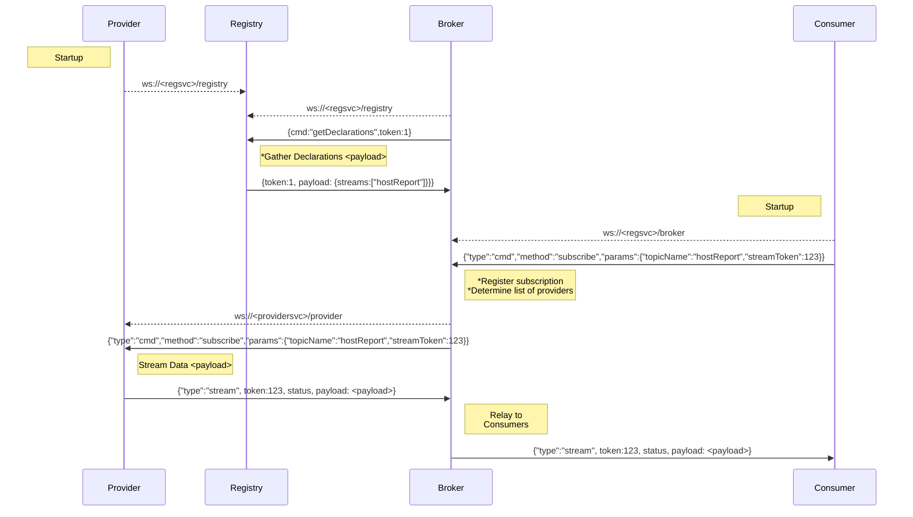
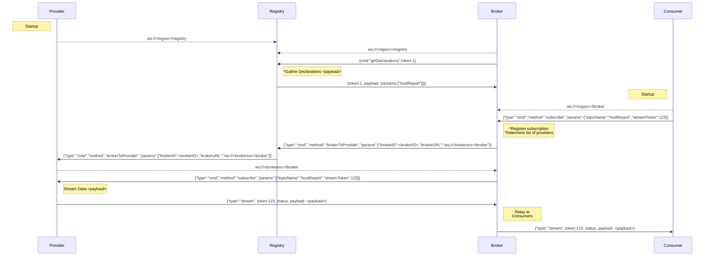

## DRP
Declarative Resource Protocol - a JSON based Websocket subprotocol for declaring and consuming resources.

## Overview
In legacy applications, resource dependencies are often statically defined.  When a new service component is
introduced, DNS, load balancer entries, firewall rules, monitoring, etc must be provisioned.  DRP can reduce
complexity by providing a mechanism for allowing service providers to self-register and dynamically routing
resource requests.

## Goals
* Reduce barriers between resources and consumers
* Minimize infrastructure component requirements
* Reduce complexity involved in implementing HA
* Provide mechanism for resource discovery and structure traversal

## Components
**Registries** - Track and distribute state of providers and their resources<br>
**Providers** - Declare services, objects and streams available for consumption<br>
**Brokers** - Process resource requests and track declarations from consumers<br>
**Consumers** - Client facing applications, monitoring and analytics<br>

## Demo
Checkout repo, change to directory.  Execute the following to start a demo service which provides the Registry, Provider and Broker routes on ws://localhost:8080
```
npm install
node server.js
```

## Sample Provider
This sample will start a Provider which listens on ws://localhost:8081/provider and connects to the Registry on ws://localhost:8080/registry
```
node testProvider.js
```
## Sample Provider - No Listener
This sample will start a Provider which does not listen for connections; it connects directly to Brokers who need it
```
node testProvider-NoListener.js
```

## Sample Client
This sample will start a Consumer which connects to the Broker on ws://localhost:8080/broker and subscribes to the dummy stream
```
node testClient.js
```

## Web UI
Running server.js will also start the rSage web interface on http://localhost:8080 which connects to the Broker on ws://localhost:8080/broker.  Click Go -> Command Testing to see the commands exposed to DRP Consumers.<br>
* **getCmds** - List DRP Consumer commands<br>
* **getRegistry** - Get dump of Registry<br>
* **listServiceInstances** - List Services and which Providers offer them<br>
* ... more ....

## PowerShell PSDrive
Navigate the DRP topology via CLI using the DRPDrive.dll module.  Open a PowerShell session and run the following.
```
cd PSDrive\bin\Debug
Import-Module .\DRPDrive.dll
Connect-DRP -Alias dev -URL ws://localhost:8080/broker
dir drp:\dev
dir drp:\dev\Registry
dir drp:\dev\Providers

# View last 10 messages in a topic
dir drp:\dev\Providers\{providerID}\Streams\dummy\History

# Execute a service command
gi drp:\dev\Services\Greeter\ClientCmds\sayHi

# View list of Consumers
dir drp:\dev\Consumers

# Retrieve HTML document from a consumer web session for debugging
gi drp:\dev\Consumers\{id}\HTMLDocument\children\0\outerHTML

# Execute a command on the consumer web session to RickRoll the user
gi drp:\dev\Consumers\{id}\RickRoll
```


## Stream Subscription


## Stream Subscription (Provider behind firewall or not listening)

