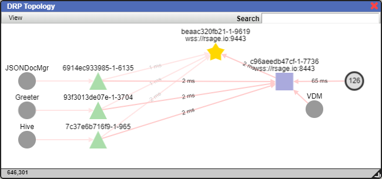
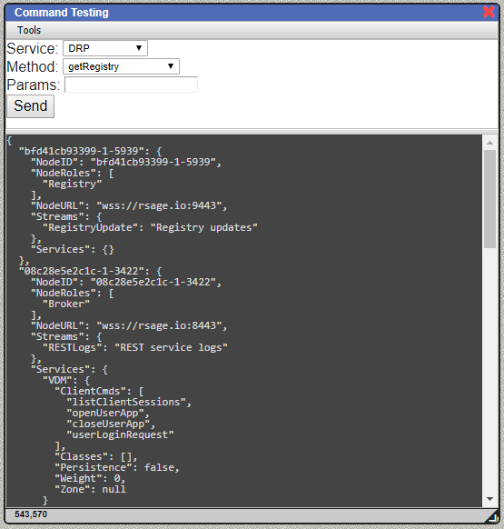
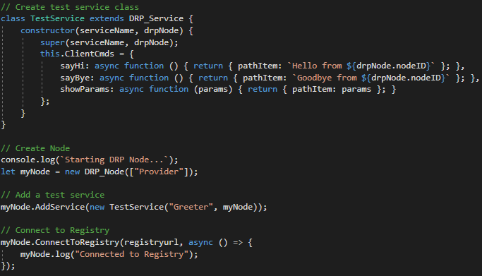
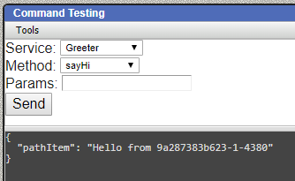
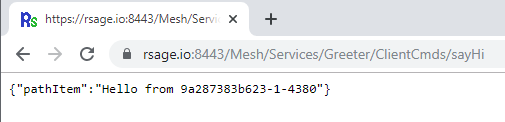
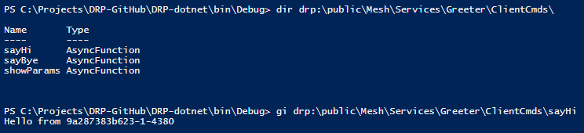
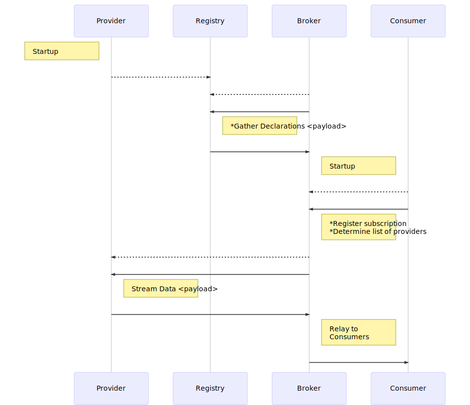
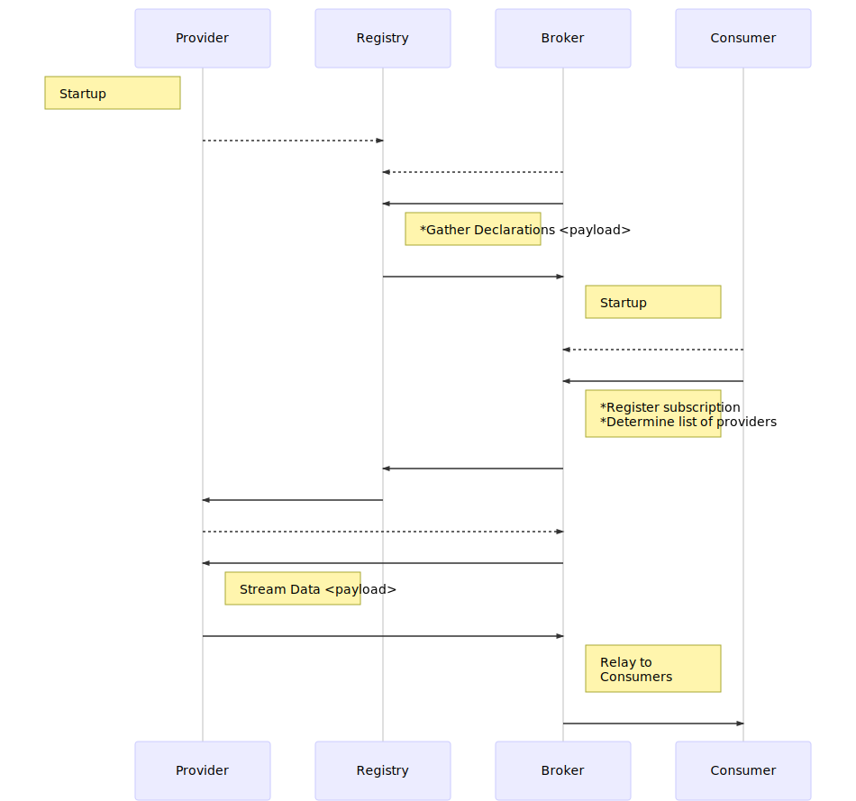

## DRP
Declarative Resource Protocol - a JSON based Websocket subprotocol for declaring and consuming resources.
<br><br>
## Overview
**TLDR - It provides a relatively easy way to create a service mesh. It is intended to be used with infrastructure services.**

In legacy applications, resource dependencies are often statically defined.  When a new service component is
introduced, DNS, load balancer entries, firewall rules, monitoring, etc must be provisioned.  DRP can reduce
complexity by providing a mechanism which allows services to self-register and dynamically routes resource requests.

Mesh solutions such as Istio are very powerful, but tend to have a steep learning curve and can be tricky to set up.
DRP can be thought of as a way to create a "beginner's" mesh.  With the provided samples, anyone with some Node.js
experience should be able to set up a mesh and create a service in a short amount of time.
<br><br>
## Goals
* Reduce barriers between resources and consumers
* Minimize infrastructure component requirements
* Reduce complexity involved in implementing HA
* Provide mechanism for resource discovery and structure traversal
<br><br>

## Mesh Components
|Name|Description|
|---|---|
|Node|Process which communicates using the DRP protocol; has one or more roles|
|Service|Logical unit consisting of RPC methods, streams, object class definitions & object instances|
|Consumer|Web page, script, PowerShell client, etc which makes calls to Broker Nodes|

<br>

## Node Roles
|Name|Description|
|---|---|
|Registry|Node which tracks and distributes state of other nodes and services|
|Provider|Node which offers services for consumption|
|Broker|Node which processes resource requests and tracks declarations from consumers|
|Logger|Node which subscribes to streams (RESTLogs, etc) and writes them to a database|

<br>

## Demo
The public demo is hosted at https://rsage.io.  To run it on your own system, either grab the Docker container or clone this repo.


**Option 1: Docker Container**
```
docker pull adhdtech/drp-nodejs
docker create --name drp-demo -p 8080:8080 -e "PORT=8080" -e "HOSTNAME=localhost" adhdtech/drp-nodejs
docker start drp-demo
```

**Option 2: Git Clone**
```
git clone https://github.com/adhdtech/DRP.git DRP
```

Checkout repo, change to directory.  Execute the following to start a demo node with the Registry and Broker roles on ws://localhost:8080
```
cd DRP-nodejs
npm install
node server.js
```
<br>

## Web UI
Running server.js will also start the rSage web interface on http://localhost:8080 which connects to the Broker on ws://localhost:8080.
<br><br>
## DRP Topology Viewer
In the rSage web interface on http://localhost:8080, Click Go -> DRP Topology to see a map of all nodes currently connected to the mesh.  The direction as well as current latency and uptime for each connection is displayed.

Here is an example from the public demo site.


<br><br>
## Command Testing
Click Go -> Command Testing to see the commands exposed to DRP Consumers.<br>
* **getCmds** - List DRP Consumer commands<br>
* **getRegistry** - Get dump of Registry<br>
* **listServiceInstances** - List Services and which Providers offer them<br>
* ... more ....


<br><br>
## PowerShell PSDrive
You can navigate the DRP topology via CLI using the DRPDrive.dll module.  After cloning the repo, execute the following to connect to the local DRP Broker.

```
# Load PowerShell Provider
cd DRP-dotnet\bin\Debug
Import-Module .\DRPDrive.dll

# Connect to local DRP Broker
Connect-DRP -Alias local -URL ws://localhost:8080

# Connect to public DRP Broker (optional)
Connect-DRP -Alias public -URL wss://rsage.io:8443
```

Now we can poke around and see some of the information available in the mesh.
```
# Dump the Mesh registry
gi drp:\local\Mesh\Registry

# List Services available in Mesh
dir drp:\local\Mesh\Services

# Execute a service command
gi drp:\local\Mesh\Services\JSONDocMgr\ClientCmds\listFiles

# List Streams available in Mesh
dir drp:\local\Mesh\Streams

# Retrieve last 10 messages sent to a stream
gi drp:\local\Mesh\Streams\RESTLogs\{nodeID}\History

# View list of attached Nodes & Consumers
dir drp:\local\Endpoints\Nodes
dir drp:\local\Endpoints\Consumers

# Dump the Mesh Topology
gi drp:\local\NodeObj\RouteHandler\EndpointCmds\getTopology

# Retrieve HTML document from a consumer web session for debugging
gi drp:\local\Endpoints\Consumers\{consumerID}\HTMLDocument\children\0\outerHTML

# Execute a command on the consumer web session to RickRoll the user
gi drp:\local\Endpoints\Consumers\{consumerID}\RickRoll
```
<br>

## Sample Provider
This starts a non-listening sample Provider which connects to Brokers who need to communicate with it
```
node drpProvider-Test-NoListener.js
```

Let's take a look at the relevant code.  In these samples we're creating a simple test service and advertising it to the mesh.



Now let's test the new service

Client|Output
---|---
Web UI|
REST|
PowerShell|

<br>

## Sample Consumer
This sample will start a Consumer which connects to the Broker on ws://localhost:8080 and subscribes to the dummy stream
```
node drpConsumer.js
```
<br>

## Stream Subscription



## Stream Subscription (Provider behind firewall or not listening)

