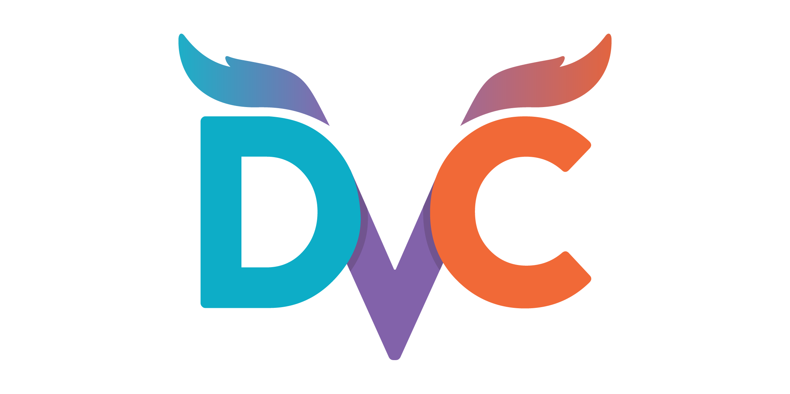

# DVC-CORTX Integration

Check out our video: https://vimeo.com/582351700



Data versioning is crucial for ML projects due to larger, ever-changing datasets, and how increasingly common it is that many people are working on the same ML project at the same time.

CORTX, a mass object storage solution, acts as a reliable store for different versions of datasets in a ML project, making it easy to revert and checkout dataset changes, and ensuring that every person working on an ML project has the same.

For demo purposes, we only showed DVC's data versioning functionality. DVC also offers other functionalities such as pipelining, hyperparameter tuning and experiment tracking. Feel free to learn more about DVC [here](https://dvc.org/doc/start).

## 1. Install DVC

Follow the steps at https://dvc.org/doc/install

## 2. Initialize Git and DVC repository

```
git init
dvc init
git commit -m "Init DVC"
```

## 3. Track dataset versions with DVC

```
# Download example dataset
dvc get https://github.com/iterative/dataset-registry get-started/data.xml -o data/data.xml

# Add (not push yet) data.xml to DVC
dvc add data/data.xml

# Add metadata to Git repository
git add data/data.xml.dvc data/.gitignore
git commit -m "Add raw data"
```

## 4. Add CORTX as the dataset storage backend for DVC

```
dvc remote add -d cortx s3://bucketName
dvc remote modify cortx endpointurl http://endpointUrl
dvc remote modify cortx access_key_id AKIAtEpiGWUcQIelPRlD1Pi6xQ
dvc remote modify cortx secret_access_key YNV6xS8lXnCTGSy1x2vGkmGnmdJbZSapNXaSaRhK
```

## 5. Push dataset into CORTX with DVC

```
dvc push
```

## 6. When you make changes on the dataset...

```
# Push it to DVC again; it will NOT overwrite your previous dataset versions
dvc add data/data.xml
git commit data/data.xml.dvc -m "Dataset Updates" # Push metadata to Git so everyone knows the dataset version to use
dvc push
```

Contributors to the same ML project can then run `dvc pull` to get access to the latest version of the dataset that you pushed.

## 7. When you want to switch to a different dataset version, e.g. to revert...

```
git checkout <e.g. older commit with an older .dvc file version>
dvc checkout # Checkout the dataset version in that older commit
```

Tested by:

- Dec 13, 2021: Harrison Seow (harrison.seow@seagate.com) using Cortx OVA 1.0.3 running on CloudShare on Windows Server 2019.
