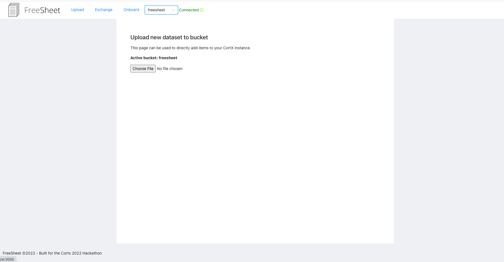

    

FreeSheet
--

Effortlessly move and onboard csv data between Cortx and IPFS into autogenerated starter Jupyter lab notebooks.

Built for the CortX 2022 hackathon on devpost: https://seagate-cortx-hackathon2022.devpost.com/

Demo (youtube): <a href="https://youtu.be/tK_bkdXqsmw" target="_blank">https://youtu.be/tK_bkdXqsmw</a>

## Inspiration

There are not a lot of great web tools that support moving between a hosted s3 instance and IPFS. I wanted to build a prototype app that made it easy to transfer csv data between IPFS and S3, and immediately import that data into a functioning jupyter notebook directly from a web interface.

## What it does

FreeSheet is an app to help you manage the world of IPFS-hosted data sets and authorized AWS Cortx instances effectively from a web UI.

FreeSheet also 'onboards' any of your files into dynamically generated jupyter notebooks so you can start working with that data immediately.

<b>FreeSheet supports three main actions:</b>

* Upload - Upload a csv of data either directly to your CortX instance or IPFS.
* Exchange - push data sets effortlessly from your Cortx or AWS-hosted node to IPFS.
* Onboard - Onboard your IFPS data sets immediately into runnable starter Jupyter notebooks.

## Running the project

FreeSheet requires both the front and backend service to be running with the access keys below available.

### Client
Define the following environment variables:
<pre>
    REACT_APP_STORAGE_KEY={YOUR WEB3 STORAGE KEY} # For connecting/uploading to IPFS.
</pre>

Generate a web3.storage key <a href="https://web3.storage/" target="_blank">here</a>!

From the root folder:
`yarn; yarn start`

The client (website) should now be running on port 3000.

### Server
Define the following environment variables:
<pre>
    FS_S3_URL={YOUR AWS S3 SERVER URL} #  (ex: on seagate/cortx)
    FS_ACCESS_KEY={YOUR AWS ACCESS KEY} # cortx access key (for use with s3 sdk)
    FS_SECRET_KEY={YOUR AWS SECRET KEY} # cortx secret key (for use with s3 sdk)
</pre>

From the `/server` folder:
`yarn; yarn start`

The server should now be running on port 3001.

You can also create a bucket in your conncted CortX instance using the command:
`yarn create`

#### Verifying the end-to-end connection

If the front end is able to successfully connect to your running CortX or S3 instance, you should see a 'Connected' indicator here with the ability to select a bucket from the dropdown here. If you are not connected, a 'Not connected' indicator will show.

After this, you're ready to use FreeSheet as an interface to S3 and IPFS!

## How we built it

* ReactJS
* AWS sdk with Cortx
* Node.js / Fastify

## Challenges we ran into
* Integrating csv upload with the different data sources.
* Creating a simple interface
* Plugging in variable data source urls into pre-generated notebooks

## Accomplishments that we're proud of
It works.

## What we learned
* How to connect to a running CortX instance
* Dynamically generate a Python notebook from an arbitrary hosted data URL.
* Manage file uploads with Fastify (Node.js)

## Potential future work.

* Extend the autogenerated python utilities and code based on uploaded data sets.
* Push back data from IPFS into your S3 service.
* Perform pre-built visualizations of uploaded data sets within the FreeSheet app.
* Production hosting as a service (requires secure connections to your cortx/seagate system), or clone this repo and use it as a tool to connect to your S3 or CortX instance locally or within your private corporate network.

## Screenshots

#### Home page

#### Upload to CortX / S3

#### Exchange between CortX and IPFS

#### Onboard dataset to python notebook from the app

#### Auto-generated python notebook

<!--
## Useful links
* https://github.com/Seagate/cortx/tree/main/cortx-s3samplecode
-->

