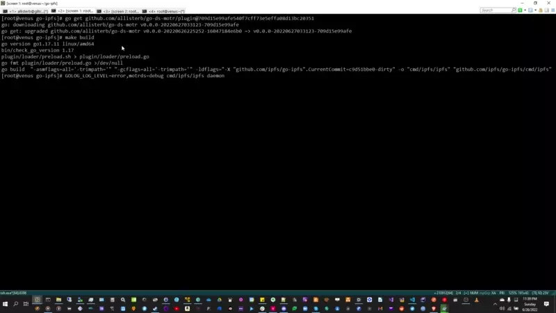

# Background
The current CORTX [integration](https://github.com/Seagate/cortx/tree/main/doc/integrations/ipfs) with IPFS relies on the IPFS [S3 data store plugin](https://github.com/ipfs/go-ds-s3) talking to the S3 object storage REST API implemented by the CORTX [RADOS Gateway](https://github.com/Seagate/cortx-rgw) (RGW) server. This isn't a very efficient design for several reasons. RGW implements a distributed object storage service oriented around objects and buckets and exposing S3-compatible and [Swift-compatible](https://docs.openstack.org/swift/latest/) REST APIs to clients relying on HTTP as the network transport.

*Basic S3 server architecture. From: [Seagate | Meet the Architect – CORTX MOTR](https://www.youtube.com/watch?v=EjL2fRdAy6M)*

IPFS however implements its own object storage scheme using [content addressing](https://docs.ipfs.io/concepts/content-addressing/), [CIDs](https://proto.school/anatomy-of-a-cid) and [Merkle DAGs](https://proto.school/merkle-dags) to store structured hierachical object data. 

*Storing a folder and files as a Merkle DAG.  From: [Introducing Merkle DAGs](https://proto.school/merkle-dags/04)*.

Each node in an IPFS object graph is identified by a CID and persisted to storage as an immutable block using a a simple pluggable key-value [data store](https://github.com/ipfs/go-datastore) interface. 

*Storing  IPFS data using key-value data stores. From: [A Technical Guide to IPFS](https://www.freecodecamp.org/news/technical-guide-to-ipfs-decentralized-storage-of-web3/)*

Several [implementations](https://github.com/ipfs/go-ipfs/tree/master/plugin/plugins) of this data store interface have been developed inluding those using the [LevelDB](https://github.com/google/leveldb) and [BadgerDB](https://github.com/dgraph-io/badger) key-value stores. 

The on-disk storage and persistence layer in IPFS is thus optimized for simple, fast, key-value stores, not full-blown distributed object storage solutions like RGW and S3. Since the RGW server uses its own storage scheme and ultimately talks to the CORTX Motr key-value, using the RGW object storage service as a data store for IPFS CIDs involves multiple levels of redundancies. In addition the IPFS S3 plugin only exposes [configuration](https://github.com/ipfs/go-ds-s3#configuration) for a generic S3 server i.e. bucket name, acccess key etc...there is no way for an IPFS server to expose or consume CORTX-specific configuration for data storage.

The best way for IPFS and Filecoin to take full advantage of the capabilities and scalability of CORTX would be to integrate IPFS directly with the Motr key-value store. This would remove the overhead of making HTTP REST calls and uploads for IPFS data storage and eliminate the need to run a CORTX RGW server node, improving performance and scalability and simplifying deployment of CORTX-integrated IPFS servers considerably 


# About
[](https://youtu.be/xE5IcISQWIY)

*(Click above for YouTube video)*

go-ds-motr is a IPFS [data store plugin](https://github.com/ipfs/go-datastore) implementation that uses the Go bindings to the CORTX [Motr C API](https://github.com/Seagate/cortx-motr/blob/main/doc/motr-developer-guide.md) to store IPFS data directly in indexes in the Motr key-value store. This allows IPFS servers to use the full capabilities and scalability of CORTX, instead of relying on a generic S3 REST API and HTTP calls. go-ds-motr stores and retrieves IPFS blocks from Motr using the native Motr client API when requested by the other IPFS subsystems using Motr key ids derived from the IPFS CIDs. go-ds-motr can consume CORTX-specific configuration and parameters specified via the IPFS configuration file and can access the full range of native functionality exposed by the Motr client API.

In simple benchmarks go-ds-motr is vastly more performant than the S3 data store plugin, achieving at least a 13x speedup for IPFS file add operations:
#### Adding 93Mb file to IPFS using S3 data store from cold start:
```cmd
[root@cortx-ova-rgw go-ds-motr]# time ../go-ipfs/cmd/ipfs/ipfs add "01 Track01.flac"                                                                                                           
added QmXUdQD5gHs483TCYFTEgFsve4J1sgfM4FGs9XLZzE3obv 01 Track01.flac                                                                                                                           
 93.83 MiB / 93.83 MiB [=======================================================================================================================================================================
======================] 100.00%                                                                                                                                                                
real    1m20.728s                                                                                                                                                                              
user    0m0.437s                                                                                                                                                                               
sys     0m0.334s                                                                                                            
```
#### Adding 93Mb file to IPFS using go-ds-motr from cold start:
```cmd
[root@venus go-ds-motr]# time ../go-ipfs/cmd/ipfs/ipfs add "01 Track01.flac"                                                                                                                   
added QmXUdQD5gHs483TCYFTEgFsve4J1sgfM4FGs9XLZzE3obv 01 Track01.flac                                                                                                                           
 93.83 MiB / 93.83 MiB [==============================================================================================================================================================] 100.00%
real    0m6.308s                                                                                                
user    0m0.615s                                                                                             
sys     0m0.117s
```

# Implementation
See [here](Implementation.md).


# Requirements
1. Access to a Motr cluster and the `motr-devel` package installed. See the CORTX [repo](https://github.com/Seagate/cortx/releases).
2. Go 1.17. See the official Go [site](https://go.dev/doc/install) for download and install instructions.

# Installation
1. Clone the go-ipfs repository: `git clone https://github.com/ipfs/go-ipfs.git`
2. Checkout v0.13.0 of the code: `cd go-ipfs &&  git checkout tags/v0.13.0`
3. Add the following line to the `plugin/loader/preload.list` file: `motrds github.com/allisterb/go-ds-motr/plugin *`. This tells the build system to build the go-ds-motr plugin together with the other plugins specified when building go-ipfs.
4. Get the Go go-ds-motr module code from GitHub: `go get github.com/allisterb/go-ds-motr/plugin@HEAD`.
5. Build go-ipfs: `make build`. This will create the ipfs executable at `cmd/ipfs/ipfs` in your `go-ipfs` directory.
6. Initialize your IPFS repository: `cmd/ipfs/ipfs init`. This will create an `.ipfs` directory in your `$HOME` directory with your IPFS server configuration.
7. Edit the `config` JSON configuration file In your `$HOME/.ipfs` directory. Change the `Spec` key to the following structure:
    ```json
    "Spec": {
              "child": {
                "haxAddr": "inet:tcp:192.168.1.161@22001",
                "index": "0x7800000000000123:0x123456780",
                "leveldbPath": "/home/allisterb/.leveldb/ipfs",
                "localAddr": "inet:tcp:192.168.1.161@22501",
                "processFid": "0x7200000000000001:0x3",
                "profileFid": "0x7000000000000001:0x0",
                "type": "motrds"
              },
              "prefix": "motr.datastore",
              "type": "measure"
            },
    ```
    Set `haxAddr`, `localAddr`, `profileFid`, `processFid`, `index`, to your Motr HA endpoint address, local endpoint address, cluster profile FID, local process FID, and Motr key-value index name respectively. Set `levelDBPath` to the path where the LevelDB key index will be stored on-disk e.g. `$HOME/.leveldb/ipfs`. An example `config` file using the go-ds-motr plugin is [here](https://github.com/allisterb/go-ds-motr)
8. Edit the `datastore_spec` file in your `$HOME/.ipfs` folder and replace with the following text:
```json 
{"haxAddr":"inet:tcp:192.168.1.161@22001","index":"0x7800000000000123:0x123456780","leveldbPath":"/home/allisterb/.leveldb/ipfs","localAddr":"inet:tcp:192.168.1.161@22501","processFid":"0x7200000000000001:0x3","profileFid":"0x7000000000000001:0x0"}
```
Enter the configuration values just as you entered for the `.config` file. A sample IPFS `datastore_spec` file is [here](https://github.com/allisterb/go-ds-motr/blob/master/config_example/datastore_spec).

9. To test these values before starting the server, clone `https://github.com/allisterb/go-ds-motr` and run the CLI commands to test access to the store e.g:
` ./run.sh store -L inet:tcp:192.168.1.161@22501 -H inet:tcp:192.168.1.161@22001 -P 0x7200000000000001:0x3 -C 0x7000000000000001:0x0 0x7800000000000123:0x123456780 foo bar`
will store the value `bar` for the key `foo` in the Motr  index `0x7800000000000123:0x123456780`
```cmd
[allisterb@mars go-ds-motr]$ ./run.sh store -L inet:tcp:192.168.1.161@22501 -H inet:tcp:192.168.1.161@22001 -P 0x7200000000000001:0x3 -C 0x7000000000000001:0x0 0x7800000000000123:0x123456780 foo bar
   ____                   ____                  __  __           _
  / ___|   ___           |  _ \   ___          |  \/  |   ___   | |_   _ __
 | |  _   / _ \   _____  | | | | / __|  _____  | |\/| |  / _ \  | __| | '__|
 | |_| | | (_) | |_____| | |_| | \__ \ |_____| | |  | | | (_) | | |_  | |
  \____|  \___/          |____/  |___/         |_|  |_|  \___/   \__| |_|

2022-06-24T15:19:03.979-0400    INFO    CLI     go-ds-motr/main.go:93   Initialized Motr client.
2022-06-24T15:19:03.979-0400    INFO    CLI     go-ds-motr/main.go:98   initialized Motr key-value index 0x7800000000000123:0x123456780.
2022-06-24T15:19:03.985-0400    INFO    CLI     go-ds-motr/main.go:178  Put object at key foo in index 0x7800000000000123:0x123456780
[allisterb@mars go-ds-motr]$ ./run.sh store -L inet:tcp:192.168.1.161@22501 -H inet:tcp:192.168.1.161@22001 -P 0x7200000000000001:0x3 -C 0x7000000000000001:0x0 0x7800000000000123:0x123456780 foo -s
    ____                   ____                  __  __           _
  / ___|   ___           |  _ \   ___          |  \/  |   ___   | |_   _ __
 | |  _   / _ \   _____  | | | | / __|  _____  | |\/| |  / _ \  | __| | '__|
 | |_| | | (_) | |_____| | |_| | \__ \ |_____| | |  | | | (_) | | |_  | |
  \____|  \___/          |____/  |___/         |_|  |_|  \___/   \__| |_|

2022-06-24T16:40:15.926-0400    INFO    CLI     go-ds-motr/main.go:93   Initialized Motr client.
2022-06-24T16:40:15.927-0400    INFO    CLI     go-ds-motr/main.go:98   initialized Motr key-value index 0x7800000000000123:0x123456780.
2022-06-24T16:40:15.961-0400    INFO    CLI     go-ds-motr/main.go:214  The size of object at key foo in index 0x7800000000000123:0x123456780 is 3.
```
10. If you need to create the Motr index you can do that from the CLI too:
```cmd
[allisterb@mars go-ds-motr]$ ./run.sh index -L inet:tcp:192.168.1.161@22501 -H inet:tcp:192.168.1.161@22001 -P 0x7200000000000001:0x3 -C 0x7000000000000001:0x0 0x7800000000000123:0x123456780 --create
   ____                   ____                  __  __           _
  / ___|   ___           |  _ \   ___          |  \/  |   ___   | |_   _ __
 | |  _   / _ \   _____  | | | | / __|  _____  | |\/| |  / _ \  | __| | '__|
 | |_| | | (_) | |_____| | |_| | \__ \ |_____| | |  | | | (_) | | |_  | |
  \____|  \___/          |____/  |___/         |_|  |_|  \___/   \__| |_|

2022-06-25T14:28:51.766-0400    INFO    CLI     go-ds-motr/main.go:121  Initialized Motr client.
2022-06-25T14:28:51.766-0400    INFO    motrds  mio/mkv.go:95   Creating index 0x7800000000000123:0x123456780...
2022-06-25T14:28:51.768-0400    INFO    CLI     go-ds-motr/main.go:231  Created or opened existing Motr key-value index 0x7800000000000123:0x123456780.
```                                                                                                                                                                                          
11. Set the [UDP receive buffer size](https://github.com/lucas-clemente/quic-go/wiki/UDP-Receive-Buffer-Size) to 2500000 to avoid [this warning message](https://discuss.ipfs.io/t/docker-failed-to-sufficiently-increase-receive-buffer-size/12498) when starting IPFS: `sudo sysctl -w net.core.rmem_max=2500000`
 
12. When everything is ready, start the IPFS server: 
`GOLOG_LOG_LEVEL=error,motrds=debug cmd/ipfs/ipfs daemon`.
This will start the go-ipfs server with the default logging level set to only print errors except for the motrds plugin which will be logging in debug mode.

You should see diagnostic messages from the motrds plugin indicating it initialized successfully and is handling queries and requests for data from IPFS.

# Benchmarking
You can run `benchmark.sh` from the go-ds-motr repo to get a idea of how performant the data store is:


# Known issues
See: https://github.com/Seagate/cortx-motr/issues/1960