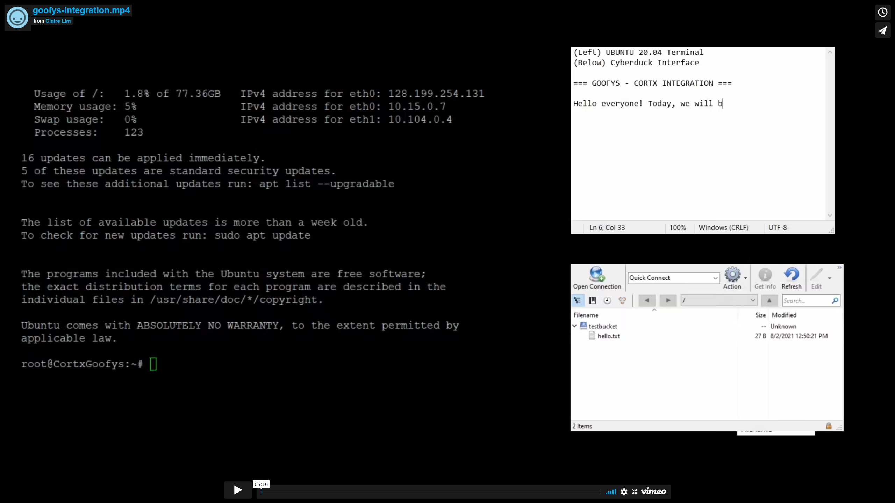

# Goofys/CORTX

## Step-By-Step Video

[](https://vimeo.com/581988233)


## What is Goofys?

[goofys](https://github.com/kahing/goofys) lets us mount S3 and S3-compatible storage buckets as a filesystem. Hence, using goofys, we are able to create a folder on our own machine that automatically 'syncs' with our CORTX buckets.

## Integration Value

This integration up lots of opportunities for CORTX to integrate with other software and utilities that do not offer an S3 API interface and requires to interact with data in filesystems. An example includes proof-of-storage blockchain mining.

## Installation 

We created a [convenience script](./goofys-cortx-setup.sh) that creates a folder `/root/shared` that will be used to mount your CORTX bucket. Simply carry out the following command:

**Note**: _Tested working Go version 1.16_

```sh
# download to our convenience script to your system
wget https://raw.githubusercontent.com/c-l-j-y/cortx/main/doc/integrations/goofys/goofys-cortx-setup.sh

# run the script with 4 arguments as listed below
sh goofys-cortx-setup.sh <cortx-endpoint-url> <bucket-name> <aws-access-key-id> <secret-access-key>
```

For detailed integration steps, do check out our 5-minute [step-by-step video]() which explains all the steps we have listed in our convenience script.

## Done By

Team Zelda:

- Claire Lim
- Xenon Ng
- Tan Ziheng

If there are any questions, do not hesitate to contact our team at clairelimjiaying@ntudsc.com.


Tested by:

- Dec 24, 2021: Bo Wei (bo.b.wei@seagate.com) using Cortx OVA 2.0.0 as S3 Server.

- Nov 30, 2021: Harrison Seow (harrison.seow@seagate.com) using Cortx OVA 2.0.0 running on VMware Workstation Player 16 on Windows 10.


