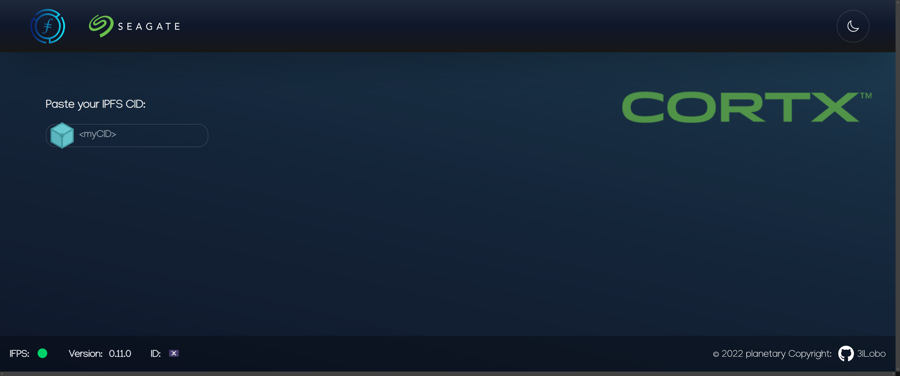
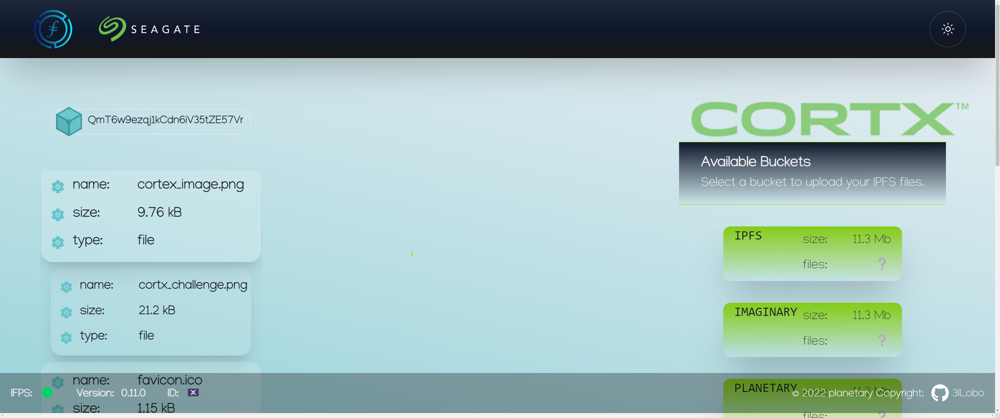
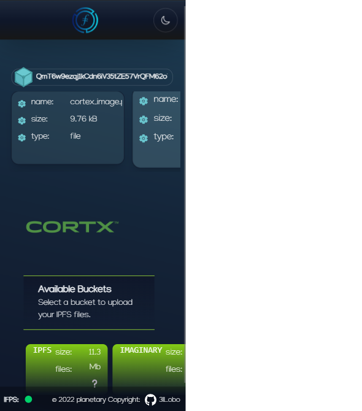
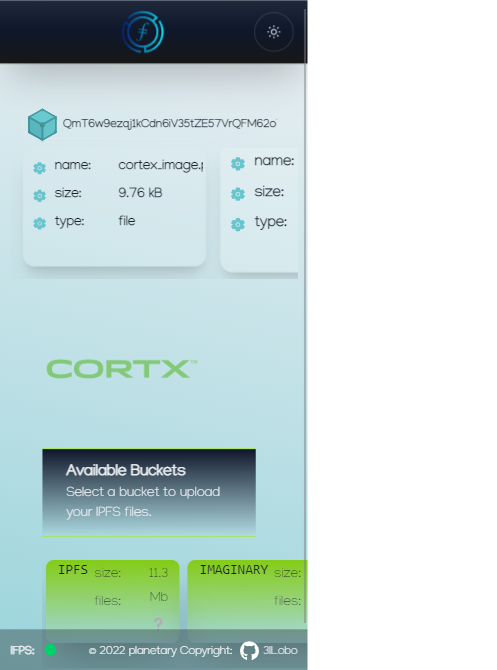

### IPFS 2 Cortx Bridge

This web(3) app provides a bridge between IPFS with it's incentive-layer blockchain FileCoin and the massive data-storage system CORTX. You can see a demo video here: 


The underlying API and state-manager unifies interaction with the IPFS network and the S3 interface of a CORTX cluster.

Once logged in, the user can download files from IPFS using the CID, then chose an existing bucket from the Cortx cluster and upload.
The mayor contribution of this app is to facilitate the file transfer between IPFS and Cortx through a flexible yet stable API. Additional we provide a UI/UX to facilitate usability for the zero-coding target group. This app is inclusive, mobile and available for everyone.




Main Features:

- Inspect CID content if available ✅
- Fetch data from IPFS through the CID ✅
- Deploy to CORTX file-system using the S3-interface ✅
- List deployed files from CORTX file-system ✅
- Mobile friendly interface ✅
- Authenticate using FileCoin 📦
- Cache user-specific S3-endpoint 📦
- Invert bridge 📦

Dynamically hosted:
[Netlify Demo](https://cortxportal.netlify.app/)

Static hosted on IPFS by Fleek:
[InterPlanetary Demo](https://cortxbridge.on.fleek.co/)

_These demos use a mock-ip server response as they are not connected to a CORTX cluster._

## How-to use 🚀

To njoy the full functionality, the frontend requires a connection to both a CORTX cluster and an IPFS node. The latter running on the same localhost.

Follow these steps:

- Download the [OVM image](https://github.com/Seagate/cortx/blob/main/doc/ova/2.0.0/PI-6/CORTX_on_Open_Virtual_Appliance_PI-6.rst)
- Power it up as VM instance.
- Set up the [S3-interface on your VM instance](https://github.com/Seagate/cortx/blob/main/doc/ova/2.0.0/PI-7/S3_IO_Operations.md)
- Log in with root privileges

Assuming the VM instance and your localhost are on the same network, get the local ip address of your OVM server:

```bash
hostname -I | awk '{print $1}'
```

This IP will serve as your endpoint.
Next find the open HTTP port (`30518` on my machine) by running:

```bash
kubectl describe svc cortx-server-loadbal-svc-cortx-ova-rgw -n cortx |grep NodePort:
```

Now edit your `.env` file. Fill in the retrieved port and IP as endpoint

Check if your instance time is aligned with the time on your localhost:

```bash
date -u
```

If not, reboot your OVM instance:

```bash
reboot now
```

check if the instance is ready to connect:

```bash
hctl status
```

Next on your localhost, inside the [root folder][./] install all dependencies and start the development server:

```bash
yarn && yarn dev
```

In a separate terminal, spin up an IPFS node:

```bash
ipfs daemon
```

To interact with the frontend:

- input CID in designated field
- select/deselect file/s by clicking
- select bucket if available
- selected files are uploaded recursively

Make sure your CORTX cluster is running and available. In case of [cloudshare](https://use.cloudshare.com/Authenticated/Landing.aspx?s=1), adjust the endpoint and make sure the port is open.

## Architecture

Mayor part of this repo contains frontend resources, yet the underlying Redux architecture can be used in any other `Node.Js` project.
The Redux API and state manager is located in [/app](./app). It runs on the client-side and manages:

- State of:
  - IPFS:
    - Current CID
    - Files downloaded from IPFS
    - User selection/deselection
  - CORTX:
    - Cluster connection
    - Available buckets
    - Files and size of selected bucket
    - Upload status
- API requests:
  - S3 interaction:
    - List buckets
    - List files in bucket
    - Upload a file to a bucket

The API requests are forwarded to a ServerSide endpoint which is located in [/pages/api](./pages/api). The reason herefore is twofold:

- the endpoint and login information stored as environment variables are not accessible to the client side.
- The ServerSide endpoint can receive S3 responses without signed-header authentication, which would get blocked by most browsers CORS policy.

## Resources

Links to resources which proved useful for the scope of this project:

### JS tech-stack

[CORTX](https://github.com/Seagate/cortx)

[AWS for React](https://docs.aws.amazon.com/sdk-for-javascript/v3/developer-guide/getting-started-react-native.html)

[Redux toolkit](https://redux-toolkit.js.org/)

[Redux RTK](https://redux-toolkit.js.org/rtk-query/overview)

### Design

[IPFS color pallette](https://github.com/ipfs-shipyard/ipfs-css/blob/main/theme.json#L2)

[CORTX branding](https://branding.seagate.com/documentpreview/b2b83d31-af68-4cd8-a6b0-3d226a92d609)

[Tailwind animations](https://www.devwares.com/blog/create-animation-with-tailwind-css/)

## IPFS

This project offers two options for the IPFS client.
The deployed version of this app uses a browser side IPFS client since not every user is expected to run a IPFS node. This option is slower and less stable.
For localhost users, a running IPFS daemon on port `:5001` is a requirement.

[IPFS client](https://github.com/ipfs/js-ipfs/tree/master/packages/ipfs-http-client)

[IPFS hooks](https://github.com/ipfs-examples/js-ipfs-examples/blob/master/examples/browser-create-react-app/src/App.js)

## S3

Useful take-aways 🥡

- bucket names must be lowercase.
- the clusters CORS policy can be updated using Callbacks
- CORS policy can be updated like [this](https://docs.amazonaws.cn/en_us/AmazonS3/latest/userguide/ManageCorsUsing.html)

## Copy left & right ⬅️➡️

You know how it worqs: `Ctrl + c` and `Ctrl + v`.

Would be charming if you mention the source and give this repo a ⭐

## Mobile View




<!-- ### OVM S3

Follow [these steps]() to init/test S3 on your VM.

Get the local ip address of your OVM server:

```bash
hostname -I | awk '{print $1}'
```

Get the port to connect to:

```bash
kubectl describe svc cortx-server-loadbal-svc-cortx-ova-rgw -n cortx |grep NodePort:
```

My machine 30518 for http -->
