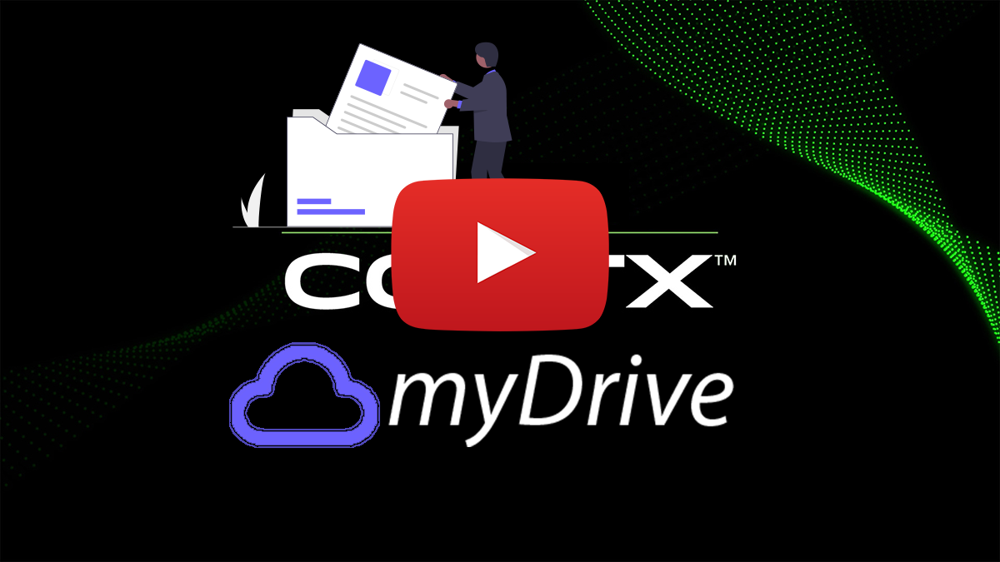
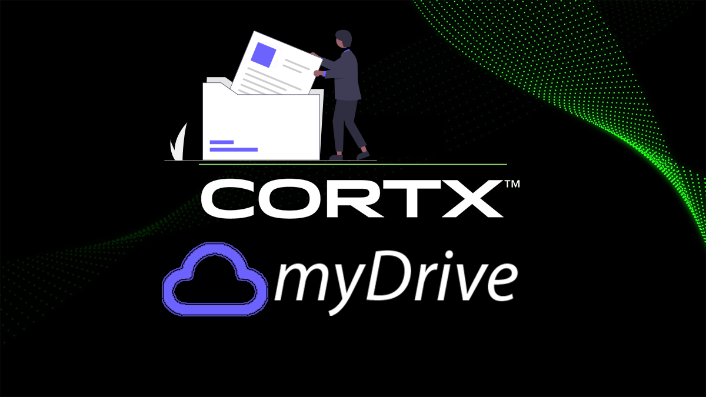

## Cortx-MyDrive is a free Open Source Cloud Server (Similar To Google Drive) integrated with CORTX engine

Notice ❤: this integration is heavily based on [cortx-js-sdk](https://github.com/kaminskypavel/cortx/blob/main/doc/integrations/cortx-js-sdk
), for more info click on the image below, which I also implemented as part of this integration, but published as a different integration 
for making the life of future developers easier.

[](https://github.com/Seagate/cortx/blob/main/doc/integrations/cortx-js-sdk)


## Youtube Demo
[](https://youtu.be/iegzyHMiqfw)

##### Host myDrive on your own server or trusted platform, and then access myDrive through your web browser.
----
## Screenshots

- ## upload documents


- ## download documents


- ## built in player


- ## search for documents


## Problem

In this day and age, privacy and "owning" your own information - matters!
Enterprises may choose a self hosted solutions for a well known software , and some  might go as far as hosting their own servers and infrastructure.

## Solution 
# 

We provide a self hosted solution for a remote data drive similar to "Google Drive" and "Dropbox",
which can be useful both on an enterprise and a personal level

## Technology 

- The project is base on the popular open source project [myDrive](https://mydrive-storage.com/) who received over 2000+ stars.

[](https://GitHub.com/subnub/myDrive/stargazers/) 

- myDrive's code was integrated with `cortx-js-sdk` so all file uploads are stored on **CORTX object store**

## Instruction

1. checkout the code from the repository 
   
   ```git clone https://github.com/kaminskypavel/cortx-js-myDrive```

2. install dependencies
   
   ```yarn```
   
3. make sure you're running a mongodb instance. you can run a local copy or use 
   
   ```docker run -it -v mongodata:/data/db -p 27017:27017 --name mongodb -d mongo```

4. create db indexes ```yarn run create-indexes-database```

5. copy ```config/dev.env.sample``` to ```config/dev.env``` and fill in the S3 relevant ID , KEY , ENDPOINT etc..

6. run it! 
   
   ```yarn start:dev```
   
7. point your browser to ```http://localhost:3000```


