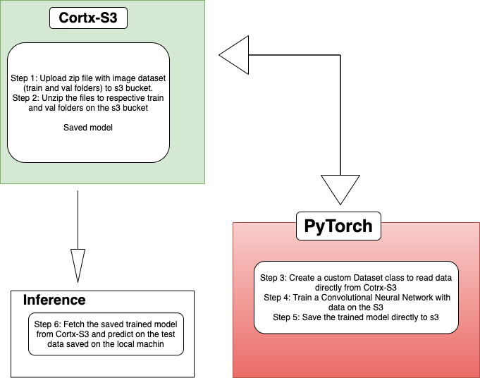
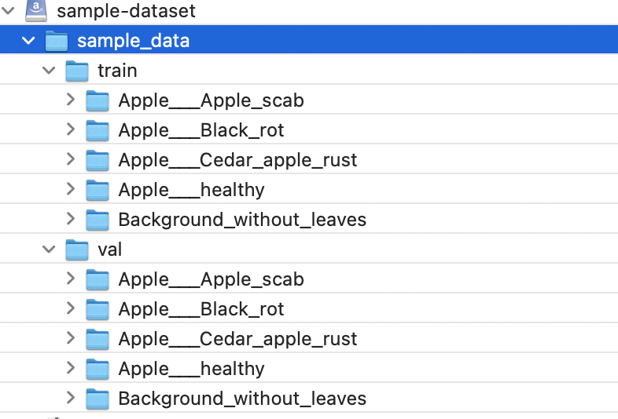

## Integrating Cortx and PyTorch
<br>
<br>

<p align="center">
  
</p>

<br>
<br>

#### PyTorch
[PyTorch](https://pytorch.org/) is an open-source deep learning framework that provides graph-based execution, distributed training, mobile deployment, quantization, developing neural network models.

#### Cortx
[CORTX](https://www.seagate.com/em/en/products/storage/object-storage-software/) is a distributed object storage system designed for great efficiency, massive capacity, and high HDD-utilization. CORTX is 100% Open Source.


#### Why Integrate PyTorch to Cortx
In the 21st century, there has been an increase in applications of deep learning, from finance, health, self-driving cars, etc. Most of these applications require massive datasets to be efficient. Hosting the data becomes expensive. Currently, with the help of  Cortx, you can host massive data from different sources, reducing the cost.


#### Integration Process.

<p align="center">
  
</p>

For this integration, the training of the deep learning model is performed on the CPU. Therefore I’ll use a sample dataset with 5 classes, then train for 1 epoch. The data is stored in Cotrx-S3 and integrated via a custom PyTorch Dataset Loader to pass through to a Convolutional Neural Network for Multi-class classification.
Data on s3 using cyberduck.


<p align="center">
  
</p>


Step 1: Install Cortx OVA on virtual box following these [guidelines](https://github.com/Seagate/cortx/blob/main/doc/OVA/1.0.4/CORTX_on_Open_Virtual_Appliance.rst):

Step 2: Set up Cortx-S3 account via the Cortx GUI dashboard to generate the access and secret key.

Step 3: Data Preprocessing:

- Follow the instruction on this [noteboook](https://github.com/r-wambui/cortx/blob/ft-integrate-cortx-and-pytroch/doc/integrations/pytorch/Cortx-PyTroch%20Integration%20-%20%201-Data%20Preprocessing.ipynb)  to create, list, delete a bucket, upload a file.

```
endpoint_url="http://ens34 ip address"
aws_access_key_id = "provided on Step 2"
aws_secret_access_key = "provided on Step 2"
```


Step 4: Loading the data from Cortx s3 to PyTorch Dataset Loader:

- Follow the setup on this [notebook](https://github.com/r-wambui/cortx/blob/ft-integrate-cortx-and-pytroch/doc/integrations/pytorch/Cortx-PyTroch%20Integration%20-%20%202%2C%20Loading%20%20Data%20from%20Cotrx-S3%20and%20Train%20the%20model.ipynb) 
- This is the main step when integrating to PyTorch. Currently, PyTorch does not have pre-existing Dataset Loaders to fetch data from S3. Therefore you need to create a custom Dataset class
```
    class ImageDataset(Dataset):
        def __init__, 
        
        def __len__,
        
        def __getitem__
```
- Use boto3 to fetch the image from the bucket, OpenCV to read the images, then convert to PIL images which is the required format by PyTorch.

```img_name = my_bucket.Object(key).get().get('Body').read()
   image = cv2.imdecode(np.asarray(bytearray(img_name)), cv2.COLOR_BGR2RGB)
   image = Image.fromarray(image)
   ```
- Use the s3fs library for listdir(), listfiles() etc. S3 buckets do not have folder structures. s3fs make it easier to maintain the folder structure.


Step 5: Save the trained model directly to Cortx-S3:
- I do not save the model to my local machine first then upload it but saving directly to s3. We're minimizing using the local storage at all costs.


Step 6: Load the saved model from Cortx-S3 - Inference.
- Follow the guideline on this [notebook](https://github.com/r-wambui/cortx/blob/ft-integrate-cortx-and-pytroch/doc/integrations/pytorch/Cortx-PyTroch%20Integration%20-%20%203%2C%20Load%20trained%20model%20from%20Cotrx-S3%20for%20Inference%20.ipynb)
- After training any machine learning model, the next step is to evaluate how your model performs on the test data. 
For this setup, the test images on the local storage. You can save them to Cortx s3 and load them directly from there as we did on the train and validation images.


Step 7: Experiment!!!:
 - Integrate different PyTorch models to Cortx and see how they perform.
 

### Demo
- [Quick demo video](https://vimeo.com/542200459)
- [Detailed video which describes the entire integration process.](https://vimeo.com/542193184)

#### Contributors:
- Rose Wambui


