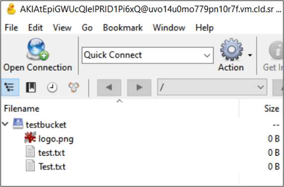

# Raspberry Pi Samba Server


[Integration video link](https://vimeo.com/582170955)

## Introduction
With a Raspberry Pi, Samba and CORTX, this integration lets you create your NAS server (to serve network-wide files) cheaply, and automatically syncs with your CORTX storage.

What is NAS?:
> Network attached storage allows you to share files from one, always-on device throughout your house. With a NAS on your network, you can use it to store your movies and play them from multiple Kodi boxes, store backups on it from your PC, or use it as a BitTorrent box that seeds your files 24/7.

## Architecture


## Setup

1. Setup RPi

Download RPI OS and BalenaEtcher.

Run `sudo apt-get update && sudo apt-get upgrade`

2. Setup Samba

Run `sudo apt install samba samba-common-bin -y`


3. Create folders for NAS sharing
```
sudo mkdir -p /home/shared/public
sudo chown -R root:users /home/shared/public
sudo chown -R ug=rwx,o=rx /home/shared/public
```

4. Update Samba config files

Run `sudo nano /etc/samba/smb.conf`, then insert:

```
[your-storage-name]
path = /
writeable = yes
create mask = 0775
directory mask = 0775
public = no
```

5. Password lock your server

Run `sudo smbpasswd -a pi` and configure your password

6. Restart Samba service

Run `sudo /etc/init.d/smbd restart`

7. Mount your USB/HDD/etc - it is usually SDA1

E.g. Run `umount dev/sda1`

8. Configure AWS

```
pip install awscli
aws configure
```

9. Sync NAS storage with CORTX

```
aws --endpoint-url http://uvo1djqlaa0iveuluux.vm.cld.sr s3 sync s3://testbucket .
```

## Final Product

Our simple setup:


Files on network storage:


Files on CORTX storage:


