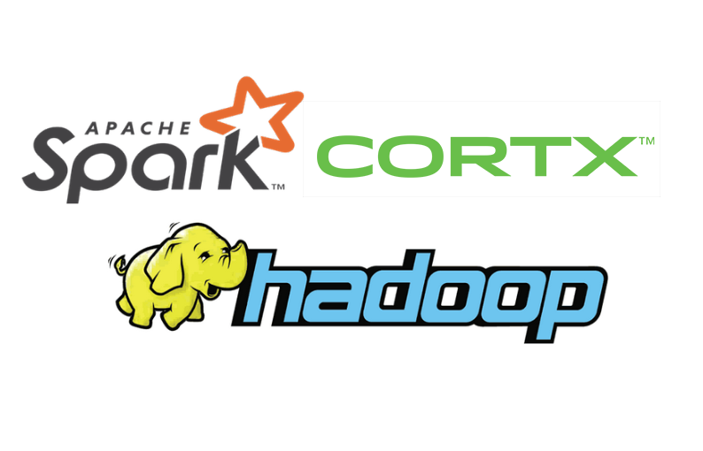
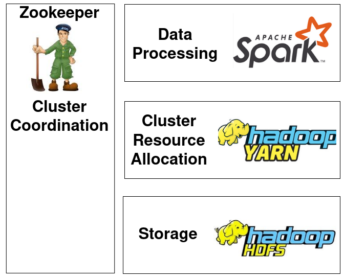
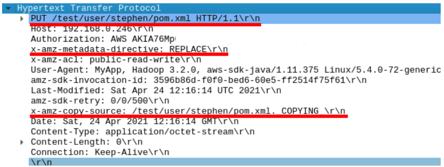
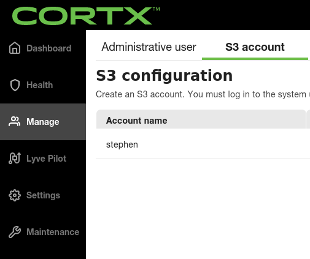
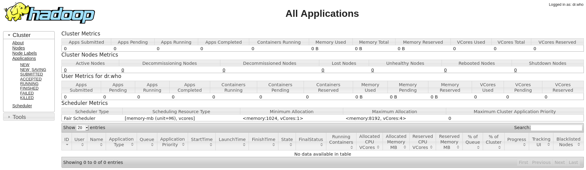
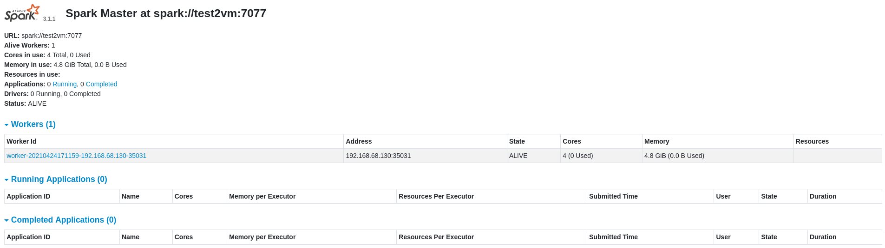
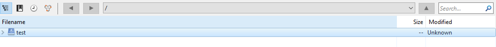

# CORTX Spark
Utilizing CORTX as a storage backend for Apache Spark.




[Video Presentation](https://www.youtube.com/watch?v=w3vvrV6sVkI)


## What is Spark
Spark is an open source large scale data processing engine which is capable of being used with the Python, Scala or Java
programming languages.

Spark is traditionally used by data scientists, with [many organisations](https://spark.apache.org/powered-by.html) 
adopting spark as part of their workflows for large scale data processing and machine learning.


## The Hadoop Ecosystem
The Hadoop ecosystem normally refers to an open source framework consisting of many applications for running distributed
storage and applications, with names that are cryptic and often [indistinguishable from pokemon](http://pixelastic.github.io/pokemonorbigdata/).



Components of the Hadoop ecosystem that Spark normally relies on.

Spark relies on a few components from this ecosystem, with Zookeeper acting to coordinate nodes, Yarn for managing 
cluster resources, and the Hadoop Distributed File System (HDFS) for storage. To get Spark to use CORTX natively I 
had to configure Hadoop to use CORTXs S3 compatible API using their [S3A](https://hadoop.apache.org/docs/current/hadoop-aws/tools/hadoop-aws/index.html)
API rather than the traditional Hadoop Distributed File System.

In doing so I am able to run filesystem commands to interact with CORTX that look very familiar to linux users. Examples of these are
```hadoop fs -ls``` to list subdirectories in a bucket,```hadoop fs -mkdir "foo"``` to make a new directory foo, and 
```hadoop fs -get foo.txt``` to copy foo.txt from CORTX to your local machine.

## Spark Integration
The end result of the Spark CORTX integration is that you are able to use the CORTX filesystem as a data source for 
Spark applications without having to muck around with credentials or external libraries when running against Spark.
```python
Welcome to
      ____              __
     / __/__  ___ _____/ /__
    _\ \/ _ \/ _ `/ __/  '_/
   /__ / .__/\_,_/_/ /_/\_\   version 3.1.1
      /_/

Using Python version 3.8.5 (default, Jan 27 2021 15:41:15)
Spark context Web UI available at http://192.168.68.130:4040
Spark context available as 'sc' (master = local[*], app id = local-1619369863842).
SparkSession available as 'spark'.
>>> context = SparkContext.getOrCreate()
>>> session = SparkSession(sc)
>>> my_data_frame=session.read.csv('s3a://test/cities.csv',inferSchema=True, header=True)
>>> my_data_frame.show(10)
+----+-------+-------+-----+-------+-------+-------+-----+------------------+--------+
|LatD| "LatM"| "LatS"| "NS"| "LonD"| "LonM"| "LonS"| "EW"|            "City"| "State"|
+----+-------+-------+-----+-------+-------+-------+-----+------------------+--------+
|41.0|    5.0|   59.0|  "N"|   80.0|   39.0|    0.0|  "W"|      "Youngstown"|      OH|
|42.0|   52.0|   48.0|  "N"|   97.0|   23.0|   23.0|  "W"|         "Yankton"|      SD|
|46.0|   35.0|   59.0|  "N"|  120.0|   30.0|   36.0|  "W"|          "Yakima"|      WA|
|42.0|   16.0|   12.0|  "N"|   71.0|   48.0|    0.0|  "W"|       "Worcester"|      MA|
|43.0|   37.0|   48.0|  "N"|   89.0|   46.0|   11.0|  "W"| "Wisconsin Dells"|      WI|
|36.0|    5.0|   59.0|  "N"|   80.0|   15.0|    0.0|  "W"|   "Winston-Salem"|      NC|
|49.0|   52.0|   48.0|  "N"|   97.0|    9.0|    0.0|  "W"|        "Winnipeg"|      MB|
|39.0|   11.0|   23.0|  "N"|   78.0|    9.0|   36.0|  "W"|      "Winchester"|      VA|
|34.0|   14.0|   24.0|  "N"|   77.0|   55.0|   11.0|  "W"|      "Wilmington"|      NC|
|39.0|   45.0|    0.0|  "N"|   75.0|   33.0|    0.0|  "W"|      "Wilmington"|      DE|
+----+-------+-------+-----+-------+-------+-------+-----+------------------+--------+
```

## Limitations
At present this integration can modify directories but cannot write new objects to CORTX. This limitation is due to
the `x-amz-copy-source` API not being supported as shown by [this test](https://github.com/Seagate/cortx-s3server/blob/c3725de47ef05b55e1c14cd7630a4a74fc59ddce/st/clitests/unsupported_api_check.sh).
This copy command is used because Hadoop performs the following two steps when it uploads a file.
* Uploads the object appended by ```._COPYING_``` as a "Staging" file.
* Performs the ```x-amz-copy-source``` command to replace the ```._COPYING``` file that's already in S3 to its final name.

My hope is that at some point in the future this API is implemented so that write features can be integrated. I have raised [issue #940](https://github.com/Seagate/cortx/issues/940) 
to track this.
 

Unimplemented API shown.

## Installation
This installation guide assumes you have already performed a few steps:
1. Installed CORTX. My suggestion for development is to use the provided [Open Virtual Appliance](https://github.com/Seagate/cortx/blob/main/doc/OVA/1.0.4/CORTX_on_Open_Virtual_Appliance.rst)
image to create a Virtual Machine although there are other methods to [get started](https://github.com/Seagate/cortx/blob/main/QUICK_START.md).
2. Create a cortex S3 account from the management UI.
   
   

Management webpage to add a CORTX s3 account.

3. Create an initial folder for your data to be stored in. You can use [cyberduck](https://github.com/Seagate/cortx/blob/f124b3fef81b7aae617b3e8cd5209afcc2a9d6f3/doc/testing_io.rst)
   for this purpose.
   
### Easy install
The process of installing Hadoop and Spark can be complicated, so I have created an Ansible playbook to automate the process.

This ansible playbook will run a set of reproducible commands against a target environment of ```ubuntu 20.04```.
It should be possible to make this playbook compatible with the provided CORTX VM by replacing the APT install with YUM 
install although this is untested.

To use this playbook, [install ansible](https://docs.ansible.com/ansible/latest/installation_guide/intro_installation.html), 
git clone the CORTX github, change directory to cortx/doc/integrations/spark with
```zsh
git clone https://github.com/Seagate/cortx.git
cd cortx/doc/integrations/spark
``` 
Modify the following:
* in inventory.yml add the IP address of your S3 endpoint
* in playbooks/install_spark.yml add your s3_endpoint, s3_access_key, s3_secret_key and base folder you created
and run this command while in this directory
```zsh
ansible-playbook -i inventory.yml playbooks/install_spark.yml -u {YOUR USERNAME} -K -k
```
Once this is done, go to the Verification section of this document to verify and run the components

### Manual Way
#### Hadoop
```zsh
# Install requirements
# If you are targeting a RHEL/Centos operating system use sudo yum install instead
sudo apt install openjdk-8-jdk gzip unzip maven pdsh wget
# Create a SSH key for hadoop components to communicate
ssh-keygen -b 2048 -t rsa -f ~/.ssh/hadoop_key -q -N ""
# Add key to authorized users
cat ~/.ssh/hadoop_key.pub >> ~/.ssh/authorized_keys
# Add server to known hosts
ssh-keyscan -H localhost >> ~/.ssh/known_hosts
# change directory to your home directory
cd ~
# download file
wget https://archive.apache.org/dist/hadoop/common/hadoop-3.2.0/hadoop-3.2.0.tar.gz
# extract file
tar -xvf ZendFramework-1.7.2.tar.gz -C ~/hadoop --strip 1
```
Copy the following files from this repository ```spark/static_templates/hadoop``` to your ~/hadoop/etc/hadoop directory, replacing the [{{}} jinja variables](https://jinja.palletsprojects.com/en/2.11.x/)
with the required values 
* ```s3_secret_key``` the S3 secret key for your user
* ```s3_access_key``` the S3 access key for your user
* ```s3_endpoint``` the IP address or DNS entry of your S3 endpoint
* ```s3_base_bucket_name``` the base bucket/directory that you want to use for hadoop data
* ```hadoop_dir``` the full path to your hadoop install

Rename the files to the following
* hadoop-env.j2.sh -> hadoop-env.sh
This file loads the environment variables needed for your S3 keys, location of Java and additional package to use (hadoop-aws)
* yarn_site.j2.xml -> yarn-site.xml
  Configuration files for yarn task scheduling
* site_config.j2.xml -> core-site.xml
The bulk of settings for Hadoop, [there are a lot of configurations specific to s3 that you can tweak](https://hadoop.apache.org/docs/current/hadoop-aws/tools/hadoop-aws/index.html#General_S3A_Client_configuration)

add variables to bashrc and restart
Make sure to replace {{hadoop_dir}} with the full path to your hadoop installation
```zsh
export HADOOP_MAPRED_HOME={{hadoop_dir}}
export HADOOP_COMMON_HOME={{hadoop_dir}}
export HADOOP_HDFS_HOME={{hadoop_dir}}
export YARN_HOME={{hadoop_dir}}
export HADOOP_HOME={{hadoop_dir}}
export PDSH_RCMD_TYPE=ssh
export HADOOP_CLASSPATH={{hadoop_dir}}/share/hadoop/tools/lib/*
export PATH=$PATH:{{hadoop_dir}}/bin:{{hadoop_dir}}/sbin:{{hadoop_dir}}/spark/bin'
```
Reload bash so that the variables are loaded into your environment
source ~/.bashrc

#### Spark
Now that you've got a working hadoop install that works with CORTX you can now install Spark.
```zsh
# change directory to your home 
cd ~
# Download Spark
wget https://downloads.apache.org/spark/spark-3.1.1/spark-3.1.1-bin-hadoop3.2.tgz
# Extract it
tar -xvf spark-3.1.1-bin-hadoop3.2.tgz -C ~/spark --strip 1
```
Copy the two spark configuration files from ```spark/static_templates/spark``` to your spark configuration directory ```spark/conf/``` and rename them to the
following:
* spark-env.j2.sh -> spark-env.sh
Environment variables for Spark to use Hadoop files.
* spark-defaults.j2.conf -> spark-defaults.conf
  Configuration files for Spark

replacing the JINJA {{}} variables with the following
* ```s3_secret_key``` the S3 secret key for your user
* ```s3_access_key``` the S3 access key for your user
* ```s3_endpoint``` the IP address or DNS entry of your S3 endpoint
* ```s3_base_bucket_name``` the base bucket/directory that you want to use for hadoop data
* ```hadoop_dir``` the full path to your hadoop install
* ```hadoop_version``` the current version of hadoop you're using (if you've been following this guide, use 3.2.0)
* ```spark_dir``` the full path of your spark installation
* ```bundled_aws_sdk``` the version number of the aws sdk that you're using. If following this guide use 1.11.375 ,
otherwise look at the version of aws-java-sdk-bundle in ```hadoop/share/hadoop/tools/lib/```.
  
## Verification
### Test hadoop filesystem to see that S3 is being used correctly
```$ hadoop fs -mkdir -p test```
If you've inserted any files via cyberduck, you'll see them with ```ls```
```$ hadoop fs -ls
Found 2 items
-rw-rw-rw-   1 stephen stephen      11078 2021-04-25 16:17 mytestfile._COPYING_
drwxrwxrwx   - stephen stephen          0 2021-04-25 16:26 test
```
You can view more hadoop fs commands that you can use with hadoop fs --help.


### Start Yarn
```~/hadoop/sbin/start-yarn.sh```
And you should be able to view the yarn webpage. Note, because this is not exposed externally if you're trying to view
it from outside the VM you will need to ssh tunnel it out.
```ssh -L 8088:localhost:8088 username@ip_address```
On your machine visit localhost:8088 via a web browser.



Hadoop cluster management UI.
### Verify Spark
To verify spark, we're going to check that you can read CSVs from CORTX.
* Upload a CSV to CORTX. Example CSVs can be found [here](https://people.sc.fsu.edu/~jburkardt/data/csv/csv.html)
* Enter the PySpark REPL with ```pyspark```

Note: This may take a while to start the pyspark shell as the first run will attempt to download some additional files 
that are required.
* Run the following script to verify that you can access your CSV. Ensure you have inserted it into CORTX.

Note: You need to include the fullpath including your initial bucket that you set up as  ```s3_base_bucket_name```
```python
context = SparkContext.getOrCreate()
session = SparkSession(context)
my_data_frame=session.read.csv('s3a://PATH/TO/YOUR.csv',inferSchema=True, header=True)
my_data_frame.show(10)
```

### Start Spark master and worker
To run spark master and one worker run ```~/spark/sbin/start-all.sh```.
You should then be able to view the master page to view the status of your master and worker nodes.


Spark Master


With a working spark install and verification that spark can natively use CORTX for storage, you can now use [spark-submit](https://spark.apache.org/docs/latest/submitting-applications.html)
to submit jobs against your single node spark cluster or just run scripts inside the spark python REPL.


## Errors
Here are a few of the errors I have seen and how to fix them.
If you do encounter errors you should modify ```hadoop-env.sh``` from
```zsh
export HADOOP_ROOT_LOGGER="WARN"
```
to
```zsh
export HADOOP_ROOT_LOGGER="DEBUG"
```
to drop the logging level down to something more verbose. This generally gives more verbose information about your issues.
### Bucket doesn't exist
```zsh
$ hadoop fs -ls
ls: Bucket test does not exist
```
You need to ensure you've created the bucket that you defined in ```core-site.yml```. The hadoop filesystem is unable to
auto create this for you.
If you think you've already done this, then make sure your folder is defined at the root level of your cortex account.


### A header you provided implies functionality that is not implemented.
Trying a command that will insert an object into CORTX results in an error like this
```zsh
$ hadoop fs -put file.txt hadoop
put: copyFile(user/stephen/file.txt._COPYING_, user/stephen/hadoop) on user/stephen/file.txt._COPYING_: com.amazonaws.services.s3.model.AmazonS3Exception: A header you provided implies functionality that is not implemented. (Service: Amazon S3; Status Code: 501; Error Code: NotImplemented; Request ID: 4da4da1e-e2df-4dd1-a7ef-59ff140b71ec; S3 Extended Request ID: null), S3 Extended Request ID: null:NotImplemented: A header you provided implies functionality that is not implemented. (Service: Amazon S3; Status Code: 501; Error Code: NotImplemented; Request ID: 4da4da1e-e2df-4dd1-a7ef-59ff140b71ec; S3 Extended Request ID: null)
```
Unfortunately there is no workaround and this is a limitation on the subset of the S3 API that's supported by CORTX.
See [Issue #940](https://github.com/Seagate/cortx/issues/940) for more details.

Other [S3A committers](https://hadoop.apache.org/docs/r3.1.1/hadoop-aws/tools/hadoop-aws/committers.html) have similar
issues that prevent them from working


### Hadoop command not found
```zsh
$ hadoop
hadoop: command not found
```
This happens when you haven't defined your hadoop/bin directory properly in your PATH or haven't reloaded bashrc after 
putting in your export statements. You can look at your current PATH using ```printenv | grep PATH```. Your PATH is 
where your system will look for commands that you run

### Hadoop commands don't run they just hang
When trying a hadoop filesystem command and it just hangs, not letting you input anything
```zsh
$ hadoop fs -ls

<a long wait before you finally ctrl c in frustration>
```
it implies one of two things
1. You have not put in the right S3 address in ```core-site.xml```
2. You have a firewall block preventing you, check telnet <your_endpoint> 443 to see if the port is open

### 403 Forbidden
```zsh
stephen@test2vm:~$ hadoop fs -ls
ls: s3a://test/user/stephen: getFileStatus on s3a://test/user/stephen: com.amazonaws.services.s3.model.AmazonS3Exception: Forbidden (Service: Amazon S3; Status Code: 403; Error Code: 403 Forbidden; Request ID: 9d08c15d-40b2-407e-9a14-d995cb844e08; S3 Extended Request ID: null), S3 Extended Request ID: null:403 Forbidden
```
This error comes about when your endpoint is correct, but your credentials are not. Check your credentials in ```hadoop-env.sh```

### Spark Class Not found
When running spark if you see any errors that contain
```
java.lang.ClassNotFoundException
```

Then you likely have incompatible Spark and Hadoop versions. You need to ensure that you either stick to the versions 
documented here, or you compile spark yourself against your target Hadoop version. This was a constant source of error
for me when I was attempting my integration.

### Hadoop fs no such file or directory s3a://bucket/user/username
By default ```hadoop fs``` commands will try to use the path /user/username as the root directory for its commands.

You should ensure that files you want to access using ```hadoop fs``` commands reside in a folder called user/```yourusername```.

To create this folder path directly pass in mkdir with the `-p` flag to make a directory and the path leading up to it. 
eg. ```hadoop fs -mkdir -p my_new_folder```

This limitation only applies for ```hadoop fs``` commands, not Spark.
