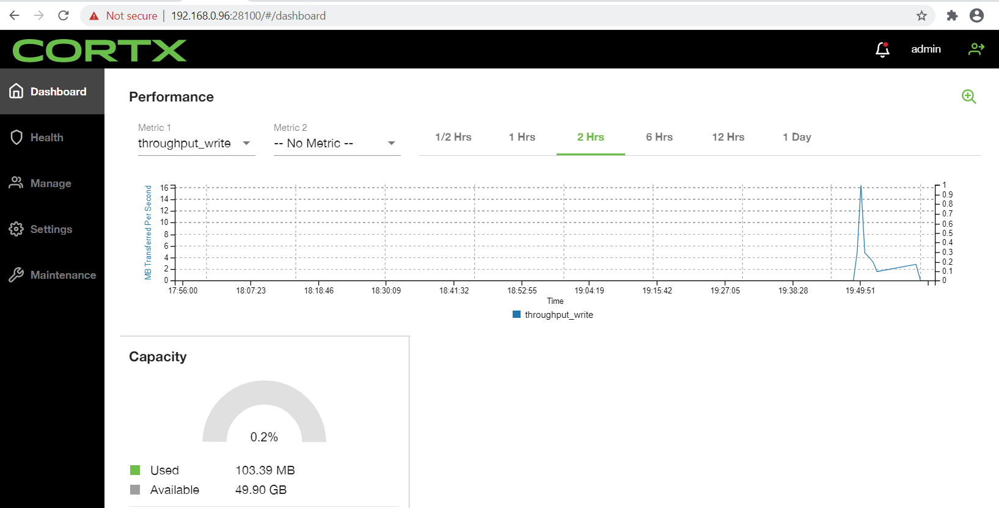

**What is Splunk?**

Splunk is a software platform that allows you to search, monitor, and analyze machine-generated big data via a Web-style interface. Splunk captures, indexes, and correlates real-time data in a searchable repository from which it can generate graphs, reports, alerts, dashboards and visualizations.

The SmartStore feature provides a way to use remote object stores, such as Amazon S3, to store indexed data. By reducing reliance on local storage, SmartStore allows you to scale compute and storage resources separately, thus improving the efficiency of resource usage.

**What is CORTX?**

CORTX is a distributed object storage system designed for great efficiency, massive capacity, and high HDD-utilization. CORTX is 100% Open Source.

**How do CORTX and Splunk work together?**

Because CORTX is S3 compatible we can use the storage system and the Splunk SmartStore feature to offload data to the object storage.

**Configuring Splunk to work with CORTX:**

**Step 0:** If you prefer your instructions in video check out this [video on youtube](http://bit.ly/cortx-splunk).

**Step 1:**  Get your S3 bucket credentials/details.

Here's what you'll need:

* Data IP address 
* Secret key 
* Access Key

You will get the above information when you create an s3 account on your CORTX server. Please refer to the testing document [here](https://github.com/Seagate/cortx/blob/main/doc/testing_io.rst) for more information on how to create an account and test it.

1. When you create an account you will be shown a screen with your credentials like the one below.


2. S3 Bucket: You will need to create an s3 bucket by logging into the CORTX management console and creating an s3 Bucket.


**Step 2:** Configuring Splunk

Please refer to the document [here](https://docs.splunk.com/Documentation/Splunk/8.0.6/Indexer/ConfigureremotestoreforSmartStore) to configure a remote SmartStore store. However, the instructions below should suffice for configuring CORTX. 

:page_with_curl: **Notes:** 

* The steps below apply to a single-indexer configuration. 
* See [Splunk documentation for more details about clustered indexers setup](https://docs.splunk.com/Documentation/Splunk/8.1.1/Indexer/UsetheCLI).

1. Configruing the remote s3 storage is done using an `indexes.conf` file. You can find the local copy of this file in this location: `$SPLUNK_HOME/etc/system/local`  

2. You will need to add these lines to the `indexes.conf` file.

:page_with_curl: **Note:** The values for *s3_BUCKET + ACCESS_KEY + SECRET_KEY + DATA_IP* are from your s3 credentials/details. 

```shell

[volume:s3]
storageType = remote
path = s3://<S3_BUCKET>
remote.s3.access_key = <ACCESS_KEY>
remote.s3.secret_key = <SECRET_KEY>
remote.s3.supports_versioning = false
remote.s3.endpoint = https://<DATA_IP>:443
```

**For example:**

```shell

storageType = remote
path = s3://splunk
remote.s3.access_key = 2wuishXYQAe79w-1is75jw
remote.s3.secret_key = UtywncifcfOdTdSKVhsfs7w9xP51234BhJxmaJ14NAL
remote.s3.supports_versioning = false
remote.s3.endpoint = https://ssc-vm-0668.colo.seagate.com:443
```

3. In your splunk server navigate to `http://<SPLUNK_IP>:8000/en-US/manager/launcher/control` and hit the "Restart Server" button.


**Step 3:** Validating Splunk with CORTX

There are a few ways we can validate the integration:

1) Check the Smartstore Activity Instance Console

You should see that the Remote Storage Connectivity is ONLINE and there is Bucket Activity being uploaded to the remote s3 bucket


2) Use an S3 client (eg. cyberduck) to connect to the S3 bucket and see that folders have been created and logs have been uploaded.


3) Login to the CORTX Management Dashboard and verify that there is data being written



## Watch the integration demo 

Our Developer Advocate, Justin Woo, walks us through integrating Splunk and CORTX. Splunk is a software platform that allows you to search, monitor, and analyze machine-generated big data via a web-style interface. Because CORTX is S3 compatible we can use the storage system and the Splunk SmartStore feature to offload data to the object storage. This short video walks through an integration a CORTX integration with Splunk. 
   
[](https://www.youtube.com/watch?v=rBAIloua4p0)
