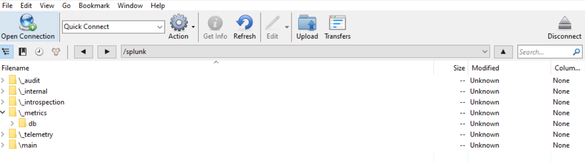

**What is Splunk?**
Splunk is a high performance event processing platform for enterprise computing environments that provides critical and timely insight into IT operations, including data from IoT, firewalls, webservers and more. 

The SmartStore feature enables Splunk to offload Petabytes of data to an external Amazon S3 compatible object storage. Disaggregating compute and storage frees Splunk nodes to focus on indexing and search, while the object storage is free to focus on the management, resilience and security of the data.

**What is CORTX?**
CORTX is a distributed object storage system designed for great efficiency, massive capacity, and high HDD-utilization. CORTX is 100% Open Source

**How does CORTX and Splunk work together?**
Because CORTX is S3 compatible we can use the storage system and the Splunk SmartStore feature to offload data to the object storage.


**Configuring Splunk to work with CORTX:**

*Step 1:  Get your S3 bucket credentials/details*

Here's what you'll need:

* Data IP address: This can be found by running `ip a l` on your server and noting the IP address behind the `ens256` interface

* Secret key + Access Key: This will given to you when you create your s3 account on your CORTX server. More information on how to create an account and test it can be found [here](https://github.com/Seagate/cortx/blob/main/doc/testing_io.rst).

* S3 Bucket: You will need to create an s3 bucket by logging into the CORTX management console and creating an s3 Bucket


 
*Step 2: Installing the integration:*

For reference [here](https://docs.splunk.com/Documentation/Splunk/8.0.6/Indexer/ConfigureremotestoreforSmartStore) is information on how to configuring a remote SmartStore store. But the instructions below should be sufficent for CORTX. 

Configruing the remote s3 storage is done using an `indexes.conf` file. You can find the local copy of this file in this location: `$SPLUNK_HOME/etc/system/local`  

You will need to add these lines to the `indexes.conf` file.

Note: The values * s3_BUCKET + ACCESS_KEY + SECRET_KEY + DATA_IP* will be from your s3 credentials/details. 

```
[volume:s3]
storageType = remote
path = s3://<S3_BUCKET>
remote.s3.access_key = <ACCESS_KEY>
remote.s3.secret_key = <SECRET_KEY>
remote.s3.supports_versioning = false
remote.s3.endpoint = https://<DATA_IP>:443
```
For example:
```
storageType = remote
path = s3://splunk
remote.s3.access_key = 2wuishXYQAe79w-1is75jw
remote.s3.secret_key = UtywncifcfOdTdSKVhsfs7w9xP51234BhJxmaJ14NAL
remote.s3.supports_versioning = false
remote.s3.endpoint = https://ssc-vm-0668.colo.seagate.com:443
```

*Step 3: Restart your splunk Server*
In your splunk server navigate to `http://<SPLUNK_IP>:8000/en-US/manager/launcher/control` and hit the "Restart Server" button.


**Validating Splunk with CORTX**

There are a few ways we can validate the integration:

1) Check the Smartstore Activity Instance Console


You should see that the Remote Storage Connectivity is ONLINE and there is Bucket Activity being uploaded to the remote s3 bucket


2) Use an S3 client (eg. cyberduck) to connect to the S3 bucket and see that folders have been created and logs have been uploaded.



3) Login to the CORTX Management Dashboard and verify that there is activity being uploaded


