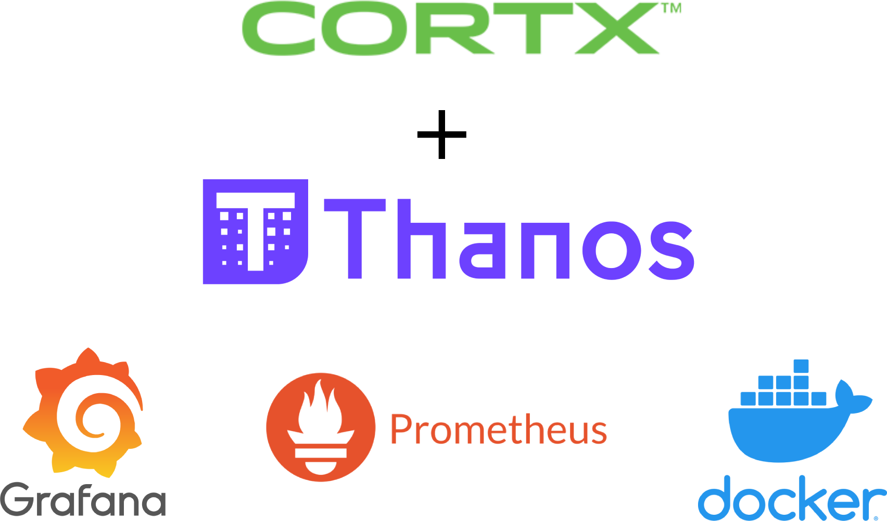
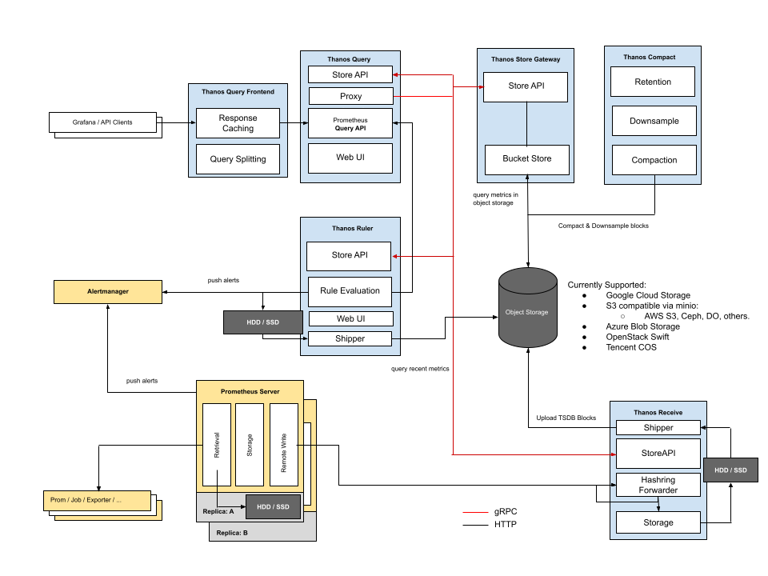
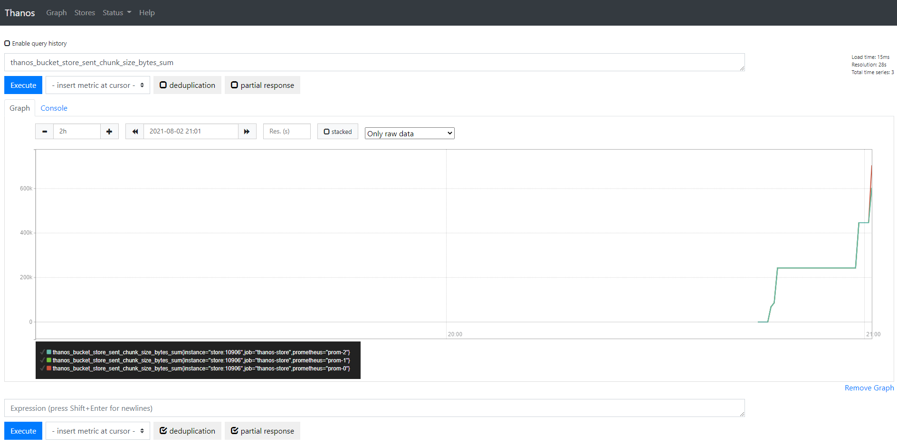
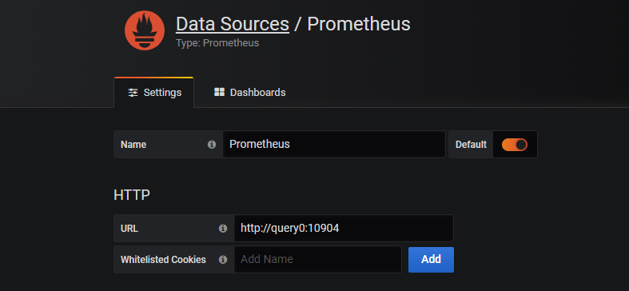
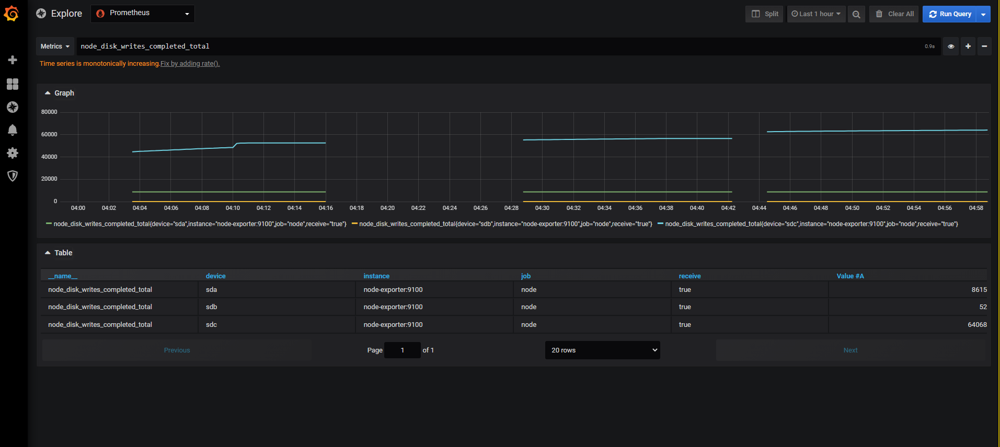

# Thanos + Cortx Integration deployed with Multi-cluster Docker + Prometheus + Grafana



[Video Link](https://vimeo.com/582275562)

[Prometheus](https://prometheus.io/) is an open source systems monitoring and alerting toolkit that is widely adopted as a standard monitoring tool with self-managed and provider-managed Kubernetes. Prometheus provides many useful features, such as dynamic service discovery, powerful queries, and seamless alert notification integration. Beyond certain scale, however, problems arise when basic Prometheus capabilities do not meet requirements such as:

- Storing petabyte-scale historical data in a reliable and cost-efficient way
- Accessing all metrics using a single-query API
- Merging replicated data collected via Prometheus high-availability (HA) setups

[Thanos](https://github.com/thanos-io/thanos) was built in response to these challenges. Thanos, which is released under the Apache 2.0 license, offers a set of components that can be composed into a highly available Prometheus setup with long-term storage capabilities. Thanos uses the Prometheus 2.0 storage format to cost-efficiently store historical metric data in object storage, such as Seagate's CORTX, while retaining fast query latencies. In summary, Thanos is intended to provide:

- Global query view of metrics
- Virtually unlimited retention of metrics, including downsampling
- High availability of components, including support for Prometheus HA

Thanos has a global query view, which essentially means you can query your prometheus metrics from one endpoint backed by multiple prometheus servers or cluster.

You can still use the same tools such as Grafana as it utilizes the same Prometheus Query API.

Thanos provides downsampling and compaction, so that you downsample your historical data for massive query speedup when querying large time ranges.

The architecture of Thanos can be seen below



## Overview of Integration

In this guide, we'll implement Thanos for long-term storage for Prometheus metrics using Seagate's CORTX, using Docker Compose.

We will setup a Thanos Cluster with Minio, Node-Exporter, Grafana on Docker. Our Thanos setup will consist of 3 prometheus containers, each one running with a Thanos Sidecar container, a Thanos Store container, 2 Thanos Query containers, then we have the remotewrite and receive containers which node-exporter will use to ship its metrics to.

Seagate's CORTX will be used as our long-term storage and the mc container will be used to initialize the storage bucket client API layer which is used by Thanos.

## Pre-requisites

You should have Docker installed, which should come with docker-compose. 

A CORTX VM should also be running with the endpoints available.


## Step 1

Clone this folder, ensuring that you are in the same directory as the file ```thanos-compose.yml```

## Step 2

Ensure that you have your SECRET_KEY and SECRET_ACCESS_KEY and CORTX_ENDPOINT.


In ```thanos-compose.yml```

there is a line 

```yml
mc config host add tmp uvo1f7e7qbkxtmmt5iq.vm.cld.sr AKIAtEpiGWUcQIelPRlD1Pi6xQ YNV6xS8lXnCTGSy1x2vGkmGnmdJbZSapNXaSaRhK
```

replace it with

```yml
mc config host add tmp <ENDPOINT> <SECRET_KEY> <SECRET_ACCESS_KEY>
```

In ```data/bucket.yml```

replace the following with your own credentials as well

```yml
endpoint: "uvo1f7e7qbkxtmmt5iq.vm.cld.sr"
access_key: "AKIAtEpiGWUcQIelPRlD1Pi6xQ"
secret_key: "YNV6xS8lXnCTGSy1x2vGkmGnmdJbZSapNXaSaRhK"
```

If your new endpoint has SSL / HTTPS, change the insecure flag to false

```yml
insecure: false
```

## Step 3

Run docker-compose

```bash
$ docker-compose -f thanos-compose.yml up
```

You should get the following logs

```bash
Starting node-exporter ... done
Starting grafana        ... done
Starting prometheus0    ... done
Starting prometheus1     ... done
Starting thanos-receive  ... done
Starting thanos-store    ... done
Starting prometheus2     ... done
Starting mc             ... done
Starting thanos-sidecar0 ... done
Starting thanos-sidecar1     ... done
Starting thanos-sidecar2     ... done
Starting thanos-remote-write ... done
Starting thanos-query1       ... done
Starting thanos-query0       ... done
Attaching to node-exporter, grafana, mc, prometheus0, prometheus1, thanos-store, prometheus2, thanos-receive, thanos-sidecar0, thanos-sidecar1, thanos-sidecar2, thanos-remote-write, thanos-query0, thanos-query1
```

## Step 4

Access the Thanos Query UI, which looks identical to the Prometheus UI: - http://localhost:10904/graph




## Step 5

Access the Grafana UI at http://localhost:3000/

Default login/password is ```admin```

Select datasources, add a prometheus datasource and select the endpoint: ```http://query0:10904```, which should look like this:



When we create a dashboard, you can test a query with node_disk_writes_completed_total and it should look something like this:



Tested by:

- March 17, 2022: Jalen Kan (jalen.j.kan@seagate.com) using Cortx OVA-2.0.0-585 on Windows 10 running VMware Workstation.
