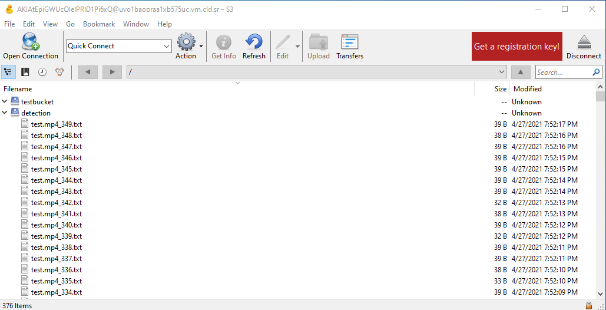

## Description

This repository represents open-source detection methods with YOLOv5 at the edge (on camera), sending cloud storage and importing data. YOLO or You Only Look Once is an object detection algorithm. In YOLO a single convolutional network predicts the bounding boxes and the class probabilities for these boxes. \
The model I use in my project trains on COCO dataset and can detect up to 80 classes. With the help of this model, I detect objects on video frames and save the bounding boxes in a text file, send them to the CORTX cloud, and store them there. Next, I download the data from the CORTX storage and draw the bounding boxes on the original video. 
NOTE: In Yolo, the coordinates are relative. Meaning that the annotations are written this way: \
<object-class, x_center, y_center, width, height>

## Concept pitch
can be found [here](https://www.loom.com/share/4c0956c5851249db8119a0fdaa7f2d16).

## Integration work-through

### Step 1: Preparing the cloud
* For using the could I follow the [steps](https://github.com/Seagate/cortx/wiki/CORTX-Cloudshare-Setup-for-April-Hackathon-2021) in CORTX Cloudshare Setup.
* I use the Boto3 library that allows me to connect CORTX. 
For that requires END_POINT_URL (CORTX URL), aws_access_key_id (AWS access key), aws_secret_access_key (AWS access secret).
* I create bucket by the name "detection" for reading and writing the data to.

### Step 2: Integrate CORTX to YOLO
For each frame in the video, a txt file that contains the parameters of the detected objects is sent to the cloud.\
In order to achieve high speed for upload and download files, I decided to upload small text files instead of very large video files. \
Note: After running the YOLO model, for each object detected, all parameters are stored in the frame. Therefore, the video file grows for each detection.
* First, install the requirements:
```bash
$ pip install -r requirements.txt
$ pip install boto3
$ pip install logging
$ pip install botocore
```
make sure you install torch>=1.7
* Next, make test video file and add it to the script below:
```bash
$ python3 detectAndSend.py --source <test.mp4> --weights yolov5s.pt --save-txt
```
It will automatically start downloading the pre-trained model if it's not in the folder.
* Now, you can go to Cyberduck and click refresh and see the files uploading in real-time.\
In the picture below, you can see the files uploading to the cloud:

<p align="center">
   
</p>

### Step 4: Downloading the data from the cloud and drawing the results.
* Once the files are uploaded to the cloud, we will move on to the final step in the integration.\
At this point, we will download the files automatically by running this script.
```bash
python3 downloadAndDraw.py
```
Read the data and display it on each frame in the video.\
Running results are shown below:

The left top gif is the original film.\
The right top gif is the yolo detection output.\
The center-down gif is the output after downloading the data from the cloud.

<p align="center">
   
   
   
</p>

## Future work
* Add RTSP(Real Time Streaming Protocol).
* Improve the model

