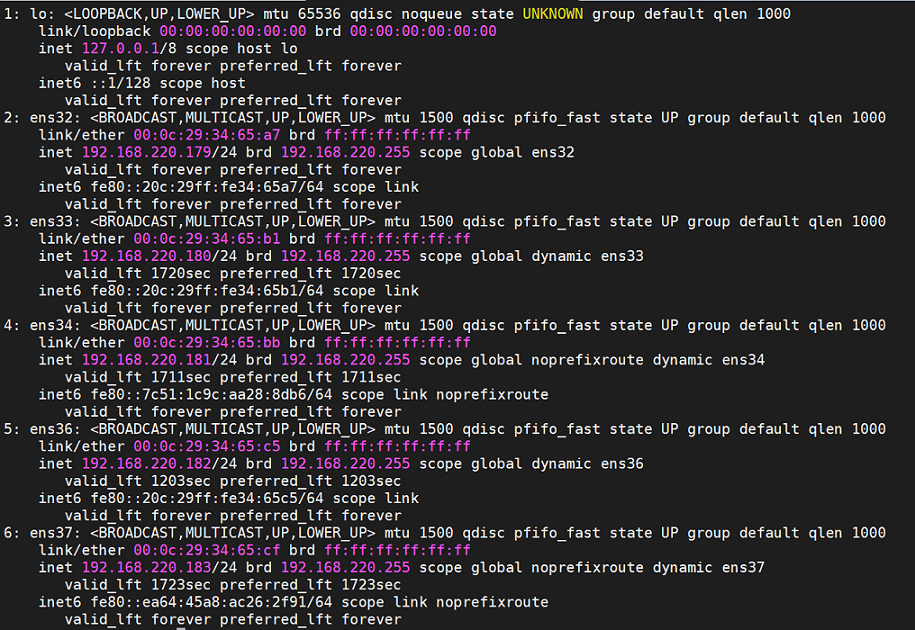

********
Troubleshooting your virtual network configuration
********

In order to run CORTX, it must be able to acquire IP addresses.  To test whether it has, run **ip a l** and you should hopefully see something like the following:

If you do not see IP addresses and you are running in a virtual machine hypervisor such as VMWare Workstation, you probably have misconfigured virtual networks.  The following instructions have been known to fix the problem in VMWare Workstation.

#. Edit your virtual machine settings and set *every* network adapter to use a Bridged connection and to 'Replicate physical network connection state':

   .. image:: images/config_networks3.png
   
#. Then select the 'Edit->Virtual Network Editor' menu item:

   .. image:: images/config_networks4.png
   
#. In the Virtual Network Editor, make sure you select the right NIC to bridge:

   .. image:: images/config_networks2.png
   
#. Reboot your VM and recheck **ip a l**.  Hopefully you now have IP addresses showing and your CORTX system will run correctly!  If you still do not see IP addresses, the following commands may be useful:

   ::
 
   ifdown <interface>  # e.g. ifdown ens192 
 
   ifup <interface>    # e.g. ifup ens192 

   If not, please contact the community and we'll figure it out together.  :relaxed:

